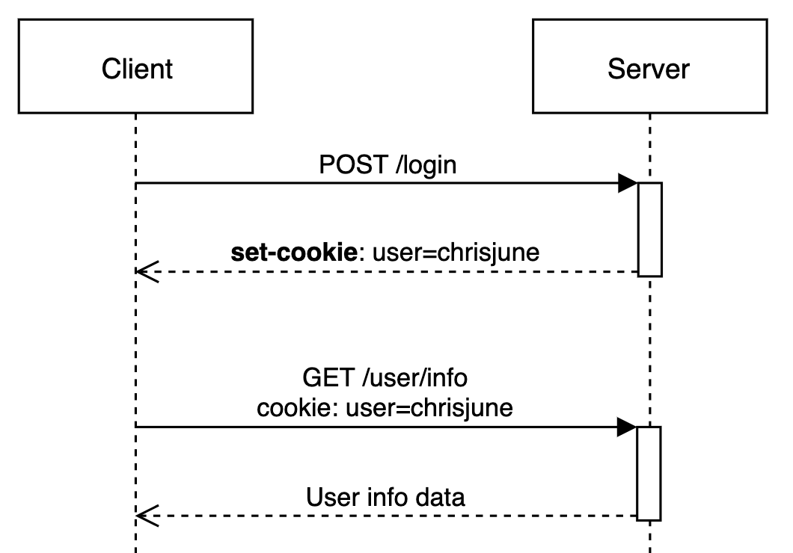
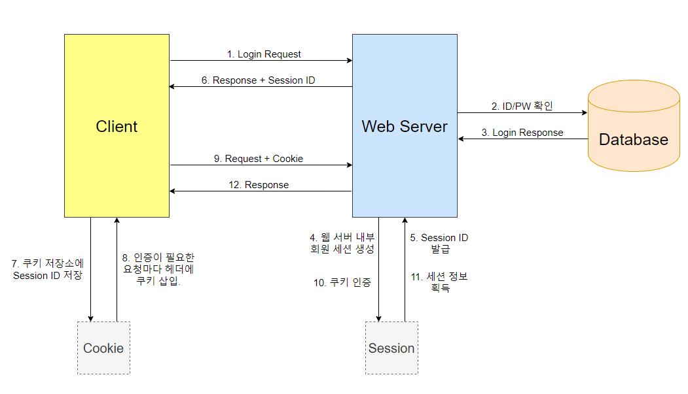
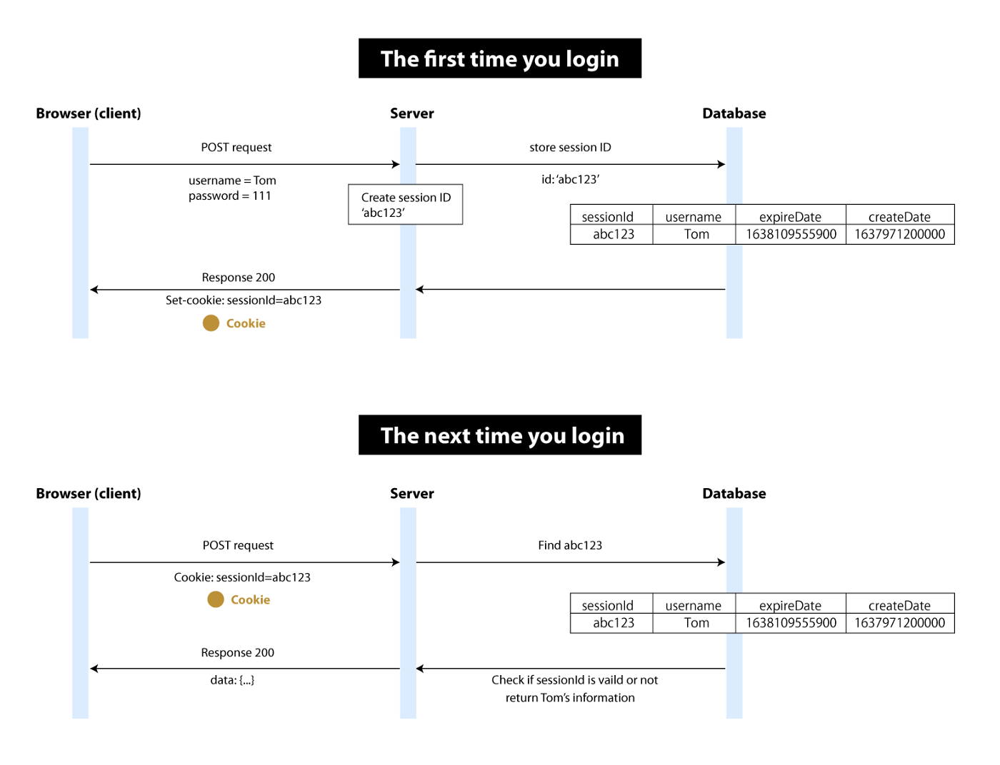
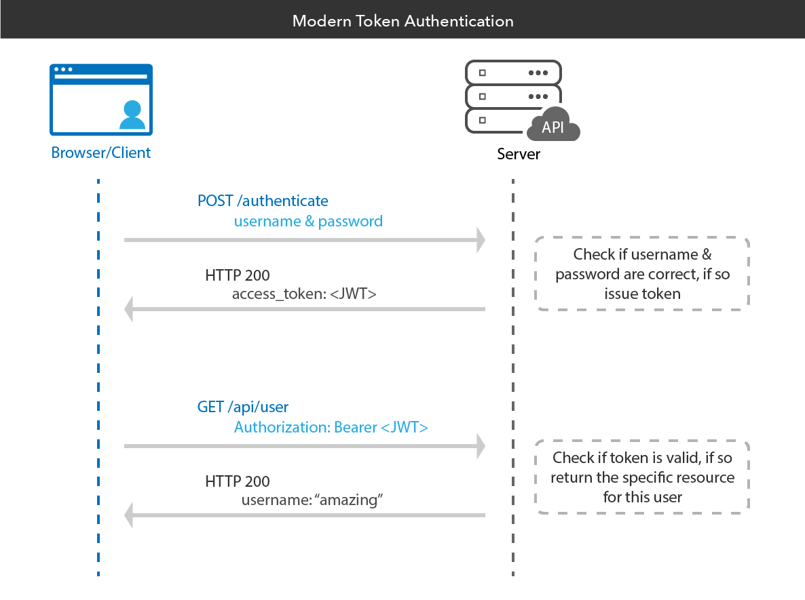

# HTTP

## HTTP 프로토콜이란?

- HTTP(Hypertext Transfer Protocol)는 텍스트 기반의 통신 규약으로 인터넷 상에서 데이터를 주고 받기 위해 서버/클라이언트 모델을 따르는 프로토콜.

### HTTP 프로토콜의 동작방식

- HTTP는 서버/클라이언트 모델을 따름. 클라이언트에서 요청을 보내면 서버는 요청을 처리해서 응답한다.
- 초기 HTTP는 오직 HTML 문서를 주고 받기 위해서 설계되었으나, 현재는 HTML 문서 외에도 JSON 데이터나 XML 데이터 등의 정보를 주고 받을 수 있음.
- 클라이언트 : 서버에 데이터를 요청하는 클라이언트 소프트웨어(IE, Chrome, Firefox). 클라이언트는 URI를 이용해서 서버에 접속하고 데이터를 요청할 수 있음.
- 서버 : 클라이언트의 요청을 받아서 요청을 해석하고 응답하는 소프트웨어(Apache, nginx, IIS, ...). 웹 서버는 보통 표준 포트인 80번 포트로 서비스 함.
- HTTP 예시 : 클라이언트 프로그램에서 사용자가 회원 가입을 요청하면, 서버로 사용자가 입력한 회원 정보를 보내게 되고, 서버는 회원 정보를 저장한 후 잘 저장했다고 클라이언트에 응답함. 이 과정에서 클라이언트와 서버 간 교류가 HTTP라는 규약을 이용해 이뤄지게 됨.

## Request(요청)

- 클라이언트가 서버에게 연락하는 것을 요청이라 하며, 요청을 보낼 때는 요청에 대한 정보를 담아 서버로 보냄.
- 서버는 일종의 주문서를 받아 클라이언트가 어떤 것을 원하는지 파악할 수 있음. 여기서 요청은 주문서를 작성하는 것과 유사.

### Request Method (요청의 종류)

- `Get` : 자료를 요청할 때 사용 (SELECT)
- `Post` : 자료의 생성을 요청할 때 사용 (INSERT)
- `Put` : 자료의 모든 부분에 대해 수정을 요청할 때 사용 (UPDATE)
- `Delete` : 자료의 삭제를 요청할 때 사용 (DELETE)
- `Patch` : 자료의 일부분에 대해 수정을 요청할 때 사용
- `HEAD` : 헤더 정보만 요청함. 해당 자원이 존재하는지 혹은 서버에 문제가 없는지를 확인하기 위해서 사용함.
- `TRACE` : 클라이언트의 요청을 그대로 반환함. 예로 echo 서비스로 서버 상태를 확인하기 위한 목적으로 주로 사용함.
- `Options` : 웹서버가 지원하는 메서드의 종류를 요청함.
  - Options는 preflight 요청할 때 사용. CORS와 관련 있음.
  - preflight는 서버에서 어떤 메서드와 어떤 header 를 허용하는지 확인하는 과정. target 리소스와 혹은 서버와 통신하기 위한 통신 옵션을 확인할 때 사용.
  - 우리가 특정 Http Method 로 요청을 보내게 된다면 해당 서버로 OPTIONS 를 미리 보내보고 해당 응답을 확인한 후, 우리가 보낸 Http Method 가 지원하면 실제 요청이 이뤄지게 되는 것.

### Request HTTP 메시지 예시

```
GET https://www.test.com HTTP/1.1    //시작줄
User-Agent: Mozilla/5.0 (Windows NT 10.0; Win64; x64) ...   // 헤더(header)
Upgrade-Insecure-Requests: 1

//본문 - 현재는 없음.
```

- 시작줄
  - 첫 줄은 시작 줄로 메소드 종류, URI, HTTP 버전으로 구성되어 있음.
  - GET : HTTP Method
  - https://test.com : 사이트 주소
  - HTTP/1.1 : HTTP 버전

<br/>

- 헤더
  - 두 번째 줄부터는 헤더이며 요첟에 대한 정보를 담고 있다. User-Agent, Upgrade-Insecure-Requests 등 많은 헤더가 있음.

<br/>

- 본문
  - 헤더에서 한 줄 띄고 시작함.
  - 본문을 요청을 할 때 함께 보내는 데이터를 담는 부분. 현재 예시에는 단순히 주소로 Get 요청만 보내고 있고, 따로 데이터를 담아 보내진 않아서 본문이 비어있음.

## Response(응답)

- 서버가 요청에 대한 답변을 클라이언트에게 보내는 것을 응답이라고 함.

### Status Code(상태 코드)

- 상태 코드는 많은 종류가 있으며 모두 숫자 세 자리로 이루어져 있음.
- 아래와 같이 크게 다섯 종류로 나눌 수 있음.
  - 1XX (조건부 응답) : 요청을 받았으며 작업을 계속한다.
  - 2XX (성공) : 클라이언트가 요청한 동작을 수신하여 이해했고, 성공적으로 처리했다.
  - 3XX (리다이렉션 완료) : 클라이언트는 요청을 마치기 위해 추가 동작을 취해야 한다.
  - 4XX (요청 오류) : 클라이언트 요청에 오류가 있음을 나타낸다.
    - 400 (잘못된 요청) : 주로 헤더 포맷이 HTTP 규약에 맞지 않을 경우
    - 403 (금지) : 서버가 요청을 거부하고 있다.
    - 404 (찾을 수 없음) : 요청한 자원이 서버에 존재하지 않는다.
  - 5XX (서버 오류) : 서버가 유효한 요청을 명백하게 수행하지 못했음을 나타낸다.

### Response HTTP 메시지 예시

```
HTTP/1.1 200 OK	            // 시작줄
Connection: keep-alive		// 헤더
Content-Encoding: gzip
Content-Length: 35653
Content-Type: text/html;

<!DOCTYPE html><html lang="ko" data-reactroot=""><head><title...    // 본문
```

- 시작줄
  - 첫 줄은 HTTP 버전, 상태 코드, 상태 메시지로 구성되어 있음.
  - 200은 요청이 성공적으로 처리됐다는 뜻.

<br/>

- 헤더
  - 두 번째 줄부터는 헤더. 응답에 대한 정보를 담고 있음.

<br/>

- 본문
  - 응답에는 대부분의 경우 본문이 있음. 보통 데이터를 요청하고 응답 메시지에는 요청한 데이터를 담아서 보내기 때문.
  - 예시의 응답 메시지에는 HTML이 담겨있는데, 이 HTML을 받아 브라우저가 화면에 렌더링할 수 있음.

## HTTP의 특징

- TCP/IP 위에서 동작하는 응용 프로토콜이다.
- 연결 상태를 유지하지 않는 비연결성(Connectionless) 프로토콜이다.
- 상태가 없는 무상태(Stateless) 프로토콜이다.
- 요청/응답 방식으로 동작한다.

### Connectionless

- HTTP는 Connectionless 방식으로 작동하는데, 이 방식은 클라이언트와 서버가 한 번 연결을 맺은 후, 클라이언트 요청에 대해 서버가 응답을 마치면 맺었던 연결을 끊어버리는 특징을 가지고 있음.
- 기본적으로 자원 하나에 대해서 하나의 연결을 만드는데, Connectionless 작동 방식은 아래의 장단점을 가짐.
  - 장점 :
    - 불특성 다수를 대상으로 하는 서비스에 적합한 방식임.
    - 수십만명이 웹 서비스를 사용하더라도 접속 유지는 최소한으로 할 수 있기 때문에 더 많은 유저의 요청을 처리할 수 있음.
  - 단점 :
    - 연결을 끊어버리기 때문에 클라이언트의 이전 상태를 알 수가 없는데, 이러한 HTTP의 특징을 Stateless라고 함.
    - 클라이언트의 이전 상태 정보를 알 수 없게 되면 웹 서비스를 하는데 여러 문제가 생김. 예를 들어 클라이언트가 과거에 로그인을 성공하더라도 로그 정보를 유지할 수가 없음.

### Stateless

- HTTP의 비연결적인 특성으로 인해 연결이 해제됨과 동시에 서버와 클라이언트가 이전에 요청한 결과에 대해서 잊어버리게 됨. 따라서 클라이언트가 이전 요청과 같은 데이터를 원한다고 하더라도 다시 서버에 연결을 하여 동일한 요청을 시도해야 함.
- HTTP는 이러한 무상태 특성으로 인해 독립적인 쌍의 요청과 응답을 처리하기 때문에 서버의 부담을 줄일 수 있음.
- 상태가 서버에 꼭 저장되어야만 하는 '인증'은 그렇다면 어떻게 구현?
  - 현재 상태라면 클라이언트는 매번 데이터베이스를 왕복하면서 인증을 해야함.
  - 이를 더 효율적으로 처리하기 위해 `쿠키`를 통해 인증을 구현한다.

### 쿠키(Cookie)

- 쿠키는 웹 브라우저가 보관하는 데이터.
- 웹서버는 쿠키를 생성하여 웹 브라우저에 정보를 전송할 수 있고, 쿠키는 key-value 형태로 웹 브라우저의 쿠키 저장소에 저장됨.
- 서버로부터 쿠키를 전달 받은 웹 브라우저는 이후 웹 서버에 요청을 보낼 때 쿠키를 헤더에 실어서 함께 전송함.
- 이를 통해 웹서버와 클라이언트는 필요한 값을 공유하고 상태를 유지할 수 있음.
  
- 하지만 쿠키는 네트워크를 통해 전달 되기 때문에 중간에 쿠키를 탈취할 수 있다는 취약점이 있음.
- 쿠키에 바로 아이디, 비밀번호 값이 들어 있으면 위험하기 때문에 이를 보완하고자 세션이나 토큰이라는 방식을 도입할 수 있음.

### 세션(Session)

- 세션도 마찬가지로 클라이언트의 상태를 저장할 수 있음.
- 쿠키와 다른 점은, 쿠키는 각 브라우저의 별도 쿠키 저장소에 저장되는 반면 세션은 서버에 저장됨.
- 웹 브라우저는 각각 별도의 세션을 가짐. 각 세션을 구분하기 위해 고유 ID를 할당하고, 웹 서버는 각 브라우저에게 세션 ID를 전송함.
- 웹 브라우저는 웹 서버에 연결 시 매번 세션 ID를 보내서 웹 서버가 어떤 세션을 사용할 지 알 수 있도록 함.
- 이때, 웹 서버와 웹 브라우저가 세션 ID를 주고 받기 위해 사용하는 것이 쿠키. 세션 ID를 쿠키에 넣는다고 생각하면 됨.
- 쿠키와 세션을 종합하여 로그인이 이루어지는 과정 :
  - 로그인 정보는 웹 컨테이너 메모리의 세션 객체에 저장되고, 클라이언트는 쿠키를 통해 세션 ID를 전송하여 보라우저 고유 세션을 식별하게 됨.
  - 세션 객체 내부에 로그인 여부를 확인할 수 있는 특정 속성이 존재하면 로그인한 것으로 판단할 수 있음.
    
    

### 토큰(Token)

- 토큰 기반의 방법으로 많은 웹 서버들은 JWT(JSON Web Token)을 사용함. 토큰 기반 인증 방식은 유저의 정보가 서버에 저장되지 않는 무상태라는 특징이 있음.
- 과정은 다음과 같음 :
  - 유저가 로그인을 하고 서버는 세션을 이용해서 정보를 기록하는 대신 토큰을 발급한다.
  - 클라이언트는 발급된 토큰을 받아 Local Storage에 저장하거나, 토큰을 쿠키에 담아서 쿠키 저장소에 저장한다.
  - 클라이언트는 요청 시 저장된 토큰을 Authorization 헤더에 포함하여 보낸다.
  - 서버는 매 요청 시 클라이언트로부터 전달 받은 헤더의 토큰 정보를 검증한다.
    

### 예상 면접 질문

- HTTP란?
  - HTTP(Hyper Text Transfer Protocol)은 텍스트 기반의 통신 규약으로, 인터넷 상에서 데이터를 주고 받기 위해 서버/클라이언트 모델을 따르는 프로토콜.

<br/>

- Request Method를 아는 대로 설명해 보시오.
  - `Get` : 자료를 요청할 때 사용 (SELECT)
  - `Post` : 자료의 생성을 요청할 때 사용 (INSERT)
  - `Put` : 자료의 모든 부분에 대해 수정을 요청할 때 사용 (UPDATE)
  - `Delete` : 자료의 삭제를 요청할 때 사용 (DELETE)
  - `Patch` : 자료의 일부분에 대해 수정을 요청할 때 사용
  - `HEAD` : 헤더 정보만 요청함. 해당 자원이 존재하는지 혹은 서버에 문제가 없는지를 확인하기 위해서 사용함.
  - `TRACE` : 클라이언트의 요청을 그대로 반환함. 예로 echo 서비스로 서버 상태를 확인하기 위한 목적으로 주로 사용함.
  - `Options` : 웹서버가 지원하는 메서드의 종류를 요청함.

<br/>

- HTTP의 특징은?

  - TCP/IP 위에서 동작하는 응용 프로토콜이다.
  - 연결 상태를 유지하지 않는 비연결성(Connectionless) 프로토콜이다.
  - 상태가 없는 무상태(Stateless) 프로토콜이다.
  - 요청/응답 방식으로 동작한다.

<br/>

- HTTP의 특성 중 비연결성(Connectionless)이란 무엇인가?
  - 클라이언트와 서버가 한 번 연결을 맺은 후, 클라이언트 요청에 대해 서버가 응답을 마치면 맺었던 연결을 끊어 버린다는 것. 수십 만 명이 웹 서비스를 사용하더라도 접속 유지는 최소한으로 할 수 있기 때문에 더 많은 유저의 요청을 처리할 수 있지만, 클라이언트의 이전 상태를 알 수 없어서 Stateless하다는 특징이 생김.

<br/>

- HTTP의 특성 중 무상태(Stateless)란 무엇인가?
  - HTTP는 비연결적 특성으로 인해 연결이 해제됨과 동시에 서버와 클라이언트가 이전에 요청한 결과에 대해서 잊어버리게 된다는 것. 이전 상태를 유지하지 않기 때문에 Stateless라고 함. 때문에 클라이언트가 이전 요청과 같은 데이터를 원한다고 하더라도 다시 서버에 연결을 하여 동일한 요청을 시도해야 함. HTTP는 이러한 무상태 특성으로 인해 독립적인 쌍의 요청과 응답을 처리하기 때문에 서버의 부담을 줄일 수 있음.

<br/>

- HTTP는 무상태인데 로그인과 같은 인증을 어떻게 구현하는가?
  - 최초의 로그인 요청에서 응답으로 받은 아이디와 비밀 번호를 쿠키에 담으면 이전 결과를 저장해 둘 수 있음. 다만 쿠키에 바로 아이디와 비밀 번호를 담으면 탈취될 시 위험하므로 쿠키에 아이디와 비밀 번호를 바로 담기보다는, 세션이나 토큰을 사용하여 세션ID를 담은 쿠키를 요청과 함께 서버에게 보내거나, 토큰을 요청과 함께 서버에게 보내는 식으로 보안을 강화함.
