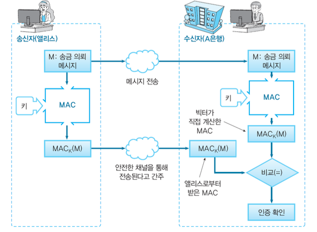

# HTTPS

## HTTPS란?

- HTTPS는 Hypertext Transfer Protocol Secure의 약자로 보안이 강화된 HTTP 프로토콜. SSL/TLS라는 보안 프로토콜 위에서 동작하는 HTTP.
- HTTP 프로토콜만으로 통신을 수행하면, 다음과 같이 평문 데이터가 모두 노출됨.
  
  - 와이어 샤크를 이용하면 위와 같이 HTTP 패킷을 확인할 수 있는데, 유저의 민감한 데이터가 그대로 노출되는 것을 확인할 수 있음.
- 이렇게 HTTP는 암호화되지 않은 데이터를 전송하기 때문에 서버와 클라이언트가 주고 받는 메시지를 외부에서 볼 수 있어 보안에 취약함. 이러한 취약점을 보완하고자 만들어진 것이 바로 HTTPS.
- HTTP의 문제점 :
  - 암호화 기능 없음
    - 단순 text로 주고 받기 때문에 중간에 누군가가 신호 가로채면 내용이 그대로 노출됨.
  - 신뢰할 수 있는 사이트인지 확인 불가
    - 통신하려는 사이트가 신뢰할 수 있는지 따로 확인하는 작업이 없어 다른 사이트가 통신하려는 사이트로 위장 가능.
  - 통신 내용 변경 가능
    - 요청을 보낸 곳과 받은 곳의 데이터 내용이 정확히 일치하는지 확인할 수 없음.
    - 누군가가 중간에 데이터를 악의적으로 변조한다면 정확한 데이터를 주고 받을 수 없게 됨.

## SSL/TLS

- 응용 계층 보안을 위한 기술로, 웹에서 가장 많이 사용되고 있는 보안 서비스 중 하나.
- 처음에는 Secure Socket Layer(SSL) 기술이 개발되어 널리 사용되었지만, 보안 결함으로 인하여, 더욱 업그레이드 된 Transport Layer Secuirty(TLS)가 개발되어 사용되고 있음. (원래 SSL이라고 부르던 습관 때문에 TLS인데 SSL이라고 부르는 사람들 있음. 그래서 현재는 다 TLS로 표준화 되었지만 SSL/TLS라고 통용함.)
- 다음과 같은 서비스를 제공함.
  1. 서버와 클라이언트 사이에 전송되는 데이터를 암호화
  2. 서버와 클라이언트는 공개키 기반 암호 시스템을 이용하여 서로를 인증.
  3. MAC(Message Authentication Code)을 이용하여 전송되는 모든 메시지의 무결성을 검사.
- 현재 웹브라우저를 포함한 많은 응용프로그램에 TLS 패키지가 내장되어 있음.
- HTTP에 SSL/TLS를 적용시킨 것이 바로 HTTPS.

### TLS 구조

- TCP/IP 모델의 HTTPS

  

- TLS 구조

  

- 2개의 계층에 걸쳐있는 프로토콜. HTTP 빼고 위 4개와 레코드 프로토콜까지가 TLS에서 제공하는 프로토콜.
  - TLS는 TCP/IP 모델의 응용계층에 포함됨.
  - 응용계층이 2층으로 나뉘어져 있는 것.  
- 상위 계층: Handshake Protocol, Change Cipher Specification Protocol, Alert Protocol, Heartbeat Protocol
- 하위 계층: Record Protocol - 상위 계층 프로토콜에 기본적인 보안 서비스 제공. (실제로 보안 행위를 수행하는 프로토콜. 데이터 암호화, MAC 생성 등이 이루어짐.)
- HTTP도 TLS 위에서 동작 가능하다. (예: HTTPS) (기존의 HTTP를 계층에 포함시켜둬서 일반 메시지는 HTTP 통해서 나갈 수 있음.)
  - 데이터가 일반적인 웹페이지일 경우 HTTP, 레코드 프로토콜, TCP, IP 순으로 데이터가 내려감.
  - 문제가 발생해서 경고 메시지일 경우엔 경고 프로토콜, 레코드 프로토콜, TCP, IP 순으로 내려감.
  - 두 서버가 있을 때 한 서버쪽에서 다른쪽 서버가 살아있나보려고 잘 살아있는지 물어볼 때는, 하트비트 프로토콜, 레코드 프로토콜, TCP, IP 순으로 내려감.
  - 서버랑 클라이언트가 처음 연결할 때는, 핸드 셰이크 프로토콜, 레코드 프로토콜, TCP, IP 순으로 내려감.
  - 통신 중간에 암호를 바꾸거나 해야할 떄는 암호 명세 변경 프로토콜, 레코드 프로토콜, TCP, IP 순으로 내려감.

### HTTPS

- HTTPS는 SSL/TLS의 껍질을 덮어쓴 HTTP 라고 할 수 있음.
- 즉, HTTPS 는 새로운 애플리케이션 계층의 프로토콜이 아니며, HTTP 통신하는 소켓 부분을 SSL(Secure Socket Layer) or TLS(Transport Layer Security)라는 프로토콜로 대체하는 것 뿐.
- HTTP는 원래 TCP와 직접 통신했지만, HTTPS에서 HTTP는 SSL/TLS와 통신하고, SSL/TLS가 TCP와 통신하게 됨.
- HTTPS의 SSL/TLS에서는 대칭키(공통키) 암호화 방식과 공개키 암호화 방식을 혼합한 하이브리드 암호 시스템을 사용함. 대칭키를 공개키 암호화 방식으로 교환한 다음에 다음부터의 통신은 대칭키 암호를 사용하는 방식.
- 평문 통신인 HTTP에 비해서 암호화 통신인 HTTPS는 CPU나 메모리 등 리소스를 더 많이 요구함. 통신할 때마다 암호화를 하면 추가적인 리소스를 소비하기 때문에 서버 한 대당 처리할 수 있는 리퀘스트의 수가 상대적으로 줄어들게 됨.
- 하지만 최근에는 하드웨어의 발달로 인해 HTTPS를 사용하더라도 속도 저하가 거의 일어나지 않으며, 새로운 표준인 HTTP 2.0을 함께 이용한다면 오히려 HTTPS가 HTTP보다 더 빠르게 동작함. 따라서 웹은 과거의 민감한 정보를 다룰 때만 HTTPS에 의한 암호화 통신을 사용하는 방식에서 현재 모든 웹 페이지에서 HTTPS를 적용하는 방향으로 바뀌어가고 있음.
- HTTP는 80 포트를 사용하지만, HTTPS는 443 포트를 사용한다.
- HTTPS를 사용하면 다음 내용들이 암호화된다.
  - URL
  - 문서 내용
  - 브라우저 양식 내용
  - 쿠키
  - HTTP 헤더

## 대칭키 암호 모델

- 대칭키 암호 모델에서 사용되는 주요 용어들은 다음과 같다.
  - 평문(Plaintext) : 원본 메시지
  - 암호문(Ciphertext) : 코드화된 메시지
  - 비밀 키(Secret Key) : 송신자와 수신자만이 공유하고 있는 키.
  - 암호화(Encryption) : 평문을 암호문으로 바꾸어주는 과정. 입력값으로 평문과 비밀 키가 들어간다.
  - 복호화(Decryption) : 암호문을 복호문(평문)으로 바꾸어주는 과정. 입력값으로 암호문과 비밀 키가 들어간다.
- 암호화할 때 쓰이는 키와 복호화할 때 쓰이는 키가 같기 때문에 대칭키 암호 모델이라고 한다

### 대칭키 암호 모델의 문제점

- 대칭키 암호 모델은 대칭 암호를 사용하여 메시지를 주고 받기 위해서, 송신자와 수신자가 대칭키를 사전에 공유해야 한다는 문제가 있음.
- 키를 안전하게 공유하지 않고 그냥 같이 보낸다면, 공격자가 도청하게 되었을 때, 그 키로 메시지를 풀 수 있다. 따라서 암호화한 것이 쓸모 없어져 버리게 된다.

  

- 안전하게 키를 보내기 위해서 공개키 암호 모델을 사용할 수 있음.

## 공개키 암호 모델

- 공개 키 암호의 가장 큰 역할은 키 분배 문제를 해결할 수 있다는 것으로, 현재 가장 많이 쓰이고 있다.
- 공개 키 암호 기반의 키 분배는 다음 두 과정으로 이루어져 있다.
  - 공개키의 분배
  - 공개 키 암호를 이용한 대칭 키 분배.

 

- 과정 예시 :
  
  - 앨리스가 밥에게 메시지를 보내려고 함. 밥이 먼저 공개키를 공개된 공간 풀어놓고, 앨리스는 세션키(대칭키)를 하나 만들어내서 밥의 공개키로 암호화한 후 밥에게 보냄. 밥은 받은 암호화된 세션키(대칭키)를 자신의 개인키로 복호화함. 그러면 앨리스와 밥은 세션키(대칭키)를 공유하게 됨.
  - 공개 키 주인을 인증해야 하는 문제가 발생할 수 있는데, 이는 추가적인 보안 기술로 해결 가능하다. (공개키 주인이 밥이 맞는지 앨리스가 알 수 없음.)

 

- 공개키 암호 주요 과정 :

  

  - (밥이 앨리스에게 메시지 보내는 경우)
    - Alice 가 비밀키(Private key)를 임의로 생성하고, 그의 짝이 되는 공개키(Public key)를 계산해낸다.
    - Alice 가 공개키를 공개한다.
    - Bob이 Alice에게 메시지를 보낼 때, Alice의 공개키로 암호화한다.
    - Alice가 Bob으로부터 암호화된 메시지를 받으면, 자신의 비밀키로 복호화한다.

 

- 공개키 암호에 대한 오해
  - 공개키 암호가 대칭키 암호보다 더 안전하다 :
    - 실제로 AES 256(대칭키)과 RSA 1024(공개키)가 보안 수준이 비슷한데, 필요한 키의 크기는 RSA가 4배로 크다. (키 사이즈가 똑같을 경우 aes가 rsa보다 더 안전하다.)
  - 공개키 암호는 대칭키 암호를 완전히 대체할 수 있다 :
    - 같은 크기의 평문을 암호화하는데 공개키 암호가 연산량이 훨씬 많다. 따라서 데이터를 암호화하는데는 여전히 대칭키 암호가 사용되며, 공개키 암호는 대칭키 암호의 가장 큰 약점인 대칭키 공유 이슈를 해결해준다. (데이터는 대칭키 방식으로 암호화, 대칭키는 공개키 방식으로 암호화한다.)
  - 공개키를 사용하면 키 공유 이슈가 해결된다 :
    - 공개키 암호가 대칭키 암호의 키 공유 이슈를 해결해주지만, 여전히 인증과 관련된 이슈가 남는다(공개키가 정말 그 사람의 것인가?). 이를 위하여 추가적인 프로토콜(예: 인증서)이 필요하다.

## 메시지 인증 코드(MAC)

- 무결성(요청을 보낸 곳과 받은 곳의 데이터 내용이 정확히 일치하며 누군가가 중간에 데이터를 악의적으로 변조한 적이 없음)을 확인하고, 메시지에 대한 인증을 하기 위한 코드. (메시지의 무결성과 인증만 고려한 알고리즘. 기밀성은 고려하지 않았기때문에 평문 메시지를 그대로 보냄.)
  - 입력 : 메시지, 공유하는 키
  - 출력 : 고정 비트 길이의 코드

 

- 프로세스

  - Alice와 Bob이 공유하고 있는 키 K와 해시 함수 $H()$가 있다고 하자.
  - Alice가 Bob에게 메시지 M을 보낼 때, MAC ← $H(K||M)$ 연산을 수행한다. (원본메시지 앞에 키를 붙여서 해시함수에 집어넣음.)
  - Alice가 Bob에게 M과 MAC을 보낸다.
  - Bob은 $H(K||M)$을 계산하여 MAC과 값이 같은지 비교해본다.

    

 

- MAC의 한계
  - 제 3자에게 증명하기가 불가능.
    - 공유키를 가진 사람만이 메시지를 검증할 수 있음.
    - 하지만, 그 외의 사람들은 메시지를 검증할 수 없음.
  - 부인 방지(Non-repudiation)가 불가능.
    - Alice와 Bob 사이에서 공유하고 있는 키로 Alice가 MAC을 만들어서 전송했다고 가정.
    - Bob은 Alice가 보낸 것을 알고 있지만, 그 외의 사람들은 알 수 없음.
    - Alice는 제 3자에게 자신이 보낸 메시지가 아니라고 부인(Repudiate)할 수 있음.

## 디지털 서명

- MAC의 한계가 발생하는 이유는 MAC이 대칭키방식이기 때문.
  - MAC을 위해 사용되는 대칭키는 Alice와 Bob만이 공유하고 있고, 그 키를 갖고 있어야 증명과 검증이 가능.
  - 거꾸로 생각하면 그 키를 갖고 있지 않으면 검증이 불가능한 상황.
- 따라서 메시지 작성자만이 서명하고, 누구나 검증할 수 있는 새로운 메시지 인증 시스템이 필요.
- 공개키 암호화 방식은 누구나 암호화할 수 있고, 수신자만이 복호화할 수 있는데, 이것을 역이용하여 디지털 서명을 설계.

 

- 디지털 서명과 공개키 암호의 비교

  - 공개키 암호
    - 앨리스에게 메시지를 보내려면 밥이 보낼 메시지를 앨리스의 공개키로 암호화. 앨리스는 밥에게서 메시지를 받아서 개인키로 복호화하여 메시지를 확인.
  - 디지털 서명
    - 앨리스는 자신의 메시지를 개인키로 서명(암호화)해서 이를 다른 사람들에게 전송. 받은 사람들은 메시지의 서명을 앨리스의 공개키로 복호화하여 서명을 검증함.
  - 비교 :

    

 

- 디지털 서명의 구조

  

  - 앨리스가 밥에게 메시지를 보내고자 함.
    - 앨리스가 원본 메시지를 해시함수에 통과시켜서 해시값을 얻음. 얻은 해시값을 앨리스 자신의 비밀키를 이용해서 서명하여 서명 s를 얻음. 앨리스는 원본메시지와 서명 s를 붙여서 밥에게 전송함.
    - 밥은 앨리스가 전송한 것을 받아 서명 s를 앨리스의 공개키로 복호화함. 복호화해 나온 결과값과, 원본메시지를 해시함수에 통과시켜 얻어낸 해시값을 비교하여 둘이 같으면 서명이 검증된 것임(=앨리스가 보낸 메시지가 맞다).
  - 보면 알겠지만 구조상 공격자가 앨리스의 서명만 따낸 다음에 다른 메시지에 붙여서 앨리스인척 밥에게 보낸다고 해도 들킬 수 밖에 없다. (마지막에 비교했을 때 값이 같지 않을테니까)

## 공개 키 암호를 이용한 키 분배의 한계

- 공개 키 암호를 이용하면 키 분배 문제를 해결할 수는 있지만, 누구라도 공개 선언을 위장할 수 있다는 한계점이 있음. 예를 들어, A가 아닌 다른 사용자가 A를 가장하여 공개키를 다른 사람에게 보낼 수 있다.
- 이를 방지 하기 위하여, 제 3자 기관인 Certificate Authority (CA) 를 두어 운영하고, CA로부터 공개키의 인증서(Certificate)를 발급 받는다.
- 인증서는 대체로 키 소유자의 ID, 공개키, 그리고 CA가 서명한 값으로 구성되어 있다.
- 인증서는 누구나 검증할 수 있도록 설계되어 있다. (공인인증기관의 공개키를 누구나 갖고있기 때문에 누구나 검증 가능)

## 공개키 인증서

- 사용자의 공개키를 인증하기 위한 인증서. (공개키 방식을 이용해 다른 사람의 공개키를 인증해주는 인증서.)
- 기본적으로 사용자의 공개키가 저장되어 있음.
- 또한, 이름이나 소속, 메일 주소 등의 개인 정보가 추가적으로 들어있음.
- 공개키를 인증하기 위하여, 인증기관(CA; certification authority)이 자신의 개인 키로 디지털 서명하고, 사용자에게 배포.
- 세계적인 인증기관으로는 DigiCert(Verisign), Sectigo, GlobalSign 등이 있다.
- 우리나라에서는 금융결제원, 코스콤, 한국전자인증, 한국무역정보통신, 한국정보인증이 있다.

## TLS을 이용한 통신(HTTPS) 동작 과정

- 공인인증기관(CA)이 서버의 인증서를 서명해서 서버에게 보내줌(공개키를 인증받음).
  - 사이트틑 CA에 사이트 정보와 사이트 공개키를 보내고, CA는 자신의 개인키로 사이트 정보와 사이트 공개키를 암호화하여 인증서를 생성한 뒤, 인증서를 사이트에게 전달한다.
- 클라이언트(브라우저)가 최초로 접속요청하게 되면 서버는 인증서(공개키)를 클라이언트(브라우저)에게 보내줌. 클라이언트(브라우저)는 받은 인증서를 공인인증기관(CA)의 공개키로 검증해보고(CA의 공개 키가 브라우저에 내장되어 있다고 가정), 검증 성공하면 세션키(대칭키) 생성해서 보관하며, 서버의 공개키로 세션키(대칭키)를 암호화해서 서버에게 보내줌. 서버는 이를 받아 자신의 개인키로 복호화해 세션키(대칭키)를 얻어내고, 비로소 세션키(대칭키)를 클라이언트와 서버가 공유하게 됨. (`SSL/TLS HandShake Protocol`)
- 이후부터는 서버와 클라이언트가 실제로 데이터를 주고받는 단계이고, 데이터를 보낼 때는 세션키(대칭키)로 암호화하여 보내고 데이터를 받은 후엔 세션키로 복호화를 진행하며 안전한 통신이 이루어짐.
- 데이터 전송이 끝나면 SSL/TLS 통신이 끝났음을 서로에게 알려주고 세션키는 폐기하여 세션을 종료시킨다.

  

## SSL/TLS Handshake Protocol

- 서버와 클라이언트가 세션을 만들기 위하여 처음으로 수행하는 프로토콜.
- 통신을 하는 브라우저와 웹 서버가 서로 암호화 통신을 시작할 수 있도록 신분을 확인하고 필요한 정보를 클라이언트와 서버가 주거니 받거니 하는 과정.
- 암호화 방법, 메시지 인증, 압축 방법, 사용되는 각종 키들을 정한다.
- 첫번째 그림의 파란색 칸과 노란색 칸은 네트워크 상에서 전달되는 IP 패킷을 표현한 것. 파란색 칸에 해당하는 SYN, SYN ACK, ACK는 TCP 레이어의 3-way handshake로, HTTPS가 TCP 기반의 프로토콜이므로 SSL Handshke에 앞서 연결을 생성하기 위해 실시하는 과정이다. 노란색 칸에 해당하는 패킷들이 SSL Handshake라고 보면 된다.

 

- SSL/TLS Handshake Protocol의 목표
  - 클라이언트와 서버가 상대방의 공개키를 받아서 인증.
  - 세션키(대칭키)와 MAC용 키를 공유. (암호화할 때 사용되는 대칭키, 메시지를 인증하기 위해서 사용되는 키 두가지를 공유하기 위함.)

 

## SSL/TLS Handshake Protocol 동작 방법

### 1단계 : Client Hello

- 클라이언트가 서버에 처음으로 접속을 시도하며 Client Hello 메시지를 보낸다.

  - 이 단계에서 클라이언트 측에서 생성한 랜덤 데이터(Random Byte), 클라이언트 측에서 지원하는(자신이 사용 가능한) 암호화 방식(Cipher Suite), 세션 아이디 등을 전달한다.
  - Cipher Suite는 SSL 프로토콜 버전, 인증서 검증, 데이터 암호화 프로토콜, Hash 방식 등의 정보를 담고 있는 존재로, 선택된 Cipher Suite의 알고리즘에 따라 데이터를 암호화하게 됨.

    

    - 위 사진처럼 클라이언트가 사용 가능한 Cipher Suite를 서버에 제공하는 것을 알 수 있음.

    

### 1단계 : Server Hello

- 서버는 Client Hello 메시지를 처리한 후 Handshake Failure Alert 메시지 또는 Server Hello 메시지를 전송하게 된다

  - 다음과 같은 정보들을 Server Hello 메시지를 통해 클라이언트로 전송한다.
  - 서버 측에서 생성한 랜덤 데이터(Random Byte)
  - 서버의 SSL/TLS 프로토콜 버전
  - 서버가 선택한 암호화 방식(Cipher Suite 중 하나를 선택)

    

    - ClientHello에서 17개였던 Cipher Suite와 달리 Sever가 선택한 한 줄만 존재하는 것을 확인할 수 있음.

### 2단계 : Certificate

- Server가 자신의 SSL/TLS 인증서를 클라이언트에게 전달한다. 인증서는 CA(인증 기관)의 개인 키로 암호화(디지털 서명) 되어있다.
- 인증서 내부에는 Server가 발행한 공개 키(개인 키는 따로 서버가 소유)가 들어있다.
- 클라이언트는 서버의 인증서를 발급한 CA가 자신이 내장한 CA의 리스트에 있는지 확인한다.
- 확인 결과 내장된 CA 리스트에 포함되어 있다면 해당 CA의 공개키를 이용해서 암호화되어있는 SSL 인증서를 복호화한다. 복호화에 성공하면 이 인증서는 CA가 서명한 것이 맞으니 진짜임을 검증할 수 있다.
- 복호화를 통해 클라이언트는 인증서에 들어있는 서버 공개키를 획득한다.

  

  - SSL 인증서가 무슨 알고리즘으로 암호화되었고, 무슨 Hash 알고리즘을 사용하였는지 (디지털 서명) 확인할 수 있음.

### 2단계 : Server Key Exchange

- 서버의 공개 키가 SSL 인증서 내부에 없는 경우, 서버가 직접 전달한다는 뜻이다. 공개 키가 SSL 인증서 내부에 있을 경우 Server Key Exchange는 생략된다.
- 원래 공개키가 certificate안에 들어있어야 하는데 없는 경우에는 서버가 따로 공개키를 보내주는데 그럴 때 수행되는 것.

### 2단계 : Certificate Request

- 서버도 client에게 인증서를 요구하는 경우가 있을 수도 있는데 그런 경우.
- 이 요청이 있었을 경우 3단계의 Certificate에서 서버에게 client도 자신의 인증서을 보내줌.

### 2단계 : Server Hello Done

- 서버가 행동을 마쳤음을 전달함.

### 3단계 : Certificate

- 서버도 client에게 인증서를 요구했을 경우, 서버에게 client도 자신의 인증서을 보내줌.

### 3단계 : Client Key Exchange

- 클라이언트는 데이터 암호화에 사용할 대칭키를 생성한 후 SSL 인증서 내부에서 추출한 서버의 공개 키를 이용해 대칭키를 암호화한 후 서버에게 전달한다. 이로인해 서버와 클라이언트가 대칭키 공유하게 됨.
  - 클라이언트는 주고받은 랜덤 데이터를 조합해 pre master secret이라는 키를 생성하고, 아까 인증서에서 복호화해낸 서버의 공개키로 pre master secret 키를 암호화해서 서버로 전송.
  - 서버는 이를 받아 자신의 비공개키로 pre master secret키를 복호화한다.
  - 이제 클라이언트, 서버 둘 다 동일한 pre master secret키를 가지고 있게 된다.
  - 서버와 클라이언트 모두 pre master secret 값으로부터 일련의 과정을 거쳐서 master secret값을 유도해낸다. 이렇게 만든 master secret으로 세션키(대칭키)를 생성한다.

### 3단계 : Certificate Verify

- 2단계에서 서버가 보낸 인증서에 대한 확인을 보내는 것.

### 4단계 : Change Cipher Spec / Finished

- Change Cipher Spec은 클라이언트와 서버 모두가 서로에게 보내는 패킷으로, 교환할 정보를 모두 교환한 뒤 통신할 준비가 다 되었음을 알리는 패킷이다. 그냥 프로토콜이 끝났음을 알려주는 단순한 과정.
- 그 후 Finished 패킷을 보내어 SSL Handshake의 종료를 서로에게 알리게 된다.

## TLS Record Protocol

- 전송 데이터의 보안을 위하여 실질적으로 MAC 코드를 생성하고 암호화하는 과정. (TLS에서 가장 중요한 프로토콜. 실제로 보안 행위를 수행하는 프로토콜. MAC 생성 + 메시지 암호화.)
    
- 다음 두 가지 서비스를 제공한다.
  - 기밀성: Handshake Protocol에서 정의한 대칭키를 이용하여 전송 데이터를 암호화한다.
  - 무결성: MAC을 생성하여 전송된 데이터의 무결성을 증명해준다.

 

- 다음 다섯 단계로 데이터를 처리한다.
  
  1. 단편화 (Fragmentation) - 16,384바이트 이하의 블록으로 나눔
  2. 압축 (Compression)
  3. 메시지 인증 코드 계산 - HMAC 이용
  4. 암호화 - AES나 3DES, RC4 알고리즘을 사용
  5. 헤더 붙이기 - 컨텐츠 유형, 주버전, 서브버전, 압축된 데이터의 길이로 구성됨
     - 컨텐츠 유형은 change_cipher_spec, alert, handshake, application_data 중 하나의 값을 갖는다.
  - 결론적으로, 단편화, 압축, 압축한 결과에 MAC 첨부, 전체를 암호화, 앞에다 헤더 붙임.

### 기타 Protocol들

- Change Cipher Specification Protocol :
  - 암호의 명세를 변경하기 위한 프로토콜.
  - Handshake protocol에도 포함이 되며, 세션 중간에 키나 암호화, 인증, 압축 알고리즘을 변경할 때 사용된다.
- Alert Protocol :
  - Handshake 프로토콜에서 뭔가 문제가 발생했거나 메시지의 복호화가 안 될 때, 메시지의 인증을 실패했을 때, 등에 사용되는 프로토콜.
- Heartbeat Protocol :
  - Heartbeat: 정상적으로 동작한다는 걸 나타내기 위해서 또는 시스템의 다른 부분과 동기화를 하기 위해 하드웨어나 소프트웨어가 생성하는 주기적 신호.
  - 개체의 가용성(지금 연결이 잘 되고 있는지)을 모니터링 할 때 사용하는 프로토콜.

 

- HTTP만 사용한 경우 vs HTTPS를 사용한 경우
  

- HTTPS 적용 여부에 따른 웹페이지
  

### HTTPS의 연결 개시와 연결 종료

- HTTPS 연결 시작을 위한 과정
  - 클라이언트가 적절한 포트를 통해 TLS_ClientHello를 서버에 보냄으로써 연결 시작.
  - TLS 핸드셰이크가 마무리되면 첫 번째 HTTP 요청을 전송.
  - 모든 HTTP 데이터는 TLS응용 데이터로 전송.
    
    - 연결요청할 때는 그냥 HTTP 통신. 세션키 공유 후부터는 HTTPS 통신 일어남. (세션키 공유 전에는 그냥 HTTP 통신하는 거라 처음부분이 제일 취약한 것.)

 

- HTTPS 연결 종료를 위한 과정
  - 클라이언트나 서버가 HTTP 레코드 안에 "Connection: close" 를 삽입해서 연결 종료.
  - 오류로 인하여 연결 중단되었을 때는 close_notify 경보를 띄우고, 사용자에게 경고 메시지를 나타내어준다.
