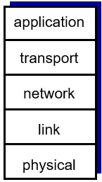
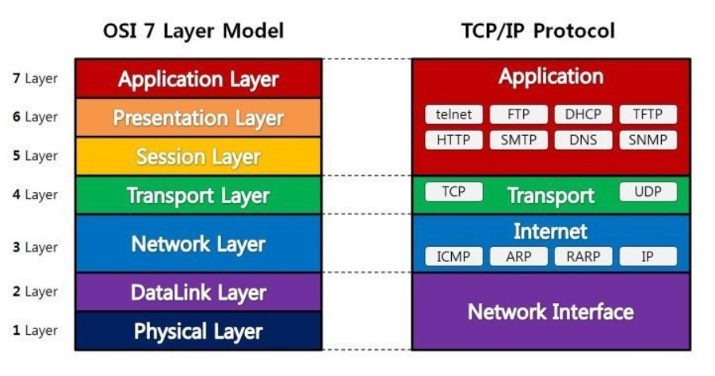
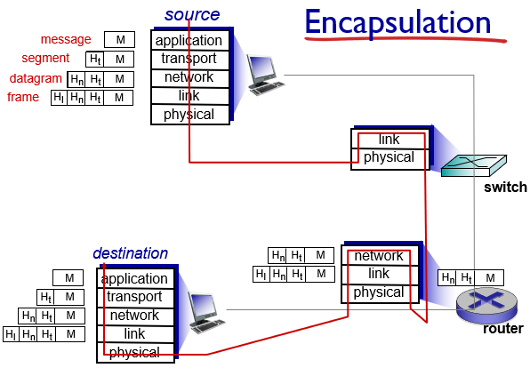

# OSI 7계층
## protocol layers, service models

### Protocol "layers"

- 프로토콜은 방대하고 복잡하기 때문에 layering 구조를 가지고 있음.
- layering의 장점 :
    - 복잡한 시스템의 각 부분들을 identify하고 관계를 정의하는 것이 쉬워짐.
    - maintenance와 update가 용이해짐.
- layering의 단점 :
    - 각 레이어의 기능들 간에 중복이 발생할 수 있음.
    - 한 레이어가 최적으로 작동하기 위해서는 다른 레이어에서 생성되는 정보를 필요로 할 수가 있는데 엄격하게 레이어로 구분해놓으면 두 레이어 간에 어떤 communication이 있어야지만 다른 레이어에서 발생한 정보를 가져올 수가 있음. 그래서 가져오는 데서 overhead 비용이 추가로 발생할 수 있다. 레이어의 구분때문에 다른 레이어의 정보를 활용해야되는데 활용하지 못할 수도 있다.
- 어쨌거나 지금 인터넷의 모든 네트워크의 프로토콜은 계층구조로 구성이 되어있다.

### Internet protocol stack

- 인터넷 프로토콜은 5개의 레이어로 구성되어있음. physical layer가 1계층, application layer가 5계층 이 순대로 번호 붙여져 있음.
- 각 레이어는 목적을 갖고있음.
- (5계층)**application(응용 계층)** :
    - supporting network applications.
    - 맨 위에 application protocol layer가 오는데 이 프로토콜의 목적은 network application program을 지원하는 것임. network application마다 그 application을 지원하기 위한 프로토콜들로 이 계층이 기반 되어있다. application 계층에서 해주는 일은 user application program에서 발생시킨 data를 encapsulate(포장)해서 어떻게 메시지로 만드냐 하는게 얘의 주된 역할임. 유저 메시지를 생성해내는 게 목적.
    - 종류에는 FTP, SMTP, HTTP가 있음.
        - FTP : file transfer(파일 전송) application을 지원하는 프로토콜.
        - HTTP : web application을 지원하는 프로토콜. web application이 실행되기 위해서 다양한 web page 를 request하는 메시지는 어떤 형태로 생겼고, 어떤식으로 전달해야 되고, request message를 받은 웹서버에서는 response를 어떤식으로 prepare하고 보내야하는지를 다 정의하고 있음.
        - SMTP : email application을 지원하는 프로토콜.
- (4계층)**transport(전송 계층)** :
    - process-process data transfer
    - application 계층에서 유저 메시지를 만들어내면 그 다음에는 얘를 transport 계층에다 process-process data delivery를 부탁함. 즉, transport 계층의 목적은 source process에서 destination process로 배달임.
    - 종류에는 TCP, UDP가 있음.
- (3계층)**network(네트워크 계층)** :
    - routing of datagrams from source to destination
    - transport 계층에서 process to process delivery를 하기 위해서 network 계층에 host to host delivery를 부탁함(process-process delivery가 있기 위해선 먼저 host-host delivery가 이뤄져야 때문). source host부터 destination host까지 네트워크 상에서 길찾기를 해서 배달해주는 작업(source host to destination host delivery)을 network 계층이 하게 됨.
    - 종류에는 IP, routing protocols가 있음.
- (2계층)**link(데이터 링크 계층)** :
    - data transfer between neighboring network elements
    - network 계층이 source host로부터 destination host까지 배달해주기 위해서 hop by hop으로 네트워크 노드를 거쳐가는데 한 hop 전달하는 것(한 hop을 건너가는 것)을 link 계층에게 부탁함. 한 hop을 건너가는 것이 link 계층의 목적.
    - 종류에는 Ethernet, 802.111(WiFi), PPP가 있음.
- (1계층)**physical(물리 계층)** :
    - bits "on the wire"
    - link 계층에서 한 hop을 건너가기 위해 physical medium을 통해서 bit를 실어날라주는 작업을 하는 것을 physical 계층에게 부탁함. wire에서 데이터를 실어 나르는 역할.
- 각 계층은 바로 아래 계층의 서비스를 이용해서 자기 프로토콜 계층의 목표를 달성한다.

### ISO/OSI reference model(OSI 모형)

- 컴퓨터 네트워크 프로토콜 디자인과 통신을 계층으로 나누어 설명한 것. 일반적으로 OSI 7 계층이라고 함. physical layer가 1계층, application layer가 7계층 이 순대로 번호 붙여져 있음.
- application과 transport 계층 사이에 presentation과 session 계층이 추가됨.
- (6계층)**presentation(표현 계층)** :
    - application들이 data의 의미를 해석할 수 있게 해줌.
    - 코드 간의 번역을 담당하여 사용자 시스템에서 데이터의 형식상 차이를 다루는 부담을 응용 계층으로부터 덜어 줌. MIME 인코딩이나 암호화 등의 동작이 이 계층에서 이루어짐. 예를 들면, EBCDIC로 인코딩된 문서 파일을 ASCII로 인코딩된 파일로 바꿔 주는 것이 표현 계층의 몫.
    - ex) encryption, compression, machine-specific conventions
- (5계층)**session(세션 계층)** :
    - 양 끝단의 응용 프로세스가 통신을 관리하기 위한 방법을 제공함. 동시 송수신 방식(duplex), 반이중 방식(half-duplex), 전이중 방식(Full Duplex)의 통신과 함께, 체크 포인팅과 유휴, 종료, 다시 시작 과정 등을 수행. 이 계층은 TCP/IP 세션을 만들고 없애는 책임을 짐.
    - 동기화, checkpointing, recovery of data exchange.
- 나머지 계층은 internet protocol stack과 같다.
- internet stack이 이 두 레이어들을 빼먹은 것이라 할 수 있음. 이 서비스들은 필요하다면 application에 반드시 구현되어야 함.

### Encapsulation(캡슐화)

- source로부터 destination까지 메시지가 전달되는 과정.
- source host와 destination host에만 internet protocol의 5계층이 다(protocol full stack) 존재함. router에는 3계층인 network 계층까지밖에 없고 switch에는 2계층인 link 계층까지밖에 없음.
    - network application program은 router와 switch에선 실행되는 일이 없고 host(end system)에서만 실행되기 때문에 application 계층은 host에 밖에 없다.
    - transport 계층은 end-end process delivery를 하기 때문에 router나 switch에는 들어갈일이 없고 host에만 존재한다.
    - network 계층은 길을 찾아서 destination host까지 가는일을 하기 때문에 end system뿐만 아니라 router에도 존재한다. 다음 홉을 어디로 보내야할지를 결정해야하므로 router에도 network 계층이 필요. switch는 network 계층을 갖고있지 않아서 general한 길찾기 기능을 갖고있지 못함.
- 각 프로토콜 계층에서는 자기 기능을 수행하기 위해서 헤더를 붙인다. 그 헤더는 나의 peer(가다가 다음번으로 만나는 같은 계층)가 읽는 게 목적임. 그래서 네트워크 계층의 역할은 이 peer들이 잘 협력해서 source host로부터 destination host까지 배달하는 것임.
- 각 프로토콜 계층에서 만들어내는 데이터 유닛을 **PDU(protocol data unit)**이라고 함.
    - 일반적으로 application 계층에서 만들어내는 것은 **message**.
    - transport 계층에서 이 message에다가 transport 계층 헤더를 붙여서 만든 PDU가 **segment**.
    - network 계층에서 이 segment에다 network 계층의 헤더를 붙여서 만든 PDU가 **datagram**.
    - link 계층에서 이 datagram에다가 link 계층의 헤더를 붙여서 만든 PDU가 **frame**.
- 과정 자세한 설명 :
    - source :
        - source host의 application 계층에서는 network application program을 위해서 메시지를 생성해냄. 그러면 그 메시지를 process-process delivery를 부탁하기 위해서 transport 계층으로 메시지를 내려보냄.
        - 그러면 source의 transport 계층에서는 application 계층이 내려준 메시지에다가 header를 붙여서 **segment**라는 유닛을 만들게 됨.(헤더는 destination의 transport 계층에게 쓴 delivery가 잘됐나 확인하는 용도의 편지라고 할 수 있음.) 그러면서 transport 계층은 이 segment를 host-host delivery를 부탁하기 위해서 network 계층으로 내려보냄.
        - 그러면 source의 network 계층은 host-host delivery가 제대로 되게 하기 위해서 segment에 네트워크 계층의 헤더를 붙여서 **datagram**이라는 유닛을 만들게 됨. 그러면서 network 계층은 다음 hop을 알려주면서 한 hop을 건너갈 것을 부탁하면서 이 datagram을 link 계층으로 내려보냄.
        - 그러면 source의 link 계층은 한 hop을 건너가는 것을 제대로 하기 위해서 datagram에 link 계층 헤더를 붙여서 **frame**이라는 유닛을 만들게 됨. 결국 이 frame을 physical 계층으로 내려보내면서 link로 비트를 밀어넣어달라고 부탁하게 됨.
        - 마지막으로 source의 physical 계층에서 비트를 link에 밀어넣어줌.
    - switch :
        - source의 physical 계층에서 밀어넣은 비트는 switch의 physical 계층이 받게 됨. 그래서 switch의 physical 계층에서 비트를 다 모아서 source의 link 계층에서 만들었던 frame을 그대로 복구해 link 계층으로 올려줌.
        - 그러면 switch의 link 계층이 다시 한 hop을 건너가게 하기 위해서 새로 frame을 만들어서 다시 physical 계층으로 내려보내주고 link로 비트를 밀어넣어달라고 부탁함. (링크마다 frame의 종류가 다르기 때문에 frame은 복구하는 것에서 끝나는 게 아니라 매번 link 통해서 보낼때마다 새로 만들어줘야 함.)
        - 마지막으로 switch의 physical 계층에서 비트를 link에 밀어넣어줌.
    - router :
        - switch의 physical 계층에서 밀어넣은 비트는 router의 physical 계층이 받게 됨. 그래서 router의 physical 계층에서는 다시 frame에 속하는 비트를 다 모아서 switch의 link 계층에서 만들었던 frame을 다시 복구해 link 계층으로 올려줌.
        - 그러면 router의 link 계층에선 switch의 link 계층에서 붙였던 헤더($H_l$)를 보고 한 hop을 제대로 건너갔다는 것을 확인한 다음 이 헤더를 떼어내고 (=source의 network 계층에서 만들었던 datagram을 복구해) network 계층으로 올려주게 됨.
        - 그러면 router의 network 계층에선 source의 network 계층에서 붙였던 헤더($H_n$)를 보고, 이 목적지 host로 가기 위해선 다음 hop어디로 가야겠구나 길을 결정한 다음 헤더를 떼어내고 다시 자기 헤더($H_n$)를 붙여서 새 datagram을 만들어서 link 계층으로 내려보냄.
        - 그러면 router의 link 계층에선 또 한 hop을 건너가기 위해서 헤더($H_l$)를 붙여서 새 frame을 만들어서 physical 계층으로 내려보냄.
        - 마지막으로 router의 physical 계층에서 비트를 link에 밀어넣어줌.
    - destination :
        - router의 physical 계층에서 밀어넣은 비트는 destination host의 physical 계층이 받게 됨. 그래서 destination의 physical 계층에서는 다시 frame에 속하는 비트를 다 모아서 router의 link 계층에서 만들었던 frame을 다시 복구해 link 계층으로 올려줌.
        - 그러면 destination의 link 계층에선 router의 link 계층에서 붙였던 헤더($H_l$)를 보고 한 hop을 제대로 건너갔다는 것을 확인한 다음 이 헤더를 떼어내고(=router의 network 계층에서 만들었던 datagram을 복구해) network 계층으로 올려주게 됨.
        - 그러면 destination의 network 계층에선 router의 network 계층에서 붙였던 헤더($H_n$)를 보고, 내가 destination이구나를 확인한 다음(destination host니까 잘 왔고 다음 홉은 없구나를 확인) 헤더를 떼어내고(=source의 transport 계층에서 만들었던 segment를 복구해) transport 계층으로 올려주게 됨.
        - 그러면 destination의 transport 계층에선 source의 transport 계층에서 붙였던 헤더($H_t$)를 보고, process-process delivery가 잘된 것을 확인하고 헤더를 떼어내고(=source의 application 계층에서 만들었던 message를 복구해) application 계층으로 올려주게 됨.
        - 그러면 결국 source에서 만들었던 message를 destination의 application 계층에서 받아보게 된다.