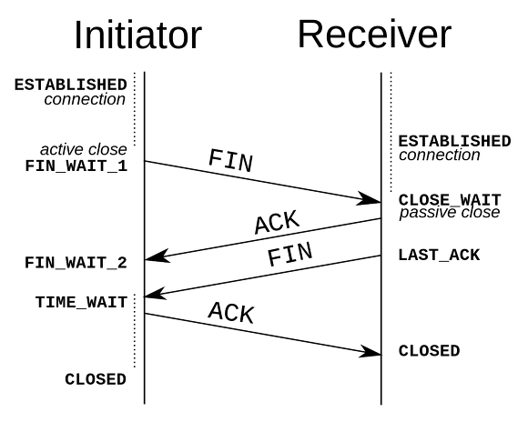

# TCP/IP

## TCP/IP란
- TCP/IP는 OSI 7계층 중에서 3계층(Network Layer), 4계층(Transport Layer)을 다루는 프로토콜
    
    - Transport 계층(4계층) : 송신자와 수신자의 논리적 연결을 담당하는 부분으로, 신뢰성 있는 연결을 유지할 수 있도록 도와줌. TCP와 UDP가 대표적.
    - Network Layer(3계층) : IP(Internet Protocol)이 활용되는 부분으로, 한 endpoint가 다른 endpoint로 가고자 할 경우, 경로와 목적지를 찾아줌. 이를 Routing이라고 하며 대역이 다른 IP들이 목적지를 향해 제대로 찾아갈 수 있도록 돕는 역할.
- TCP/IP는 패킷 통신 방식의 인터넷 프로토콜인 IP와 전송 조절 프로토콜인 TCP로 이루어져 있음. 하나의 프로토콜이 아닌 TCP와 IP를 합쳐서 부르는 말.
- IP는 패킷 전달 여부를 보증하지 않고, 패킷을 보낸 순서와 받는 순서가 다를 수 있음.
- TCP는 IP 위에서 동작하는 프로토콜로, 데이터의 전달을 보증하고 보낸 순서대로 받게 해줌.
- HTTP, FTP, SMTP 등 TCP를 기반으로 한 수많은 애플리케이션 프로토콜들이 IP 위에서 동작하기 때문에 묶어서 TCP/IP로 부르기도 하는 것.
- TCP/IP를 사용하겠다는 것 = IP 주소 체계를 따르고, IP Routing을 이용해 목적지에 도달하며, TCP의 특성을 활용해 송신자와 수신자의 논리적 연결을 생성하고 신뢰성을 유지할 수 있도록 하겠다는 것. = 송신자가 수신자에게 IP 주소를 사용하여 데이터를 전달하고 그 데이터가 제대로 갔는지, 너무 빠르지는 않는지, 제대로 받았다고 연락은 오는지에 대한 얘기를 한다는 것. 

## TCP 프로토콜을 이용하여 메시지를 송신하는 과정
- 브라우저의 URL 입력 상자에 URL을 입력하면, 브라우저가 URL을 해독한 것을 바탕으로 HTTP 리퀘스트 메시지를 만들고, 메시지를 송신하도록 OS에 의뢰함.
- 이후 OS에 내장된 프로토콜 스택이 TCP 혹은 UDP 프로토콜을 사용하여 데이터 송수신을 실행.
- 애플리케이션에서 의뢰를 받은 프로토콜 스택이 TCP 프로토콜을 이용하여 메시지를 송신하는 동작은 4단계로 요약 가능
    1. 소켓 작성
    2. 서버에 접속
        - 클라이언트 측의 소켓을 서버측의 소켓에 접속하는 단계
    3. 데이터를 송·수신
        - 소켓이 연결되면 메시지를 송신.
        - 프로토콜 스택은 애플리케이션에서 의뢰받은 메시지를 작은 조각으로 분할하여 서버를 향해 송신함.
        - 오류 때문에 패킷이 없어질 수 있으므로 분할한 조각이 제대로 서버에 도착했는지 확인하고, 도착하지 않았으면 한 번 더 보냄.
    4. 서버에서 연결을 끊어 소켓을 말소함
        - 메시지 송·수신이 전부 끝나면 서버에서 연결 끊고(메시지 송수신이 끝난 것을 클라이언트와 서버가 함께 확인) 소켓을 말소함.
- TCP 프로토콜의 메시지 송·수신 동작의 다음은, 실제로 패킷을 송수신하는 IP와 이더넷의 패킷 송·수신 동작. 프로토콜 스택과 LAN 어댑터가 연대하여 작은 조각으로 분할한 데이터를 패킷 형태로 묶고 그것을 전기나 빛의 신호로 변환하여 케이블에 송출함.

## 1. 소켓 작성
### 1) 프로토콜 스택의 내부 구성

- 위 그림의 상하관계는 작업을 의뢰하는 쪽이 위쪽에 있고, 의뢰를 받아 실제로 작업하는 쪽이 아래에 있다는 의미이며, 대강의 경향을 나타낼 뿐 상하 관계가 확실하지 않거나 역전되는 경우도 있으므로 엄밀히 생각할 필요 없음.
- 맨 위는 네트워크 애플리케이션(브라우저, 메일러, 웹서버, 메일 서버 등). 여기서부터 아래로 향하여 데이터 송수신 등의 일을 의뢰함.
- 애플리케이션의 아랫부분에는 Socket 라이브러리가 있으며, 그 안에는 리졸버가 있음. (리졸버는 DNS 서버에 조회하는 동작을 실행. 웹 브라우저와 같이 DNS 클라이언트의 요청을 네임 서버로 전달하고 네임 서버로부터 정보(도메인 이름과 IP 주소)를 받아 클라이언트에게 제공하는 기능을 수행.)
- 그 아래가 OS의 내부이며, 여기에 프로토콜 스택 존재함. 프로토콜 스택의 윗부분에는 TCP 혹은 UDP라는 프로토콜을 사용하여 데이터 송수신을 담당하는 부분이 있으며, 이 둘이 애플리케이션에서 보낸 의뢰를 받아 송수신 동작을 실행함.
- 브라우저나 메일 등의 일반적 애플리케이션은 TCP를 사용하여 데이터 송수신하고, DBS 서버에 대한 조회 등에서 짧은 제어용 데이터를 송수신하는 경우에는 UDP 사용함.
- 그 아래에는 IP 프로토콜을 사욛하여 패킷(인터넷에서 데이터 운반하기 위해 데이터를 작게 나눈 형태) 송수신 동작을 제어하는 부분이 있음. 패킷을 통신 상대까지 운반하는 것이 IP의 주 역할.
- IP 안에는 ICMP와 ARP라는 프로토콜을 다루는 부분이 포함되어 있음. ICMP는 패킷을 운반할 때 발생하는 오류를 통지하거나 제어용 메시지를 통지할 때, ARP는 IP주소에 대응하는 이더넷의 MAC주소를 조사할 때 사용함.
- IP 아래의 LAN 드라이버는 LAN 어댑터의 하드웨어를 제어. 그 아래에 있는 LAN 어댑터가 실제 송수신 동작(케이블에 대해 신호를 송수신하는 동작) 실행함.

### 2) 소켓의 실체는 통신 제어용 제어 정보
- 프로토콜 스택은 재부에 제어 정보를 기록하는 메모리 영역을 가지고 있으며, 여기에 통신 동작을 제어하기 위한 제어 정보(통신 상대의 IP주소, 포트 번호, 통신 동작의 진행 상태)를 기록.
- 소켓은 개념적인 것이여서 실체가 없으므로, 이 제어 정보 혹은 제어 정보를 기록한 메모리 영역이 소켓의 실체.
- 프로토콜 스택은 소켓에 기록된 제어 정보를 참조하면서 동작함. 
    - 데이터 송신 시 소켓에 기록된 IP 주소, 포트 번호 보고 그곳으로 데이터 송신.
    - 데이터 송신 후 응답 기다릴 떄, 어느 정도 시간이 경과하면 포기하고 없어진 데이터를 다시 보내야 하기 때문에, 소켓에는 응답이 돌아오는지의 여부와 송신 동작 후의 경과 시간 등이 기록되어있음. 프로토콜 스택은 이 정보를 보고 포기하거나 다시 보내는 동작 실행.
    - 이외에도 소켓에는 통신 동작 제어 위한 여러 정보가 기록되어 있음.
-  소켓을 만든다는 동작은 제어 정보를 추가하고 송수신 데이터를 일시적으로 일시적으로 저장하는 버퍼 메모리를 준비하는 등 통신을 준비하는 작업.

### 3) 소켓을 호출했을 때의 동작
- 애플리케이션이 Socket 라이브러리를 통해 프로토콜 스택에 소켓을 만들 것을 의뢰함.
- 프로토콜 스택은 소켓 한 개 분량의 메모리 영역을 확보하고, 초기 상태임을 나타내는 제어 정보를 소켓의 메모리 영역에 기록 -> 이 과정을 통해 소켓이 만들어짐.
- 소켓이 만들어지면 소켓을 나타내느 디스크립터를 애플리케이션에 알려줌.
    - 디스크립터 : 프로토콜 스택의 내부에 있는 다수의 소켓 중 어느 것을 가리키는지를 나타내는 번호표와 같은 정보.
- 디스크립터를 받은 애플리케이션은 이후 프로토콜 스택에 데이터 송수신 동작을 의뢰할 때 디스크립터를 통지함. 디스크립터만 알려주면 프로토콜 스택쪽에서 해당 소켓을 참고해 필요한 정보를 얻음.

## 2. 서버에 접속
### 1) 접속의 의미
- 소켓을 만들면 애플리케이션은 connect를 호출. 그러면 프로토콜 스택은 자기쪽의 소켓을 서버측 소켓에 접속함.
1. 소켓을 만든 직후는 아직 아무것도 기록되어 있지 않아 통신 상대가 누구인지도 모름. 브라우저(애플리케이션)는 URL을 바탕으로 서버의 IP주소와 포트 번호(80번)를 알고 있지만 소켓을 만드는 동작만으론 프로토콜 스택에는 아무것도 전달되지 않기 때문에 서버의 IP 주소나 포트 번호를 프로토콜 스택에 알리는 동작이 필요한데, 이것이 접속 동작의 한가지 역할임.
2. 서버측에도 소켓 만들어졌지만 서버측의 프로토콜 스택도 소켓을 만드는 동작만으로는 통신 상대 모름. 또한 서버측은 애플리케이션에서도 상대를 알 수 없음. 그래서 클라이언트에서 자신의 IP주소와 포트번호를 알리면서 통신하려는 클라이언트가 있다는 것을 서버측에 전달. 이것도 접속 동작의 역할 중 하나. 다시말해, 통신 상대와의 사이에 IP주소와 포트번호를 포함한 제어 정보를 주고받아 소켓에 필요한 정보를 기록하고 데이터 송수신이 가능한 상태로 만듦.
3. 송수신하는 데이터를 일시적으로 저장하는 메모리 영역(버퍼 메모리)도 필요한데 이 버퍼 메모리의 확보도 접속 동작을 할 때 실행됨.

### 2) 제어 정보를 주고받는 방법
- 통신 동작에 이용하는 제어 정보에는 다음의 두 종류가 있음.
    1. 헤더에 기입되는 정보
    2. 소켓(프로토콜 스택의 메모리 영역)에 기록되는 정보  

- 클라이언트와 서버는 패킷의 맨 앞부분에 제어정보를 기록한 헤더를 배치하여, 이 헤더로 제어정보를 주고 받음.

    
- 접속 동작 뿐만 아니라 데이터를 송수신하는 동작이나 연결을 끊는 동작에 필요한 정보들을 기입. 점속, 송수신, 연결끊기의 각 단계에서 클라이언트와 서버가 대화할 때마다 제어 정보를 헤더에 부가함.
- 접속 동작의 단계에서는 아직 데이터 송수신이 이루어지지 않으므로 데이터가 없고 패킷의 내용은 제어 정보만으로 이루어져 있음. 이 제어 정보를 배치한 패킷의 맨 앞부분을 헤더라고 부름.
- 이더넷이나 IP에도 같은 제어 정보가 있고 이것도 헤더라고 부름. 따라서 무엇의 헤더인지 알 수 있도록 써줌.(TCP 헤더, 이더넷 헤더, IP 헤더)

    

 

- 소켓에 기록되는 제어 정보는 프로토콜 스택의 동작을 제어하기 위한 정보.
- 애플리케이션에서 통지된 정보, 통신 상대로부터 받은 정보, 송수신 동작의 진행 상황 등이 수시로 기록되고, 프로토콜 스택은 하나하나 차례로 정보를 참조하면서 동작.
- 프로토콜 스택이 어떤 정보를 필요로 하는지는 프로토콜 스택을 만드는 사람에 따라 달라짐.
- 소켓에 기록한 제어 정보는 상대측에서 볼 수 없음. 규칙에 따라 헤더에 제어 정보를 기록하여 대화하고 그것으로 클라이언트와 서버가 서로 연락을 취하기 때문. (OS가 다르면 프로토콜 스택을 만드는 방법이 다르므로 필요한 제어 정보도 다름. 따라서 소켓에 기록한 정보는 상대측에서 보이지 않아도 됨.)

### 3) 접속 동작의 실제 과정
- 애플리케이션이 Socket 라이브러리의 connect를 호출하면서 디스크립터와 서버측의 IP 주소와 포트번호를 매개변수로 건네줌.
- 명령이 프로토콜 스택의 TCP 담당 부분에 전달되고, TCP 담당 부분은 IP 주소로 표시된 상대(서버의 TCP 담당 부분)와 제어 정보를 주고 받음. 이 대화 과정이 3-way handshake.

 

- 3-way handshake :
     
    - TCP 헤더 내의 'SYN', 'SYN/ACK', 'ACK' Flag를 사용하여 통신. TCP로 이루어지는 모든 통신은 반드시 3-way handshake를 통해 시작함.
    - 간단히 말하자면, 
        1. 송신자가 수신자에게 'SYN'을 날려 통신이 가능한지 확인.
        2. 수신자가 송신자로부터 'SYN'을 받고 'SYN/ACK'을 송신자에게 날려 통신할 준비가 되어있음 알림
        3. 송신자가 수신자의 'SYN/ACK'을 받고 'ACK'을 날려 전송을 시작함을 알림.
    - 자세한 과정 :
        - 먼저 데이터 송수신 동작의 개시를 나타내는 제어 정보를 기록한 헤더를 만듦. 송신처와 수신처의 포트 번호를 헤더에 기입하고 이를 통해 송신처가 되는 클라이언트 측의 소켓과 수신처가 되는 서버측의 소켓을 지정. 그리고 컨트롤 비트인 SYN이라는 비트를 1로 만듦. 이외에도 시퀀스 번호는 윈도우에도 적정 값 설정.
        - 이렇게 해서 TCP 헤더 만들고 이를 IP 담당 부분에 건네주어 송신하도록 의뢰.
        - IP 담당 부분이 패킷 송신 동작 실행하고 네트워크 통해 패킷이 서버에 도착하면 서버측의 IP 담당 부분이 받아 TCP 담당 부분에 건네줌.
        - 이후 서버측 TCP 담당 부분이 TCP 헤더 조사하여 수신처 포트 번호에 해당하는 소켓 찾아내 여기에 필요한 정보 기록하고 접속 동작이 진행중이라는 상태가 됨. 
        - 이후 서버의 TCP 담당 부분은 클라이언트와 마찬가지로 송신처, 수신처의 포트 번호나 SYN 비트 등을 성정한 TCP 헤더 말들고, ACK라는 컨트롤 비트도 1로 만들어(패킷을 잘 받은 것을 앙리기 위한 동작. 패킷이 없어질 수도 있기 때문에 도착한 것을 확인하면서 진행하는데 이 때 여길 참고함.) 응답 돌려보냄. 그리고 TCP 헤더를 IP 담당부분에 건네주어 클라이언트에 반송하도록 의뢰.
        - 패킷은 클라이언트에 돌아오고 IP 담당 부분 경유하여 TCP 담당 부분에 도착. 그리고 TCP 헤더 조사하여 서버측의 접속 동작이 성공했는지 확인. SYN이 1이면 접속 성공이므로 소켓에 서버의 IP주소, 포트 번호 등 접속 완료를 나타내는 제어 정보 기록함.
        - 서버가 응답을 돌려보낼 때 ACK 비트를 1로 만들었던 것처럼, 패킷이 잘 도착한 것을 서버에게 알리기 위해 ACK 비트를 1로 만든 TCP 헤더를 반송함. 이것이 서버에 도착하면 접속 동작의 대화 종료.
        - 이로써 소켓은 데이터를 송수신할 수 있는 상태가 됨(커넥션이 연결됨). 커넥션은 데이터 송수신 동작을 계속하고 있는 동안, 즉 close 호출하여 연결 끊을 때까지 계속 존재.

## 3. 데이터를 송·수신
### 1) 프로토콜 스택에 HTTP 리퀘스트 메시지를 넘김
- 커넥션 연결 후 애플리케이션에 제어가 돌아오면 데이터 송수신 동작에 들어감.
- 먼저 애플리케이션이 write 호출하여 송신 데이터 프로토콜 스택에 건네줌.
- 프로토콜 스택은 받은 데이터를 곧바로 송신하는 것이 아니라 일단 내부의 송신용 버퍼 메모리 영역에 저장하고, 애플리케이션이 다음 데이터를 건네주기를 기다림.
- 받은 데이터를 곧바로 보내면 작은 패킷을 많이 보내게 될 수도 있어 네트워크 이용 효율이 저하되므로 어느 정도 데이터를 저장하고 나서 송수신 동작을 함.
- 어느정도까지 저장한 후 송신 동작을 하는지는 2가지 판단 요소를 바탕으로 결정함 :
    1. 한 패킷에 저장할 수 있는 데이터의 크기
        - 프로토콜 스택은 MTU라는 매개변수를 바탕으로 이를 판단함.
            
            - MTU : 한 패킷으로 운반할 수 있는 디지털 데이터의 최대 길이. 이더넷에서는 보통 1500 바이트.
            - MSS : 헤더를 제외하고 한 개의 패킷으로 운발할 수 있는 TCP의 데이터의 최대 길이
        - MTU에서 헤더를 제외한 것이 MSS.
        - 애플리케이션에서 받은 데이터가 MSS를 초과하거나 MSS에 가까운 길이에 이르기까지 데이터 저장하고 송신하면 패킷이 잘게 나누어질 걱정없음.
      
    2. 타이밍
        - 애플리케이션의 송신 속도가 느려질 경우 MSS에 가깝게 데이터를 저장하면 송신이 지연되므로 적당한 시간이 경과하면 송신 동작 실행해야 함.
        - 프로토콜 스택은 내부에 타이머가 있어서 이것으로 일정시간 이상 경과하면 패킷을 송신함.
    - 전자를 중시하면 패킷 길이가 길어져서 네트워크 이용효율 높아지지만 송신 지연 우려
    - 후자를 중시하면 지연은 적어지지만 이용 효율 떨어짐. 따라서 둘을 절충해야.
    - TCP 프로토콜 사양에는 절충에 관한 규정은 없으며, 프로토콜 스택 만드는 개발자에게 맡김. 따라서 OS 종류, 버전에 따라 관련 동작 달라짐.
    - 프로토콜 스택에만 맡기면 좋지 않은 일 생길 수도 있으므로 애플리케이션 측에서 송신의 타이밍 제어도 가능.
        - 데이터 송신을 의뢰할 때 옵션을 지정할 수 있으며, 여기에서 '버퍼에 머물지 않고 바로 송신할 것'이라고 지정하면 프로토콜 스택은 버퍼에 머물지 않고 송신 동작을 실행함.
        - 브라우저와 같이 대화형 애플리케이션이 서버에 메시지를 보낼 때는 버퍼에 머무는 부분만큼 응답 시간이 지연되므로 이 옵션 사용하는 경우 많음.

### 2) 데이터가 클 때는 분할하여 보냄
- 폼을 사용하여 긴 데이터를 보낼 경우 한 개의 패킷에 들어가지 않을 수 있음. (블로그나 게시판 등에서 긴 문장 투고할 경우)
- 이 경우 송신 버퍼에 저장된 데이터는 MSS 길이를 초과하므로 다음 데이터 기다릴 필요 없이, 송신 버퍼에 들어있는 데이터를 맨 앞부터 차례대로 MSS 크기에 맞게 분할하고, 분할한 조각을 한 개씩 패킷에 넣어 송신함.
    

### 3) 시퀀스 번호와 ACK 번호를 사용하여 패킷이 도착했는지 확인함
- TCP에는 송신한 패킷이 상대에게 올바르게 도착했는지 확인하고, 도착 안했으면 다시 송신하는 기능이 있으므로, 데이터를 입력한 패킷이 서버에 송신되면 송신 후 확인 동작으로 넘어감.
- 확인 방법 : 
    - TCP 담당부분은 데이터 부할 시 조각이 통신 개시부터 따져서 몇번째 바이트에 해당하는지 세어둠. 이 세어둔 값을 TCP 헤더에 기록하며 이것이 시퀀스 번호.
    - 패킷 전체 길에에서 헤더 길이를 빼면 데이터의 크기 계산 가능하므로 송신하는 데이터 크기도 수신측에서 산출 가능.
    - 이 두가지 방법으로 송신한 데이터가 몇번째 바이트부터 시작되는 몇바이트 분의 것인지 알 수 있음. 이를 통해 수신측에서 패킷 누락 여부 확인.
    - 누락 여부 확인 후 수신측은 데이터를 몇번째 바이트까지 수신한 것인지 계산하고, 그 값을 TCP 헤더의 ACK 번호에 기록하여 송신측에 알려줌. 이 ACK 번호를 되돌려 주는 동작을 수신 확인 응답이라 부름.
    - 시퀀스 번호는 악의적 공격의 우려 때문에 1부터 시작하지 않고 난수 바탕으로 산출한 초기값으로 시작함. SYN이라는 제어 비트를 1로 하여 서버에 보낼 때 시퀀스 번호에도 값을 설정하게 되어있어 시퀀스 번호의 값이 초기값을 나타냄.
        
        1. 접속 동작을 실행할 때 클라이언트에서 서버로 보내는 데이터의 시퀀스 번호 초기값을 클라이언트에서 산출하여 서버에 통지
        2. 서버에서 초기값으로부터 ACK 번호를 산출하여 클라이언트에 반송. 이 때 서버에서 클라이언트에 보내는 데이터에 관한 시퀀스 번호의 초기값을 서버에서 산출하여 이 값도 함꼐 클라이언트에 통지.
        3. 클라이언트에서도 서버처럼 받은 시퀀스 번호의 초기값으로부터 ACK 번호 산출하여 서버에 반송. 이로써 시퀀스 번호와 ACK 번호가 준비되었으므로 데이터 송수신에 들어감.
        4. 최초로 클라이어트에서 서버로 메시지 보내면서 데이터와 함께 시퀀스 번호 보냄.
        5. 데이터 수신한 서버에서 ACK 번호 반송.
        6. 서버에서 클라이어트에게 데이터 보내는 경우 그 반대가 됨. (6, 7)
    - TCP는 이 방법으로 상대가 데이터 받은 것 확인하며, 확인할 때까지 송신한 패킷을 송신용 버퍼 메모리 영역에 보관함. 그리고 ACK 번호가 상대로부터 돌아오지 않으면 패킷을 다시 보냄.
    - 이 과정을 통해 네트워크의 어디에서 오류가 발생했더라도 회복처리 취할 수 있으며, LAN 어댑터, 버퍼, 라우터 등의 다른 곳에서 오류를 회복 조치할 필요가 없어 다른 곳에서 오류를 검출하면 그 패킷을 버리기만 함.
    - 단 케이블 분리나 서버 다운의 경우 TCP는 몇 번 다시 보낸 후 회복의 전망이 없는 것으로 보고 데이터 송신 동작을 강제 종료하고 애플리케이션에 오류를 통지함.

### 4) 패킷 평균 왕복 시간으로 ACK 번호의 대기 시간 조정
- ACK 번호가 돌아오는 것을 기다리는 대기 시간을 타임아웃 값이라고 함.
- 대기 시간은 적절할 값으로 설정해야 하는데 서버가 가까운지 먼지에 따라 차이도 크고 정체시의 지연에 따라 달라질 수도 있음. 따라서 TCP는 대기 시간을 동적으로 변경하는 방법을 취하고 있음.
- ACK 번호가 돌아오는 시간을 기준으로 대기 시간을 판단하며 구체적으로는 데이터 송신 동작 실행 중 항상 ACK 번호가 돌아오는 시간을 계측해 둠. 그리고 이 시간이 지연되면 대응하여 대기 시간도 늘림. 반대로 짧아지면 대기 시간도 짧게 설정함.

### 5) 윈도우 제어 방식으로 효율적으로 ACK 번호를 관리함.
- 한개의 패킷을 보내고 ACK 번호가 돌아올 때까지 아무일도 하지 않고 기다리는 것은 시간 낭비이므로, TCP는 윈도우 제어라는 방식으로 송신과 ACK 번호 통지의 동작을 실행함.
- 윈도우 제어는 한 개의 패킷을 보낸 후 ACK 번호를 기다리지 읺고 차례대로 연속해서 복수의 패킷을 보내는 방법
- 윈도우 제어를 사용하면 ACK 번호를 기다리는 시간의 낭비가 없어지지만, 수신측의 능력을 초과하여 패킷을 보내는 사태가 일어날 수도 있게 됨.
    - 수신측의 TCP가 패킷을 수신하면 일단 수신용 버퍼메모리에 이를 보관하고 ACK 번호 계산하거나 조간을 연결하여 원래 데이터 복원 후 애플리케이션에 건네줌. 이 건네주는 속도보다 빠른 속도로 데이터가 도착하면 수신 버퍼의 데이터가 쌓이다가 넘쳐버림.
- 이 사태를 피하기 위해 먼저 수신측에서 송신측에 수신 가능한 데이터 양을 통지하고, 수신측은 이 양을 초과하지 않도록 송신하며 이것이 윈도우 제어 방식의 개념임.
    
    - 수신측에서 수신 처리가 끝나고 버퍼에 빈부분 생기면 그 분량만큼 수신할 수 있는 데이터 양을 늘려 TCP  헤더의 윈도우 필드에서 이것을 송신측에 알림.
    - 위 그림은 수신측 동작 속도가 느려 수신 버퍼에 빈 부분이 없어질만큼 패킷 도착했는데도 아직 최초의 수신 처리가 끝나지 않은 장면 나타낸 것.
    - 수신 가능한 데이터 양의 최대값을 윈도우 사이즈라고 부름.

### 6) HTTP 응답 메시지를 수신
- 브라우저의 의뢰를 받아 프로토콜 스택이 HTTP 리퀘스트 메시지를 보내는 일련의 동작에 대한 설명은 이것으로 끝. HTTP 리퀘스트 메시지를 보내면 다음에는 웹서버에서 응답 메시지가 돌아오기를 기다리고, 응답 메시지가 돌아오면 수신함.

## 4. 서버에서 연결을 끊어 소켓을 말소
### 1) 데이터 보내기를 완료했을 때 연결을 끊음
- 애플리케이션이 송신해야 하는 데이터를 전부 송신 완료했다고 판단했을 때, 송신을 완료한 측이 연결끊기 단계로 들어감. 예로 웹은 브라우저에서 웹서버에 리퀘스트 메시지를 보내고, 서버가 응답 메시지를 반송 완료하면 데이터 보내기가 완료되어 서버측이 연결 끊기 단계에 들어감.
- 연결 종료는 일반적으로 4 way handshake로 이루어지지만 3way도 가능.
- 4 way handshake :
    
    

    - 서버측에서 연결 끊기 단계에 들어가는 경우, 서버측의 애플리케이션이 먼저 Socket 라이브러리의 close를 호출함.서버측의 프로토콜 스택이 TCP 헤더를 만들어 여기에 연결 끊기를 나타내는 정보를 설정함.
    - 구체적으로는 컨트롤 비트의 FIN 비트에 1을 설정하고 IP 담당 부분에 의뢰하여 클라이언트에 송신해 달라고 함. 이와 동시에 서버측의 소켓에 연결 끊기 동작에 들어갔다는 정보 기록함.
    - 서버에서 FIN에 1을 설정한 TCP 헤더가 도착하면 클라이언트 측 프로토콜 스택은 자신의 소켓에 서버측이 연결 끊기 동작에 들어갔다는 것을 기록함. 그리고 FIN을 1로 설정한 패킷을 받은 것을 알리기 위해 ACK 번호를 서버측에 반송하고 애플리케이션이 데이터를 가지러 올 떄까지 기다림.
    - 잠시 후 애플리케이션이 read를 호출하여 데이터를 가지러 오고, 그리고 나면 데이터를 건네지 않고 서버에서 보낸 데이터를 전부 수신 완료했다는 사실을 클라이언트측의 애플리케이션에 알림.
    - 서버에서 보낸 데이터를 전부 수신 완료하면 클라이언트도 종료.
    - 클라이언트 측 애플리케이션도 close 호출하여 데이터 송수신 동작 끝냄. 클라이언트 측의 프로토콜 스택은 서버측처럼 FIN 비트에 1을 설정한 TCP 헤더 만들고 IP 담당 부분에 의뢰하여 서버에 송신한 후 서버에서 ACK 번호가 돌아오면 서버와의 대화가 끝남.

### 2) 소켓 말소함
- 서버와의 대화가 끝나면 소켓 사용하여 서버와 대화 불가능하기 때문에 소켓 필요 없지만, 바로 말소하지 않고 오작동 막기 위해 잠시 기다린 후 말소함.
- 기다리는 시간은 패킷을 다시 보내는 동작과 관련있으며 다시 보내기 동작이 완전히 끝나는 시간 정도만 기다리고 소켓을 말소함.

### 3) 데이터 송수신 동작 정리

- 데이터 송수신에서 최초의 동작은 소켓 작성 단계. 보통 먼저 서버 측에서 애플리케이션이 동작하기 시작했을 때 소켓 만들고 이것을 접속 대기 상태로 만듦. 이 단계에서는 아직 패킷 주고받지 않음.
- 소켓 만들면 클라이어늩에서 서버 향해 접속 동작 실행. 먼저 클라이언트가 SYN을 1로 만든 TCP 헤더를 만들어 서버에 보냄. (1번) 이 TCP 헤더에는 클라이언트가 서버에 데이터를 보낼 때 사용하는 시퀀스 번호의 초기값도 기록되어 있음. 도한 서버에서 클라이언트에 데이터를 송신할 때 이용하는 윈도우의 값도 기록되어 있음.
- 이것이 서버에 도착하면 서버에서 SYN을 1로 만든 TCP헤더가 돌아옴. (2번) 이 TCP 헤더에도 1의 TCP 헤더와 마찬가지로 시퀀스 번호와 윈도우가 기록되어 있고, TCP 헤더를 받은 것을 나타내늠 ACK 번호도 기록되어 있음.
- 이것이 클라이언트에 도착하면 TCP 헤더를 받은 것을 나타내는 ACK번호를 기록한 TCP 헤더를 클라이언트가 서버에 보냄. (3번) 이것으로 접속 동작은 끝나고 데이터 송수신 단계에 들어감.

 

- 데이터 송수신 단계는 애플리케이션의 종류에 따라 동작이 다르지만, 웹의 경우 클라이언트에서 서버에 리퀘스트 메시지를 보내는 것부터 시작함. TCP는 이것을 적당한 크기의 조각으로 분할하고 TCP 헤더를 맨앞에 부가하여 서버에 보냄. (4번) TCP 헤더에 송신 데이터가 몇번째 바이트부터 시작되는지를 나타내는 시퀀스 번호가 기록되어 있을 것.
- 이것이 서버에 도착하면 서버는 ACK 번호를 클라이언트에 반송할 것. (5번) 최초의 데이터 조각인 경우 서버는 데이터를 받기만 하지만,데이터 송수신이 진행되면 애플리케이션에 데이터 건네주어 수신버퍼에 빈 영역이 생기는 장면이 나오는데, 이때 윈도우의 값도 기록하여 클라이언트에 통지함. 이렇게 해서 클라이언트에서 서버에 리퀘스트 메시지 보내면 서버가 응답 메시지 반송. 이 때의 동작은 앞의 설명과 대략 반대가 됨. (6번, 7번)

 

- 서버가 응답 메시지 보내기를 완료하면 데이터 송수신 동작이 끝나므로 연결 끊기 동작에 들어감. 웹의 경우 서버에서 연결 끊기 동작에 들어갈 것임.
- 먼저 FIN을 1로 만든 TCP 헤더가 흐르고 (8번) 이것을 받았음을 나타내는 ACK 번호의 TCP 헤더가 돌아올 것임. (9번)
- 이후 역방향으로 FIN을 1로 만든 TCP 헤더 (10번)와 ACK번호의 TCP 헤더 (11번) 가 흐르다가 잠시 후 소켓이 말소됨.