# TCP/UDP (Transport layer)

# 목차
- transport layer가 제공하는 서비스들 :
    - multiplexing, demultiplexing
    - reliable data transfer (3가지 조건 : 에러 없이 전달, 순서대로 전달, 중복 없이 전달.)
    - flow control
    - congestion control
- internet에서의 transport layer protocol들 :
    - UDP : connectionless transport.
        - reliable data transfer, congestion control, flow control 안 함.
    - TCP : connection-oriented reliable transport.
        - reliable data transfer, congestion control, flow control 함.
    

# transport-layer services

## Transport services and protocols

- transport 계층 서비스들은 application processes 간의 logical communication을 제공함.
- transport protocol들은 end system에서만 동작함(네트워크 코어부분의 라우터들에선 동작하지 않음).
    - 보내는 쪽 : app messages를 segments로 쪼개고, network layer에게 보냄.
    - 받는 쪽 : segments를 reassemble해서 messages로 만들고 application layer에게 보냄.
- app들에게는 한 개 이상의 transport protocol이 available함.
    - Internet : TCP와 UDP.

## Transport vs. network layer

- network layer : host들간의 logical communication을 함. (host to host delivery를 제공함.)
- transport layer : process들간의 logical communication을 함. (목적지 host로 온 메시지를 목적지 process로 delivery 해주는 역할.)
    - network layer가 제공하는 서비스들을 이용하며 서비스를 추가로 더하기도 함.
        - UDP는 process to process delivery만 해줌. 즉, 네트워크 계층의 서비스에 더 얹어주는 게 없음. 반면, TCP는 네트워크 서비스에 추가로 reliable data transfer까지 가능하도록 해줌.

## Internet transport-layer protocols

- TCP :
    - reliable한, in-order delivery를 제공함. (에러없이 도착, 보낸 순서대로 도착, 중복 없이 도착.)
        - connection setup 함.
        - congestion control 제공.
        - flow control 제공.
- UDP :
    - unreliable한, unordered delivery를 제공함.
    - 네트워크 계층의 서비스에 추가적으로 더 해주는 게 없음. 따라서 host delivery가 네트워크 계층에 의해서 이뤄지면, 거기다가 process delivery만 해준다.
- TCP와 UDP 둘 다 제공하지 못하는 서비스들 :
    - delay guarantees (몇초내에 도착하도록 보장해주는 서비스.)
    - bandwidth guarantees (최소 bandwidth 보장해주는 서비스.)

# multiplexing and demultiplexing

## Multiplexing/demultiplexing

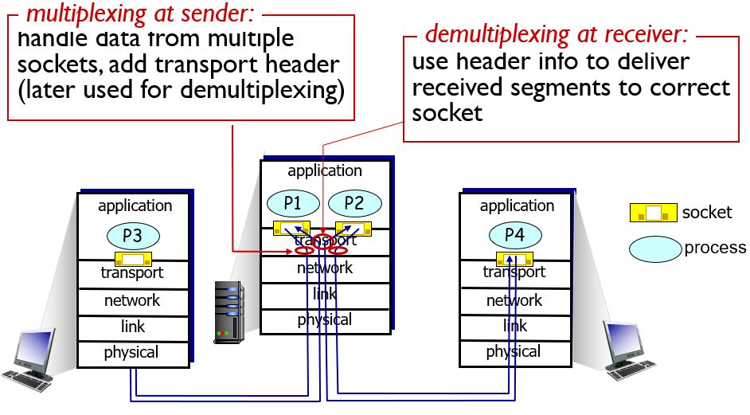

- transport 계층의 가장 기본적인 역할은 process to process delivery인데 그걸 위해선, 보내는 쪽에선 multiplexing, 받는 쪽에선 demultiplexing을 해줘야 함.
    - 클라이언트 호스트 둘에 서버 호스트 하나. 서버 프로세스가 컨택트하는 클라이언트 별로 소켓을 별도로 열어놓고 있다고 가정.
    - sender 쪽에선, 여러 애플리케이션에서 메시지들을 내려보낼 텐데, transport 계층에서 메시지마다 목적지를 꽝꽝 찍어줘서 다 일렬로 한길로 합쳐서 network 계층으로 내려보내줌. 그렇기 때문에 보내는 측에선 multiplexing이 일어남.
        
    - receiver 쪽에선, 각각 다른 host의 client process들에서 메시지를 받을텐데, 그 메시지들이 다 network 계층을 통해서 transport 계층으로 올라오게 될 것임. network계층에서 한줄로 올라온것을 transport 계층에서 목적지 application process로 배달해줘야 돼서, sender측에서 multiplexing할 때 찍워줬던 목적지 도장을 이용해서 demultiplexing이 일어남.

## How demultiplexing works

- transport 계층에서 만들어내는 protocol data unit의 이름은 segment. network 계층에서 만들어내는 protocol data unit의 이름은 datagram.
- **segment**의 format :
    
    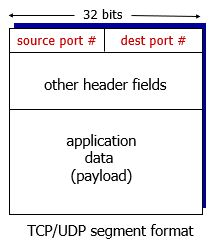
    
    - 모든 protocol계층에서 만들어내는 data unit은 payload와 header 이 두 파트로 이루어짐.
    - header에 반드시 포함되어야하는 파트가 바로 source port번호와 destination port번호. demultiplexing을 위해서 보내는 쪽에서 나의 port번호는 뭐고 목적지 port번호는 뭔지 찍어준다.
    - source port #와 dest port # 16비트씩 차지함. 따라서 포트의 수는 2의 16승.
- host는 network 계층에 의해 IP datagrams를 전송받게됨.
    - 각 datagram은 source IP address와 destination IP address를 가짐.
    - 각 datagram은 하나의 transport-layer segment를 carry함.
    - 각 **segment**는 **source port number**와 **destination port number**를 가짐.
- host는 IP address들과 port number들을 사용하여 segment를 적절한 socket으로 전달해줌.

## Connectionless demultiplexing

- UDP와 같은 connectionless의 경우에 demultiplexing이 어떻게 이뤄지는지.
- demultiplexing은 receiver측에서 이뤄짐. (client도 receiver될 수 있고 server도 receiver될 수 있음.)
- socket이 생성되면 host-local port number(그 host내에서만 유니크한 포트번호)가 할당됨.
- UDP 소켓을 통해서 datagram을 보낼 때는 반드시 그 datagram에 destination IP 주소와 destination port번호 두 가지를 명시해줘야함.
- host가 UDP segment를 받으면, segment에서 destination port number(목적지 포트 번호)를 확인해서, 그 port 번호에 해당하는 소켓으로 UDP segment를 전달해주게 됨.
- 이 과정에서, 다른 source IP address나 source port 번호를 가지지만, 같은 destination port 번호를 가지는 IP datagram들이 목적지 host에서 같은 소켓으로 전달되게 됨.
- 따라서 같은 소켓으로 들어온 메시지들을 헷갈릴 수 있으므로 응답해줄때는 IP주소까지 끄집어내서 확인하고 응답해줌. 하지만 목적지 소켓 찾을 때는 포트번호들만나 있으면 된다.

## Connectionless demux: example

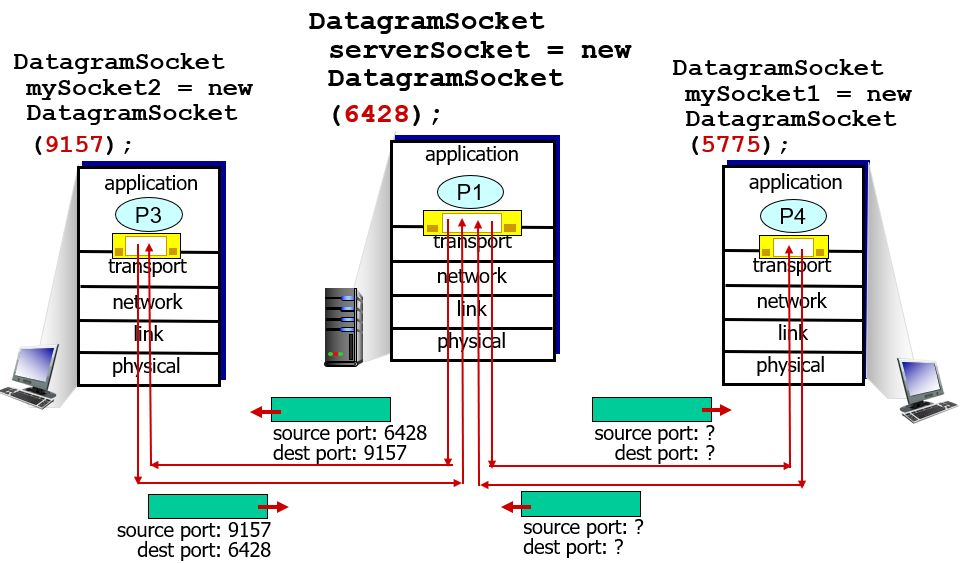

- 왼쪽 client에서 오는 segment는 source port : 9157, dest port : 6428.
- 오른쪽 client에서 오는 segment는 source port : 5775, dest port : 6428.
- 이렇게 2가지 정보 사용 중.
- 따라서 다양한 host IP주소와 port 번호에서 만들어진 segment들이 destination port번호가 같다는 이유로 다 동일한 서버 소켓을 통해서 들어오게 됨.
- UDP의 경우에는 서버측에서 어떤 한 특정 애플리케이션 프로세스를 위한 소켓이 한 개 열리면, 여러 클라이언트들이 보내는 모든 메시지가 이 서버 소켓을 통해서 애플리케이션으로 전달됨. 그래서 connectionless의 경우 서버에서 하나의 애플리케이션 프로세스 당 소켓을 하나만 열고 있다.
- 따라서 **connectionless demux**에서는 source port number, destination port number 2가지만 보고 demultiplexing이 일어난다. (=UDP에서는 소켓을 구별하기 위해 2개의 튜플이 필요.)

## Connection-oriented demux

- connection-oriented(ex. TCP)의 경우에 demultiplexing이 어떻게 일어나는지.
- 하나의 애플리케이션 프로세스는 도어소켓을 열고있고, 그리고 클라이언트가 컨택트할 때마다 각 클라이언트를 위한 소켓을 별도로 열어줌. 그래서 Connection-oriented의 경우 서버에서 하나의 애플리케이션 프로세스 당 소켓을 여러개 열고 있다(각 클라이언트를 응대하기 위한 소켓을 여러개 열어두고 있음).
- 따라서 **connection-oriented demux**에서는 demultiplexing을 하기 위해서 source IP address, source port number, destination IP address, destination port number 4가지 정보가 다 필요함. (=TCP에서는 소켓을 구별하기 위해 4개의 튜플이 필요.)
    - destination IP address로 목적지 호스트에 도착 가능. destination port number는 여기서 door socket에 할당된 포트번호라 어느 애플리케이션이다라는 것까지만 알 수 있음. connection-oriented transport의 경우 애플리케이션만 알아선 안돼고, 그 애플리케이션을 위해 열려있는 소켓들 중 해당 클라이언트를 위한 소켓이 어떤 것인지 파악할 수 있어야 하는데, 이를 source IP address와 source port number 정보(source가 누구냐)로 파악함.

## Connection-oriented demux: example

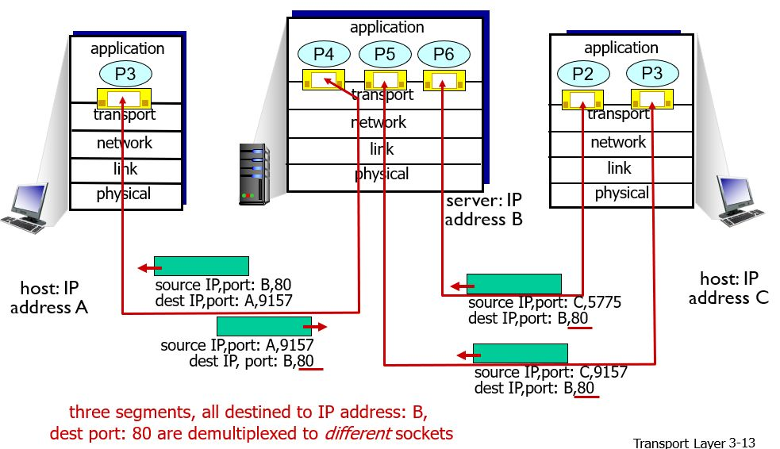

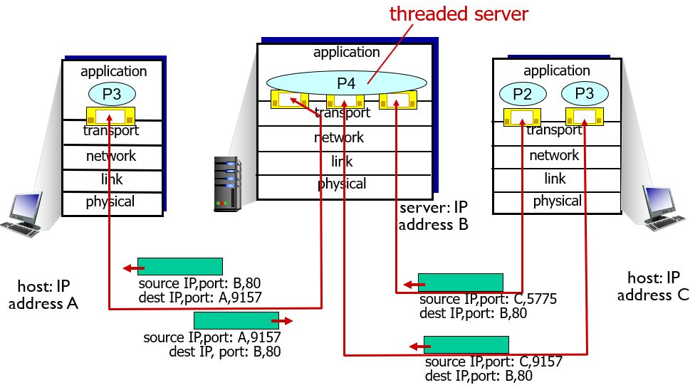

- 이렇게 4가지 정보 사용 중.
- 소켓별로 해당 소켓으로 데이터 주고받는 일만 담당하는 자식 프로세스를 생성해줌. 그래서 한 애플리케이션 프로세스 밑에 여러 프로세스들이 있는 것.
- 동일한 애플리케이션 밑에 있는 여러 소켓들을 통해서 데이터 주고 받는 일을 threaded process를 이용해서 할 수도 있다.

# connectionless transport : UDP

## UDP: User Datagram Protocol [RFC 768]

- UDP는 첨가된 것이 없고  뼈대만 있는 transport protocol의 기본임. IP가 제공하는 서비스만을 이용하고 추가로 UDP에서 하는일이 없음.
- 또한 "best effort" 서비스를 제공해줌. 다시말해, 네트워크가 어떤 segment를 배달해주면 그 segment를 그냥 애플리케이션에 배달해줌. 네트워크가 segment를 중간에 lost하거나 drop해서 배달못해주면, UDP는 그걸 파악할 수도 없고 애플리케이션에 알려주지도 않음. 그냥 최선을 다해서 서비스를 제공해줌.
- 그래서 UDP로 transport를 해주면 데이터를 잃어버릴 수도 있고, 데이터가 순서에 어긋나게 애플리케이션에 배달될 수도 있음. (네트워크 계층에서 순서에 어긋나게 배달하면 그걸 그냥 그대로 전달함.)
- UDP는 connectionless transport를 함.
    - 즉, UDP sender와 receiver 사이에 handshaking이 없음.
    - 각 UDP segment는 독립적으로 다뤄짐. (내가 이전에 어떤 segment 받았는데 다음으로 이 segment 왔다 이런 인식이 없음. 각 segment는 각자 자신의 목적지 주소를 달고 나감.)
- UDP를 사용하는 애플리케이션들 :
    - streaming multimedia apps
        - (얘네는 reliable data transfer에는 그렇게 민감하지 않음. loss tolerant하다. 반면에, 지속적인 플레이가 가능해야하기 때문에 단위시간당 minimum throughput guarantee가 있어줘야 돼서, rate sensitive하다. TCP에선 congestion control과 flow control 같은 rate control을 하기 때문에 앱에서 data가 generate되는 속도로 네트워크에 밀어넣어지는 게 아니라 속도가 자기맘대로 조절될수있어서 rate sensitive한 앱들은 TCP를 불편해함. 최근에는 이런 것들을 TCP를 이용해서 서비스하고 있긴 함.)
    - DNS
        - (모든 클라이언트와 서버간의 커뮤니케이션(호스트 네임을 물어보는 쿼리)이 한번 묻고 답 받으면 끝이기 때문에 connection을 만들 필요가 없어서 TCP 사용안하고 UDP 사용함.)
    - SNMP
        - (네트워크 관리 프로토콜. 로컬 사이트를 관리하는 entity에게 나머지 entity들이 정기적으로 자신과 주변의 status info를 report함. 정기적으로 report하기 때문에 loss 가 발생한다 한들 좀이따 또 보낼 것이기 때문에 괜찮음. 이렇게 periodic하게 정보교환이 이뤄질 때도 TCP보다는 UDP를 사용함.)
- UDP 위에서 reliable transfer를 하려면 :
    - application layer에서 reliablity를 추가해라.
    - application layer 상에서 순서에 어긋나게 들어왔으면 순서를 맞추거나, 패킷이 하나 안왔으면 패킷 복구를 한다던지 하면 됨.

## UDP: segment header

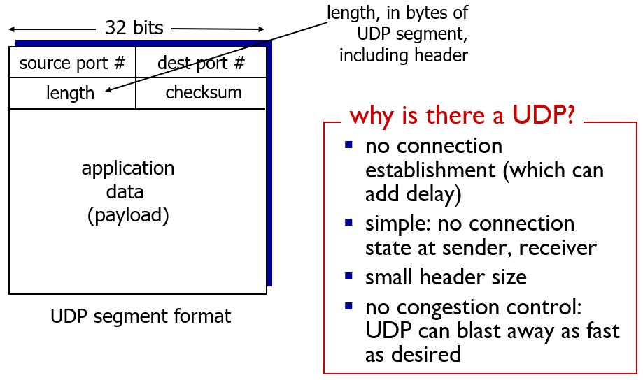

- UDP segment 헤더와 payload로 구성.
- UDP segment의 헤더 : source port #, dest port #, length, checksum.
    - length = 헤더를 포함해서 UDP segment의 바이트 수. (헤더는 4*2=8byte. 8+payload 바이트 수 하면 됨.)
- UDP를 쓰는 이유(장점) :
    - connection 설정 과정이 없기 때문에 delay가 짧음. (TCP는 일단 connection을 맺는 delay가 소요됨.)
    - 간단함. connection에 대한 상태정보를 sender건 receiver건 유지하고 있을 필요가 없기 때문. (매 segment가 independent.)
    - header 사이즈가 작음. (8byte. multiplexing과 demultiplexing를 위한 정보만을 갖고있음(source port number, destination port number). 이외에도 헤더에 length와 checksum이라는 필드를 갖고있지만 아주 중요한 필드들은 아니고 많은 양도 아님.)
    - congestion control을 하지 않아서 애플리케이션이 데이터를 생성하는 족족 네트워크에 데이터를 밀어넣을 수가 있음.

## UDP checksum

- UDP에서 checksum 필드는 전송된 segment에서 error(1이 0으로, 0이 1로 바뀐 경우)를 감지하는데 쓰임.
- UDP에서 sender는 segment(헤더 포함)를 16-bit integers 단위의 시퀀스로 봐서 16bit마다 잘라 세로로 나열해놓고 걔네들을 다 더한(1's complement sum) 후 결과로 나온 checksum 값을 checksum 필드에 넣어줌. (1's complement sum = 다 더해준 다음 맨 윗자리에서 발생한 올림(carryout)이 있을 경우 맨 아랫자리로 가서 더해짐. 마지막으로 1을 0으로 0을 1로 바꾼다.)
- sender 측에서 이렇게 checksum 필드를 작성해서 보내면, receiver 측에서는 자기도 똑같이 checksum을 계산해봐서, 그게 sender가 보낸 checksum값과 일치하는지를 봄.
    - 일치하지 않으면 오는 동안 transmission bit error가 발생한 것이라 가정.
    - 일치하면 오는 동안 에러가 없었던 것이라 가정. 하지만 에러가 발생했지만 detect못한 것일 수도 있음.
        - checksum이 모든 에러를 다 발견할 수 있는 것은 아님. 16bit시퀀스의 같은 자릿수 위치에서 하나는 0이 1로 바뀌고 하나는 1이 0으로 바뀌었다면 상쇄되어서 checksum이 여전히 같은 값 나올 수도 있음.
- UDP는 그냥 자기가 받은 segment에 그냥 오류가 발생했나 안했나만 checksum으로 체크함. 체크해서 올려보내 주면 오류가 있을 지도 모르는 segment를 어떻게 할지는 애플리케이션이 결정하는 것.

## Internet checksum: example

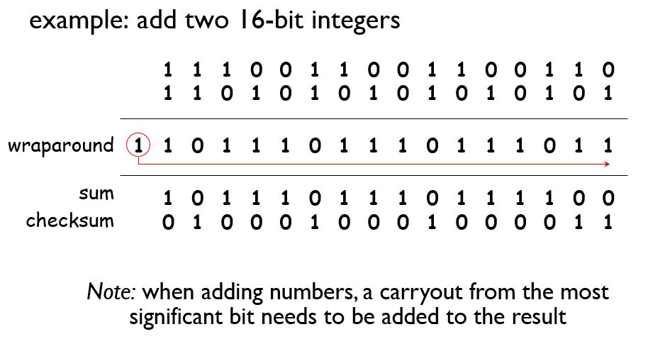

- 어떤 UDP segment가 두개의 16-bit integers로 이뤄져있음(총 길이 32bit라는 소리).
- 16bit씩 잘라서 bit wise addition(1's complement addition)을 함. 쫙 더하고 맨 윗자리에서 발생한 올림(carryout)은 맨 아랫자리로 가서 더해짐. 마지막으로 1은 0으로 0은 1로 바꿈.
- 1's complement addition이 끝나서 나온 결과가 checksum이 됨.

# principle of reliable data transfer

- TCP 보기전에 일반적으로 reliable data transfer를 할려면 어떤 프로토콜 요소들이 필요한지 살펴볼 것임.

## Reliable data transfer: getting started

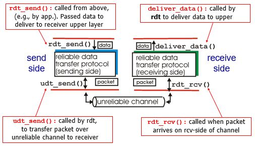

- rdt_send( ) 함수 : application layer에서 콜하는 함수. data 전송을 위해 data를 전달할 때 콜함.
- udt_send( ) 함수 : rdt에서 콜함. unreliable channel(네트워크 계층)을 통해서 패킷이 receiver에게 전송되게 하기 위해서 부르는 함수.
- rdt_rcv( ) 함수 : receiver 측에 패킷이 도착하면 이 함수를 콜함.
- deliver_data( ) 함수 : rdt에서 콜함. 함수에서 패킷을 끄집어내서 뭔가 작업을 한 다음 상위레이어로 데이터를 올려주는데, 상위 레이어로 데이터를 올려줄 때 부르는 함수.

## rdt1.0: reliable transfer over a reliable channel

- underlying channel이 완전히 reliable 하다고 가정.
    - error가 없음.
    - packet을 잃어버리지도 않음.
    - 보낸 순서대로, 에러없이, 중복없이 도착.
- sender는 데이터를 underlying channel로 보내고, recevier는 underlying channel에서 데이터를 받기만 하면 됨.
    - 이를 FSM(finite state machine)으로 표현한 것 :
        
        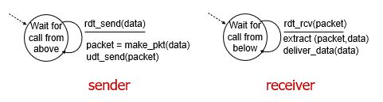
        

## rdt2.0: channel with bit errors

- 이번엔 underlying channel에서 bit error가 발생할 수 있다고 가정. (data packet에 에러 발생할 수 있음.)
    - checksum을 이용해 이를 detect 가능하다고 가정한다.
- how to recover from errors :
    - acknowledgements (ACKs) : recevier가 명시적으로 sender에게 보낸 패킷 잘 받았다고 응답해주는 것.
    - negative acknowledgement (NAKs) : recevier가 명시적으로 sender에게 보낸 패킷에 에러가 있다고 응답해주는 것.
        - NAK을 받으면 sender는 패킷을 recevier에게 재전송해줌.
- rdt2.0에는 error detection과 feedback(ACK나 NAK 같은 control msgs를 recevier로부터 sender로 보냄) 개념이 추가되게 됨.
- bit error가 발생할 수 있다 → 해결하기 위해 ACK NAK를 쓰자.

## rdt2.0: FSM specification

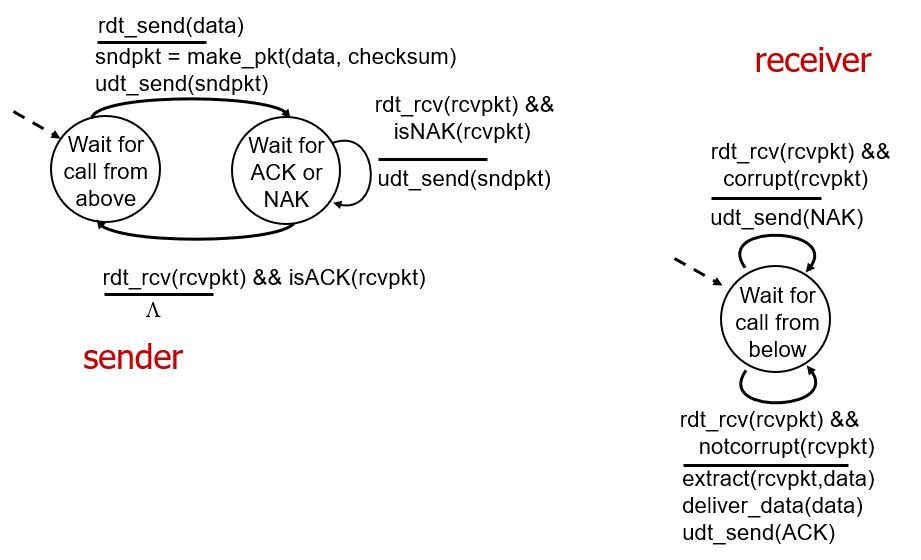

- sender :
    - rdt1.0에선 데이터 이용해서 패킷을 만드는 것 밖에 없었는데, 이번에는 checksum을 계산해서 데이터와 함께 넣어서 패킷을 만듦. 패킷을 보내고 나선 ACK가 오거나 NAK가 오길 기다리는 상태로 바뀜.
    - 기다리다가 NAK가 도착하면 패킷을 재전송하고 다시 기다리는 상태를 유지하고, ACK가 도착하면 wait for call from above(상위 레이어로부터 뭔가가 도착하길 기다리는)상태로 넘어가서 다시 패킷전송 준비함.
- receiver :
    - 패킷 도착했을 때 조사해봤더니 에러가 있으면(=corrupt) sender에게 NAK을 보냄.
    - 패킷 도착했을 때 조사해봤더니 에러가 없으면, 패킷에서 데이터를 끄집어내서 데이터를 상위 레이어로 올려주고 sender에게 ACK을 보냄.

## rdt2.0: operation with no errors

- 에러가 없을 때의 rdt2.0 시나리오(FSM).
    
    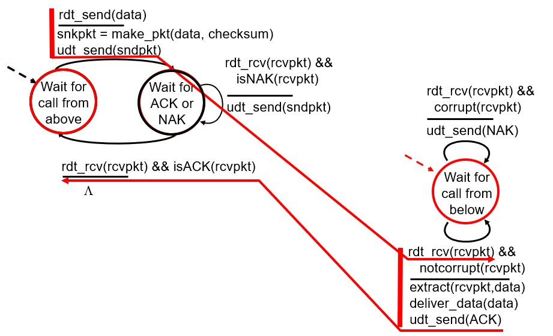
    

## rdt2.0: error scenario

- 에러가 있을 때의 rdt2.0 시나리오(FSM).
    
    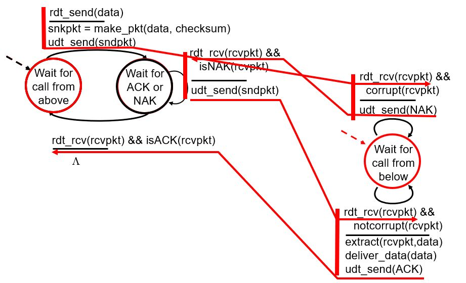
    

## rdt2.0 has a fatal flaw!

- ACK나 NAK에도 에러가 발생할 수 있는데, rdt2.0은 ACK이나 NAK가 corrupt된 경우엔 대응 못함. 이 경우엔 sender가 receiver측에서 무슨일이 일어졌는지 알 수가 없음.
- 그냥 재전송해버린다면 만약 잘 도착했었을 경우에는 중복된 전송이 발생할 수가 있음. 그래서 재전송하는 것과 추가로 중복을 구분하기 위해 뭘 더 해줘야 함.
- 중복(duplicates)이 발생하지 않게 하기 위해 :
    - ACK나 NAK가 corrupt되면 sender는 현재 패킷을 재전송함. (sender가 receiver로부터 받은 패킷이 corrupt 되어있는 경우 보낸 패킷 재전송.)
    - sender는 duplicates 문제를 해결하기 위해서 패킷마다 sequence number를 추가해서 중복패킷을 구분할 수 있게 함.
    - receiver는 중복 패킷을 받게되면 그것을 버려버림.
- sender 입장에선 패킷을 하나 보내놓고 receiver에서 응답이 올 때까지 기다리고 있음. sender가 한 패킷을 전송해놓고 recevier로부터 응답이 올때까지 기다리는 이런 프로토콜을 stop and wait 프로토콜이라고 함. (↔ pipeline 프로토콜)
- ACK나 NAK가 corrupt 될 수 있다(그래서 중복문제 발생할 수 있다) → 해결하기 위해 sequence number를 쓰자. (=rdt2.1)

## rdt2.1: sender, handles garbled ACK/NAKs

- ACK나 NAK가 corrupt되었을 때의 sender측 시나리오(FSM).
    
    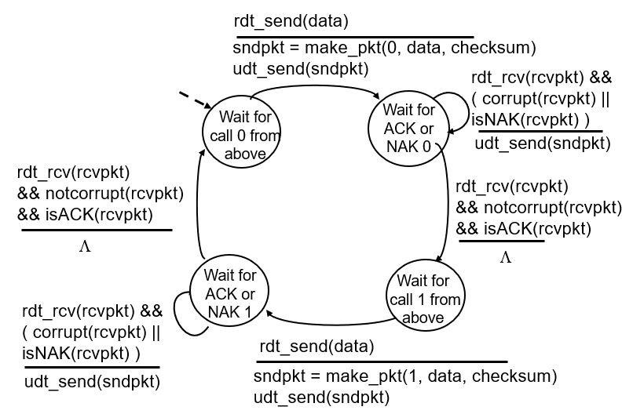
    
    - sender가 시퀀스 번호 0번, 데이터, checksum으로 패킷을 만들어서 전송함.
    - 0번에 대한 ACK나 NAK를 기다림. receiver로부터 받은 패킷에 에러가 있거나 (corrupt된 NAK이나 ACK가 온 것.) NAK가 오면 보냈던 패킷을 재전송하고 다시 기다림. 패킷에 에러가 없고 ACK가 오면 0번은 잘 받았다는 소리니까 다음 데이터 기다림.
    - 시퀀스 번호 1번, 데이터, checksum으로 패킷을 만들어서 전송함.
    - 1번에 대한 ACK나 NAK를 기다림.receiver로부터 받은 패킷에 에러가 있거나 NAK이 패킷으로 오면 보냈던 패킷을 재전송하고 다시 기다림. 패킷에 에러가 없고 ACK가 오면 1번은 잘 받았다는 소리니까 다음 데이터 기다림. 다음에 데이터 오면 다시 시퀀스 번호 0번으로 패킷만듦.
    

## rdt2.1: receiver, handles garbled ACK/NAKs

- ACK나 NAK가 corrupt되었을 때의 receiver측 시나리오(FSM).
    
    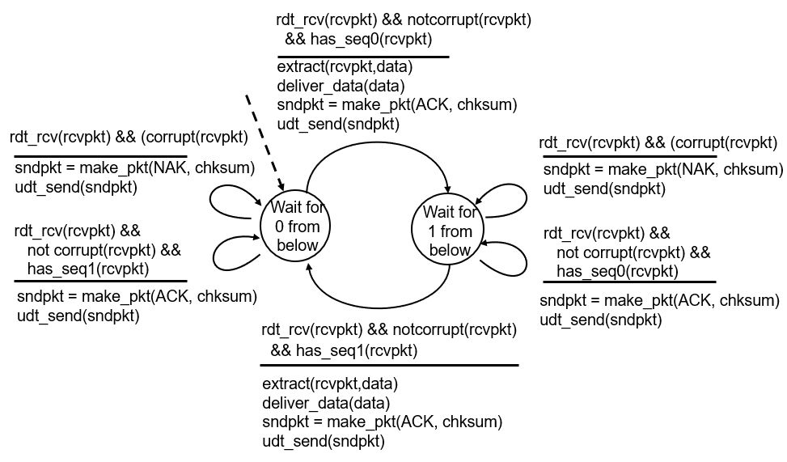
    
    - wait for 0 from below상태에서 받은 패킷이 corrupt되지 않았고 시퀀스 번호 0번이면, receiver는 패킷에서 데이터를 빼서 상위레이어로 주고, sender에게 ACK와 ACK에 대한 checksum을 붙여서 보내줌.
    - wait for 1 from below 상태로 넘어가서, sender로부터 패킷을 받았는데 받은 패킷이 corrupt되어있으면 NAK과 NAK에 대한 checksum을 붙여서 보내주고 다시 기다림. 또 패킷을 받았는데 corrupt 되지않았지만 시퀀스 번호가 0번이라면, ACK와 ACK에 대한 checksum을 붙여서 보내주고 다시 기다림(1번이 안왔으니까). 패킷을 받았고 에러도 없고 1번 패킷인 경우에야 비로소 패킷에서 데이터를 빼서 상위 레이어로 주고, sender에게 ACK와 ACK에 대한 checksum을 붙여서 보내주고, 다음 wait for 0 from below 상태로 넘어감.

## rdt2.1: discussion

- sender :
    - 패킷에 sequence number가 추가되었음.
    - 두개의 sequence number(0,1)만으로도 충분함. 하나를 전송 성공할 때까지 기다렸다가 다음 것을 보내기 때문.
    - ACK나 NAK에 에러가 있는지 확인함.
    - state 수가 2배 많아졌다.
- receiver :
    - 항상 자기가 받은 패킷이 중복된 것인지 아닌지 확인함. (그래서 state가 지금 sequence #가 0번인 패킷을 기다리는지 1번을 기다리는지 명시되어있음.)
    - receiver는 자기가 바로 전에 보낸 ACK/NAK가 sender에게 잘 도착했는지 알 수는 없음.

## rdt2.2: a NAK-free protocol

- rdt2.1에서는 ACK와 NAK를 두개 다 썼는데, NAK 없이 ACK만 써서 할 수도 있을 듯함.
- 그래서 rdt2.2는 rdt2.1과 같은 기능을 가지지만 대신 ACK만 사용함.
- NAK를 보내는 대신에, receiver는 자기가 마지막으로 제대로 받은 패킷에 대한 ACK를 보냄. (ex. 내가 0번까진 잘 받았다.)
- sender에게 중복된 ACK가 보내지면, rdt2.1에서 NAK를 받았을 때처럼 현재 패킷을 재전송해주면 됨. (ex. 0번 ACK가 와서 1번을 sender가 보냈는데 다시 0번 ACK가 올 경우 1번 패킷을 재전송.)

## rdt2.2: sender, receiver fragments

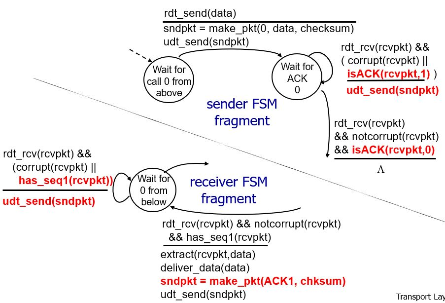

- sender는 wait for call 0 from above 상태였다가 데이터 보내라고 상위레이어에서 오면 checksum 계산해 0번 sequence # 갖는 패킷 만들어 receiver에게 전송.
    - receiver로부터 받은 패킷이 corrupt되어있거나 시퀀스 번호 1번에 대한 ACK라면 보냈던 패킷을 재전송함. (1번이 잘 전송되어서 0번으로 온건데 1번이 또 가서 중복 발생한 거니까 재전송함.)
    - receiver로부터 받은 패킷이 에러가 없고 시퀀스 번호 0번에 대한 ACK라면, 잘보내진 거니까 Wait for call 1 from above 상태로 넘어가게 됨.
- receiver는 Wait for 1 from below(1번을 기다리는) 상태에서 sender로부터 패킷을 받았는데 패킷이 에러가 없고 sequence # 1인 패킷이면, 패킷에서 데이터를 꺼내서 상위 레이어로 올려주고 1번 잘 받았다고 sender에게 ACK1과 checksum 계산해서 보내주고, Wait for 0 from below(0번을 기다리는) 상태로 넘어감.
    - Wait for 0 from below(0번을 기다리는) 상태에서 에러가 있는 패킷이 도착하거나, sequence #가 1인 패킷이 도착하면 아까 ACK1 패킷을 재전송해준다(1번까지는 잘 받았다 다시 보냄.)

## rdt3.0: channels with errors and loss

- underlying channel에서 패킷에 에러가 생길 수도 있고 패킷 loss도 발생할 수 있다고 가정. (data 혹은 ACK 패킷을 잃어버려서 도착 안할 수도 있다는 가정이 추가됨.)
- 해결방법 : sender가 ACK를 "reasonable"한 시간만큼 기다린다.
    - 이 시간 동안 ACK가 안오면 재전송함.
    - 패킷이 lost된 게 아니라 단순히 delay되는 거였다면 :
        - 재전송이 중복을 일으키겠지만 sequence #로 해결 가능하기 때문에 문제 안됨.
        - receiver가 ACK 된 패킷의 seq #를 sender에게 명시적으로 말해줘야 함. (ex. 몇번까진 잘 받았다.)
    - countdown timer를 필요로 함.

## rdt3.0 sender

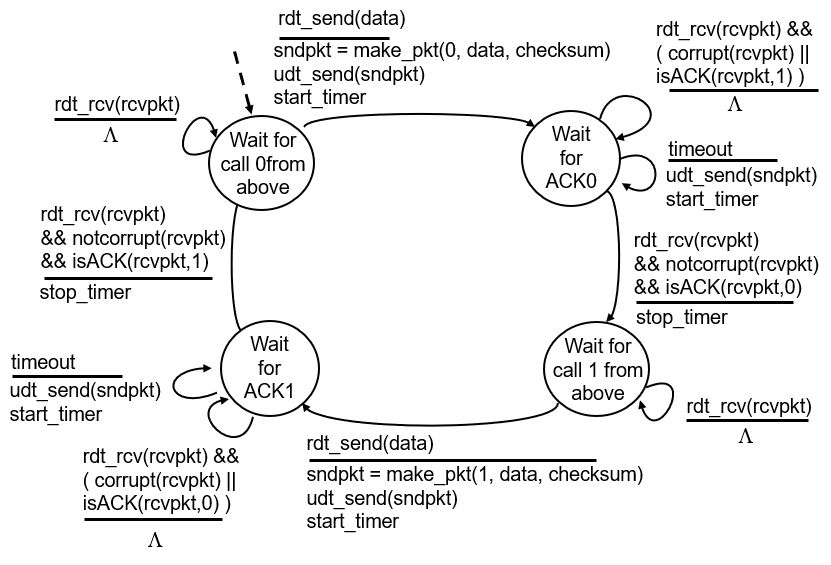

- sender가 wait for call 0 from above 상태였다가 데이터 보내라고 상위레이어에서 오면, 데이터 만들고 checksum 계산해 0번 sequence # 갖는 패킷 만들어 receiver에게 전송하고, timer를 시작시킴. 그리고 wait for ACK0 상태로 넘어감.
    - timer가 timeout되면 재전송하고 timer를 다시 시작시킴.
    - 패킷이 timer가 timeout 되기전에 도착했는데, 에러가 있거나 1번에 대한 ACK이면, 바로 재전송 하는게 아니라 아무것도 하지 않음. 흐르고 있는 timer가 timeout이 되면 어차피 재전송할거니까 timeout 될때까지 기다렸다가 재전송되도록 한다.
    - 패킷이 timer가 timeout 되기전에 도착했는데, 에러도 없고 0번에 대한 ACK이면, 0번 잘받았다는 것이므로 timer를 멈춤. 그리고 wait for call 1 from above 상태로 넘어감.
- sender가 wait for call 1 from above 상태(1번 데이터 만들라는 명령 기다리는 중)인데 갑자기 패킷이 도착하면, 이 패킷은 늦게 도착한 패킷이므로 이미 다 처리된 패킷이니까 아무것도 하지 않음. (거꾸로 된 V처럼 된 표시 나오면 아무것도 하지 말라는 것.)

## rdt3.0 in action

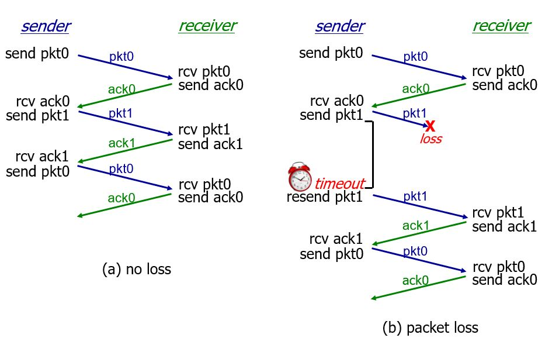

- b 시나리오의 경우 packet1이 loss 됨. → packet1을 보내고 시작시켰던 timer가 timeout되고 packet1을 재전송함.

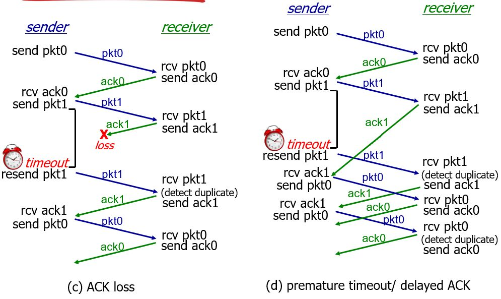

- c 시나리오의 경우 ACK1이 loss 됨 → packet1을 보내고 시작시켰던 timer가 timeout되고 packet1을 재전송함. packet 1이 중복이란걸 감지하고 receiver는 ack1을 다시 sender에게 보냄.
- d 시나리오의 경우 ACK1이 너무 늦게 와서 timeout이 된 상황. sender는 packet1을 다시 보내고, 늦어졌던 ACK1이 바로 도착하게됨. sender는 잘보내졌구나 생각하고 packet 0 보내라는 명령 기다림. receiver는 packet1을 받아 중복이란 걸 감지하고 ack1을 보냄.

## Performance of rdt3.0

- 3.0이 잘 돌아가긴 하는데 성능면에서 보면 stop-and-wait이라 비효율적이다.
    
    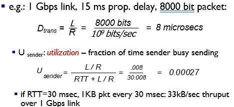
    

## rdt3.0: stop-and-wait operation

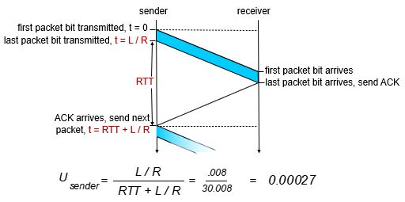

## Pipelined protocols

- pipelining : 패킷하나 보내놓고 응답 올 때까지 기다리는 게 아니라, acknowledgement가 아직 오지 않은 여러 개의 패킷을 보내놓고 그 패킷에 대해 응답이 오는 것에 따라서 다음 패킷을 전달하는 프로토콜.  (Acknowlegment를 받지 않은 상태에서 네트워크에 집어넣을 수 있는 최대 데이터의 양을 window size라고 함. window size만큼 패킷을 보낸다.)
    - sequence number의 범위가 증가하게 됨.
    - 여러개 보내고 이 보낸 여러개를 기억하고 있어야 재전송 등 할 수있으므로 버퍼가 필요.
- 대표적 두 가지 pipelined protocol  :
    - go-Back-N, selective repeat

## Pipelining: increased utilization

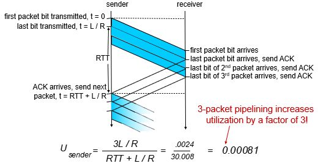

## Pipelined protocols: overview

- Go-back-N :
    - sender가 아직 ACK가 안 온 패킷을 N개까지 보낼 수 있음. (N이 window size. window size만큼 패킷을 보낼 수 있음.)
    - receiver의 window size는 하나임. receiver가 buffering을 하지 않음(순서대로 도착하지 않은 것은 다 discard).
    - receiver는 cumulative ack만 보낸다.
        - (ex. ack N = N번까지는 잘 받았다)
        - 패킷에 갭이 생기면 해당 패킷은 ack하지 않음. 1번 패킷 받은 후 2번 패킷이 안오고 3번 패킷이 왔을 경우 3번은 버려버리고 1번에 대한 ACK를 보냄. (순서가 잘못 온 것은 버려버리고 제대로 받은 것까지의 번호만 ACK 보낸다.) sender는 3번까지 보냈는데 1번 ACK를 받았으므로, 2번 3번을 다시 보냄. 아직 ACK가 오지 않은 것들을 돌아가서 다 다시 재전송을 하기 때문에 이름이 Go-back-N.
    - 보낼때마다 각각 타이머 사용하는 방식이 아니라, 가장 오래 전에 보낸 ack가 아직 오지 않은 packet에 대해서만 timer를 동작시킴.
        - timer가 시간 초과되면 아직까지 ack가 오지 않은 모든 패킷(unacked packets)을 다 재전송함. (seq # n이 timeout되었다고 하면, n포함해서 n 이상의 sequence number를 갖는 전송했지만 아직 unacked였던 패킷들을 재전송함.)
- Selective Repeat :
    - sender가 아직 ACK가 안 온 패킷을 N개까지 보낼 수 있음. (N이 window size. window size만큼 패킷을 보낼 수 있음.)
    - sender의 window size와 receiver의 window size가 같음. receive가 buffering을 함.
    - receiver는 개별 패킷마다 individual ack를 보낸다. (1번 받으면 1번 잘받았다고 보내고, 2번 받으면 2번 잘 받았다고 보내고...)
    - sender는 각각의 아직 ack가 오지 않은 packet에 대해서 timer를 사용함. (하나 보낼 때마다 각각의 패킷에 대해서 타이머를 쓰는데, 이를 timer 하나만으로도 구현 가능. 책에선 하나만 쓰는걸로 설명할 것임.)
        - timer가 시간 초과되면, timeout된 sequence number에 해당하는 번호의 packet만 재전송함.
    

## Go-Back-N: sender

- 패킷 헤더의 sequence number필드에 k-bit의 seq #를 저장.
- window size N. N개까지 unacked된 패킷들 전송가능.
    
    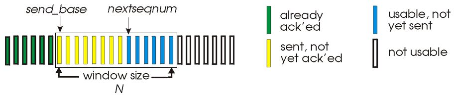
    
- ACK(n) : sequence number n까지의 모든 패킷들을 ACK함. cumulative ACK이다. (ACK n = n번까지 잘 받았다.)
- 전송되었는데 ack가 아직 안온 패킷들 중에서 가장 오래된 패킷에 timer를 사용함(oldest in-flight packet).
- timeout(n) : n포함해서 n 이상의 sequence number를 갖는 전송했지만 아직 unacked였던 패킷들을 재전송함.

## GBN: sender extended FSM

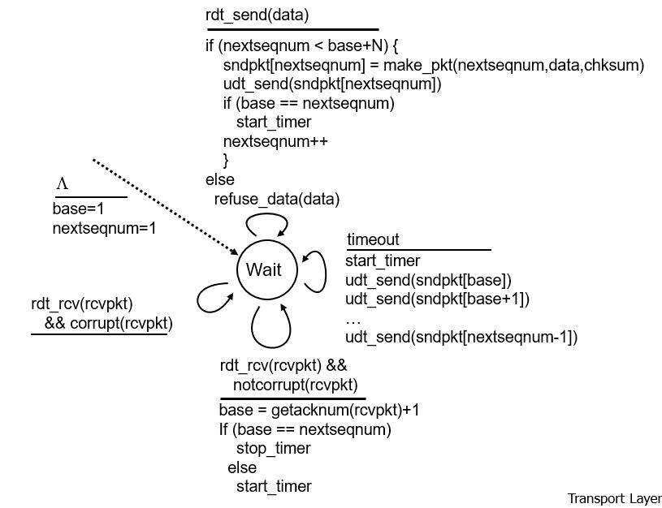

- base=1, nextseqnum=1로 초기화하고 시작함.
- 상위레이어에서 패킷 보내라고 명령오면, nextseqnum이 window size안에 있는지 확인함.
    - window size안에 있을 경우, nextseqnum, data, checksum 넣어서 패킷 만들고 전송하고, (send)base와 nextseqnum가 같을 경우(=oldest할 경우)에만 timer를 시작시키고 nextseqnum을 하나 증가시킴.
    - window size안에 있지 않을 경우, 데이터를 보낼 수 없어 refuse함.
1. 패킷 전송 후 timout이 되었을 경우에는, base부터 다 다시 재전송하고, base 전송할때 timer 다시 시작시킴.
2. 패킷 전송 후 receiver로부터 응답을 받았는데 응답에 오류가 없을 경우에는, ACK가 제대로 온 것이므로 받은 패킷에서 ACK number를 끄집어내고 거기에 +1해서 새 base번호를 설정함(ex. 3번까지 잘 받았으니까 이제 base 4번). 
    - 만약 base와 nextseqnum이 같으면(=window size만큼 전송할 수 있지만 상위 레이어에서 보내라는 명령 안와서 아직 보낸 게 하나도 없을 때. window size안에 파란것들로만 차있을 때.) 패킷이 나간 게 없으니까 timer start할게 없어서 timer를 stop시킴. 그렇지 않을 경우에만 timer 시작시킴.
3. 패킷 전송 후 receiver로부터 응답을 받았는데 응답에 오류가 있을 경우에는, 아무것도 하지 않음. 이후 timeout되어 패킷 전송 후 timeout 되었을 때 실행되는 코드로 넘어감.

## GBN: receiver extended FSM

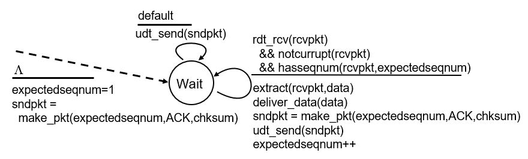

- expectedseqnum=1로 초기화하고 시작함. 내가 기다리고 있는 것은 1번이라는 의미에서, 1번 expectedseqnum, ACK, chksum으로 패킷을 만들어 둠. 문제가 생기면 이 만들어둔 패킷을 전송함.
- 패킷에 sender로부터 도착했는데 에러가 없고 패킷의 seqnum이 내가 기다리고 있는 번호가 맞을 땐, 제대로 온 것이므로 패킷에서 데이터를 끄집어내고 data를 상위 레이어로 올려주고, expectedseqnum, ACK, chksum으로 패킷을 만들어 잘 받았다고 ACK 패킷 전송해줌. 그리고 expectedseqnum을 1 증가시켜줌.
- 패킷에 sender로부터 도착했는데 에러는 없는데 패킷의 seqnum이 내가 기다리고 있는 번호가 아닐 땐, 받은 건 버려버리고 아무것도 안함. sender가 timeoout때문에 재전송하는 것을 기다림.
- GBN은 NAK 사용안하고 ACK만 사용함. 순서대로 에러 없이 도착한 패킷 중 가장 높은 seq# 가지는 패킷에 대해서만 ACK 보냄(packet with highest in-order seq #).
    - 중복된 ACK를 발생시킬 수도 있음. (ACK1 보내고 또 잘못와서 ACK1 또 보내고.)
    - expectedseqnum만 잘 기억하고 있으면 됨.
- 순서가 어긋난 패킷의 경우 :
    - 버린다. (받았지만 buffer에 넣지 않음. no receiver buffering.)
    - 그리고 pkt with highest in-order seq #의 ACK를 재전송한다.

## GBN in action

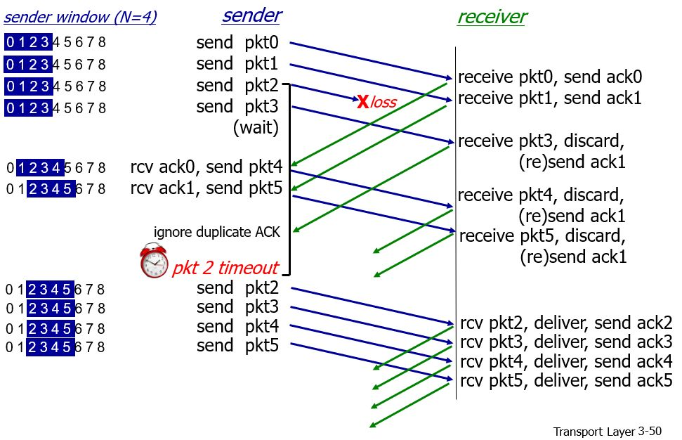

## Selective repeat

- receiver는 모든 잘 받은 패킷들을 각각(individually) acknowledge함.
    - 순서에 어긋나게 패킷을 받았을 경우 버퍼에 넣어놨다가, 갭에 해당하는 패킷이 도착하면 버퍼에서 꺼내서 순서에 맞게 상위 레이어로 올려보냄. (ex. 1번 패킷 도착 후 3번과 4번 패킷이 왔다면, 3번과 4번을 버퍼에 넣어두었다가 2번 패킷이 도착하면 그 때 순서대로 상위 레이어에 올려보냄.) receiver가 buffering을 한다.
- sender는 ACK가 오지 않은 해당 패킷(하나)에 대해서만 재전송을 함.
    - sender는 각각의 ack가 오지않은 패킷에 대해서 timer를 사용함.
- sender window size와 receiver window size가 같음.
    - N consecutive seq #'s
    - limits seq #s of sent, unACKed pkts

## Selective repeat: sender, receiver windows

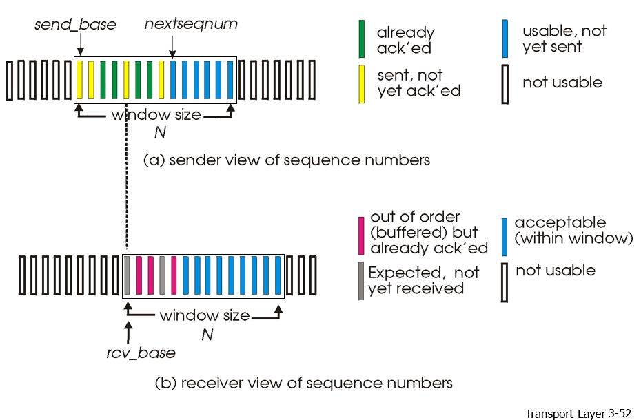

## Selective repeat

- sender :
    - 상위 레이어에서 데이터를 보내라고 오면, nextseq#가 window size안에 포함되는지를 체크해봄. 포함된다면 패킷을 만들어 전송함.
    - timeout(n) : 패킷 n의 timer가 timeout되었을 경우. 패킷 n을 재전송하고 timer를 reset함.
    - ACK(n) in [sendbase, sendbase+N] :
        - 패킷 n을 전송 잘됐다고 mark함.
        - n이 unACKed된 패킷의 seq num 중 가장 작은 seq num이면(=window size에서 가장 왼쪽에 있는 패킷이면) window base를 현재 unACKed seq # 중 다음 순서의 #로 옮김.
- receiver :
    - pkt n in [rcvbase, rcvbase+N-1] (도착한 패킷이 receiver window size 내의 패킷일 경우) :
        - ACK(n)을 보내줌.
        - 순서대로 도착한 패킷이 아니라면 buffering 해뒀다가, 갭부분의 패킷이 도착했을 때 순서에 맞게 올려보내줌.
        - 순서대로 도착한 패킷이라면 상위 레이어에 올려줌. 그리고 아직 못받은 다음 패킷으로 advance window(window 이동)함.
    - pkt n in [rcvbase-N, rcvbase-1] (도착한 패킷이 receiver window size 내의 패킷이 아니라 이미 받았던 rcvbase-N부터 rcvbase-1까지의 패킷일 경우) : ACK(n)을 보내줌.
    - 그외 경우 : ignore.

## Selective repeat in action

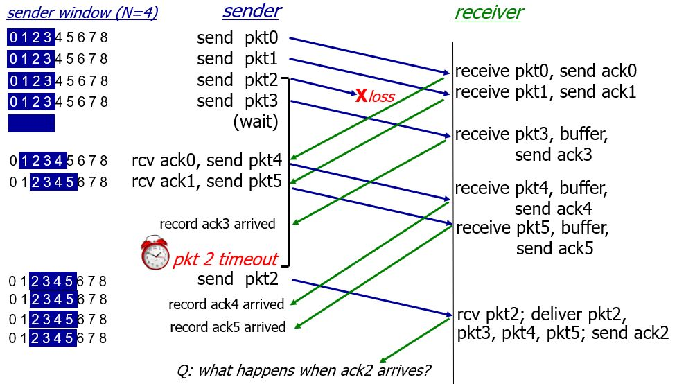

- sender window size가 4이므로 receiver window size도 4.
- 중간에 wait는 window size만큼 다 보내서 더 못보내고 기다리는 것.
- ack2가 sender측에 도착하면, sender window는 6, 7, 8, 0 으로 advance됨(0~8까지를 계속 돌려가면서 쓴다고 하면).

## Selective repeat: dilemma

- seq #를 0, 1, 2, 3만 사용한다고 가정하고, window size는 3이라고 가정.
    
    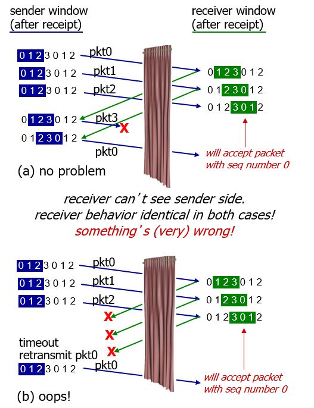
    
    - b 시나리오의 경우 ack0, ack1, ack2가 모두 loss됨. 그래서 sender측에선 timeout이된 pkt0을 재전송해주는데 receiver측에선 이게 중복이라고 인식하고 안 받는 게 아니라 다음의 pkt0이라고 인식하고 받아버리게 됨. duplicate data가 new data로 accept되어져 버림. (중복인지 시퀀스 넘버만 같은 new 패킷인지 구분하지 못한다.)
- 따라서 sender의 window size가 N일 때, sequence number는 적어도 2N개 이상을 써야 함. (ex. window size=4이면 sequence number 적어도 0~7까지는 써야함.)

## Summary of Reliable Data Transfer Mechanism

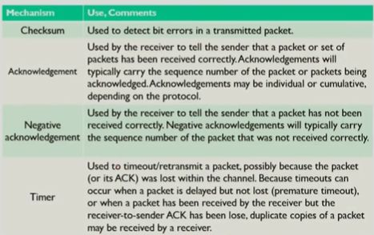

- 일단 receiver가 segment를 받았을 때 그 segment에 오류가 있냐를 체크할 수 있어야하니까 오류 여부를 확인할 수 있는 **checksum** 필드가 필요함.
- 오류가 없으면 상대방에게 오류 없이 잘받았다고 해야하고 오류가 있으면 오류가 있다고 알려줄 수 있어야 하므로(잘못 온 패킷은 다시 보내야하니까), **Acknowlegment**와 **Negative acknowledgement** 필요.
    - Acknowlegment는 sender에게 packet을 잘받았다는 것을 알리기 위한 것. 이 때 이 Acknowlegment가 individual packet에 대한 것일 수도 있고, cumulative packet에 대한 것일 수도 있음. Acknowlegment받아야지 sender는 다음 패킷 보내줌.
    - Negative acknowledgement는 sender에게 어떤 packet이 잘못 전송됐다는 것을 얘기하는 것. 얘는 특정 packet을 집어서 얘기해서, 일반적으로 Negative acknowledgement는 제대로 전송 안 된 특정 패킷의 sequence number를 carry함. Negative acknowledgement 받으면 sender는 패킷 다시 보내줌.
- checksum으로 체크하고 Acknowlegment하거나 Negative acknowledgement하는 건 잘못오더라도 패킷이 도착했을 때의 얘기임. 패킷이 만약에 네트워크 상에서 drop되면 receiver측에서 받지를 못하므로 Acknowlegment도 Negative acknowledgement도 하지를 못해서 sender가 한없이 기다리게 됨. 그래서 **Timer**가 필요.
    - sender측에서 어떤 데이터를 보내놓고 아무리 기다려도 Acknowlegment나 Negative acknowledgement가 오지 않으면, 네트워크가 drop했구나 가정하고 재전송하는 것.
    - 불필요한 재전송이 발생하기도 함. receiver가 보낸 Acknowlegment가 drop될 수도 있기 때문. (receiver가 아까 받은 거 또 받으면 무시하고 버려버리면 되기 때문에 큰 문제는 아님.)

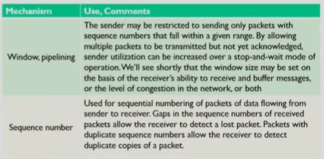

- 그래서 timer 때문에 받았던 패킷이 또 전송될 수 있기 때문에 **sequence number**가 필요. retransmission(보냈던 걸 또 보내는 것)이 발생할 수 있기 때문에 receiver측에서 받았던 건지 구분할 수 있는 방법이 필요하기 때문에 패킷의 아이디인 sequence number를 부착함.
- 아까 sender는 Acknowlegment가 와야 다음 패킷 보낸다고 했음. 하지만 sender와 receiver 사이가 어떤 파이프로 연결되어있다고 하면, 이 파이프를 최대한 효율적으로 쓰기 위해서는 Acknowlegment가 오지 않아도 파이프에 다음 패킷들을 미리 계속 밀어넣어 놓는게 좋음. 따라서 파이프의 활용률을 높이기 위해서 pipelining을 함. window는 Acknowlegment를 받지 않은 상태에서 네트워크에 집어넣을 수 있는 최대 데이터의 양임. window양만큼 pipelining하는게 **pipelining**. Acknowlegment를 받지 않은 상태로 네트워크에 집어넣는 것을 말함.

# connection-oriented transport : TCP

- TCP는 Go-Back-N만을 이용하는 것도 아니고, selective repeat만을 이용하는 것도 아니고, 두 방법에서 좋은점들을 차용해서 씀.

## TCP: Overview RFCs: 793,1122,1323, 2018, 2581

- point-to-point :
    - TCP는 point-to-point transport를 위한 프로토콜임.
    - sender도 하나, receiver도 하나. 1대1 커뮤니케이션.
- TCP는 reliable, in-order transfer를 해줌. 또한 자기가 전송하는 데이터를 byte stream으로 봄.
    - TCP는 유저가 메시지를 내려보내면 그걸 일단 자기의 버퍼에 받음.
    - 그리고 버퍼에서 뽑아줄 때는 flow control과 congestion control에 의해서 제어되는 rate로 뽑아줌.
    - user의 메시지 바운더리는 전혀 인식하지 않고 유저가 자기의 버퍼에 내려보낸 데이터들을 byte의 연속으로 본다는 것. 메시지 경계 상관없이 maximum segment size로 잘라서 하나의 segment로 묶어서 내보낸다.
- pipelined :
    - stop and wait protocol이 아니라 pipelined protocol을 쓴다.
    - TCP는 throughput을 enhance하기 위해서 pipelining을 함. pipelining을 하지 않으면 reliable transport를 하기 위해서는, segment하나 내보내고 거기에 대한 Acknowledgement 올 때까지 기다리고를 반복해야 해서, sender와 receiver 사이 파이프에 하나의 segment만 떠있을 수 밖에 없음. 이는 파이프를 낭비하기 때문에 pipe utilization을 높이기 위해 pipelining을 함.
    - TCP congestion과 flow control 하에 window size를 결정해서, window 크기 만큼은 Acknowlegment를 받지 않은 상태에서 데이터를 파이프에다 밀어넣을 수 있음.
- full duplex data :
    - TCP는 full duplex data communication을 함. 같은 하나의 연결에서 양쪽으로 데이터를 동시에 보낼 수 있음. 클라이언트와 서버 프로세스가 conneciton을 맺으면, 클라이언트 측에서 서버측에서 메시지를 보낼 수도 있지만, 반대로 동일한 connection을 통해서 서버가 클라이언트쪽으로 데이터를 보내기도 함. bi-directional data가 동일한 connection에서 흐름.
    - MSS : maximum segment size. 상위 레이어에서 데이터가 오면 데이터를 segment 단위로 나누는데 그 때 segment의 최대 크기.
- connection-oriented :
    - TCP는 사용자 데이터를 실어나르기 전에 connection을 setup하는 connection-oriented protocol임. 그래서 이를 위해서 handshaking을 함.
- flow controlled :
    - sender가 receiver를 overwhelm하지 않기 위해 TCP에선 flow control을 함.
- congestion controlled :
    - sender가 network를 overwhelm하지 않기 위해 TCP에선 congestion control을 함.

## TCP segment structure

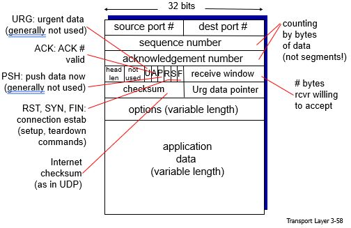

- TCP segment도 UDP segment와 마찬가지로 header 부분과 payload부분으로 나뉨. options 필드까지가 헤더.
- Source port # 필드부터 Urg data pointer 필드까지가 고정된 길이의 헤더이고 options 부분이 가변길이 헤더. 따라서 헤더 길이가 UDP와는 다르게 TCP는 가변적이라서 header length 필드가 있음.
    - 32bits=4byte. 따라서 고정 헤더 길이는 총 20 byte.
- source port #, dest port # : mux, demux를 위한 필드들
- sequence number : 이번 segment의 payload에 실린 유저 데이터의 첫번째 바이트는 connection이 시작된 이후로 몇번째 바이트다 라는 걸 표시해줌.
- acknowlegment number : 상대방이 나에게 보낸 데이터에 대한 acknowlegment number n이 들어가게 됨. (n-1까지는 잘 받았고 다음엔 n번째를 기대하고 있다.)
- receive window : flow control을 위한 필드. 내가 너한테서 다음에는 n번째 바이트를 기대하고 있는데, n번째 부터 m개의 바이트만큼은 내가 acknowlegment를 안보내도 pipelining해도 된다는 뜻. 내가 너의 데이터를 받을 수 있는 버퍼 사이즈가 얼마다.
- checksum : 이 segment에 오류가 있나 없나 받은측이 확인 가능하게 하는 필드.
- UAPRSF : 6개의 flag bit들.
    - R,S,F는 connection 생성과 관련된 flag들임. R은 connection reset(resynchronize)할 때, S는 connection을 맺자는 요청을 보낼 때, F는 connection을 끝내자는 요청을 보낼 때.
    - A가 on되어있으면, 이 segment를 받을 receiver에게 acknowlegment number에 너에대한 ACK정보가 포함되어있다고 나타내는 것. ACK할게 아무것도 없으면 off.
    - U는 urgent flag, P는 push flag. 이 두 flag를 사용하는 애플리케이션이 없었어서 실제로는 사용된적이 없는 flag들임. 데이터를 지금 즉시 flush하라고 명령할 때(현재 자기의 데이터를 몽땅 segment로 싸서 즉시 내보냄) P flag 사용함. 받는쪽에서도 P가 on되어있으면 application으로 바로 올려줌. U도 데이터가 내려가는 즉시 데이터가 flush되지만, P와 차이점은 Urg data pointer라는 필드에 urgent한 데이터가 payload의 어느 위치에 있는가를 표시해서 보내줌.

## TCP seq. numbers, ACKs

- TCP의 sequence numbers :
    - segment의 payload에 실려있는 데이터의 첫번째 byte의 번호. starting sequence number로부터 시작해서 얘가 지금 몇번째 시퀀스 번호인지 적어놓는 것. 내가 지금 이 segment에 실은 데이터의 맨 앞에 있는 바이트의 번호. (따라서 1, 2, 3, 4, ... 이런식으로 넘버링되지 않고 1, 1000, 2000, 3000 이런 식이 됨.)
        
- TCP의 acknowledgements :
    - 자기가 기대하고 있는 next byte의 seq #를 acknowledgement로 보내줌.
    - 상대방에게 니가 다음에 몇번 sequence number의 데이터를 보낼 것을 기대하고 있다고 하는 것. 상대방에게 기대하는 다음 바이트의 시퀀스 번호. (1000을 보내면 999까지는 잘 왔다는 뜻.)
    - 이 넘버 전까지는 모두 제대로 왔다는 소리니까 cumulative ACK을 사용하는 것임.
- TCP에서는 순서대로 도착하지 않은 segment는 receive가 어떻게 처리하는지 TCP spec에 정해져있는 게 없음. 개발자가 알아서 구현한다.

- 예시1 :
    
    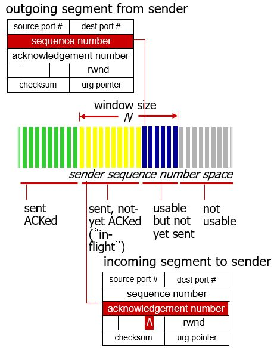
    
    - 노란색부분까지는 보내진 상태이므로, 다음에 보내질 패킷의 sequence number 에는 파란색 부분의 첫번째 byte의 번호가 들어감.
    - sender에게 보내진 segment는 A flag가 on되어있고, 초록색부분까지만 ACKed되었으므로 acknowledgement number 필드에는 노란색부분의 첫번째 byte의 번호가 들어감(초록색부분까진 잘 받았고 다음엔 노란색 부분부터 기대하고 있다는 ACK).
- 예시2 :
    
    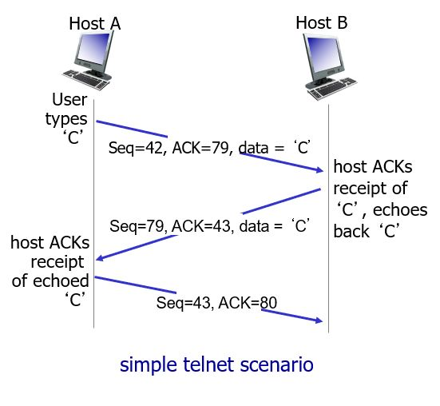
    
    - 이미 handshaking 끝나서 데이터 주고받을 수 있는 상황.
    - host A에서 유저가 'C'를 타이핑함. 'C'의 sequence number는 42이고, host A가 host B에게 나는 다음에는 너한테 sequence number 79번을 기대하고 있다는 의미에서 ACK number는 79를 보냄. 그리고 payload에 데이터인 'C'를 실음.
    - host B는 'C'를 다시 echo해주기 위해서 payload에 'C'를 실고, sequence number에는 79를 달음. 너가 보낸 sequence number 42번까지 잘받았고 이제 43을 기다리고 있다는 의미에서 ACK number는 43을 보냄.

## TCP round trip time, timeout

- TCP는 Negative acknowledgement는 사용안하고 acknowledgement만 사용하고, timer도 사용함.
- timer는 round trip time(RTT)와 굉장히 관련이 깊음. 왜냐면 segment가 가고 거기에 대한 ACK가 와야하기 때문에. RTT만큼 기다렸는데도 안오면 segment가 없어졌던지 ACK가 없어졌던지.
- 문제는, 이번에 내가 내보낸 segment에 대한 RTT를 정확히 알 수가 없음.
    - 너무 짧게 RTT를 예측하면, 실제론 segment가 잘 갔다가 ACK이 오고있는 중인데 재전송이 일어나게 됨.
    - 너무 길게 RTT를 예측하면, 실제론 segment가 drop됐는데도 이를 늦게 알게돼서 segmentation loss에 대한 reaction이 늦어지게 됨.
- 그래서 RTT를 잘 예측해야하는데, 미래를 예측할 순 없고 과거를 가지고 RTT를 예측하게 됨.
    - 내가 내보낸 매 segment에 대해서 걔를 보내서 걔에 대한 ACK이 들어올 때까지 걸리는 시간인 **SampleRTT**를 측정함. (여기서 RTT는 segment 전송해서 ACK가 돌아올때까지 걸리는 시간.)
    - 그래서 그 SampleRTT를 가지고 다음번 내보내는 segment의 RTT가 얼마일지를 예측함. sample 하나가지고 예측하는 건 아니고 average over time을 구하게 됨.
    - 단, 재전송된 segment의 RTT는 sampling하지 않음.
    - sampleRTT는 매우 가변적이기 때문에 평균을 내어서 estimate RTT를 구해 smooth하게 만듦.
- **EstimatedRTT** 구하는 법 :
    
    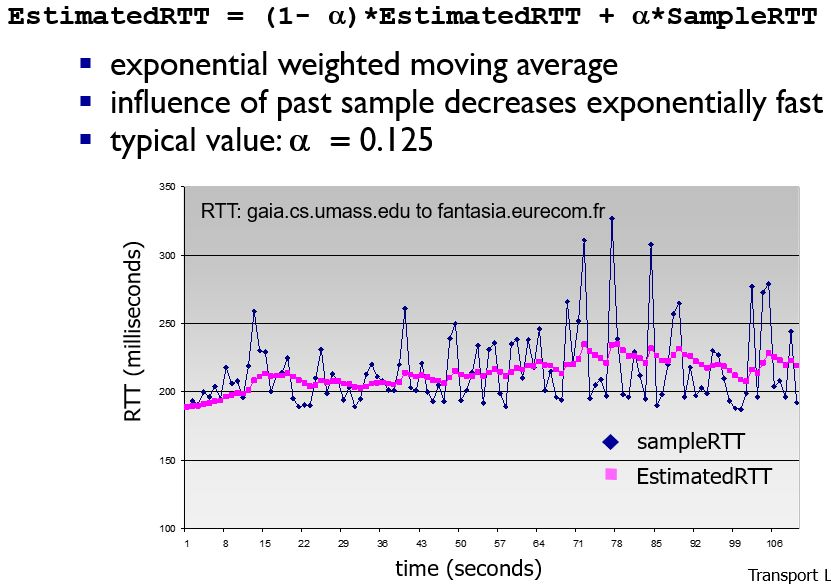
    
    - 이번 SampleRTT(current SampleRTT)를 알파만큼만 반영하고, 이 segment가 들어오기 바로 전 단계까지 내가 estimate하고 있었던 RTT(Estimated RTT)는 1-알파만큼만 반영해서 새로운 Estimated RTT를 구함.
    - 알파값으로는 0.125를 추천하고 있음. 따라서 current sampleRTT를 반영률이 그리 높지 않음.
    - EstimatedRTT는 sampleRTT에 비해서 상당히 smooth하게 변화함. 그래서 EstimatedRTT와 sampleRTT가 상당히 차이 나기 때문에 Estimated RTT만으로 다음 RTT를 예측할 수는 없음.
- 그래서 Estimated RTT에다가 "safety margin"을 더한다.
    
    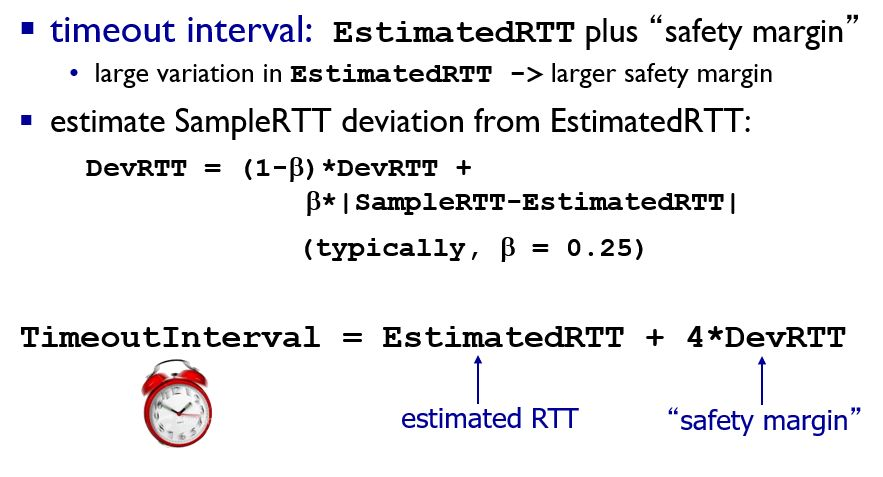
    
    - safety margin은 EstimatedRTT와 이번 SampleRTT의 차를 구해서 그건 베타만큼 반영하고, 이번 새 SampleRTT 생기기 바로 이전 스텝까지의 RTT deviation(차)은 1-베타만큼 반영함. 둘을 더해서 현재 DevRTT를 업데이트해나감.
    - DevRTT가 크다는 소리는 SampleRTT가 매번 EstimatedRTT를 훌쩍훌쩍 많이 벗어난다는 소리임. 그래서 그때는 safety margin을 크게 둔다.
    - DevRTT가 작으면 그때는 safety margin을 작게 두면 된다.
    - 그래서 safety margin은 DevRTT를 가지고 결정하는데, 보통 4*DevRTT정도로 결정함.
    - 결국 timeout interval은 EstimatedRTT에다가 4*DevRTT(safety margin)값을 더한 값으로 결정이 된다.

## TCP reliable data transfer

- TCP는 reliable data transfer service를 제공하는데 IP의 unreliable service위에서 함.
- TCP는 pipelined protocol을 사용하고, cumulate acks 사용하고, timer도 하나만 사용함(single retransmission timer).
- timer가 timeout이 되거나, duplicate acks를 받을 때 retransmission(재전송)이 이루어짐.
- 먼저 간단한 TCP sender만 봐보자. (duplicate acks도 무시하고, flow control, congestion control도 안하는 간단한 TCP sender.)

## TCP sender events:

- 데이터가 application에서 왔을 때 :
    - sequence number가지고 segment 만듦.
    - seq #는 segment에 들어간 데이터의 첫번째 data byte의 byte-stream number.
    - timer가 이미 돌고 있지 않으면 timer를 start.
        - think of timer as for oldest unacked segment
        - expiration interval : TimeOutInterval
- timeout이 발생했을 때 :
    - timeout이 된 해당 segment에 대해서만 재전송함.(selective repeat 방식.)
    - timer를 restart.
- ACK를 receive했을 때 :
    - if ack acknowledges previously unacked segments
        - update what is known to be ACKed
        - 아직 unacked segments가 있으면 start timer.

## TCP sender (simplified)

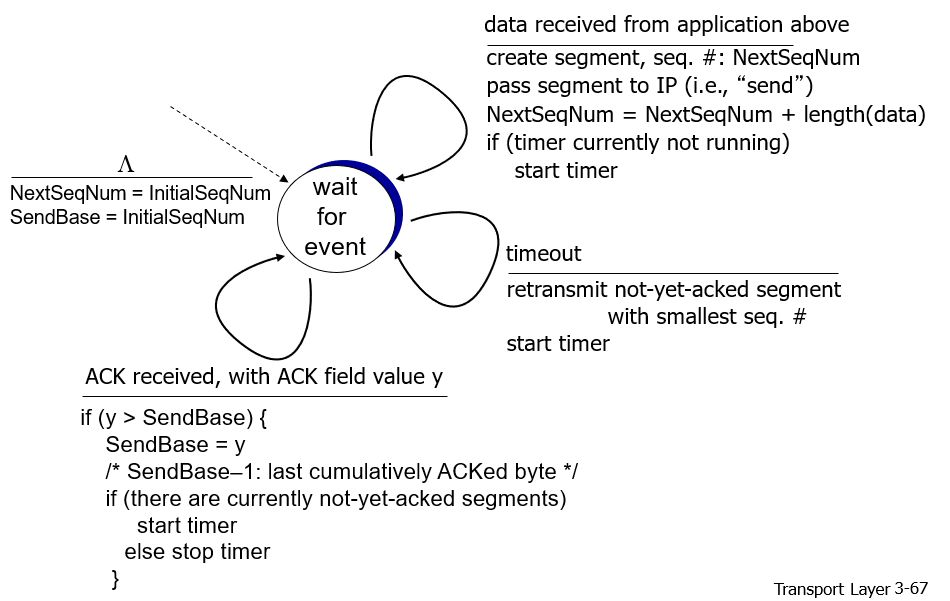

- nextseqnum이 +1이 아니라 length가 더해짐. (1, 1000, 2000 이런식으로 넘버링 되기 때문.)

## TCP: retransmission scenarios
- 예시 :
    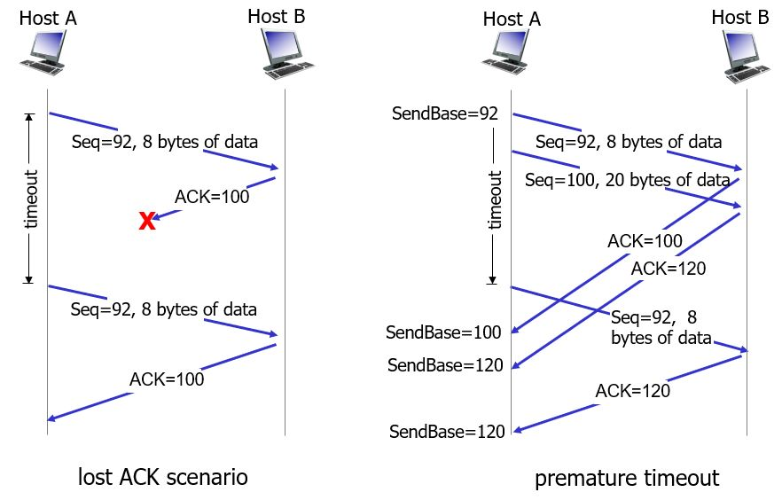    

    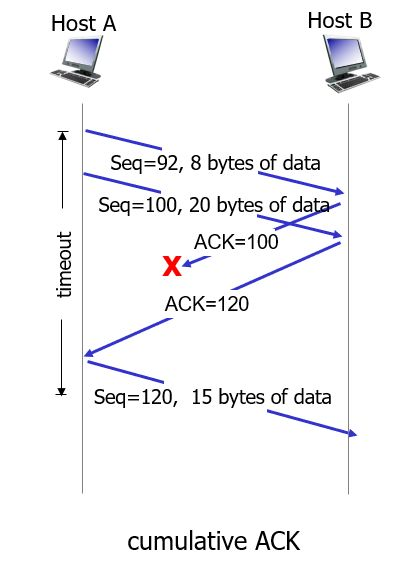 
    

## TCP fast retransmit

- 뭔가 잘못됐다는 것을 알았다면 빨리 재전송을 해주면 좋은데 timer가 expire될때까지 기다리면 시간이 낭비될 수 있음. 그래서 잘못됐다는 것을 알았다면 빨리 재전송을 해주는 것이 TCP fast retransmit.
- time out period는 보통 길기 때문에 lost packet을 재전송하기 전에 긴 delay가 생김.
- timeout은 안됐는데 중복된 ACK가 오고 또 오고 한다면 segment가 lost되었구나라고 파악하는 것.
- TCP fast retransmit :
    - sender가 같은 데이터에 대한 중복된 ACKs("triple duplicate ACKS")를 3개 받게 되면, 가장 작은 seq #를 가진 unacked segment를 재전송한다.
        - 해당 unacked segment가 lost되었을 가능성이 크니 timeout될떄까지 기다리지 않음.
            
            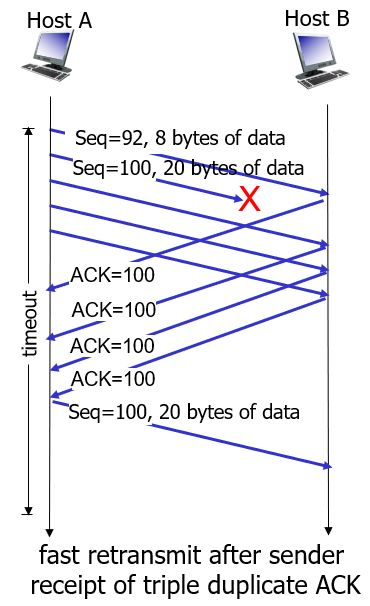
            

## TCP flow control

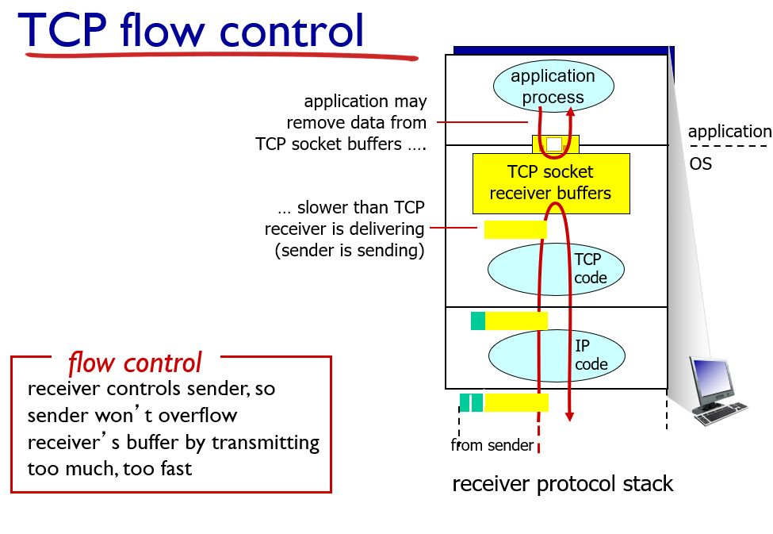

- receiver가 sender가 너무 많이 빠르게 전송해서 receiver의 버퍼를 overflow하지 않도록 sender를 컨트롤함.
- receiver가 sender에게 보내는 segments의 헤더에 rwnd (=receiver window) 값을 포함시켜서 free buffer space를 알려줌.
- sender는 receiver의 rwnd 값만큼의 unacked data를 전송함.
- RcvBuffer = 전체 reciver buffer size. rwnd = receiver buffer space 중 free buffer space.
    
    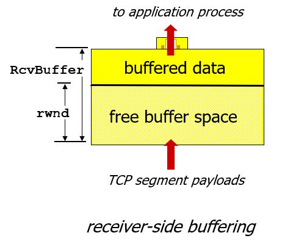
    

## Connection Management

- 데이터를 주고받기 전에 sender와 receiver가 handshake를 함.
- TCP는 3-way handshake라는 방법을 써서 connection을 설정함.
- handshake를 한다 = connection 설정에 동의한다 & connection parameters에 동의한다.
    
    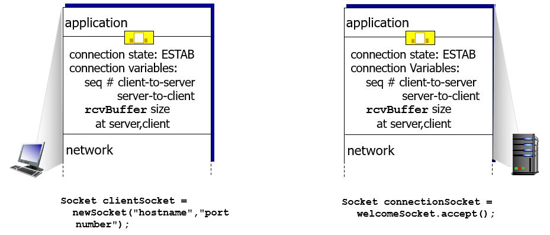
    

## Agreeing to establish a connection
- 2-way handshake

    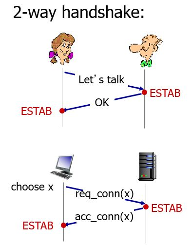

- 2-way handshake는 항상 네트워크에서 제대로 동작하지 않을 수도 있음.
    - 이유 : variable delays, retransmitted messages, message reordering, can't "see" other side.
        
        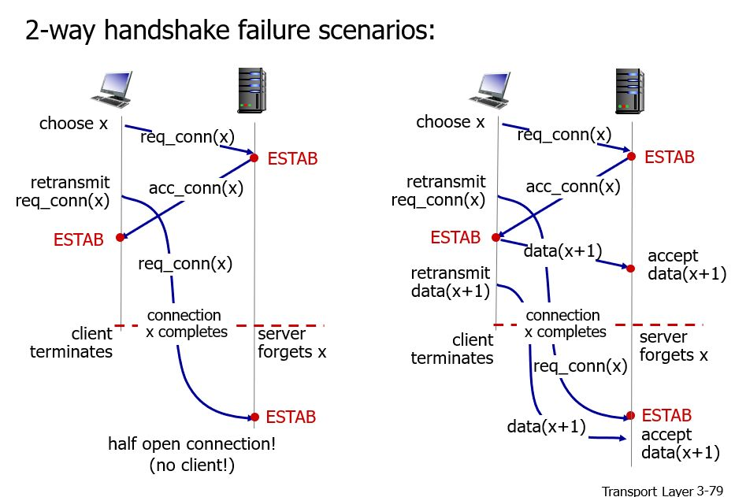
        
        - 왼쪽 그림 : acknowledgement가 timeout이 돼서 재전송을 했고, 이 재전송된 acknowledgement가 좀 늦게 도착해서 connection이 종료된 후에 server측에 도착했다고 가정. 이 경우 client는 연결이 종료되어있는데 server는 연결 설정이 돼서 half open connection 상태가 됨.
        - 오른쪽 그림 : receiver가 중복 데이터를 accept하게 됨.
- 따라서 이런 문제들이 발생하지 않게 하기 위해, TCP에서는 3-way handshake를 한다.

## TCP 3-way handshake

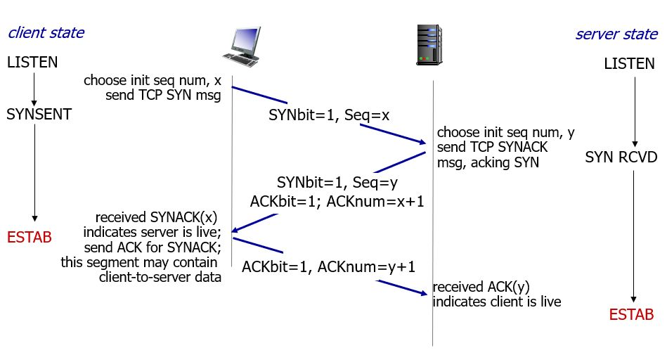

- client state에 써있는 LISTEN이 사실 CLOSED여야 함.
- SYN과 ACK를 사용해 링크 설정함.

## TCP 3-way handshake: FSM

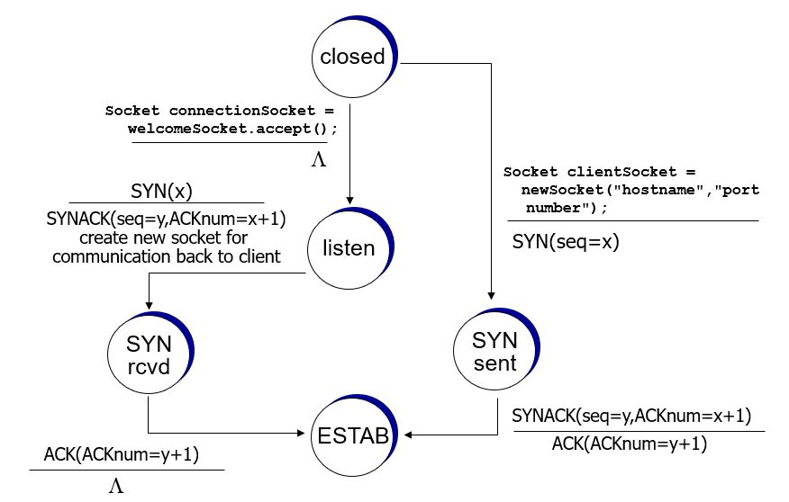

- closed 상태에서 client에서 socket을 만들고, seq #를 x로 해서 SYN을 server로 보냄.
- client는 closed 상태에서 시작. server는 listen 상태에서 client로부터 SYN이 도착하기를 기다림.

## TCP: closing a connection

- TCP segment를 FIN bit=1과 함께 보내면 연결 close 됨. (FIN이라는 flag를 통해서 link를 close함.)
- 받은 FIN을 ACK로 응답함. on receiving FIN, ACK can be combined with own FIN.
- simultaneous FIN exchanges can be handled.
    
    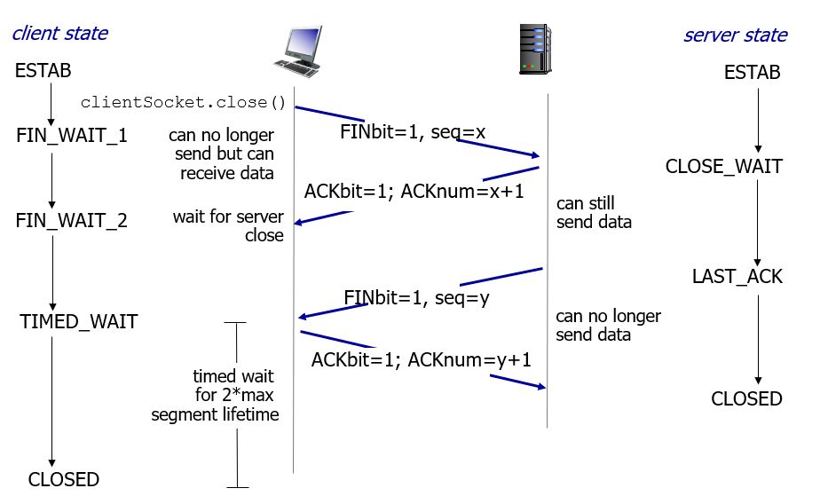
    

# principles of congestion control

## Principles of congestion control

- congestion : 여러 source에서 네트워크가 다룰 수 있는 것보다 더 많이 더 빠르게 데이터를 보내는 것.
- flow control과는 다름.
- router에서의 buffer overflow로 인해 packet loss가 발생할 수 있고, router buffer에서의 queueing 때문에 긴 delay가 발생할 수 있음.

## Causes/costs of congestion: scenario 1

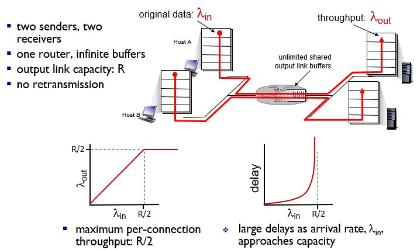

- 2개의 sender와 2개의 receiver가 있음.
- 하나의 router가 있고, 이 router의 buffer는 infinite buffer임.
- output link capacity는 R임. (R per sec)
- sender측에서 retransmission은 하지 않는다고 가정.

- 람다 in = 람다 out 이면 100%의 throughput을 갖는 것.
- 보낸 것만큼 그대로 도착하다가 R/2부터 아무리 많이 보내봐야 도착하는 것은 R/2밖에 안 됨. 왜냐면 output link로 나가는 것은 capacity가 R이라 아무리 많아봐야 R인데 2개의 receiver로 1/2씩 나뉘기 때문에 throughput은 최대 R/2이 됨.
- delay 의 관점에서는, 트래픽이 R/2에 가까워질 수록 delay가 무한에 가깝게 커지게 됨. congestion이 발생하면 delay가 발생하게 된다.
- connection끼리 공평하게 link capacity를 1/N로 나눠서 씀.

## Causes/costs of congestion: scenario 2

- 하나의 router가 있고, 이번엔 유한한 버퍼를 가진다고 가정.
- sender가 timed-out packet을 이번엔 재전송한다고 가정.
    
    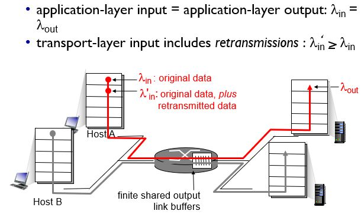
    
    - 람다 in은 original data이고, 람다' in은 original data 전송 위해 복사해 놓은 것에다가 재전송을 위해서 데이터를 복사할 때도 합친 것(original data에 재전송까지 포함한 것). 그래서 람다' in ≥ 람다 in이다. 람다' in = 람다 in인 경우는 재전송이 없는 경우. 패킷 전송해야할 때 람다 in에서 람다' in으로 copy가 발생한 후 전송됨.

- 그랬을 때, sender가 perfect한 knowledge를 갖고있어서 router buffer가 available할 때만 패킷을 전송한다고 가정할 경우,
    
    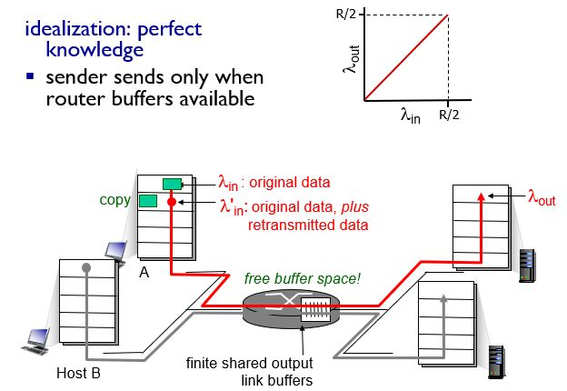
    
    - 버퍼가 꽉찼을 땐 보내지 않으므로 람다 out이 R/2가 되면 그만 보냄. R/2될때까지 보낸만큼 그대로 도착.
    
- 패킷이 loss 될 수 있고, router에서 full buffer로 인해 drop될 수 있다고 가정할 경우,
    
    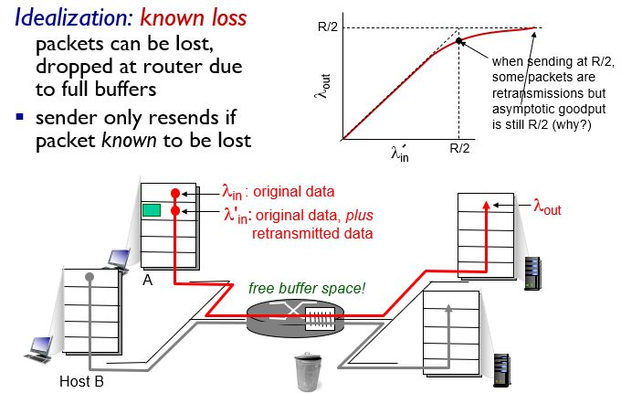
    
    - drop 되었다는 것을 알면 람다 in의 copy해놓았던 데이터를 다시 복사해서 보냄.
    - 재전송때문에 그래프가 달라짐.
    
- time out 때문에 2개의 copy가 전송될 수도 있다(duplicates 전송될 수 있다)고 가정할 경우,
    
    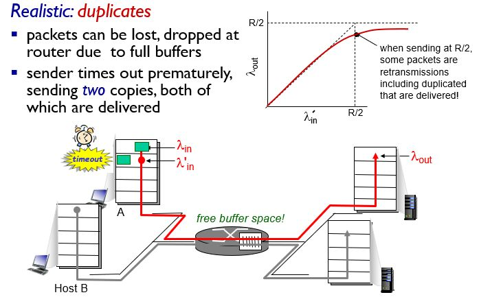

    - original data가 1/4밖에 못간다. 1/2의 반은 duplicate data 이고, 반은 original data라서.

- congestion이 발생하면 불필요한 재전송을 하게되고, 그러다보니 throughput이 떨어지게 된다.

# TCP congestion control

## TCP congestion control: additive increase multiplicative decrease

- TCP congestion control은 트래픽의 양을 증가시킬 땐 additive increase임(=하나씩 증가시킴). 네트워크에 문제가 발생해 트래픽 양을 감소시켜야 할 때는 multiplicative decrease를 함(=곱으로 감소시킴).
- slow start와 congestion avoidance라는 두 단계로 진행이 됨.
- approach : sender는 transmission rate(window size)를 packet loss가 발생할 때까지 증가시킴. (sender increases transmission rate(window size), probing for usable bandwidth, until loss occurs.)
    - additive increase : loss가 감지될 때까지 cwnd(=congestion window)를 매 RTT마다 1 MSS씩 증가시켜라.
    - multiplicative decrease : loss를 감지하면 cwnd(=congestion window)를 반으로 줄여라.
        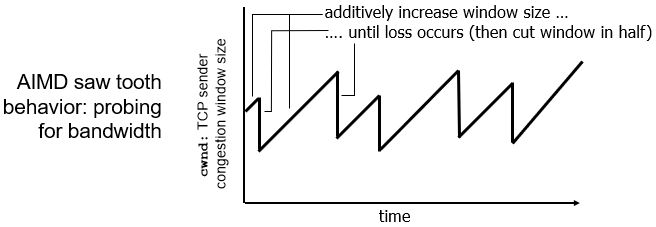

## TCP Congestion Control: details

- congestion control

    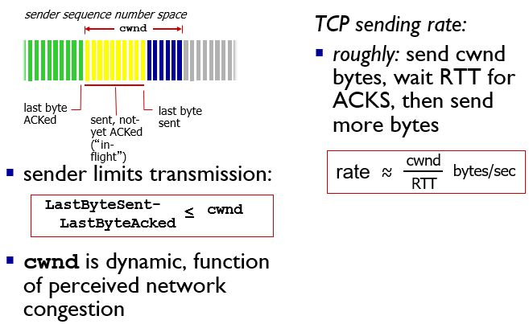

- TCP sending rate : cwnd bytes만큼 전송하고, ACK를 위해 RTT만큼 기다리고, 응답받으면 bytes를 더 전송함.

## TCP Slow Start

- slow start

    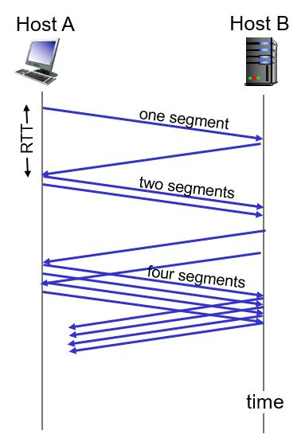

- connection이 시작이 돼서 데이터를 보내기 시작하면, rate가 첫번째 loss event가 발생할 때까지 exponential하게 증가함.
    - 초기 cwnd는 1 MSS.
    - (에러 없이 ACK가 온) 매 RTT마다 cwnd를 2배로 함. (각 segment마다 하나씩 증가시켜서 1 → 2 → 4 → 8 이렇게 증가.)
    - 이렇게 해서 매번 ACK를 받을 때마다 cwnd를 증가시킨다.
- initial rate는 매우 slow하나 cwnd가 exponential하게 빠르게 증가함.

## TCP: detecting, reacting to loss

- TCP에서 loss가 발생했다 = 네트워크에 congestion이 발생했다.
- timeout으로 loss가 indicate된 경우 (timeout이 발생한 경우),
    - timeout이 발생한 경우 cwnd를 1 MSS로 설정해서 다시 시작함. 그러고 나서window를 threshold까지 exponential하게 증가시키고, threshold가 되면 linear하게 증가시키자. (linear하게 grow할 때는 각 segment마다 하나씩 증가시키는 게 아니라 모든 segment에 대한 ACK가 오면 전체에대해서 하나씩 증가시킴. 4개였다면 8개가 아니라 5개로 증가시킴.)
    - (Tahoe버전과 RENO 버전 모두 똑같이 이렇게 처리함.)
- 3개의 중복된 ACKs에 의해 loss가 indicate된 경우 (duplicate acks 발생한 경우),
    - 중복된 ACKs는 네트워크가 조금 늦지만 그래도 segment를 deliver할 수는 있다는 것을 나타내줌. 그래서 timeout때처럼 처음부터 다시 시작할 필요는 없음.
    - (이 경우엔 Tahoe버전과 RENO 버전이 처리하는 방식이 다름.)
    - TCP RENO버전 : cwnd를 반으로 줄이고, linear하게 증가시키자.
    - TCP Tahoe 버전 : cwnd를 1 MSS로 설정해서 다시 시작함.
- TCP Tahoe는 timeout이 발생하건, 3개의 duplicate acks가 발생하건, 항상 cwnd를 1 MSS로 설정한다.

## TCP: switching from slow start to CA

- Q : exponential increase가 언제 linear increase로 바뀌어야 하는가?
    - A : cwnd가 timeout 되기 전의 값의 1/2(=threshold)이 되면.
        
        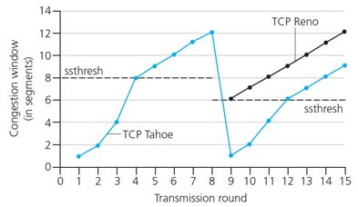
        
        - 처음에 하나 보내고, 에러없이 ACK가 잘오니까 2개보내고, 또 2개 다 ACK가 잘 와서 4개보내고, 또 4개 다 ACK가 잘 와서 8개보내고, threshold인 8에 도달했으므로 8개 다 ACK가 잘 오면 이 때는 9개를 보내고, 다음은 10개, 다음은 11개, 다음은 12개 보냄. 12개 보냈을 때 timeout이 되었거나 duplicate ack가 발생해서  cwnd가 1로 떨어지게 됨. 이후 같은 식으로 반복되는데, 이번의 threshold는 1로 떨어지기 전의 값이었던 12를 2로 나눈 값인 6이 됨.
        - TCP Tahoe의 경우, timeout이 발생하건, 3개의 duplicate acks가 발생하건, 항상 cwnd가 1 MSS로 떨어짐.
        - TCP Reno의 경우, timeout이 발생하면 cwnd가 1로 떨어지지만, duplicate ack가 발생해서 congestion이 발생했던 거라면 1이 아닌 12의 반인 6에다가 3을 더한 값인 9부터 cwnd 값이 시작해서 linear하게 증가함. (위 그림은 잘못됐고 6이 아니라 9부터 시작.)
- 구현 :
    - 변수 ssthresh.
    - loss 발생할 경우, ssthresh는 항상 loss event 직전의 cwnd 값의 1/2로 한다. (TCP Tahoe건 Reno건 threshold 값은 항상 loss event 직전의 cwnd 값의 절반으로 설정.)

## Summary: TCP Congestion Control

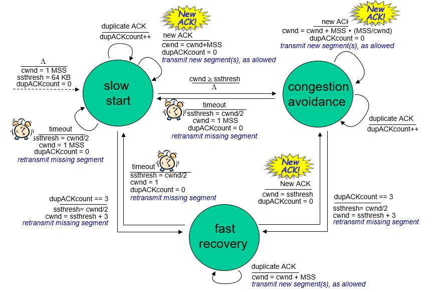

- TCP Reno 버전임.
- slow start :
    - 처음에 cwnd를 1MSS로 하고 ssthresh를 64kb로 함. dupACKcount는 0으로 함. (초기화)
    - ACK가 오면 제대로 전송된 거니까 새로운 ACK 올때마다 cwnd를 1 MSS씩 증가시켜주고 dupACKcount=0 해줌. 그리고 새 segment allow되는 한 또 보냄.
    - duplicate ACK가 올 경우 dupACKcount를 1씩 증가시켜줌.
    - slow start 상태에서 있다가 cwnd가 ssthresh 이상이 되면 congestion avoidance 상태로 넘어감.
    - dupACKcount가 3이 될경우 ssthresh를 cwnd의 절반값으로 설정하고, cwnd의 절반값에 3을 더한 값이 cwnd값이 되고, loss에 대해 재전송함. (아까 말했듯이 duplicate ack 발생했을 때 cwnd가 cwnd/2 한 것에 +3 한 값이 됨.) 그리고 fast recovery 상태가 됨.
- congestion avoidance :
    - congestion avoidance 상태에선 새로운 ACK가 오면 cwnd를 매번 1씩 증가시키는 게 아니라 4개를 보냈다고 하면 4개에 대해서 다 ACK가 왔을 때  하나를 증가시킴. 그리고 dupACKcount=0. 그리고 새 segment allow되는 한 또 보냄.
    - duplicate ACK가 올 경우 dupACKcount를 1씩 증가시켜줌.
    - dupACKcount가 3이 될경우 ssthresh를 cwnd의 절반값으로 설정하고, cwnd의 절반값에 3을 더한 값이 cwnd값이 되고, loss에 대해 재전송함. (아까 말했듯이 duplicate ack 발생했을 때 cwnd가 cwnd/2 한 것에 +3 한 값이 됨.) 그리고 fast recovery 상태가 됨.
    - congestion avoidance 상태에서 timeout이 되면, threshold를 cwnd의 절반값으로 설정하고, cwnd는 1로 설정함. 그리고 dupACKcount=0. 그리고 timeout된 segment에 대해 재전송하고, slow start 상태가 됨.
- fast recovery :
    - fast recovery 상태에서 재전송한 것들에 대한 ACK가 오면 잘 갔다는 소리니까 그 때부턴 또 slow start때처럼 매 ACK마다 1씩 증가시켜주는 상태가 됨.

## TCP throughput

- 옛날 TCP 방식의 throughput 계산 법임. 요즘은 달라졌음.
    
    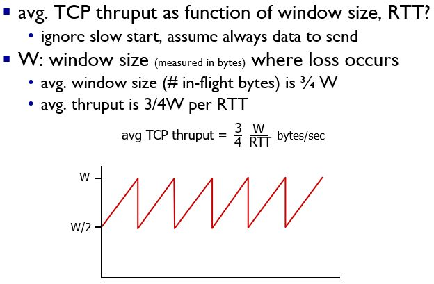
    
    - slow start는 고려하지 않고 congestion avoidance부분만 고려한 그래프.
    - window size가 w일 때 에러가 발생하면 1/2로 줄임.
    - w+w/2를 2로 나누니까  average throughput은 RTT당 3/4w.

## TCP Fairness

- fairness의 목적 : k개의 TCP 세션이 bandwidth가 R인 같은 bottleneck link를 쉐어한다면, 각각은 R/K의 average rate을 갖는다. (R을 n분에 해서 나눠가진다는 뜻.)
    
    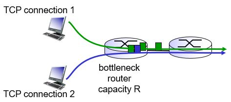
    

## Why is TCP fair?

- 2개의 competing session이 있다고 해보자 :
    - additive increase와 multiplicative decrease를 통해 throughput을 적절히 맞추다 보면 결국 equal bandwidth share를 가지게끔 조절됨.
        - additive increase는 1의 기울기로 점을 증가시키고 multiplicative decrease는 점의 가로 세로 좌표를 1/2씩 감소시킴.
            
            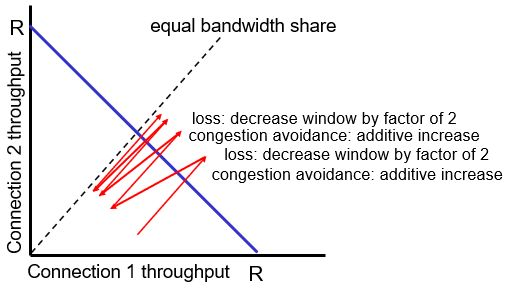
            
- TCP는 fairness를 구현하기 좋은 구조로 되어있음.

## Fairness (more)

- TCP의 경우 fairness 구현되기 쉽지만, UDP 사용하는 앱들의 경우 fairness 구현되기가 쉽지 않음.
- UDP 사용하지 않더라도, parallel TCP connection을 하게 되면 fairness 구현하기가 쉽지 않음.
    - application이 여러개의 parallel한 connection을 연결할 경우 진정한 fairness가 얻어지기가 쉽지 않다.
    - ex) rate R인 link와 9개의 connection이 있음.
        - 새로운 앱이 들어와서 1개의 TCP를 요구할 경우, TCP connection이 10개가 되었으므로 10개가 나눠서 R/10씩의 rate를 쓰면 됨.
        - 새로운 앱이 들어와서 11개의 TCP를 요구할 경우, TCP가 20개가 되었으므로 이 앱이 혼자서 (11/20)*R, 즉 거의 R/2의 rate를 사용하게 됨.

## Explicit Congestion Notification (ECN)

- 네트워크가 도와주는 congestion control :
    - IP 헤더의 2개의 bits(ToS field)를 사용해서, network router가 거기에 congestion이 있다는 것을 나타내는 mark를 함.
    - 이 mark 된 것이 receiving host까지 전달됨.
    - receiver가 IP datagram의 헤더에 있는 congestion이 발생했다는 표시를 보고, ACK segment의 ECE와 관련된 bit를 on을 시켜서 sender에게 보내 congestion이 발생했음을 알려줌.
    - sender는 이를 받아 확인하고 그때부터 transmission rate(window size)를 조절함.
        
        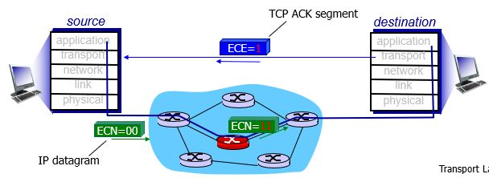
        

## summary

- application layer와 transport layer는 end system(network edge)에만 존재함.
- 그래서 edge부분은 다 봤고 그 다음은 network core부분으로 들어감. (network layer).
    - data plane  - forwarding (패킷이 들어오면 어디로 내보낼지 표 참고해 판단.)
    - control plane - routing (표를 만드는 알고리즘.)