# Join

## Join이란?

- 두 개 이상의 테이블을 서로 연결하여 데이터를 검색할 때 사용하는 방법

<br>

## Join의 종류

<br>

## 1. INNER JOIN

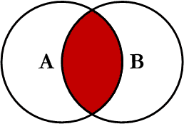

- 두 테이블의 교집합, 즉 두 테이블간 JOIN 조건을 만족하는 행을 반환함.

```sql
SELECT *
FROM EMPLOYEE
INNER JOIN DEPARTMENT
ON EMPLOYEE.DepartmentID = DEPARTMENT.DepartmentID;
```

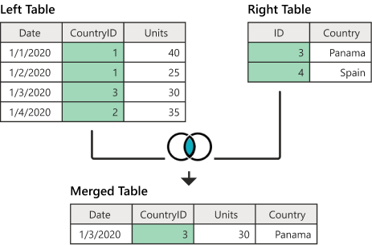

<br>

## 2. OUTER JOIN

- 조인 조건을 만족하지 않는 행도 포함하여 반환할 때 사용함.

<br>

## 2-1. LEFT OUTER JOIN

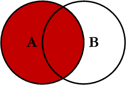

- 조인문의 왼쪽에 있는 테이블의 모든 결과를 가져온 후 오른쪽 테이블의 데이터를 매칭하고, 매칭되는 데이터가 없는 경우 NULL로 표현한 후 합쳐 보여줌.

```sql
SELECT *
FROM EMPLOYEE E LEFT OUTER JOIN DEPARTMENT D
ON E.DEPARTMENTID = D.DEPARTMENTID;
```

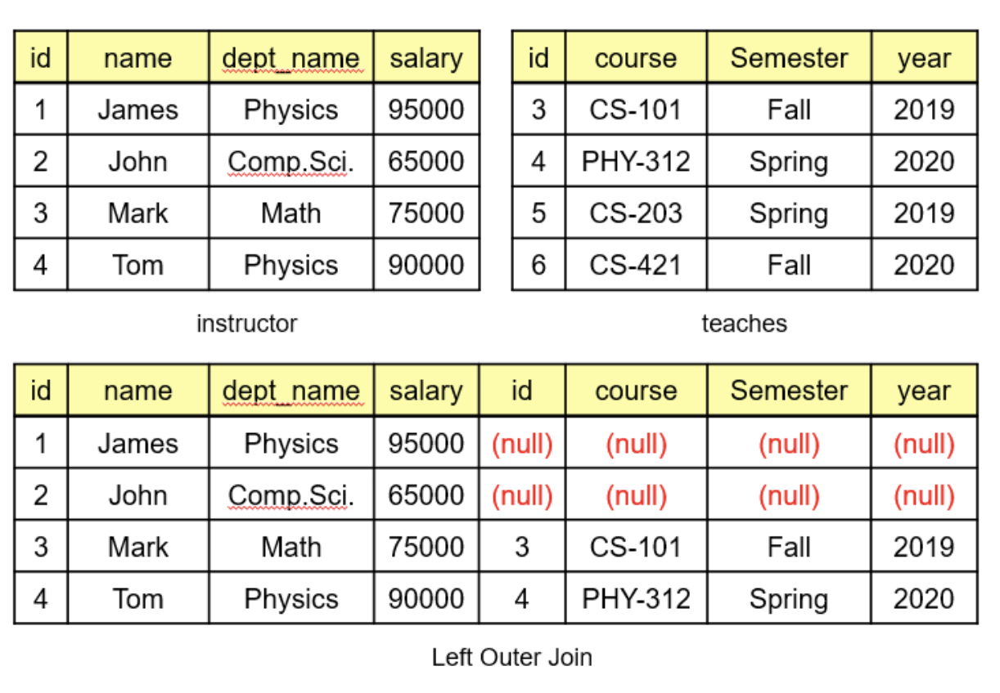

## 2-2. RIGHT OUTER JOIN

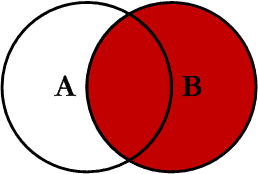

- 조인문의 오른쪽에 있는 테이블의 모든 결과를 가져온 후 왼쪽의 테이블의 데이터를 매칭하고, 매칭되는 데이터가 없는 경우 NULL로 표현한 후 합쳐 보여줌.

```sql
SELECT *
FROM EMPLOYEE E RIGHT OUTER JOIN DEPARTMENT D
ON E.DepartmentID = D.DepartmentID;
```

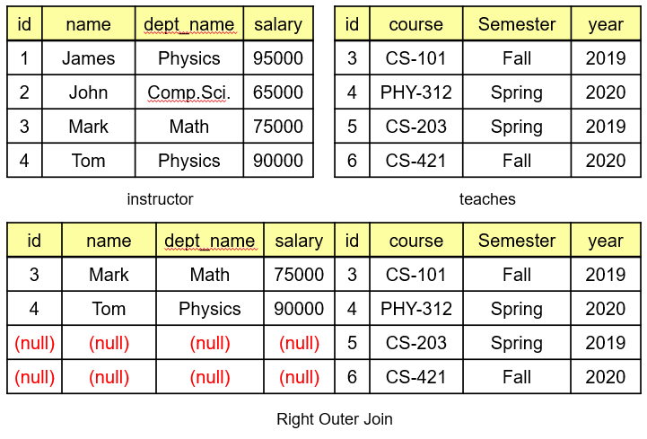

## 2-3. FULL OUTER JOIN

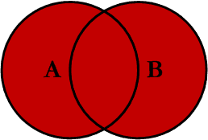

- LEFT OUTER JOIN과 RIGHT OUTER JOIN을 합친 것으로, 양쪽 모두 조건이 일치하지 않는 것들까지 모두 결합하여 출력함. 이것 역시 매칭되는 데이터가 없는 경우 NULL로 표현한 후 합쳐 보여줌.

```sql
SELECT *
FROM EMPLOYEE E FULL OUTER JOIN DEPARTMENT D
ON E.DepartmentID = D.DepartmentID;
```

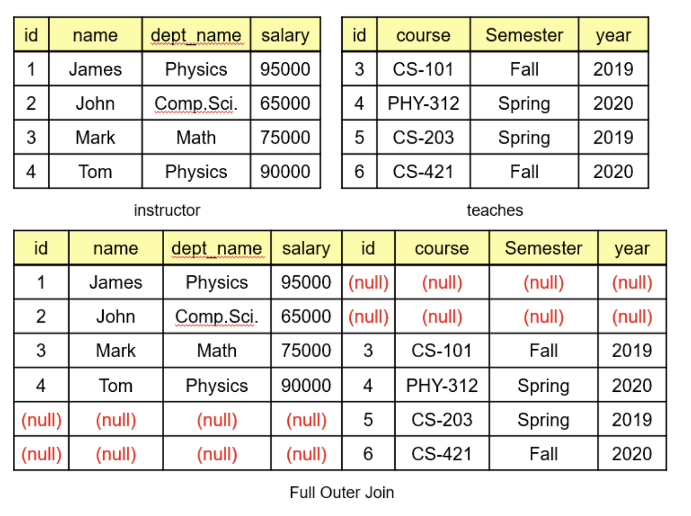

<br>

## 3. CROSS JOIN

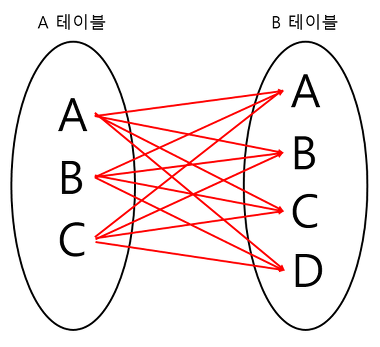

- Cartesian Product(카테시안 곱)이라고도 하며 조인되는 두 테이블에서 곱집합을 반환함.
- 예를 들어 m열을 가진 테이블과 n열을 가진 테이블이 교차 조인되면 m\*n 개의 열을 생성함.

```sql
SELECT *
FROM EMPLOYEE
CROSS JOIN DEPARTMENT;
```

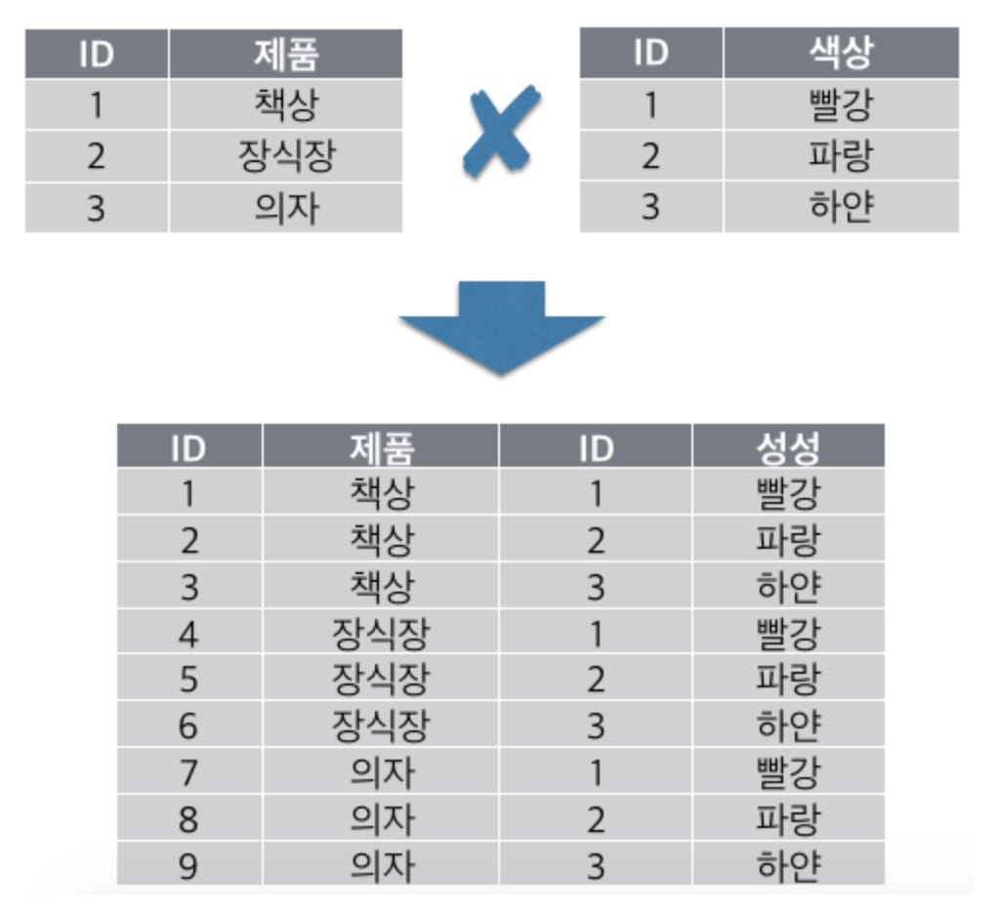

<br>

## 4. SELF JOIN

- 자기자신과 자기자신을 조인하는 것으로, 하나의 테이블을 여러번 복사해서 조인한다고 생각하면 됨.
- 같은 테이블을 사용하기 때문에 테이블에 반드시 별명을 붙여야함.
- 명령어가 따로 있는게 아니라 outer join이던 inner join이던 자기 자신의 테이블과 조인할 경우 SELF JOIN.

```sql
SELECT
A.NAME, B.AGE
FROM TABLE_A A, TABLE_A B
```

<br>

## Join 수행 원리

- DBMS가 내부적으로 조인을 수행하는 기법에는 NL Join(Nested Loop Join), Sort Merge Join, Hash Join이 있음.

<br>

## 1. NL Join(Nested Loop Join)

- 아래와 같이 사원과 고객 테이블이 있다고 하자.

  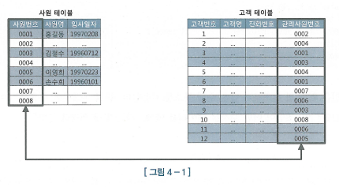

- 1996년 1월 1일 이후 입사한 사원이 관리하는 고객 데이터를 추출하는 프로그램을 작성한다고 해보자.
- 쿼리문은 아래와 같을 것.

  ```sql
  select e.사원명, c.고객명, c.전화번호
  from 사원 e, 고객 c
  where e.입사일자 >= '19960101'
  and c.관리사원번호 = e.사원번호;
  ```

- 가장 쉽게 생각할 수 있는 방식은, 사원 테이블로부터 1996년 1월 1일 이후 입사한 사원을 찾아 '건건이' 고객 테이블에서 사원번호가 일치(사원.사원번호 = 고객.관리사원번호) 하는 레코드를 찾는 것.
- Nested Loop 조인이 사용하는 알고리즘이 바로 이런 방식을 사용함. 중첩 for문과 같은 원리라고 생각하면 됨.
- 아래 psuedo code는 NL 조인이 어떤 순서로 데이터를 액세스하는지 잘 설명해 줌.

  ```
  begin
      for outer in (select 사원번호, 사원명, from 사원 where 입사일자 >= '19960101')
      loop
          for inner in (select 고객명, 전화번호 from 고객 where 관리사원번호 = outer.사원번호)
          loop
              dbms_output.put_line(
                  outer.사원명 || ' : ' || inner.고객명 || ' : ' || inner.전화번호);
          end loop;
      end loop;
  end;
  ```

- 일반적으로 NL 조인은 Outer(사원 테이블)와 Inner(고객 테이블) 양쪽 테이블 모두 인덱스를 이용함.
- Outer쪽 테이블은 사이즈가 크지 않으면 인덱스를 이용하지 않고 대신 Table Full Scan을 이용할 수 있는(어차피 한 번만 읽기 때문에) 반면에, Inner쪽 테이블은 인덱스를 이용해야 함(JOIN 컬럼이 인덱스에 걸려있어야 함). 그렇지 않으면 Outer 루프에서 읽은 건수 만큼 Table Full Scan을 반복하게 되어 비효율적이기 때문.
  - ex) 만약 Outer루프에서 읽은 건수가 100건이고 Inner 테이블의 행 수가 100개라면 총 100번 Table Full Scan을 하여 10000개의 행을 읽어야 한다.
- 따라서 Inner 테이블의 인덱스 구성 전략이 매우 중요한 요소가 되며, 결국 NL 조인은 '인덱스를 이용한 조인 방식'이라고 할 수 있음.

<br>

### NL 조인 특징요약

- NL 조인의 첫 번째 특징은 `랜덤 액세스 위주`의 조인 방식이라는 점.
  - 랜덤 액세스 :
    - 데이터를 저장하는 블록을 한번에 여러 개 액세스하는 것이 아니라 한 번에 하나의 블록만을 액세스하는 방식.
    - 인덱스를 액세스하여 확인한 ROWID를 이용하여 테이블을 액세스하는 경우 랜덤액세스가 발생.
  - 이 랜덤 액세스 위주의 조인 방식이라는 특징 때문에, 인덱스 구성이 아무리 완벽해도 대량 데이터 조인할 때는 NL 조인이 다른 조인 방식에 비해 불리함.

<br>

- 두 번째 특징은 조인을 `한 레코드씩 순차적`으로 진행한다는 점.
  - 부분 범위 처리 활용 시 매우 빠른 응답 속도를 낼 수 있음.
  - 순차적으로 진행하므로 먼저 액세스되는 테이블 처리 범위에 의해 전체 일량이 결정되는 특징도 가짐.

<br>

- 마지막으로, 다른 조인 방식과 비교할 때 `인덱스 구성 전략이 특히 중요`하다는 점도 중요한 특징.
  - 조인 컬럼에 대한 인덱스가 있는지와, 있다면 컬럼이 어떻게 구성됐느냐에 따라 조인 효율이 크게 달라짐.

<br>

- 결론적으로 NL 조인은 소량 데이터를 주로 처리하거나 부분범위 처리가 가능한 온라인 트랜잭션 처리(OLTP) 시스템에 적합한 조인 방식이라고 할 수 있음.

<br>

## 2. Sort Merge Join

- 조인 컬럼에 인덱스가 없을 때, 또는 대량 데이터 조인이어서 인덱스가 효과적이지 않을 때, 옵티마이저는 NL 조인 대신 소트 머지 조인이나 해시 조인을 선택함.
- 해시 조인의 등장으로 예전만큼 쓰이지는 않지만, 해시 조인을 사용할 수 없는 상황에서 대량 데이터를 조인하고자 할 때 여전히 유용한 조인 수행 기법.

### SGA vs PGA

- 전체 구조 :

  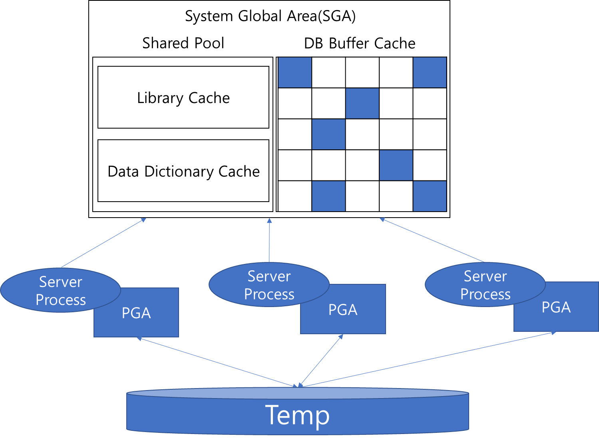

- SGA :
  - System Global Area의 약자로써, 공유 메모리 영역을 의미. SGA에 캐시된 데이터는 여러 프로세스가 공유할 수 있지만 동시에 액세스할 수는 없음. 동시에 액세스하려는 프로세스 간 액세스를 직렬화하기 위한 Lock 매커니즘으로서 래치(Latch)가 존재함.
  - 데이터 블록과 인덱스 블록을 캐싱하는 DB 버퍼캐시는 SGA의 가장 핵심적인 구성요소이며, 여기서 블록을 읽으려면 버퍼 Lock도 얻어야 함.
- PGA :
  - 서버 프로세스는 SGA에 공유된 데이터를 읽고 쓰면서, 동시에 자신만의 고유 메모리 영역을 가짐. 이를 PGA라고 부름.
  - Private Global Area의 약자. 각 서버 프로세스에 할당된 메모리 영역을 PGA라고 부르며, 프로세스에 종속적인 고유 데이터를 저장하는 용도로 사용함.
  - 할당받은 PGA 공간이 작아 데이터를 모두 저장할 수 없는 경우에는 Temp 테이블스페이스를 이용함.
  - PGA는 다른 프로세스와 공유하지 않는 독립적인 메모리 공간이므로 래치 메커니즘이 불필요하고, 따라서 같은 양의 데이터를 읽더라도 SGA 버퍼캐시에서 읽을 때보다 훨씬 빠름.

### Sort Merge Join 기본 메커니즘

- 소트 머지 조인은 아래 두 단계로 진행함.
  - 1 ) 소트 단계 : 양쪽 집합을 조인 컬럼 기준으로 정렬한다.
  - 2 ) 머지 단계 : 정렬한 양쪽 집합을 서로 머지(Merge)한다.

<br>

- 소트 머지 조인 수행과정 예시 :

  ```sql
  SELECT /*+ ordered use_merge(c) */
          e.사원번호
          ,e.사원명
          ,e.입사일자
          ,c.고객번호
          ,c.고객명
  FROM 사원 e
      ,고객 c
  WHERE c.관리사원번호 = e.사원번호
      AND e.입사일자 >= '19960101'
  ```

- 위 SQL 예시의 소트 머지 조인 수행 과정을 풀어서 설명하면 아래와 같음.

  - 1 ) WHERE 조건절에 해당하는 사원 데이터를 읽어 조인컬럼인 사원번호 순으로 정렬한다. 정렬한 결과집합은 PGA 영역에 할당된 Sort Area에 저장한다. (정렬한 결과 집합이 PGA에 담을 수 없을 정도로 크면, Temp 테이블스페이스에 저장함.)
  - 2 ) 고객 데이터 또한 WHERE 조건절에 해당하는 고객 데이터를 읽어 조인컬럼인 관리사원번호 순으로 정렬하여 PGA 영역에 할당된 Sort Area에 저장한다. (정렬한 결과 집합이 PGA에 담을 수 없을 정도로 크면, Temp 테이블스페이스에 저장함.)
  - 3 ) PGA(또는 Temp 테이블스페이스)에 저장한 사원 데이터를 스캔하면서 PGA(또는 Temp 테이블스페이스)에 저장한 고객데이터와 조인한다.
    - 조인하는 과정을 PL/SQL 코드로 표현하면 아래와 같음.
      ```
      begin
          for outer in (select * from PGA에_정렬된_사원)
          loop -- outer 루프
              for inner in (select * from PGA에_정렬된_고객 where 관리사원번호 = outer.사원번호)
              loop -- inner 루프
                  dbms_output.put_line(...);
              end loop;
          end loop;
      end;
      ```
  - 1번과 2번이 소트 단계, 3번이 머지 단계. 실제 조인 오퍼레이션을 수행하는 3번 단계는 NL 조인과 다르지 않음.
  - 고객 데이터가 정렬되어 있으므로 조인 대상 레코드가 시작되는 지점을 쉽게 찾을 수 있고, 조인에 실패하는 레코드를 만나는 순간 바로 멈출 수 있음. 따라서 사원 데이터를 기준으로 고객 데이터를 매번 Full Scan 하지 않아도 됨.

    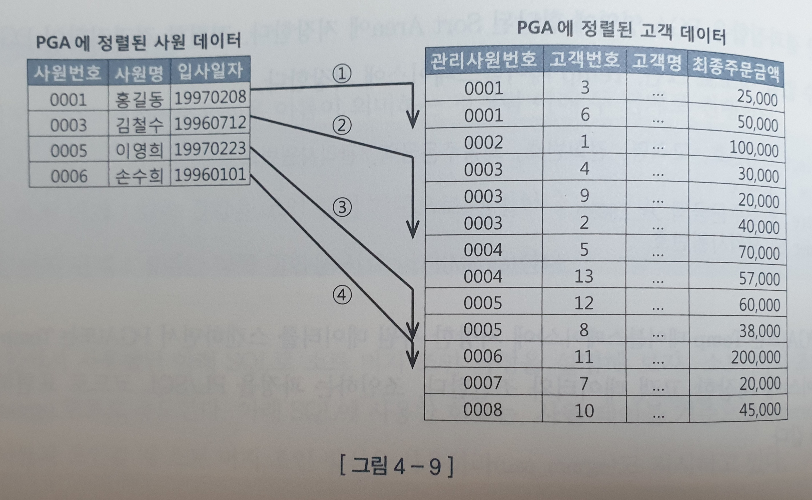

    - 예로, 관리사원번호 = '0003'인 레코드를 쉽게 찾을 수 있고, 스캔을 진행하다가 '0004'를 만나는 순간 멈출 수 있음.

- Sort Area에 저장한 데이터 자체가 인덱스 역할을 하므로, 소트 머지 조인은 조인 컬럼에 인덱스가 없어도 사용할 수 있음.

### 소트 머지 조인이 빠른 이유

- 소트 머지 조인은 Sort Area에 미리 정렬해 둔 자료구조를 이용한다는 점만 다를 뿐 조인 프로세싱 자체는 NL 조인과 같음.
- 그렇다면 대량 데이터 조인할 때 소트 머지 조인이 NL 조인보다 빠른 이유는?
- NL 조인은 '인덱스를 이용한 조인 방식'이기 때문에 조인 과정에서 액세스하는 모든 블록을 랜덤 액세스 방식으로 '건건이' DB 버퍼캐시를 경유해서 읽음. 즉, 인덱스든 테이블이든, 읽는 모든 블록에 래치 획득 및 캐시버퍼 체인 스캔 과정을 거침. 또한 버퍼캐시에서 찾지 못한 블록은 '건건이' 디스크에서 읽어 들임.
- 인덱스를 이용하기 때문에 인덱스 손인분기점 한계를 그대로 드러내고, 이것이 대량 데이터 조인에 NL 조인이 불리한 이유.
- 반면, 소트 머지 조인은 양쪽 테이블로부터 조인 대상 집합(조인 조건 이외 필터 조건을 만족하는 집합)을 '일괄적으로' 읽어 PGA(또는 Temp 테이블스페이스)에 저장한 후 조인함.
- 래치 획득 과정이 없는 PGA 영역을 사용하기 때문에, 소트 머지 조인이 대량 데이터 조인할 때 더 빠름.
- 추가로, 소트 머지 조인도 양쪽 테이블로부터 조인 대상 집합을 읽을 때는 DB 버퍼캐시를 경유하고 이 때 인덱스를 이용하기도 함. 이 과정에서 생기는 버퍼캐시 탐색 비용과 랜덤 액세스 부하는 소트 머지 조인도 피할 수 없음.

### 소트 머지 조인의 주용도

- 해시 조인의 등장으로 소트 머지 조인은 예전만큼 쓰이진 않음. 해시 조인이 대부분 더 빠르기 때문.
- 하지만 해시 조인은 조건식이 등치(=) 조건이 아닐 때 사용할 수 없다는 단점 존재.
- 그래서 소트 머지 조인은 아래와 같은 상황에 주로 사용됨 :
  - 조인 조건식이 등치(=) 조건이 아닌 대량 데이터 조인
  - 조인 조건식이 아예 없는 조인(Cross Join(카테시안 곱)).

### 소트 머지 조인 특징 요약

- 소트 머지 조인은 양쪽 집합을 정렬한 다음에는 NL 조인과 같은 방식으로 진행되지만, PGA 영역에 저장된 데이터를 이용하기 때문에 빠르다. 따라서 소트 부하만 감수한다면, 건건이 버퍼캐시를 경유하는 NL 조인보다 빠름.
- NL 조인은 조인 컬럼에 대한 인덱스 유무에 크게 영향을 받지만, 소트 머지 조인은 영향받지 않음.
- 양쪽 집합을 개별적으로 읽고 나서 조인을 시작하기 때문에, 조인 컬럼에 인덱스가 없는 상황에서 두 테이블을 각각 읽어 조인 대상 집합을 중리 수 있을 때 아주 유리.
- 스캔 위주의 액세스 방식을 사용한다는 점도 중요한 특징. 다만 양쪽 테이블로부터 조인 대상 집합을 읽을 때는 인덱스를 이용할 수 있고 그때는 랜덤 액세스가 일어남. 이는 해시 조인도 마찬가지.

## 3. Hash Join

- NL 조인은 인덱스를 이요한 조인 방식이라 인덱스 구성에 따른 성능 차이가 심하고, 또한 랜덤 액세스 때문에 대량 데이터 처리에 불리하며 버퍼캐시 히트율에 따라 들쭉날쭉한 성능을 보임.
- 소트 머지 조인, 해시 조인은 조인 과정에 인덱스 이용하지 않기 때문에 대량 데이터 조인할 때 NL 조인보다 훨씬 빠르고, 일정한 성능을 보임.
- 소트 머지 조인은 항상 양쪽 테이블을 정렬하는 부담이 있으나, 해시 조인은 그런 부담도 없음.

### Hash Join 기본 메커니즘

- 해시 조인은 아래 두 단계로 진행함.
  - 1 ) Build 단계 : 작은 쪽 테이블(Build Input)을 읽어 해시 테이블(해시 맵)을 생성한다.
  - 2 ) Probe 단계 : 큰 쪽 테이블(Probe Input)을 읽어 해시 테이블을 탐색하면서 조인한다.

<br>

- 해시 조인 수행과정 예시 :

  ```sql
  SELECT /*+ ordered use_hash(c) */
          e.사원번호
          ,e.사원명
          ,e.입사일자
          ,c.고객번호
          ,c.고객명
          ,c.전화번호
          ,c.최종주문금액
  FROM 사원 e
      ,고객 c
  WHERE c.관리사원번호 = e.사원번호
      AND e.입사일자 >= '19960101'
      AND e.부서코드 >= 'z123'
      AND e.최종주문금액 >= 20000
  ```

- 위 SQL 예시의 해시 조인 수행 과정을 풀어서 설명하면 아래와 같음.

  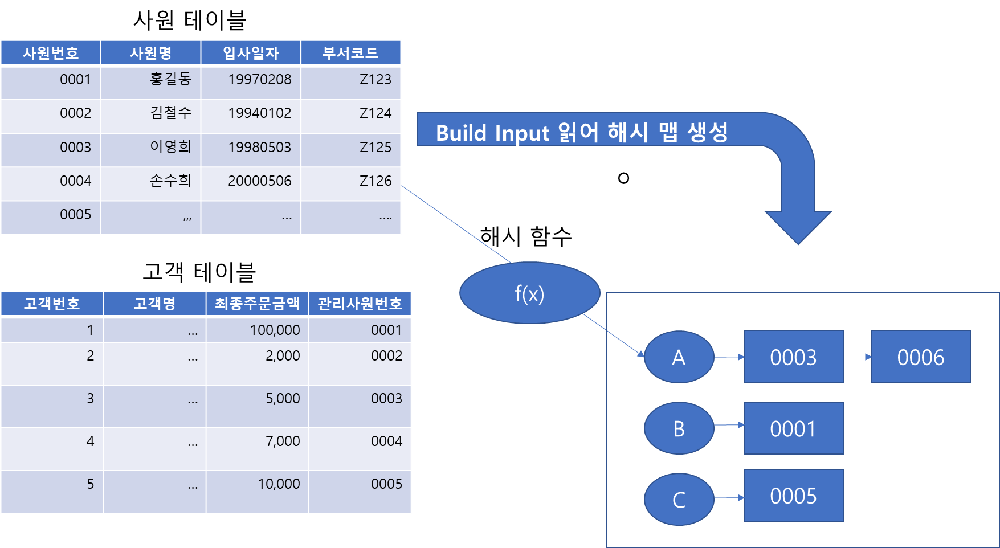

  - `Build 단계` : WHERE 조건에 해당하는 사원 데이터를 읽어 해시 테이블을 생성한다. 이때, 조인컬럼인 사원번호를 해시 테이블 키 값으로 사용한다. (사원번호를 해시 함수에 입력해서 반환된 값으로 해시 체인을 찾고, 그 해시 체인에 데이터 연결함.) 해시 테이블은 PGA 영역에 할당된 Hash Area에 저장한다. (해시 테이블이 너무 커 PGA에 담을 수 없으면, Temp 테이블스테이스에 저장.)
  - `Probe 단계` : WHERE 조건에 해당하는 고객 데이터를 하나씩 읽어 앞서 생성한 해시 테이블을 탐색한다. (관리사원번호를 해시 함수에 입력해서 반환된 값으로 해시 체인을 찾고, 그 해시 체인을 스캔해서 값이 같은 사원번호를 찾는다.) 값이 같은 사원번호를 찾으면 조인에 성공한 것이고, 못찾으면 실패한 것이다.
  - Probe 과정을 그림으로 표현하면 다음과 같음.

    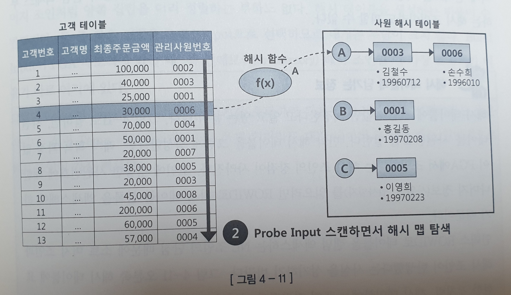

- 해시 조인도 실제 조인을 수행하는 Probe 단계는 NL 조인과 다르지 않음.

### 해시 조인이 빠른 이유

- 해시 조인은 Hash Area에 생선한 해시 테이블을 이용한다는 점만 다를 뿐 조인 프로세싱 자체는 NL 조인과 같음.
- 그런데도 대량 데이터 조인할 때 해시 조인이 NL 조인보다 빠른 이유는 소트 머지 조인이 빠른 이유와 동일. 해시 테이블을 PGA 영역에 할당하기 때문.
- 추가로, 해시 조인도 Build Input과 Probe Input 각 테이블을 읽을 때는 DB 버퍼캐시를 경유하고 이 때 인덱스를 이용하기도 함. 이 과정에서 생기는 버퍼캐시 탐색 비용과 랜덤 액세스 부하는 해시 조인도 피할 수 없음.

<br>

- 그렇다면 대량 데이터를 조인할 때 일반적으로 소트 머지 조인보다 해시 조인이 더 빠른 이유는?
- PGA에서 데이터를 탐색하는 알고리즘 차이도 있지만 그 효과는 미미하고, 두 조인 메소드의 성능 차이는 조인 오퍼레이션을 시작하기 전 사전 준비작업에서 기인함.
- 소트 머지 조인에서 사전 준비작업은 '양쪽' 집합(테이블)을 모두 정렬해서 PGA에 담는 작업임. PGA는 큰 메모리 공간이 아니므로 두 집ㅎ바 중 어느 하나가 중대형 이상이면 Temp 테이블 스페이스, 즉 디스크에 쓰는 작업을 반드시 수반함.
- 해시 조인에서 사전 준비작업은 양쪽 집합 중 어느 '한쪽'을 읽어 해시 맵을 만드는 작업. 해시 맵은 두 집합 중 작은 집합을 Build Input으로 선택해 해시 맵에 저장하므로, 두 집합 모두 Hash Area에 담을 수 없을 정도로 큰 경우가 아니면, Temp 테이블스페이스, 즉 디스크에 쓰는 작업은 전혀 일어나지 않음. (설령 Temp 테이블스페이스를 쓰게 되더라도 대량 데이터 조인할 때는 일반적으로 해시 조인이 가장 빠름.)
- 결론적으로 해시 조인은 NL 조인처럼 조인 과정에서 발생하는 랜덤 액세스 부하가 없고, 소트 머지 조인처럼 양쪽 집합을 미리 정렬하는 부하도 없음. 해시 테이블을 생성하는 비용이 추가되지만 둘 중 작은 집합을 Build Input으로 선택하므로 대개는 부담이 크지 않음.

## 조인 메소드 선택 기준

- 소량 데이터 조인할 때 -> NL 조인
- 대량 데이터 조인할 때 -> 해시 조인
- 대량 데이터 조인인데 해시 조인으로 처리할 수 없을 때, 즉 조인 조건식이 등치(=) 조건이 아닐때(조인 조건식이 아예 없는 카테시안 곱 포함) -> 소트 머지 조인
- 소량과 대량의 기준은, NL 조인 기준으로 최적화했는데도 랜덤 액세스가 많아 만족할만한 성능을 낼 수 없다면 대량 데이터 조인에 해당.
- 추가로, 수행빈도가 높은 소량 데이터 조인은 설령 해시 조인이 약간 더 빠르더라도 NL 조인을 선택하는 것이 좋음.
  - 이유 : NL 조인에 사용하는 인덱스는 영구적으로 유지하면서 다양한 쿼리를 위해 공유 및 재사용하는 자료구조. 반면, 해시 테이블은 단 하나의 쿼리를 위해 생성하고 조인이 끝나면 곧바로 소멸하는 자료구조. 같은 쿼리를 100개 프로세스가 동시에 수행하면, 해시 테이블도 100개가 만들어짐. 따라서 수행시간이 짧으면서 수행빈도가 매우 높은 쿼리를 해시 조인으로 처리하면 CPU와 메모리 사용률이 크게 증가함. 해시 맵을 만드는 과정에 여러가지 래치 경합도 발생함.
- 따라서 해시 조인은 아래 세 가지 조건을 만족하는 SQL문에 주로 사용함 :
  - 수행 빈도가 낮고,
  - 쿼리 수행 시간이 오래 걸리는,
  - 대량 데이터 조인할 때.
