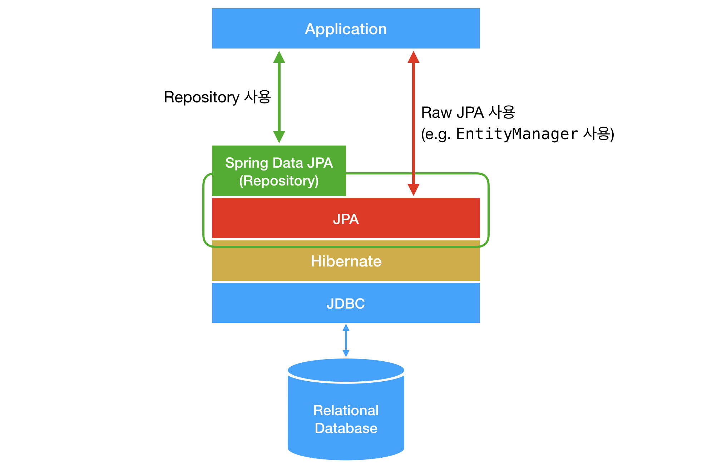

# ORM (Object-relational mapping)

## JDBC vs SQLMAPPER vs ORM

- 이들의 공통점은 `영속성(Persistance)`.

  - 영속성 :

    - 데이터를 생성한 프로그램의 실행이 종료되더라도 사라지지 않는 데이터의 특성. 영구히 저장되는 그 어떤 것.

      

      - (레이어드 아키텍쳐에서) 도메인 모델에서 나온 정보를 DB에 넣어야 할텐데, 어떤 과정을 거쳐서 데이터베이스에 저장을 시킬 것이냐 = 어떻게 영속성을 구현할 것이냐.

<br/>

- JDBC vs SQLMAPPER vs ORM :

  

  - Spring Data JDBC는 ORM이기도 하고 아니기도 함.

## JDBC(Java Database Connectivity) API

- Java 진영의 데이터베이스 연결 표준 인터페이스.
- 자바 클라이언트와 관계형 데이터베이스 서버와의 연동을 위한 메커니즘.

  

  - JAVA는 표준 인터페이스인 JDBC API를 제공하고, 실질적인 인터페이스의 메소드 기능들에 대한 실제 구현은 각 DBMS 제조사들이 자신들의 데이터베이스에 맞게 구현하여 제공하며, 이를 JDBC 드라이버라고 함.

<br/>

- JDBC 프로그래밍 절차 :

  

<br/>

- JDBC API의 불편한 점 :
  - 중복 코드가 많다.
  - 쿼리를 일일히 써야한다.
  - 커넥션 관리를 계속 해야한다.

<br/>

- SQL Mapper에서 JDBC API에서 불편했던 점들을 해소하는 기술을 제공하게 됨.

<br/>

## SQL Mapper

- 객체와 관계형 데이터베이스의 데이터를 개발자가 작성한 SQL로 매핑시켜주는 프레임워크.
- 개발자가 SQL을 직접 작성해야 하며 SQL문을 실행하고 얻은 데이터를 객체로 매핑시켜 줌.

<br/>

## 1. Spring JDBC

### Spring JDBC 구조


- DataSource(DB 주소, 아이디 패스워드 등 DB connection을 위한 설정 정보(configuration)들이 속성으로 설정되어 있음)를 주입시킨 jdbcTemplate 객체를 통해서 데이터를 꺼내옴.

<br/>

### Spring JDBC 사용 예시

**1 ) DataSource 설정**


- Spring JDBC를 사용하려면 먼저 DB Connection을 가져오는 DataSource를 Spring IoC 컨테이너의 공유 가능한 bean으로 등록해야 함.
- DB와의 연결을 위한 DB Server에 관한 정보를 property file에 설정함.
  - 설정 정보: url, driver, username, password
- 해당 property file에 있는 값을 속성으로 설정한 DataSource를 bean으로 등록함. (BasicDatSource는 DataSource 인터페이스 중 하나.)
- 생성된 DataSource bean은 id를 통해 나중에 Spring JDBC에 주입함.

**2 ) DAO에서의 처리 과정**


- Spring JDBC 접근 방법 중 하나인 JdbcTemplate 객체를 생성하여, 이 객체에 위에서 bean으로 등록한 DataSource를 setter parameter를 통해 주입함.
  - @Autowired에 의해 DataSource Type에 해당하는 id="dataSource"인 bean을 찾아서 주입함.
  - 여기서는 DataSource 인터페이스 중 하나인 BasicDataSource (위에서 등록한 bean)를 찾아서 주입하게 됨.
- JdbcTemplate 객체를 통해 CRUD API를 제공함.

  

  - SQL 문을 작성하고, RowMapper 인터페이스 구현을 통해 SQL의 결과를 객체에 매핑하여 결과를 리턴함.
  - Row Mapper는 ResultSet의 한 행이 한 인스턴스가 될 수 있게 매핑해줌.

<br/>

### Spring JDBC가 개발자 대신 해주는 것들


- Spring JDBC를 사용하면 어플리케이션 개발자는 연결에 대한 설정 정보는 제공해줘야 하지만, 연결을 오픈하는 것은 이후 Spring JDBC가 알아서 해주게 됨.
- 또한 애플리케이션 개발자가 SQL문 지정해주고 파라미터를 주면, 스테이트먼트 준비와 실행, 루프 설정, 예외 처리, 트랜잭션 제어, 연결 닫기 등을 Spring JDBC가 알아서 해주게 됨.
- 개발자 입장에서 불편했던 많은 것들을 추상화시켜놓았음.

<br/>

## 2. MyBatis

- MyBatis의 주 관심사는 Java 코드에서 SQL을 분리하는 것.
- 자바 코드에서 SQL을 쓰려고 String으로 넣어주고 하는 과정이 매우 불편하다. 따라서 쿼리를 Java에서 XML로 옮기게 됨.
- connection, statement 등의 복잡한 JDBC 코드나 ResultSet과 같이 결과값을 맵핑하는 객체를 하나도 쓰지 않고, 최대한 간단하게 XML로 관리를 하겠다.

<br/>

### MyBatis 구조


- 응용 프로그램 처음 시작 시, SqlSessionFactoryBuilder는 configuration file의 설정 기반으로 SqlSessionFactory를 생성.
- 클라이언트에서 요청이 들어올 때마다, 응용 프로그램은 SqlSessionFactory를 사용해 SqlSession을 생성하고, SqlSession에서 매퍼 인터페이스의 구현 개체를 가져옴. 가져온 매퍼 인터페이스의 구현 개체로 메서드를 호출하고, 매핑 파일에서 실행할 SQL을 가져와 SQL을 실행함.

<br/>

### MyBatis 사용 예시

- id와 name을 갖는 Crew라는 dto가 있다고 가정.

  

- DAO를 인터페이스로 만들고 XML을 다음과 같이 작성해줌.

  

  - DAO는 interface로 Spring JDBC보다 훨씬 간결해짐.
  - SQL 쿼리문을 xml에 따로 저정하고 쿼리를 자바 메소드와 매핑시킴으로써 Java 코드와 SQL 구문들을 완전히 분리함. (ex. selectAll 메서드를 호출하면 result를 반환할 것이고 쿼리는 SELECT \* FROM crews;)

- 실제 사용하는 단계에서의 코드는 아래와 같음.

  

  - SQLSession을 열고, 세션에 Mapper를 연결해줘서 dao 객체를 생성해줌.
  - 생성된 dao 객체를 통해 메서드를 호출하면, 자바단에서는 쿼리문 내용을 몰라도 XML에 다 맵핑되어 있기 때문에 간편하게 데이터를 가져오는 것이 가능.

<br/>

## ORM(Object Relational Mapping)

- JDBC API 너무 불편하고 코드 많다
  <br/>
  -> Spring JDBC 등장.
- Spring JDBC가 쿼리를 자바 상에서 관리하는 것이 불편하다
  <br/>
  -> MyBatis 등장.
- ORM은 객체지향적으로 구현되어 있는 구조를 관계형 데이터베이스와 연결하는 것을 간편하게 하기 위해 등장한 기술.

<br/>

- 만일 아래와 같은 dto에서 nickName이라는 필드가 추가된다면, SQL 구문도 모두 이에 맞춰 변경이 필요함.

  ```java
  public class Crew{
    private int id;
    private String name;
    // private String nickName; 추가

    ...
  }
  ```

  ```java
  String sql = "INSERT INTO CREW(CREW_ID, NAME, NICKNAME) VALUES(?,?,?)";
  ...
  pstmt.setString(3, crew.getNickName());
  ...
  ...
  String sql = "SELECT CREW_ID, NAME, NICKNAME   FROM CREW WHERE CREW_ID = ?";
  ```

  - 이런 문제는 SQLMAPPER를 사용한다고 해결되지 않고, 여전히 변경 작업을 수행해줘야 함.
  - 업데이트문에는 깜빡하고 nickName을 추가 안해줬다면 nickName이 비게되는 버그 발생 가능.

<br/>

- 또한 team이라는 객체 필드가 추가되게 된다면, 이를 관계형 데이터베이스에 저장하려면 team 자체를 가지고 있는 것은 불가능. 대신 team id를 외래키로 가지고 있는 것은 가능.

  ```java
  public class Crew{
    private int id;
    private String name;
    private Team team;

    ...
  }
  ```

- 자바는 객체 지향적으로 구현되어있는데, 관계형 데이터베이스와 엮어 사용하다보니 관계형 데이터베이스에서는 객체지향의 개념인 연관 관계(객체 참조), 상속 등을 그대로 표현하기 힘들어 패러다임의 불일치가 일어남.
- 따라서 객체지향을 사용하지 못하고 SQL에 의존적인 개발을 하게 됨.
- 이를 해결하기 위해 ORM이 등장.

<br/>

## 1. JPA(Java Persistence API) / Hibernate


- 표준 인터페이스인 JDBC API가 있고, 실질적인 인터페이스 구현은 각 DBMS 제조사들이 JDBC 드라이버로 구현해서 제공했던 것처럼, ORM에는 JPA라는 ORM 표준 인터페이스가 있고, 이를 구현한 Hibernate, EclipseLink, DataNucleus라는 구현체가 있음. (Hibernate가 가장 대표적인 구현체.)
- JDBC API를 사용하면서 JDBC 드라이버를 다른 것으로 간편하게 바꿔낄 수 있었던 것처럼 JPA도 구현체 변경 가능.

<br/>

### JPA 핵심 모델

- JPA의 핵심 모델은 EntityManager와 영속성 컨텍스트.

  

  - EntityManager가 위와 같은 여러 메서드들을 갖고 있음.
  - EntityManager는 말 그대로 Entity를 관리해주는 역할을 하는데(Hibernate에서는 Session으로 불림), JPA측에서는 Entity의 Context를 Detached, Managed, Removed, Transient 이렇게 4개로 분리함.
  - 어떤 새 entity 객체는 먼저 persist(entity) 메서드를 통해 영속성 컨텍스트에 올라오게 됨. entity 객체가 영속성 컨텍스트에 올라갔다는 것은 EntityManger가 해당 entity 객체를 계속 관리하겠다는 의미. (EntityManager가 여러 entity들을 영속성 컨텍스트에 들여보내고, 추적하고 싶지 않을 땐 잠시 내보내고 함.)
  - 영속성 컨텍스트에 올라간 상태에서 flush()가 호출되면 그 때 DB에 접근하며, 이 때 SQL이 생성되어 동작되게 됨.
  - 즉, 쿼리를 개발자가 직접 관리하지 않고 EntityManager에 맡기는 것.

<br/>

### Spring JPA의 핵심 Concepts

  

- Lazy Loading : 엔티티를 조회할 때 연관된 엔티티들이 항상 사용되는 것은 아님. 엔티티가 실제 사용될 때까지 데이터베이스 조회를 지연하는 방법이 lazy loading. 사용 상황에 알맞게 Proxy 객체를 사용해 필요한 정보만 가져옴.
- Dirty Checking : 해당 객체의 변경 사항만 관리하는 Concept. JPA에서는 트랜잭션이 끝나는 시점에 변화가 있는 모든 엔티티 객체를 데이터베이스에 자동으로 반영해줌.
- Caching : DB의 Connection을 최소화해 효율적으로 사용할 수 있도록 가능하면 Cache를 사용하는 Concept.

<br/>

### JPA의 특징

- 장점 :

  - JPA는 SQL을 직접 사용하지 않아도 메서드 호출만으로 쿼리가 수행됨.
  - 테이블 컬럼이 변경되었을 경우,
    Mybatis에서는 관련 DAO의 파라미터, 결과, SQL 등을 모두 확인하여 수정해야 하지만
    JPA는 JPA가 이런 일들을 대신 해줌.
  - 로직을 쿼리에 집중하기 보다 객체 자체에 집중할 수 있음.

- 단점 :
  - 메소드 호출로 SQL을 실행하기 때문에 세밀함이 떨어질 수 있음.
  - 또한 객체간의 매핑 (Entity Mapping)이 잘못되거나 JPA를 잘못 사용하여 의도하지 않은 동작을 할 수도 있음.

<br/>

## 2. Spring Data JPA

- Spring Data 진영에서 만든 JPA
- Core Concept로 Repository를 제안.
- JPA가 사용하는 EntityManager가 복잡하기 때문에 Spring에서 JPA를 한 단계 추상화시킨 Repository라는 인터페이스를 제공.

  

  

- 위처럼 interface 형태로 Repository를 제공해 개발자는 이를 가져다 사용하는데, Repository 인터페이스의 기본 구현체인 SimpleJpaRepository의 내부 구조를 살펴보면 아래와 같음.

  

  - 이와 같이 Repository 안을 뜯어보면 EntityManager를 멤버변수로 갖고 있음을 볼 수 있음.
  - 개발자는 겉에서 findById() 메서드를 사용했을 뿐인데, 사실은 그 안에서는 EntityManager가 em.find()를 실행해주고 있었다는 것.

<br/>

- JPA vs Spring Data JPA :
  

<br/>

### Spring Data JPA의 특징

- 데이터 접근 계층을 개발할 때 구현 클래스 없이 인터페이스만 작성해도 개발을 완료할 수 있음.
- 사용자가 인터페이스만 작성하면 Spring Data JPA이 알아서 애플리케이션 실행 시점에 구현체를 동적으로 생성해서 Bean으로 등록해줌.
- 따라서 개발자가 직접 구현 클래스를 개발하지 않아도 되고, 인터페이스만 만들고 그걸 의존성 주입 받아서 사용하면 됨.
- 예시 :

  ```java
  public interface MemberRepository extends JpaRepository<Member, Long> {
    Member findByUsername(String username);
  }

  public interface ItemRepository extends JpaRepository<Item, Long> {
    ...
  }
  ```

  - 회원과 상품 리포지토리 구현체는 애플리케이션 실행 시점에 스프링 데이터 JPA 가 생성해서 주입해줌.

<br/>

## 3. Spring Data JDBC

- Spring Data JPA가 가진 복잡한 부분을 많이 덜어내어 가볍게 DB를 조회하는 것에 초점을 둔 라이브러리.
- EntityManager, lazy loading, dirty checking, caching 이런 것 쓰지말고 심플하게 접근 & DDD(Domain-Driven Design) 구조로 DB에 접근하는 방법을 고안해 냈고, 이것이 Spring Data JDBC.
- ORM은 ORM인데 특정 구조를 따르는 ORM이다. 때문에 ORM이라고 하기엔 살짝 애매함.
- Spring Data JDBC a Simple, Limited Opinionated ORM.
- 그렇기 때문에 Spring Data JDBC는 Hibernate와 같은 구현체 사용하지 않고 JDBC API를 그대로 스스로 구현함.

  

- Spring Data JDBC에도 Repository 개념 존재.
