# 정규화

### 정규화(Normalization)

- 정규화 : 데이터 중복을 해소하기 위해서 릴레이션을 분해하는 과정.
- 불필요한 데이터 중복으로 인해 이상 현상이 발생할 수 있음.

  - 이상 현상 :

    - 삽입 이상 : 데이터를 삽입하기 위해 불필요한 데이터도 함께 삽입해야 하는 문제.
    - 갱신 이상 : 중복 튜플 중 일부만 변경하여 데이터가 불일치하게 되는 문제.
    - 삭제 이상 : 하나의 자료만 삭제하고 싶지만, 그 자료가 포함된 튜플 전체가 삭제됨으로 원하지 않는 정보 손실이 발생하는 문제.
    - 예시)

      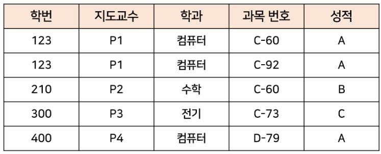

      - 삽입 이상 : 강의를 수강하지 않은 학생을 추가할 때, 학번, 지도교수, 학과만으론 삽입 불가능하며, 과목 번호와 성적에 null값이 들어가거나 불필요한 데이터를 추가해야 삽입 가능.
      - 갱신 이상 : 학번이 123인 학생의 지도교수가 P2로 바뀌면, 해당 학생 관련 모든 행에서의 지도교수를 변경시켜주어야 하고, 그렇지 않으면 데이터가 불일치하게 됨.
      - 삭제 이상 : 학번이 300인 학생이 과목 수강을 취소하면 과목 번호 C-73인 강의에 대한 정보도 삭제됨.

- 제1정규형 ~ 제5정규형, BCNF가 실묵적으로 활용되며 나머지는 연구용
- 정규화는 논리적 설계 단계에서 수행.
- 정규형들의 관계 :

  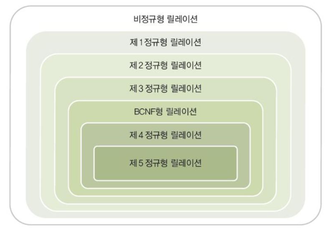

### 정규화 요약

|  정규화   | 설명                                                                    |
| :-------: | :---------------------------------------------------------------------- |
| 제1정규형 | 원자값이 아닌 도메인을 분해 - 중복되는 속성이 원자값을 가질 때까지 분해 |
| 제2정규형 | 부분함수 종속성 제거                                                    |
| 제3정규형 | 이행함수 종속성 제거                                                    |
|   BCNF    | 결정자가 후보키가 아닌 함수 종속성 제거                                 |
| 제4정규형 | 다중 종속성 제거                                                        |
| 제5정규형 | 후보키를 통하지 않은 조인 종속성 제거                                   |

### 제1정규형 (First Normal Form : 1NF)

- 릴레이션(테이블)에 속한 모든 도메인이 더 이상 분해되지 않는 원자값으로만 구성되고, 튜플의 모든 속성(컬럼)이 도메인에 속하는 하나의 값을 가지는 정규형.

  1. 릴레이션에 속한 모든 도메인이 원자값만으로 되어 있어야 함.
  2. 모든 속성(attribute)에 반복되는 그룹이 나타나지 않아야 함.
  3. 기본 키를 사용하여 각 튜플을 고유하게 식별할 수 있어야 함.
       

- 즉, 복합 속성(composite attribute), 다중값 속성(multivalue attribute), 중첩 릴레이션(nested relation) 등 비원자적인 속성들을 허용하지 않는 릴레이션 형태를 말함.
- 예시 :

  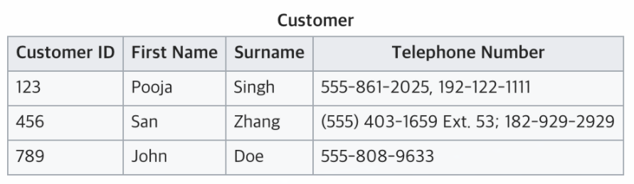

  - Telephone Number가 다중값 가지므로 1번 조건 위반.

   

  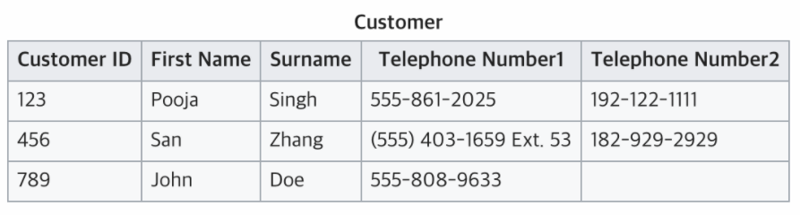

  - 그룹이 반복되므로 2번 조건 위반.

   

  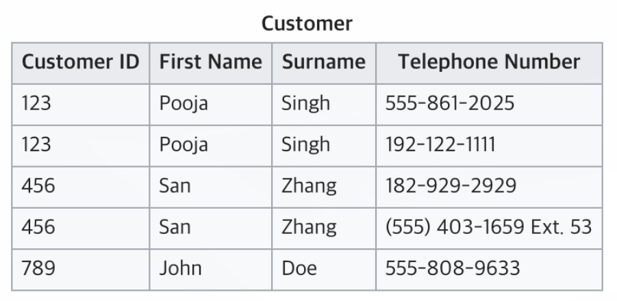

  - CustomerId로 각 행을 고유하게 식별 불가능하므로 3번 조건 위반.

   

  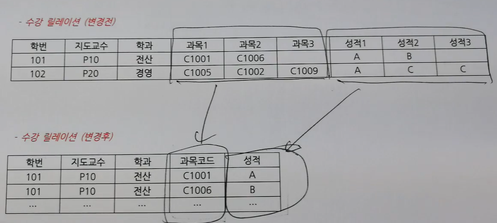

### 정규화의 기본적 이해 (제2정규형, 제3정규형, BCNF)

- 릴레이션 R이 있고, R은 속성 A, B, C, D, E, F로 구성되며, R의 기본키 집합이 {A,B} (복합기본키)라고 가정.
- 데이터 중복을 해소한다는 것은 기본키를 중심으로 레코드가 구분되게 되는 것이고, 결국 속성 C, D, E, F가 모두 기본키 집합인 {A,B}에 종속되게 된다면, 기본키를 중심으로 모든 레코드가 구분되게 되어 정규화가 완료됨.
  - 함수 종속 :
    - "Y가 X에 함수적으로 종속되어 있다" (X->Y) = 릴레이션 내의 모든 튜플을 대상으로 하나의 X값에 대한 Y값이 항상 하나인 경우를 의미.
- 기본키 집합에 종속되지 않는 속성이 존재하게 되면서, 이 때문에 데이터 중복이 발생하게 되는 것.
- 예시1(2NF) :

  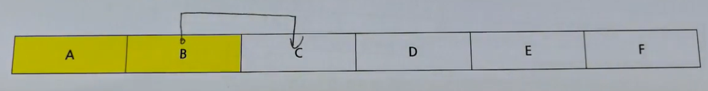

  - C라는 속성이 (기본키 집합 {A, B}의 전체 집합에 종속되야됨에도 불구하고) 부분집합인 {B}에만 종속된다고 가정.
  - 이 때, B를 결정자라고 부르고, C를 종속자라고 부름. (B->C : B는 C를 결정한다. C는 B에 종속된다.) 표기법은 B->C이며, B->C와 같은 것을 함수 종속관계라고 표현함.
  - 기본키의 부분집합으로부터 종속되는 것이므로 이를 `부분함수 종속성`이라고 함.
  - 이런 부분함수 종속성을 모두 제거한 것이 바로 `제2정규형(2NF)`.
  - 부분함수 종속성을 제거하는 방법은 먼저 결정자와 종속자를 다른 테이블로 분리하고, 원래 테이블에는 종속자를 제거하고 결정자인 B만 남긴다. 결과적으로 원래 테이블에는 A, B, D, E, F만 남게되고, B와 C가 있는 새 테이블이 생기게됨.

    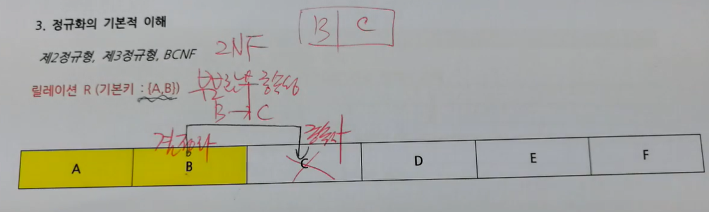

  - 결정자를 남기는 이유는 나중에 조인을 통해서 데이터를 가지고 올 수 있어야하기 때문.

- 예시2(3NF) :

  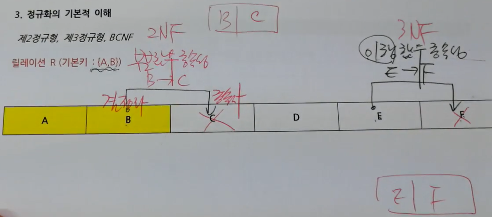

  - F라는 속성이 (기본키 집합 {A, B}에 종속되야됨에도 불구하고) E에 종속된다고 가정.
  - E를 결정자, F를 종속자라고 부름. (E->F)
  - 기본키가 아닌 일반속성이 일반속성에게 종속되는 것이므로 이를 `이행함수 종속성`이라고 함.
  - 이런 이행함수 종속성을 모두 제거한 것이 바로 `제3정규형(3NF)`.
  - 이행함수 종속성을 제거하는 방법은 부분함수 종속성을 제거하는 방법과 비슷. 먼저 결정자와 종속자를 다른 테이블로 분리하고, 원래 테이블에는 종속자를 제거하고 결정자인 E만 남긴다. 결과적으로 원래 테이블에는 A, B, C, D, E만 남게되고, E와 F가 있는 새 테이블이 생기게됨.

- 예시3(BCNF) :

  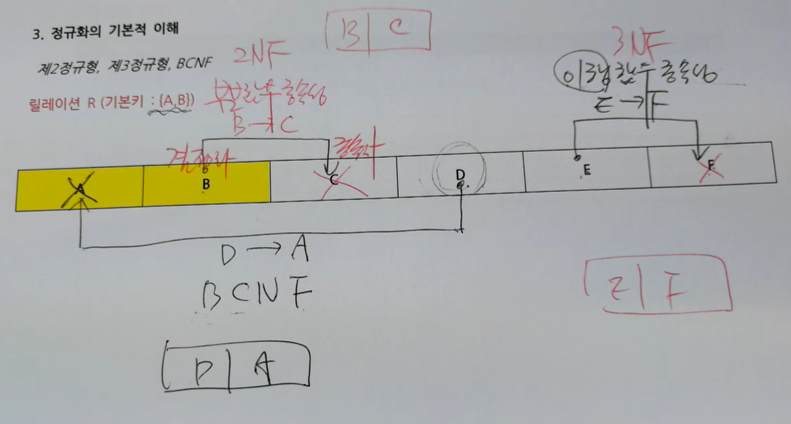

  - A라는 속성이 D에 종속된다고 가정.
  - D를 결정자, A를 종속자라고 부름. (D->A)
  - 결정자가 후보키가 아닌 일반속성이면서 종속자가 기본키 또는 기본키의 부분집합(후보키)인 경우엔 BCNF 정규화의 대상이됨.
  - `BCNF`는 제3정규형을 만족하면서 모든 결정자가 후보키 집합에 속한 정규형.
  - 따라서 후보키 집합에 속하지 않은 (일반속성인) 결정자가 후보키 집합에 속하지 않은 (일반속성인) 종속자를 갖는 경우는 이행함수 종속성이므로 제외되고, 후보키 집합에 속하지 않은 결정자가 후보키 집합에 속한 종속자를 갖는 경우만 BCNF 정규화의 대상이됨.
  - BCNF 정규화 과정도 2NF, 3NF 정규화 과정과 비슷. 먼저 결정자와 종속자를 다른 테이블로 분리하고, 원래 테이블에는 종속자를 제거하고 결정자인 D만 남긴다.
  - 원래 테이블의 기본키가 복합 기본키에서 단일 기본키로 변하게 되므로, 바뀐 새 기본키에 나머지 속성들이 다 종속되는지는 또다시 확인해봐야 한다는 점이 다른 정규화와 다른 점.

### 제2정규형 (2NF)

- 제1정규형을 만족하면서, 테이블의 모든 속성이 기본키에 대해서 완전 함수적 종속을 만족하는 정규형.
- 부분함수 종속성을 모두 제거해야함. 따라서 기본키 집합에 완전 함수적 종속되지 않고 기본키의 부분집합에 종속되는 속성을 분해한다.
- 예시 :

  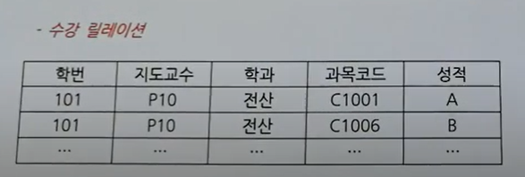

  - 위의 테이블에서 {학번, 과목코드}가 기본키 집합이라고 가정.
  - 지도교수, 학과는 {학번, 과목코드}에도 종속되지만 {학번}에도 종속되는 속성들. 따라서 부분함수 종속 관계가 존재하므로 이를 제거.

    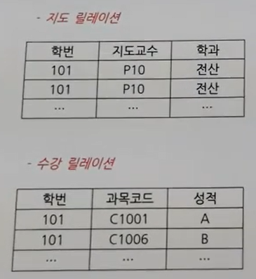

    - 원래 테이블에서 종속자인 지도교수, 학과는 제거하고 결정자인 학번만 남김.
    - 학번, 지도교수, 학과를 다른 테이블로 분리.

### 제3정규형 (3NF)

- 제2정규형을 만족하면서, 어떠한 일반 속성(후보키가 아닌 속성)도 기본키에 대해서 이행적으로 종속되지 않은 정규형. (어떠한 일반 속성도 다른 일반 속성에 종속되지 않은 정규형)
  - 이행 함수적 종속이란 X->Y, Y->Z의 경우에 의해서 추론될 수 있는 X->Z의 종속관계를 말함.   
- 기본키 집합에 종속되지 않고, 일반 속성에 종속되는 속성을 분해.
- 예시 :

  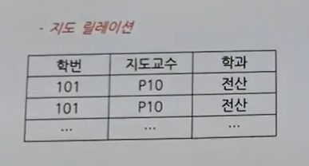

  - 위 테이블에서 학번이 기본키.
  - 학번 -> 지도교수, 학번 -> 학과.
  - 학과는 지도교수에도 종속됨. (지도교수 -> 학과) 학과와 지도교수 모두 일반속성이므로 이행함수 종속 관계 존재하며 이를 제거해야 함.

    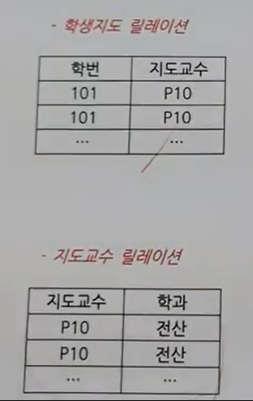

    - 원래 테이블에서 종속자인 학과는 제거하고 결정자인 지도교수만 남김.
    - 지도교수, 학과를 다른 테이블로 분리.

### BCNF (Boyce-Codd Normal Form)

- 제3정규형을 만족하면서, 모든 결정자가 후보키 집합에 속한 정규형.
- 일반 속성인 (후보키 집합에 속하지 않은) 결정자가 후보키 집합에 속한 종속자를 갖는 관계를 제거해야 함.
- 예시 :

  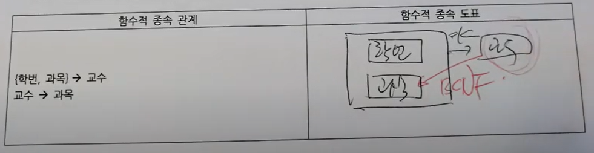

  - {학번, 과목}이 기본키 집합.
  - 일반 속성인 교수가 결정자, 후보키 집합에 속한 속성인 과목이 종속자가 되는 관계가 존재 (교수 -> 과목). 따라서 BCNF 정규화의 대상이 됨.

    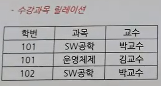
    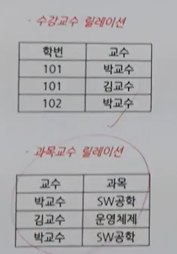

    - 원래 테이블에서 종속자인 과목은 제거하고 결정자인 교수만 남김.
    - 교수, 과목을 다른 테이블로 분리.

### 제4정규형 (4NF)

- BCNF를 만족한 상태에서, 다치 종속을 제거하면 제4정규형을 만족.
- 다치 종속 (Multi-valued Dependency) :
  - 같은 테이블 내의 독립적인 두 개 이상의 컬럼이 또 다른 컬럼에 종속되는 것을 말한다.
  - 즉, A → B 인 의존성에서 단일 값 A와 다중 값 B가 존재한다면 다치 종속이라고 할 수 있다. 이러한 종속을 A ↠ B 로 표기한다. (다치 종속은 이중 화살표(double arrow) ↠ 로 표기한다.)
  - 다치 종속은 최소 2개의 컬럼이 다른 컬럼에 종속되어야 하기 때문에 최소 3개의 컬럼이 필요.
- 예시 :

  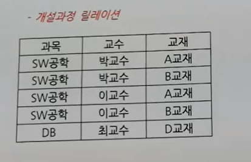

  - 과목과 교수의 관계가 1:N, 교수와 교재의 관계가 1:N.
  - 중심이 되는 속성(기본키) 중심으로 분해하면 됨. 과목과 교수를 분해하고, 과목과 교재를 분해하면 됨.

    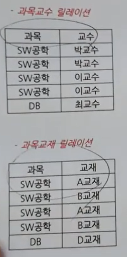

### 제5정규형 (5NF)

- 4NF를 만족한 상태에서, 명백하지 않거나 암시적이지 않은 모든 결합 종속성을 제거하면 제5정규형을 만족.
- 이 이상은 릴레이션을 분해해도 의미가 없음.
