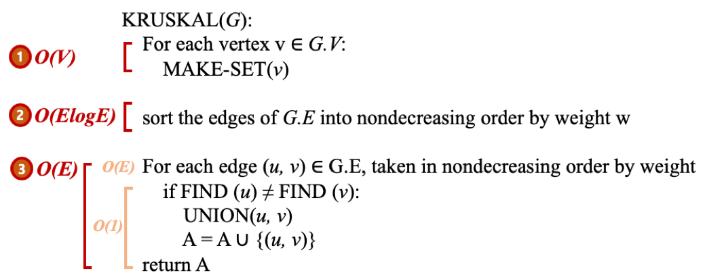

## Kruskal 알고리즘

### Kruskal 알고리즘이란
탐욕적인 방법(greedy method) 을 이용하여 그래프상에 존재하는 모든 노드들을 최소비용으로 연결시키는 (MST(최소 비용 신장 트리)를 완성하는) 알고리즘.

<br/>

- 탐욕적인 방법 (그리디)
    - 결정을 해야 할 때마다 그 순간에 가장 좋다고 생각되는 것을 선택함으로써 최종적인 해답에 도달하는 것.
    - 탐욕적인 방법은 그 순간에는 최적이지만, 전체적인 관점에서 최적이라는 보장이 없기 때문에 반드시 검증해야 함.
    - 다행히 Kruskal 알고리즘은 최적의 해답을 주는 것으로 증명되어 있음.

<br/>

### Kruskal 알고리즘의 동작 과정
1. 그래프의 간선들을 간선의 가중치를 기준으로 오름차순으로 정렬하여 리스트에 저장한다.
2. 정렬된 간선 리스트에서 순서대로 사이클을 형성하지 않는 간선을 선택한다.
    - 가장 낮은 가중치를 가진 간선을 먼저 선택함.
    - 사이클을 형성하는 간선을 제외함.
3. 해당 간선을 현재의 MST(최소 비용 신장 트리)의 집합에 추가한다.

### Kruskal 알고리즘의 동작 과정 예시
- 간선 선택을 기반으로 하는 알고리즘.
- 이전 단계에서 만들어진 신장 트리와는 상관없이 무조건 최소 간선만을 선택하는 방법
- 사이클 생성 여부를 확인(= 추가하고자 하는 간선의 양끝 정점이 같은 집합에 속해 있는지를 검사 = find)하고 해당 간선을 현재의 MST 집합에 추가(union)하는 과정에서 유니온-파인드 알고리즘 이용함.


## 유니온 파인드 알고리즘
- Disjoint Set(서로소 집합)을 표현할 때 사용하는 알고리즘.
    - Disjoint Set : 서로 중복되지 않는 부분 집합들로 나눠진 원소들에 대한 정보를 저장하고 조작하는 자료구조. 즉, 공통 원소가 없는, 즉 “상호 배타적” 인 부분 집합들로 나눠진 원소들에 대한 자료구조임.
- Kruskal's Algorithm 구현을 위한 핵심 자료구조.

<br/>

1. find() : 노드 x가 어느 집합에 포함되어 있는지 찾는 연산. 집합의 루트노드를 반환.
2. union() : 노드 x가 포함된 집합과 노드 y가 포함된 집합을 합치는 연산

<br/>

### 구현 방법
```java
static int[] parent;
public int find(int v){
    if(parent[v]==v) return v;
    else return find(parent[v]);
}
public void union(int v1, int v2){
    v1=find(v1);
    v2=find(v2);
    if(v1!=v2) parent[v2]=v1; //같은 집합이 아닐 경우에만 합집합시킴.
}
```
1) 각 집합은 하나의 루트노드를 갖는 트리로 구성됨. parent[i]를 i 노드가 속한 집합의 부모 노드(i노드의 부모노드일 수도 있고 i노드가 속한 집합의 루트노드일 수도 있음)라고 정의하고 초기화 함. parent[i] = i 인 경우, i가 자신이 속한 집합의 루트노드임을 의미함. 처음에는 병합을 하지 않았기 때문에 각 요소들이 서로 각각의 집합에 속함. (p[1]=1, p[2]=2, p[3]=3, ..)
    

2) find() : parent[v]==v 라면 부모노드가 자기자신, 즉 본인이 루트노드라는 의미. 따라서 이 자체를 그대로 return해줌. 그렇지 않다면 재귀적으로 루트를 찾아 반환해줌.

3) union() : find를 통해 두 노드가 속한 각 집합의 root를 찾아준 후, 두 집합의 root가 다른 경우(=다른 집합일 경우) 두 집합을 합쳐줌. 위의 코드예시에선 v2가 속한 집합의 루트노드를 v1으로 바꿔줘서, v2의 집합을 v1의 집합에 합쳐주고 있음. 이 합쳐주는 과정에서 v2의 집합의 루트노드가 v1으로 바뀌지만, v2의 집합에 속해있어 v2가 루트노드였던 다른 노드들은 여전히 parent 배열에 v2를 저장하고 있게 됨. 이 때문에 parent[i]가 i노드의 부모노드일 수도 있고 i노드가 속한 집합의 루트노드일 수도 있다고 했던 것.

### 개선 방법
```java
static int[] parent;
public int find(int v){
    if(parent[v]<0) return v; //Weighted Union Find
    else return parent[v]=find(parent[v]); //Path Compression
}
public void union(int v1, int v2){
    v1=find(v1);
    v2=find(v2);
    if(v1!=v2){ //같은 집합이 아닐 경우에만 합집합시킴.
        //Weighted Union Find
        if(parent[v1]<parent[v2]) parent[v2]=v1; //루트가 v1인 집합이 높이(레벨)가 더 높은 트리일 경우. (작은 트리가 큰 트리로 들어가면 높이는 변하지 않음)
        else if(parent[v1]>parent[v2]) parent[v1]=v2; //루트가 v2인 집합이 높이(레벨)가 더 높은 트리일 경우. (작은 트리가 큰 트리로 들어가면 높이는 변하지 않음)
        else{ //두 트리의 레벨이 같다면,
            parent[v1]--; //루트가 v1인 트리쪽으로 합쳐, 해당 트리의 레벨이 1 증가
            parent[v2]=v1;
        }
    }
}
```

1) Path Compression(경로 압축) :
- Find() 메서드에서 가능한 개선법
    
- find() 구현시 노드를 위로 쭉 따라가 루트노드를 찾아 이를 리턴하기만 한다면, 한 쪽으로만 tree가 치우져진 경우 find 함수가 루트노드를 찾는데 O(N)의 시간복잡도가 걸려 tree로 구현하는 이점이 사라짐. 따라서 루트노드를 찾았으면 이전까지 타고 온 노드들의 부모를 모두 루트노드로 바꿔주도록 parent[v]에 저장하는 코드를 추가해 직통으로 루트노드로 가도록하면 find의 효율을 O(1)로 개선해줄 수 있음.

<br/>

2) Weighted Union Find : 
- Union()과 Find() 메서드에서 가능한 개선법
    
- 높이(레벨)가 더 높은 트리가 높이가 낮은 트리 밑으로 들어가게 되면 트리가 점점 깊어질 위험이 있음. 따라서 두 집합을 union할 때 트리의 높이가 낮은 트리가 높은 트리 밑으로 들어가야 효율적인데, 이를 위해서는 트리의 높이를 기록해두어야 함. 트리의 높이를 기억하는 rank 라는 배열을 따로 선언해주게 되면, parent 배열도 rank 배열도 존재하여 메모리를 두 배로 사용하게 됨. 부모를 나타내는 배열, 트리의 높이를 나타내는 배열 둘 다를 쓰는 것은 메모리적으로 낭비이므로, 따라서 parent 배열 하나로 부모노드 저장도 하고 트리의 높이도 기억하도록 코드를 수정해줌. 
    - parent[x] 값이 음수이면, x는 루트 노드이고, parent[x]의 절댓값이 트리의 높이(레벨).
    - parent[x] 값이 양수이면, 원래처럼 x는 자식 노드이고, parent[x]의 값이 부모 노드. (예로, parent[2] = -3 일 경우 2번노드는 루트 노드이고, 2번 노드 밑에 두 개의 레벨이 더 있어서 2번이 속한 집합(트리)에 총 3개의 레벨이 존재한다는 의미이고, parent[3] = 5 일 경우에는 3번 노드의 부모가 5번 노드라는 의미.)
- parent 배열의 값은 모두 -1로 초기화해줌(처음엔 각 노드가 루트노드이고 레벨은 한층이므로). 
- find()는 parent[v]<0 이하일 때 v는 루트노드이므로 v를 리턴하게 수정 
- union()은 루트노드의 parent 배열 값 비교하여 높이가 낮은 트리가 높이가 높은 트리 밑으로 들어가도록 수정해줌. 높이가 낮은 트리가 큰 트리로 들어가면 큰 트리의 높이는 변하지 않으며, 두 트리의 레벨이 같을 경우에만 트리의 레벨이 1 증가하게 되므로, 레벨이 같을 때만 parent에 저장된 레벨 값을 변경해줌. parent값이 모두 음수일 경우, parent 값이 더 작은 경우가 더 높이가 높은 트리임.

## 개선된 유니온 파인드 알고리즘을 사용한 Kruskal 알고리즘의 구현

### Kruskal MST(최소스패닝트리) 알고리즘 : (ArrayList<Edge> + sort() + 유니언파인드)
그래프상에 존재하는 모든 노드들을 최소비용으로 연결시키는 알고리즘. 간선들을 간선의 가중치 값을 기준으로 오름차순 정렬한 후, 앞에서부터 간선을 선택해 그려나감(최소스패닝트리이므로 오름차순). 단, 선택한 간선에 의해 사이클이 만들어지는 경우에는 해당 간선을 선택하지 않음. 정렬한 간선 목록을 끝까지 돌게 되면 알고리즘 끝남. 정점이 n개일 때, n-1개의 간선이 선택되면서 MST가 완성됨.
	
유니언 파인드 알고리즘을 사용하며, 연결리스트 사용 안 하고 간선들을 Edge 클래스에 집어넣어 sort()한 후 앞에서부터 선택해나감. 이미 연결된 두 정점(=같은 집합인 두 정점)을 연결하면 무조건 사이클이 생기기 때문에, Find 함수 이용하여 해당 간선의 두 정점이 같은 집합에 포함된 정점이면 그 간선은 그리지 않고, 다른 집합에 포함된 정점일 경우에만 해당 간선 선택하여 간선의 양끝 정점을 Union(합집함)함.

```java
import java.util.*;
class Solution {
    class Edge implements Comparable<Edge>{ //간선 클래스
        int v1, v2, w;
        public Edge(int v1, int v2, int w){
            this.v1 = v1;
            this.v2 = v2;
            this.w = w; //간선의 cost
        }
        @Override
        public int compareTo(Edge o){ //간선의 cost로 오름차순 정렬
            return this.w-o.w;
        }
    }
    
    int[] parent;
    
    public int find(int v){ //노드 v가 어느 집합에 포함되어 있는지 찾는 연산. 집합의 루트노드를 반환.
        if(parent[v]<0) return v; //parent[v]<0이하일 때 v는 루트노드이므로 v를 리턴
        else return parent[v] = find(parent[v]); //본인이 루트노드가 아니라면 재귀적으로 루트를 찾아 반환해줌. 루트노드를 찾았으면 이전까지 타고 온 노드들의 부모를 모두 루트노드로 바꿔주도록 parent[v]에 저장하는 코드를 추가해 직통으로 루트노드로 가도록 해줌.(경로 압축)
    }
    
    public void union(int v1, int v2){ //노드 v1가 포함된 집합과 노드 v2가 포함된 집합을 합치는 연산
        v1 = find(v1);
        v2 = find(v2);
        if(v1!=v2){ //같은 집합이 아닐 경우에만 합집합시킴.
            if(parent[v1]<parent[v2]) parent[v2] = v1; //루트가 v1인 집합이 높이(레벨)가 더 높은 트리일 경우. (작은 트리가 큰 트리로 들어가면 높이는 변하지 않음)
            else if(parent[v1]>parent[v2]) parent[v1]=v2; //루트가 v2인 집합이 높이(레벨)가 더 높은 트리일 경우. (작은 트리가 큰 트리로 들어가면 높이는 변하지 않음)
            else{ //두 트리의 레벨이 같다면,
                parent[v1]--; //루트가 v1인 트리쪽으로 합쳐, 해당 트리의 레벨이 1 증가
                parent[v2] = v1;
            }
        }
    }
    
    public int solution(int n, int[][] costs) {
        parent = new int[n]; //0 ~ n-1 정점 수만큼 크기 생성
        Arrays.fill(parent, -1); //parent 배열의 값은 모두 -1로 초기화해줌(처음엔 각 노드가 루트노드이고 레벨은 한층이므로)
        ArrayList<Edge> edgeList = new ArrayList<>(); //간선들을 집어넣을 ArrayList
        for(int i=0; i<costs.length; i++){
            edgeList.add(new Edge(costs[i][0], costs[i][1], costs[i][2])); //간선들을 모두 집어넣음
        }
        int answer = 0; //최소 비용 저장할 변수 answer. (그래프상에 존재하는 모든 노드들을 최소비용으로 연결)
        Collections.sort(edgeList); //간선들을 간선의 가중치 값을 기준으로 오름차순 정렬한 후, 앞에서부터 간선을 선택해 그려나감
        for(Edge e : edgeList){
            if(find(e.v1)!=find(e.v2)){ //선택한 간선에 의해 사이클이 만들어지지 않는 경우에만 해당 간선을 선택. 이미 연결된 두 정점(=같은 집합인 두 정점)을 연결하면 무조건 사이클이 생기기 때문에, Find 함수 이용하여 해당 간선의 두 정점이 같은 집합에 포함된 정점이면 그 간선은 그리지 않고, 다른 집합에 포함된 정점일 경우에만 해당 간선 선택해 Union함
                answer+=e.w; //해당 간선 선택한 것이므로 최소 비용 누적
                union(e.v1, e.v2); //두 정점 연결함
            }
        }
        return answer; //answer(최소 비용) 리턴
    }
}
```

## Kruskal vs Prim

- Kruskal의 알고리즘은 간선을 기반으로 하는 알고리즘인 반면, Prim 알고리즘은 정점을 기반으로 하는 알고리즘임. 
- 또한 Kruskal의 알고리즘은 이전 단계에서 만들어진 신장 트리와는 상관없이 무조건 최저 간선만을 선택하는 방법. Prim의 알고리즘은 이전 단계에서 만들어진 신장 트리를 확장하는 방식.
- 또한, 크루스칼은 정점 2개로 이루어진 간선을 기반으로 하는 알고리즘이여서 chk배열 대신 유니언 파인드 알고리즘을 사용해 사이클을 방지하며, 프림은 정점을 기반으로 하는 알고리즘이기 때문에 chk 배열 사용하여 사이클 방지하는 것이 가능하여 chk 배열 사용함(이전에 선택된 전적있는 정점이면 chk배열값이 1).
- 크루스칼의 시간 복잡도는 O(ElogE), 프림의 시간 복잡도는 O(ElogV).
    
    - union-find 알고리즘을 이용하면 Kruskal 알고리즘의 시간 복잡도는 간선들을 정렬하는 시간에 좌우됨.
    - 간선 E개를 퀵 정렬과 같은 효율적인 알고리즘으로 정렬한다면 Kruskal 알고리즘의 시간 복잡도는 O(ElogE) 이 된다.
- 크루스칼 알고리즘은 간선을 기준으로 MST를 생성한다고 하였음. 따라서 간선의 갯수가 적은 희소 그래프(Sparse Graph)에는 크루스칼 알고리즘이 적합함. 프림 알고리즘은 노드(정점)을 기준으로 MST를 생성하기 때문에, 간선의 갯수가 많은 밀집 그래프(Dense Graph)에 사용하는 것이 적합함. 즉, 그래프 내의 간선이 많은 경우는 프림 알고리즘, 간선이 적은 경우는 크루스칼 알고리즘이 유리함.