# 가상 메모리의 기초

## 01 가상 메모리의 개요

### 가상 메모리란?

- 현대 메모리 관리의 가장 큰 특징은 물리 메모리의 크기와 프로세스가 올라갈 메모리의 위치를 신경 쓰지 않고 프로그래밍 하도록 지원한다는 것.
- 물리 메모리의 크기와 상관없이 프로세스에 커다란 메모리 공간을 제공하는 기술을 가상 메모리라고 부름.
- 운영체제는 주어진 메모리의 크기 아래서 프로그램을 작은 조각으로 나누어 그 중 일부분만을 메모리에 적재하되, 그것도 적재가 가능한 곳으로 흩어서 비연속적으로 넣어줌.
- 프로그램의 일부분만이 적재되기 때문에 보다 많은 사용자를 수용할 수 있고, 모든 사용자가 메모리의 크기로부터 자유로울 수 있게 됨.

### 가상 메모리의 크기와 주소

- 가상 메모리 시스템의 모든 프로세스는 물리 메모리와 별개로 자신이 메모리의 어느 위치에 있는지 상관없이 0번지부터 시작하는 연속된 메모리 공간(가상 주소 공간)을 가짐.

  

- 가상 메모리는 크게 프로세스가 바라보는 메모리 영역과 메모리 관리자가 바라보는 메모리 영역으로 나뉨.

  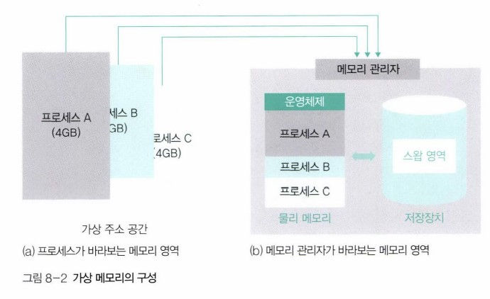

- 이론적으로 가상 메모리는 무한대의 크기를 가지지만, 실제로 가상 메모리의 최대 크기는 그 컴퓨터 시스템이 가진 물리 메모리의 최대 크기로 한정되며, CPU의 비트에 따라 결정됨.
  - 32비트 CPU의 경우 32비트로 표현할 수 있는 최댓값인 약 4GB가 메모리의 최대 크기이고, 가상 메모리의 최대 크기도 약 4GB.
- 실제로 사용할 수 있는 최대 크기의 제약에도 불구하고 이론적으로 무한대의 크기가 있는 것처럼 가상메모리를 구현할 수 있는 이유는, 스왑영역 때문.
  - 스왑 영역은 하드디스크에 존재하지만 메모리 관리자가 관리하는 영역으로서 메모리의 일부이며, 가상 메모리의 구성 요소 중 하나.
  - 메모리 관리자는 물리 메모리의 부족한 부분을 스왑 영역으로 보충함. 결국 가상 메모리에서 메모리 관리자가 사용할 수 있는 메모리의 전체 크기는 물리 메모리와 스왑 영역을 합한 크기.
  - 물리 메모리가 꽉 찼을 땐 일부 프로세스를 스왑 영역으로 보내고(스왑아웃), 몇 개의 프로세스가 작업을 마치면 스왑 영역에 있는 프로세스를 메모리로 가져옴(스왑인).
- 가상 메모리 시스템에서 메모리 관리자는 물리 메모리와 스왑 영역을 합쳐서 프로세스가 사용하는 가상 주소를 실제 메모리의 물리 주소로 변환하며, 이를 동적 주소 변환(Dynamic Address Translation, DAT)이라고 함.
- 메모리 관리자가 물리 메모리를 어떤 방법으로 나눌지, 사용자 프로세스를 어디에 배치할지, 부족한 물리 메모리를 어떻게 처리할지 등의 복잡한 문제를 처리하여 동적 주소 변환을 진행해주면, 프로세스는 아무 제약 없이 사용자의 데이터를 물리 메모리에 배치할 수 있음.

### 가상 메모리의 메모리 분할 방식

- 가상 메모리 시스템은 운영체제 영역을 제외한 나머지 메모리 영역을 일정한 크기로 나누어 일반 프로세스에 할당함.
- 가상 메모리의 메모리 분할 방식은 크게 가변 분할 방식을 이용한 `세그멘테이션`과, 고정 분할 방식을 이용한 `페이징`으로 나뉨.
- 세그멘테이션 기법은 가변 분할 방식의 단점인 외부 단편화 등의 문제 때문에 잘 사용되지 않고, 페이징 기법은 페이지 관리에 어려움이 있어서, 가상 메모리 시스템에서는 두 기법의 단점을 보완한 세그멘테이션-페이징 혼용 기법을 주로 사용함.

## 02 페이징 기법

### 페이징 기법의 구현

- 페이징 기법은 고정 분할 방식을 이용한 가상 메모리 관리 기법으로, 물리 주소 공간을 같은 크기로 나누어 사용함.

  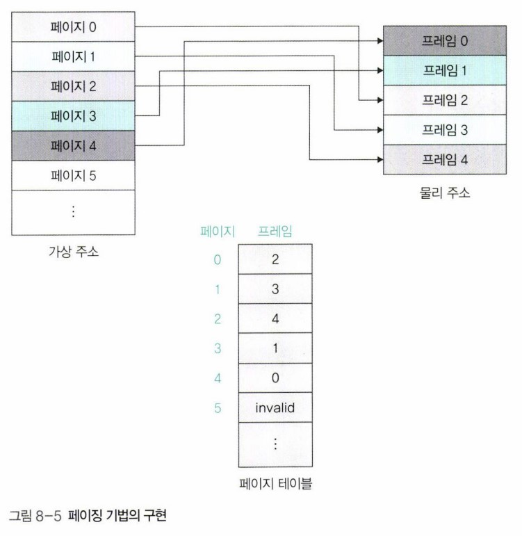

- 왼쪽의 가상 주소는 프로세스 입장에서 바라본 메모리 공간으로 항상 0번지부터 시작.
- 가상 주소의 분할된 각 영역은 페이지라고 부르며 번호를 매겨 관리함.
- 물리 메모리의 분할된 각 영역은 가상 주소의 페이지와 구분하기 위해 프레임(frame)이라고 부르며, 프레임도 번호를 매겨 관리함.
- 페이지와 프레임의 크기는 같기 때문에, 페이지는 어떤 프레임에도 배치될 수 있음.
- 어떤 페이지가 어떤 프레임에 있는지에 대한 매핑 정보는 페이지 테이블에 담겨 있음.
- 페이지 테이블은 각 페이지가 어떤 프레임에 배치되었는지에 대한 정보를 위에서부터 페이지 번호 순서대로 가지고 있기 때문에, 추가 열 없이 하나의 열로만 구성됨.
- 해당 페이지가 물리 메모리에 배치되지 않고 스왑 영역에 있는 경우엔 숫자가 아닌 invalid라고 표시됨.

### 페이징 기법의 주소 변환

- 아래의 그림은 페이징 기법에서 가상 주소가 물리 주소로 어떻게 변환되는지 보여줌.

  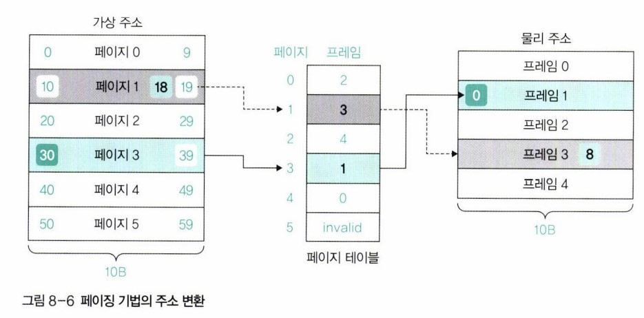

  - 예시에선 가상 주소 공간과 물리 주소 공간을 똑같이 10B(바이트)로 나누었고, 따라서 한 페이지/프레임은 총 10개의 주소 가짐.
  - 가상 주소를 물리 주소로 변환하는 과정 :
    - 예시 1)
      - 프로세스가 30번지의 내용을 읽으려고 한다고 가정.
      - 가상 주소 30번지가 어느 페이지에 있는지 찾는다. 30번지는 페이지 3의 0번째 위치에 있다.
      - 페이지 테이블의 페이지 3으로 가서 해당 페이지가 프레임 1에 있다는 것을 알아낸다.
      - 최종적으로 물리 메모리 프레임 1의 0번째 위치에 접근한다. 이 주소가 가상 주소 30번지의 물리 주소이다.
    - 예시 2)
      - 프로세스가 가상 주소 18번지에 어떤 값을 저장하려고 한다고 가정.
      - 가상 주소 18번지가 어느 페이지에 있는지 찾는다. 18번지는 페이지 1의 8번째 위치에 있다.
      - 페이지 테이블의 페이지 1로 가서 해당 페이지가 프레임 3에 있다는 것을 알아낸다.
      - 프로세스가 저장하려는 값을 프레임 3의 8번 위치에 저장한다.

- 페이징 기법에서는 가상 주소를 VA = <P, D>로 표현하는데, P는 페이지, D는 페이지의 처음 위치에서 해당 주소까지의 거리(distance)를 의미함.
  - ex) VA = <3, 0> : 가상 주소 페이지 3의 0번째 주소라는 의미.
- 물리 주소는 PA = <F, D>로 표현하며, F는 프레임, D는 프레임의 처음 위치에서 해당 주소까지의 거리를 의미함.
  - ex) PA <1, 0> : 물리 주소 프레임 1의 0번째 주소라는 의미.
- 페이징 기법의 주소 변환 과정 : VA = <P, D> -> PA = <F, D>
- 페이지 테이블을 사용하여 P는 F로 바꾸고, 페이지와 프레임의 크기를 똑같이 나누었기 때문에 D는 변경 없이 그대로 씀.

  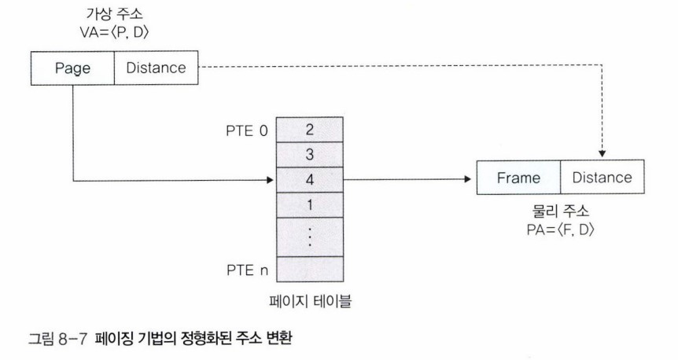

- 가상 주소를 <P, D>로 변환하는 공식 :
  - P = (가상주소/한 페이지의 크기)의 몫
  - D = (가상주소/한 페이지의 크기)의 나머지
- 컴퓨터는 2진법을 사용하므로 실제 한 페이지의 크기는 예시와 같은 10B가 아닌 2의 지수승으로 분할됨. (ex. 마이크로소프트의 윈도우 NT는 2의 12승 바이트, 오라클의 솔라리스는 2의 13승 바이트.)

### 페이지 테이블 관리

- 시스템에는 여러 개의 프로세스가 존재하고, 프로세스는 메모리에 올라와야 실행 가능하므로 모든 프로세스의 일부 페이지가 물리 메모리의 프레임에 올라와 있고, 어떤 페이지가 어떤 프레임에 있는지 관리하기 위해 프로세스마다 페이지 테이블을 하나씩 운영함.

  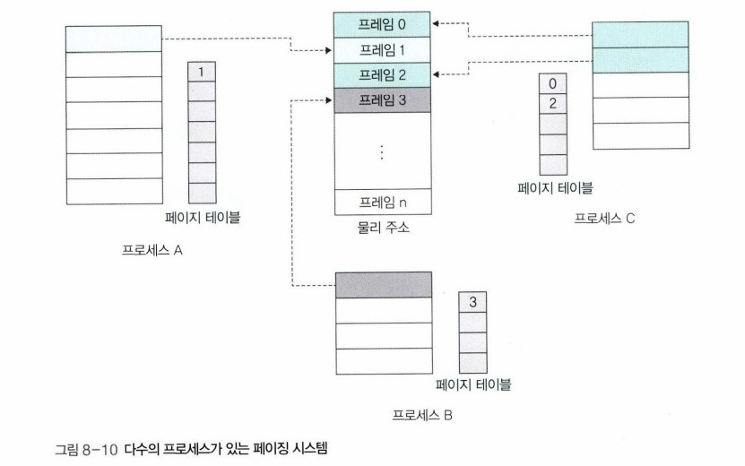

- 메모리 관리자는 특정 프로세스가 실행될 때마다 해당 페이지 테이블을 참조하여 가상 주소를 물리 주소로 변환하는 작업을 반복함.
- 페이지 테이블은 메모리 관리자가 자주 사용하는 자료구조이므로 필요시 빨리 접근할 수 있게 하기 위해, 물리 메모리 영역 중 운영체제 영역의 일부분에 모아놓음.
- 전체 테이블의 크기는 한 번에 실행하는 프로세스의 수에 비례해서 커지며, 이에 따라 프로세스가 실제로 사용할 수 있는 메모리 영역이 줄어들게 됨.
- 페이지 테이블의 크기가 작지 않기 때문에, 페이지 테이블의 크기를 적정하게 유지하는 것이 페이지 테이블 관리의 핵심.
- 물리 메모리 내 페이지 테이블의 구조 :

  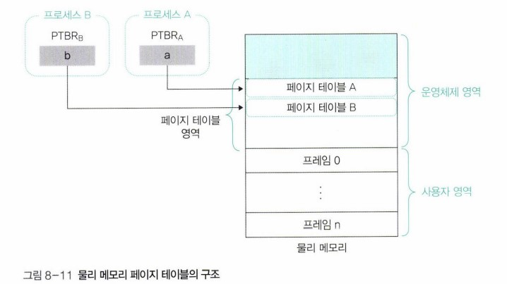

  - 페이지 테이블의 수가 늘어나거나 페이지 테이블의 크기가 늘어나면 운영체제 영역이 늘어나 그만큼 사용자 영역이 줄어들게 됨.
  - 물리 메모리의 크기가 작을 때는 프로세스만 스왑 영역으로 옮겨지는 것이 아니라 페이지 테이블의 일부도 스왑 영역으로 옮겨짐.
  - 메모리 관리자는 페이지 테이블에 빠르게 접근하기 위해 각 페이지 테이블의 주소를 페이지 테이블 기준 레지스터(Page Table Base Register, PTBR)에 보관함.
  - 페이지 테이블 기준 레지스터는 각 프로세스의 프로세스 제어 블록에 저장되는 데이터로, 페이지 테이블의 시작 주소를 가지고 있음.

### 페이지 테이블 매핑 방식

- 페이지 테이블이 위치한 곳에 따라 페이지 테이블 매핑 방식이 달라짐.
- 페이지 테이블 매핑 방식에는 직접 매핑, 연관 매핑, 집합-연관 매핑, 역매핑이 있음.

### 직접 매핑

- 직접 매핑(direct mapping)은 페이지 테이블 전체가 물리 메모리의 운영체제 영역에 존재하는 방식.
- 물리 메모리가 충분할 때 사용할 수 있으며, 모든 페이지를 물리 메모리에 가지고 있기 때문에 별다른 부가 작업 없이 바로 주소 변환이 가능해 주소 변환 속도가 빠름.
- 페이지 테이블의 시작 주소는 페이지 테이블 기준 레지스터(PTBR)가 가지고 있음.

  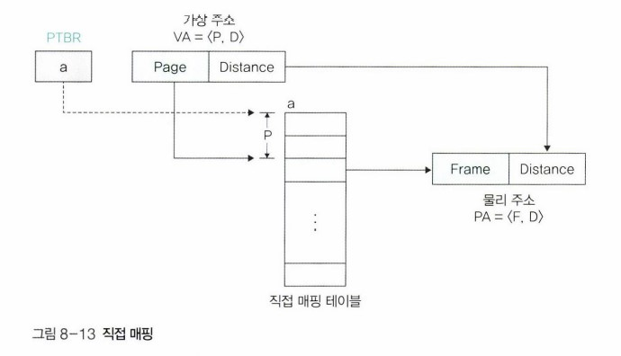

### 연관 매핑

- 연관 매핑(associative mapping)은 페이지 테이블 전체를 스왑 영역에서 관리하는 방식.
- 물리 메모리의 여유공간이 작을 때 사용하는 방식으로, 전체 페이지 테이블을 저장장치의 스왑 영역에 저장하고 그 중 일부만 물리 메모리에 가져오는 방식.
- 가져온 일부분의 테이블을 변환 색인 버퍼(Translation Look-aside Buffer, TLB) 또는 연관 레지스터(associate register)라고 부름.
- 연관 매핑은 페이지 테이블의 일부만 무작위로 가져오기 때문에 페이지 번호와 프레임 번호 둘 다 표시함. 따라서 페이지 테이블의 열 개수는 직접 매핑은 1개이고, 연관 매핑은 2개.
- 연관 매핑 방식의 작동 방식은 캐시 시스템과 유사.
  - 캐시 시스템에서 원하는 데이터가 캐시에 있으면 캐시 히트, 없으면 캐시 미스라고 하는 것처럼, 연관 매핑에서는 원하는 페이지 번호가 변환 색인 버퍼에 있는 경우는 TLB 히트라고 하며, 곧바로 물리 주소로 변환됨.
  - 원하는 페이지 번호가 변환 색인 버퍼에 없는 경우는 TLB 미스라고 하며, 스왑 영역에 저장된 직접 매핑 테이블을 사용하여 프레임 번호로 변환함.
- 연관 매핑 방식은 전체 페이지 테이블을 물리 메모리에 보관하지 않아 메모리를 절약할 수 있다는 것이 장점.
- 단점으로는, 주소 변환 시 직접 매핑은 원하는 프레임 번호를 한 번에 바로 얻을 수 있지만, 연관 매핑은 모든 변환 색인 버퍼를 위에서부터 다 검색해야 하고, 그래도 원하는 프레임 번호를 얻지 못한다면 스왑 영역에 저장된 직접 매핑 테이블을 또 검색해야함.
- 따라서 TLB 미스를 알게 되는 시점이 변환 색인 버퍼를 모두 검색하고 난 후라서, TLB 미스가 빈번하게 발생할 경우 주소 변환이 느려지고 시스템의 성능이 떨어진다는 단점 있음.

  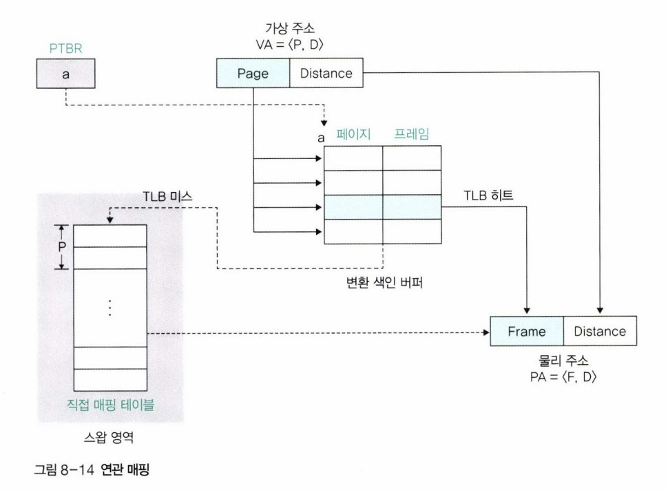

### 집합-연관 매핑

- 집합-연관 매핑(set-associative mapping)은 연관 매핑의 TLB 미스가 일어날 경우 시스템 성능이 떨어지는 단점을 개선한 방식.
- 전체 페이지 테이블을 저장장치의 스왑 영역에 저장하고, 그 중 일부만 물리 메모리로 가져온다는 것은 연관 매핑과 동일.
- 다른 점으로는, 연관 매핑에서는 스왑 영역에 있는 페이지 테이블의 일부를 무작위로 물리 메모리에 가져왔지만, 집합-연관 매핑에서는 페이지 테이블을 같은 크기의 여러 묶음으로 나누고, 각 묶음의 시작 주소를 가지며 이를 관리하는 페이지 테이블(디렉터리 테이블)을 하나 더 생성하며, 이 묶음 단위로 일부 테이블을 메모리로 옮겨놓는다는 점.
- 새로 생성한 디렉터리 테이블에는 해당 묶음이 물리 메모리에 있는지 스왑 영역에 있는지에 대한 위치정보를 표시함.
- 따라서 디렉터리 테이블을 살펴보면 원하는 테이블 묶음이 어디에 있는지 알 수 있으므로, 연관 매핑에서처럼 전체 테이블을 찾아보지 않아도 TLB 미스를 바로 알 수 있어 주소 변환 시간이 단축됨.
- 집합-연관 매핑 방식에서는 가상 주소를 VA = <P, D>가 아니라 VA = <P1, P2, D>로 바꾸어 표시함. P1은 디렉터리 테이블에서의 위치 정보, P2는 묶음 내에서의 위치 정보를 나타냄.
- 집합-연관 매핑 과정 :
  - 디렉터리 페이지 테이블의 시작 주소는 페이지 테이블 기준 레지스터(PTBR)이 가지고 있음.
  - 프로세스가 특정 주소를 요구하면 VA = <P1, P2, D>로 변환되고, P1을 이용하여 디렉터리 테이블에서 주소를 찾음.
  - I(invalid)라고 표시되어 있으면 TLB 미스가 발생한 것이고, 반대로 원하는 테이블이 물리 메모리에 있으면 묶음 테이블의 시작 주소가 명시되어 있음. 묶음 테이블의 시작 주소와 P2를 이용하여 묶음 테이블에서 원하는 프레임 번호를 얻는다.
- 집합-연관 매핑은 직접 매핑과 연관 매핑의 장점을 합한 방식.

  - 집합-연관 매핑은 직접 매핑과 달리 일부 페이지 테이블만 메모리에서 관리하여 물리 메모리 낭비하지 않음.
  - 연관 매핑은 TLB 미스가 발생할 경우 변환 색인 버퍼 전체를 검색하는데 시간을 낭비하지만, 집합-연관 매핑에서는 디렉터리 테이블을 이용하여 묶음 테이블 위치를 바로 확인 가능.

  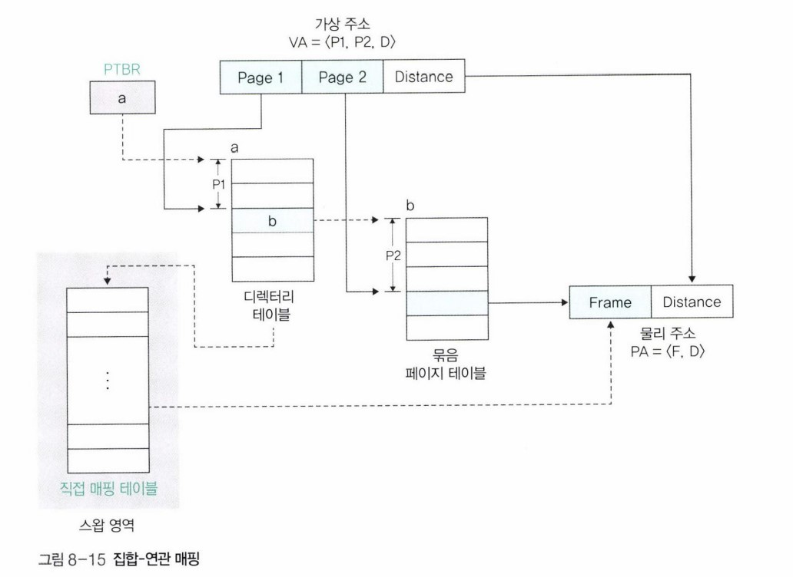

### 역매핑

- 직접 매핑, 연관 매핑, 집합-연관 매핑에서는 페이지 번호를 기준으로 프레임 번호를 매핑해 테이블을 구성. 이 방식은 프로세스마다 페이지 테이블이 필요하기 때문에 물리 메모리 공간을 낭비.
- 역매핑(invert mapping)에서는 물리 메모리의 프레임 번호를 기준으로 테이블을 구성함. 즉, 프레임에 어떤 프로세스의 어떤 페이지가 올라와 있는지를 표시.
- 테이블이 프레임을 기준으로 프로세스 아이디(PID)와 페이지 번호로 구성되며, 물리 메모리 상의 프레임 수와 테이블의 열 수가 같음.

  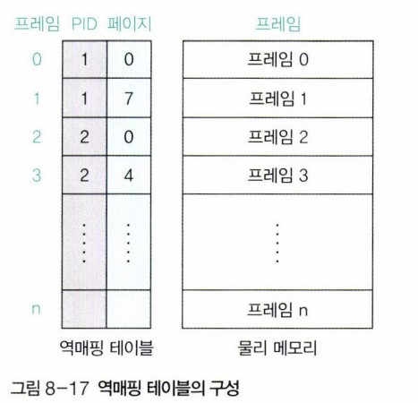

- 가장 큰 특징은 프로세스의 수와 상관없이 테이블이 하나만 존재한다는 것.
- 역매핑에서는 물리 메모리를 기준으로 프레임 테이블을 만들기 때문에 전체 시스템에서 테이블의 수가 단 1개라서, 테이블의 크기가 매우 작다는 것이 장점.
- 주소 변환 시 메모리 관리자는 프로세스 아이디와 페이지 번호가 물리 메모리에 있는지 역매핑 테이블에서 검색한 후, 없으면 스왑 영역에서 가져옴.
- 연관 매핑과 마찬가지로 페이지 테이블을 다 검사한 후에야 스왑 영역에 접근하기 때문에 검색 시간을 낭비하는 단점 있음.

## 03 세그먼테이션 기법

- 세그먼테이션 기법은 가변 분할 방식을 이용한 가상 메모리 관리 기법으로, 물리 주소 공간을 가변적인 크기로 나누어 사용함.

### 세그먼테이션 기법의 구현

- 페이징 기법처럼 세그먼테이션 기법도 매핑 테이블을 사용하며, 이를 세그먼테이션 테이블 또는 세그먼테이션 매핑 테이블이라고 함.

  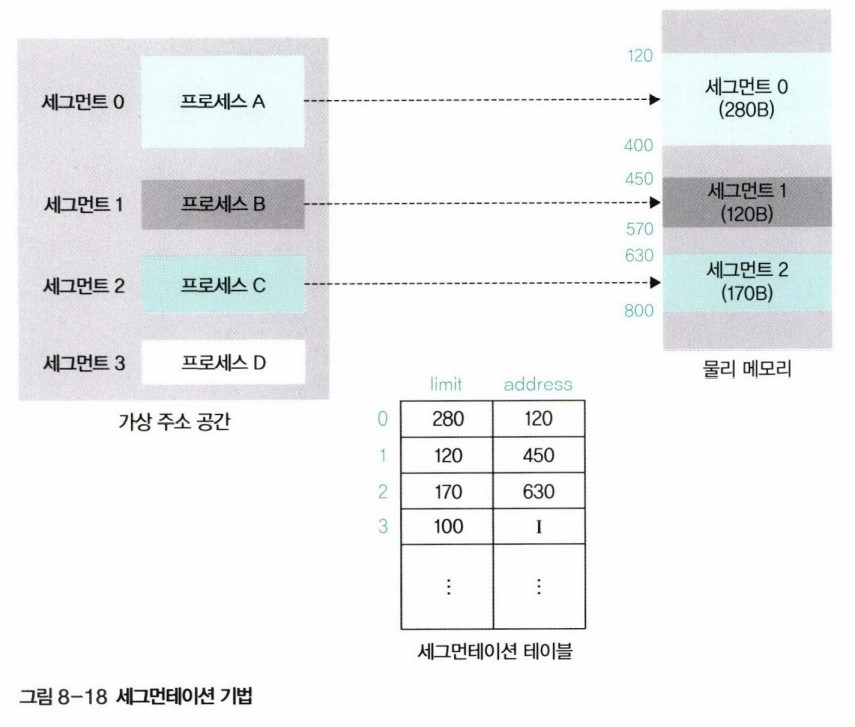

- 세그먼테이션 테이블에는 세그먼트의 크기를 나타내는 limit과 물리 메모리 상의 시작주소를 나타내는 address가 있음.
- 메모리를 같은 크기의 페이지 단위로 나눴던 페이징 기법과 다르게 세그먼테이션 기법은 프로세스의 크기에 따라 메모리를 분할하기 때문에 매핑 테이블에 크기 정보 포함함.
- 각 세그먼트가 자신에게 주어진 메모리 영역을 넘어가면 안된다는 의미에서 size 대신 limit 사용함.
- 세그먼테이션 기법에서도 물리 메모리가 부족할 때 스왑 영역을 사용함.
- 장점으로는 메모리를 프로세스 단위로 관리하기 때문에 페이지 테이블이 작고 단순하며, 단점은 물리 메모리의 외부 단편화로 인해 물리 메모리 관리가 복잡하다는 것.

### 세그먼테이션 기법의 주소 변환

- 세그먼테이션 기법에서는 가상 주소를 VA = <S, D>로 표현함. S는 세그먼트 번호(segment number), D는 세그먼트 시작 지점에서 해당 주소까지의 거리를 의미.

  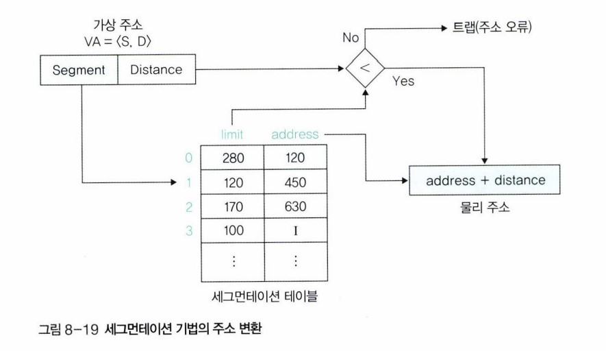

- 주소 변환 과정 :
  - 프로세스 A가 세그먼트 0으로 분할되어있고, 프로세스 A의 32번지에 접근한다고 가정.
  - 프로세스 A는 세그먼트 0으로 분할되었으므로 S는 0이고 D는 32. 따라서 가상 주소는 VA = <0, 32>.
  - 세그먼테이션 테이블에서 세그먼트 0의 시작 주소 120을 알아낸 후, 시작 주소 120에 거리 32를 더하여 물리 주소 152번지를 구함.
    - 이 때 메모리 관리자는 거리가 세그먼트의 크기(limit인 280)보다 큰지 점검하여, 만약 크기보다 크다면 메모리를 벗어난 것이므로 운영체제는 사용자에게 세그먼테이션 오류(segmentation fault)라는 메세지를 보내고 해당 프로세스를 강제 종료함. 만약 크지 않다면 시작 주소에 거리를 더하여 물리 주소를 구함.

## 04 세그먼테이션-페이징 혼용 기법

- 페이징 기법은 물리 메모리를 같은 크기로 나누어 관리하기 때문에 메모리 관리가 수월한 반면 페이지 테이블의 크기가 크고, 세그먼테이션 기법은 페이지 테이블의 크기를 작게 유지할 수 있으나 물리 메모리의 외부 단편화로 인해 추가적인 관리 필요.
- 세그먼테이션-페이징 혼용 기법은 이 두 기법의 장점만 취한 기법.

### 세그먼테이션-페이징 혼용 기법의 주소 변환

- 아래의 그림에서 왼쪽은 사용자 관점에서 본 메모리 구조이고, 오른쪽 그림은 메모리 관리자 관점에서 본 메모리 구조.

  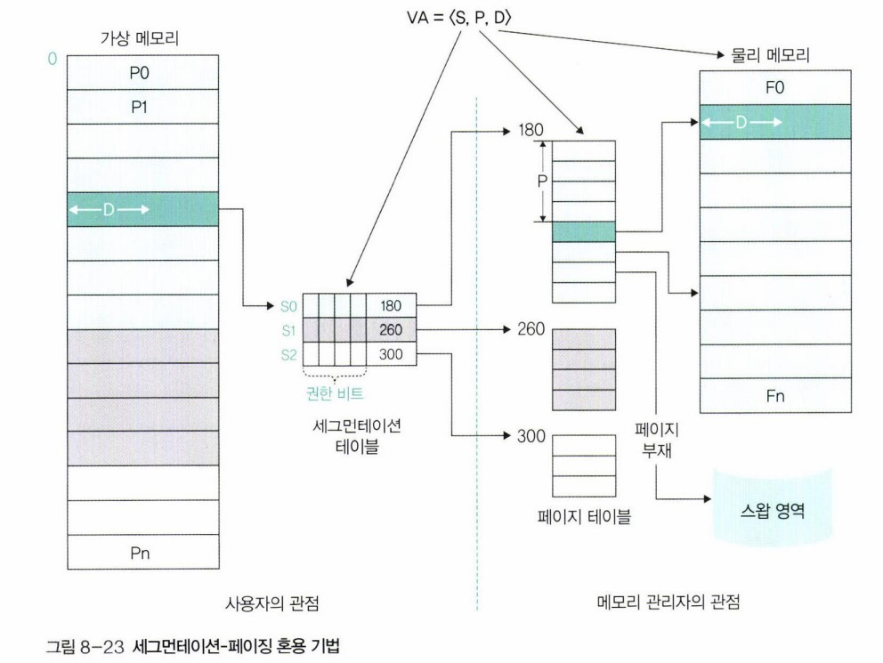

  - 사용자 입장에선 기본적으로 세그먼테이션 기법을 사용하고, 메모리 관리자 입장에서는 페이징 기법을 사용함.
  - 프로그램을 먼저 세그먼트로 나눈 후, 각 세그먼트는 다시 페이지들로 나뉘는 구조.
  - 세그먼테이션-페이징 혼용 기법에서는 가상 주소를 VA = <S, P, D>로 표현함. S는 세그먼트 번호, P는 페이지 번호, D는 페이지의 처음 위치에서 해당 주소까지의 거리를 의미. 페이징 기법의 가상 주소 VA = <P, D>에 세그먼트 번호인 S만 추가된 것.
  - 세그먼테이션 테이블에는 해당 페이지 테이블의 시작 주소가 기록되어있음.

- 주소 변환 과정 :
  - 사용자가 어떤 주소에 있는 데이터를 요청하면 해당 주소가 몇 번째 세그먼트의 몇 번째 페이지로부터 얼마나 떨어져 있는지 계산하여 가상 주소 VA = <S, P, D>를 구함.
  - 먼저 세그먼테이션 테이블의 해당 세그먼트 번호로 가서 메모리 영역을 벗어나는 접근이거나 권한이 없는 페이지에 접근하는 것은 아닌지 등을 확인. 잘못된 접근이라면 세그먼테이션 오류를 발생시켜 프로세스를 강제 종료하고, 그렇지 않으면 연결된 페이지 테이블로 감.
  - 페이지 테이블에서 해당 페이지가 어느 프레임에 저장되었는지 프레임 번호를 찾음. 물리 메모리에 해당 프레임이 있다면 메모리에 바로 접근하고 없다면 스왑 영역에 가서 해당 페이지를 물리 메모리로 가져옴.
  - 물리 메모리에 있는 프레임의 처음 위치에서 D만큼 떨어진 곳에 접근하여 데이터를 읽거나 씀.
