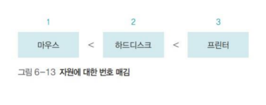

# 교착 상태

## 교착 상태 개요

### 교착 상태(dead lock)란?

- 2개 이상의 프로세스가 다른 프로세스의 작업이 끝나기만 기다리며 작업을 더 이상 진행하지 못하는 상태.
- (ex. 요리사 A는 믹서를 독점한 채 제빵기를 달라고 하고, 요리사 B는 제빵기를 독점한 채 믹서를 달라고 하는 상황. 두 요리사가 양보하지 않는다면 작업이 진행되지 않음.)
- 컴퓨터 시스템에서 교착 상태는 시스템 자원, 공유 변수(또는 파일), 응용 프로그램(ex. 데이터베이스) 등을 사용할 때 발생 가능.
- 교착 상태와 아사 현상의 차이 :
  - `아사 현상` :
    - 운영체제가 잘못된 정책을 사용했다거나 오류로 인해 특정 프로세스의 작업이 지연되는 문제.
    - ex. 최단 작업 우선(SJF) 스케줄링 알고리즘에서 작업 시간이 긴 프로세스가 작업 시간이 짧은 프로세스 때문에 작업이 진행되지 못하는 경우.
    - 몇 번 이상 양보했다면 더 이상 양보하지 않도록 조정하는 에이징(나이 먹기)으로 해결할 수 있음.
  - `교착 상태` :
    - 아사 현상과 달리 정책상 잘못이나 오류가 없어도, 여러 프로세스가 작업을 진행하다 보니 자연적으로 일어나는 문제.
    - 에이징으로도 해결할 수 없고 정책을 바꾼다고 해서 막을 수도 없음. 대신 예방, 회피, 검출 등으로 해결 가능.

### 자원 할당 그래프(Resource Allocation Graph)

- 프로세스가 어떤 자원을 사용 중이고 어떤 자원을 기다리고 있는지를 방향성이 있는 그래프로 표현한 것.
- 프로세스는 원으로, 자원은 사각형으로 표현.
- 자원을 사용하고 있는 경우(할당된 경우), 자원으로부터 프로세스로 향하는 화살표로 표시.
- 프로세스가 자원을 기다리는 경우(대기하는 경우), 프로세스로부터 자원으로 향하는 화살표로 표시.
- 자원이 2개 이상의 프로세스를 동시에 허용하는 경우(여러 프로세스가 하나의 자원을 동시에 사용 가능한 경우)도 있는데, 이를 `다중 자원`(multiple resource) 이라고 부름. 다중 자원은 수용할 수 있는 프로세스 수를 사각형 안에 작은 동그라미로 표현함.

  
  

### 식사하는 철학자 문제

- 교착 상태를 설명하기 위한 예로 오랫동안 사용.
- 철학자 4명이 둥근 식탁에 둘러앉아 식사를 하는데, 왼쪽에 있는 포크를 잡은 뒤 오른쪽에 있는 포크를 잡아야만 식사가 가능. 모두 자기 왼쪽의 포크를 잡은 채 오른쪽 포크를 기다리다가 굶어 죽게됨.

  

- 식사하는 철학자 문제에서 `교착 상태가 발생하기 위한 필요조건` 알 수 있음 :
  1. 철학자들은 서로 포크 공유 못함 -> 자원을 공유하지 못하면 교착 상태가 발생
  2. 각 철학자는 다른 철학자의 포크 빼앗을 수 없음 -> 자원을 뺏을 수 없으면 자원을 놓을 때까지 기다려야 하므로 교착 상태 발생
  3. 각 철학자는 왼쪽 포크를 잡은 채 오른쪽 포크를 기다림 -> 자원 하나를 잡은 상태에서 다른 자원을 기다리면 교착 상태가 발생
  4. 자원 할당 그래프가 원형 -> 자원을 요구하는 방향이 원을 이루면 양보를 하지 않기 때문에 교착 상태가 발생

## 교착 상태 필요조건

### 교착 상태가 발생하기 위한 필요조건

- 교착 상태는 `상호 배제(mutual exclusion)`, `비선점(non-preemption)`, `점유와 대기(hold and wait)`, `원형 대기(circular wait)`을 모두 충족해야 발생하고, 이 중 단 하나라도 충족하지 않으면 교착상태 발생하지 않음.
  - 상호 배제 : 한 프로세스가 사용하는 자원은 다른 프로세스와 공유할 수 없는 배타적인 자원이어야 함.
  - 비선점 : 한 프로세스가 사용 중인 자원은 중간에 다른 프로세스가 빼앗을 수 없는 비선점 자원이어야 함.
  - 점유와 대기 : 프로세스가 어떤 자원을 할당받은 상태에서 다른 자원을 기다리는 상태여야 함.
  - 원형 대기 : 점유와 대기를 하는 프로세스 간의 관계가 원을 이루어야 함.

## 교착 상태 해결 방법

### 교착 상태 해결 방법

- 교착 상태를 해결하는 방법은 `예방(prevention)`, `회피(avoidance)`, `검출(detection)`이며, 추가적으로 교착 상태 검출 후 자원을 `회복(recovery)`하는 방법도 있음.

  | 해결 방법      | 특징                                                |
  | :------------- | :-------------------------------------------------- |
  | 교착 상태 예방 | 교착 상태를 유발하는 네 가지 조건을 무력화한다.     |
  | 교착 상태 회피 | 교착 상태가 발생하지 않는 수준으로 자원을 할당한다. |
  | 교착 상태 검출 | 자원 할당 그래프를 사용하여 교착 상태를 발견한다.   |
  | 교착 상태 회복 | 교착 상태를 검출한 후 해결한다.                     |

### 교착 상태 예방

- 교착 상태를 유발하는 네 가지 조건 중 하나라도 발생하지 않도록 막아 교착 상태를 사전에 예방하는 것. (교착 상태는 네가지 필요조건을 동시에 충족해야 발생하지 때문에 이 중 하나라도 막는다면 교착상태 발생 x)
- 상호 배제 예방, 비선점 예방, 점유와 대기 예방, 원형 대기 예방, 이렇게 4가지 방법이 있음.

**1) 상호 배제 예방**

- 시스템 내에 있는 상호 배타적인(독점적으로 사용할 수 있는) 모든 자원을 없애버리는 방법
- 시스템 내의 모든 자원이 공유 가능하면 교착 상태가 발생하지 않을 것.
- 현실적으로는 모든 자원을 공유할 수 없으며, 상호 배제를 적용하여 보호해야 하는 자원 존재함. (ex. 임계구역 문제(공유 데이터를 여러 프로세스가 동시에 접근할 때 생기는 문제), 프린터를 아무렇게나 공유하면 출력물 엉키는 문제.)
- 따라서 현실적으로 어려운 방법.

**2) 비선점 예방**

- 모든 자원을 빼앗을 수 있도록 만드는 방법
- 임계구역을 보호하기 위해 잠금을 사용하면 자원을 빼앗을 수 없음. 따라서 현실적으로는 시스템의 모든 자원을 빼앗을 수 있도록 할 수 없음.
- 어떤 자원을 빼앗을 수 있도록 하더라도, 어떤 기준으로 빼앗을지, 빼앗은 시간 중 얼마나 사용할지 결정하기가 어려움.
- 또한 이 방법은 아사 현상을 일으킬 수 있음.
- 에이징으로 아사 현상을 해결한다고 해도, 우선순위가 낮은 프로세스가 몇 번 양보 후엔 무조건 이 자원을 사용한다고 가정하면, 이 프로세스가 점유하고 있는 자원은 비선점 자원이 되어버림.
- 따라서 현실적으로 어려운 방법.

**3) 점유와 대기 예방**

- 프로세스가 자원을 점유한 상태에서 다른 자원을 기다리지 못하게 하는 방법.
- '전부 할당하거나 아니면 아예 할당하지 않는(all or nothing)' 방식.
- 프로세스는 시작 초기에 자신이 사용하려는 모든 자원을 한꺼번에 점유하거나, 그렇지 못할 경우 자원을 모두 반납.
- 자원에 대한 제약을 풀어버리는 상호 배제 예방, 비선점 예방과 달리 프로세스의 자원 사용 방식을 변화시켜 교착 상태를 처리한다는 점에서 의미가 있음.
- 점유와 대기 에방의 단점 :
  - 프로세스가 자신이 사용하는 모든 자원을 자세히 알기 어려움. 추가로 필요한 자원 생길 수 있으며, 이를 다시 확보하기가 어려움.
  - 프로세스가 당장 사용하지도 않을 자원을 미리 선점해서, 그 자원을 필요로 하는 다른 프로세스의 작업이 진행되지 않아 자원의 활용성이 떨어짐.
  - 많은 자원을 사용하는 프로세스가 적은 자원을 사용하는 프로세스보다 자원을 동시에 확보하기 어려워, 아사 현상 발생 가능.
  - 점유와 대기 예방을 실제로 구현하면 결국 거의 모든 프로세스가 일괄 작업 방식으로 처리되게 되어, 시스템의 효율이 떨어짐.

**4) 원형 대기 예방**

- 점유와 대기를 하는 프로세스들이 원형을 이루지 못하도록 막는 방법.
- 자원을 한 방향으로만 사용하도록 설정함으로써 원형 대기 예방 가능. (ex. 모든 자원에 숫자 부여하고 숫자가 큰 방향으로만 자원을 할당하는 것. 숫자가 작은 자원을 잡은 상태에서 큰 숫자를 잡는 것만 허용.)

  

- 모든 자원을 할당받아야 실행할 수 있는 점유와 대기 예방보다 완화된 방법.
- 원형 대기 예방의 단점 :
  - 프로세스 작업 진행에 유연성이 떨어짐.
    - 마우스가 1번 자원이고, 프린터가 3번 자원이라고 하면, 프린터를 사용한 다음 마우스 할당받으려면 운영체제가 이를 거부하게 됨.
  - 자원의 번호를 어떻게 부여할 것인지가 문제이며, 어떤식으로 번호를 붙이든 자원 사용에 제약이 따르게 됨.

**교착 상태 예방 정리**

- 임계구역으로 보호받는 자원에 대한 제약을 풀기는 어렵기 때문에, 상호 배제 예방, 비선점 예방은 현실적으로 어려운 방법.
- 점유와 대기 예방, 원형 대기 예방은 프로세스 작업 방식을 제한하고 자원을 낭비하기 때문에 사용할 수 없음.

### 교착 상태 회피

- 프로세스에 자원을 할당할 때 어느 수준 이상의 자원을 나누어주면 교착 상태가 발생하는지 파악하여, 그 수준 이하로 자원을 나누어주는 방법.
- 자원의 총수와 현재 항당된 자원의 수를 기준으로 시스템을 안정 상태와 불안정 상태로 나누고, 시스템이 안정 상태를 유지할 수 있는 범위 내에서 자원을 할당함으로써 교착 상태를 피함.
- 할당된 자원이 적으면 안정 상태가 크고, 할당된 자원이 늘어날수록 불안정 상태가 커짐. 불안정 상태가 커질 수록 교착 상태가 발생할 가능성이 높아짐.

  

**은행원 알고리즘**

- 교착 상태 회피를 구현하는 방법 중 하나가 `은행원 알고리즘(Banker's Algorithm)`. 은행이 대출 금액이 대출 가능 범위 내이면 대출 해주고 그렇지 않으면 거부하는 것과 유사하기 때문에 붙은 이름.
- 은행원 알고리즘의 변수 :
  |변수|설명|
  |:---|:---|
  |전체 자원(Total)|시스템 내 전체 자원의 수|
  |가용 자원(Available)|시스템 내 현재 사용할 수 있는 자원의 수(가용 자원=전체 자원-모든 프로세스의 할당 자원)|
  |최대 자원(Max)|각 프로세스가 선언한 최대 자원의 수|
  |할당 자원(Allocation)|각 프로세스에 현재 할당된 자원의 수|
  |기대 자원(Expect)|각 프로세스가 앞으로 사용할 자원의 수(기대 자원=최대 자원-할당 자원)|
  - 각 프로세스는 자신이 사용할 자원의 최대 수(Max)를 운영체제에 알려줌.
  - 각 프로세스에 할당된 자원의 수는 '할당 자원'에 표시됨.
  - 각 프로세스마다 자신이 선언한 최대 자원에서 현재 할당된 수를 빼면 '기대 자원'이 됨.
  - 전체 자원에서 각 프로세스에 할당되고 남은 자원 수가 '가용 자원'.
- 은행원 알고리즘의 자원 할당 기준 :
  - `각 프로세스의 기대 자원과 비교하여 그 중 하나라도 가용 자원>=기대자원이면`(= `안정 상태`이면) 자원을 할당함.
    - 가용 자원>=기대자원 이라는 것은 시스템 내 가용자원을 사용하여 작업을 끝낼 수 있는 프로세스가 있다는 의미이므로 안정 상태.
  - `가용 자원이 어떤 기대 자원보다도 같거나 크지 않으면`(= `불안정 상태`이면) 할당하지 않음.
    - 가용 자원을 사용하여 작업을 마칠 수 있는 프로세스가 없다는 의미이므로 불안정 상태.
- 예시 :

  

  - 첫번째 예시에서 프로세스 P2가 가용 자원 2개를 사용하여 실행을 종료하면 이미 할당받아 사용하던 자원 6개를 반환하고, 이를 프로세스 P1이나 P3에 할당하면 전체 작업 완료 가능.
  - 두번째 예시에선 가용 자원 1개로는 어떤 프로세스의 기대 자원도 충족할 수 없으므로 가용 자원 할당하지 않음.

**교착 상태 회피의 문제점**

- 교착 상태 회피를 사용하려면 모든 프로세스가 자신이 사용할 모든 자원을 미리 정확하게 선언해야 하는데 이는 현실적으로 쉽지 않음. (선언한 자원이 정확하지 않으면 교착 상태 회피에서도 교착 상태 발생 가능.)
- 은행원 알고리즘에서 안정 / 불안정 상태를 파악하려면 시스템의 전체 자원 수가 고정적이어야 함. 일시적 고장이나 새로운 자원 추가로 자원 수가 변동되는 일이 빈번하므로 불가능.
- 모든 불안전 상태가 교착 상태가 되는 것은 아님에도 불구하고 불안정 상태이면 자원을 할당하지 않으므로 자원 낭비로 이어질 수 있음.

### 교착 상태 검출

- 교착 상태 예방은 실제로 구현하기 어렵고, 교착 상태 회피는 구현할 수는 있지만 자원을 낭비하는 문제가 있음. 따라서 교착 상태 해결 방법 중 가장 현실적인 것은 교착 상태 검출.
- 교착 상태 검출은 운영체제가 프로세스의 작업을 관찰하면서 교착 상태 발생 여부를 계속 주시하는 방식. 교착 상태가 발견되면 해결하기 위해 교착 상태 회복 단계를 밟게됨.
- 타임아웃을 이용하는 방법과 자원 할당 그래프를 이용하는 방법이 있음.

**1) 타임아웃을 이용한 교착 상태 검출**

- 일정 시간 동안 작업이 진행되지 않은 프로세스를 교착 상태가 발생한 것으로 간주하여 처리하는 방법.
- 다음과 같은 문제 있음 :
  - 교착 상태 외의 다른 이유로 일정 시간 동안 작업이 진행되지 못한 프로세스까지 모두 강제 종료되게 되면서, 엉뚱한 프로세스가 강제 종료될 수 있음.
  - 모든 시스템에 적용할 수 없음. 하나의 운영체제 내에서 동작하는 프로세스들은 타임아웃 방법을 적용할 수 있지만, 분산 데이터베이스의 경우에는 타임아웃 방법을 적용하기가 어려움. 응답이 없는 것이 교착 상태 때문인지, 네트워크 문제 때문인지, 단순히 처리가 늦어지는 것인지 정확히 알 수 없기 때문.
- 위와 같은 문제에도 불구하고 타임아웃은 대부분의 데이터베이스와 운영체제에서 많이 선호하는 방식. 또 다른 방식인 자원 할당 그래프를 이용하여 교착 상태를 찾는 방법은 작업이 너무 많아서 구현하기가 힘들기 때문.

  

- 타임아웃을 이용하는 방식을 '가벼운 교착 상태 검출'이라 부르고, 자원 할당 그래프를 이용하는 방법을 '무거운 교착 상태 검출'이라 부름.

 

- 데이터베이스에서의 타임아웃 :

  - 데이터베이스에서는 타임아웃으로 프로세스가 종료되면 일부 데이터의 일관성이 깨질 수 있음.
  - 데이터의 일관성이 깨지는 문제를 해결하기 위해 `체크포인트`와 `롤백` 사용.

    - 체크포인트 : 작업하다가 문제가 발생하면 저장된 상태로 되돌아오기 위한 표시.
    - 스냅숏 : 체크포인트를 설정하면 현재의 시스템 상태가 하드디스크에 저장되는데, 해당 데이터를 스냄숏이라 함.
    - 롤백 : 작업을 하다가 문제가 발생하면 과거의 체크포인트로 되돌아오는 것. 저장된 스냅숏을 복원하여 시스템을 체크포인트 시점으로 되돌림.

      

      - 타임아웃 걸려서 프로세스 중단하거나 데이터 잠금을 포기해야 한다면 롤백을 사용.

**2) 자원 할당 그래프를 이용한 교착 상태 검출**

- 예시 :

  

  - `단일 자원`을 사용하는 경우 `자원 할당 그래프에 사이클 있으면 교착 상태`임.
  - 다중 자원을 사용하는 경우에는 자원 할당 그래프에 사이클 있다고 해서 모두 교착 상태라고 판단할 수 없음.
  - 위의 예시는 단일 자원 사용하는 경우.
    - (a)그래프는 사이클이 존재하지 않으므로 교착 상태가 없고, 프로세스 P2가 작업 마치고 자원 R2 반환하면 나머지 프로세스의 작업이 계속 진행되며 결국 교착 상태 발생하지 않음.
    - (b)그래프는 P1->p2->P4->P1의 사이클이 존재하기 때문에 운영체제는 교착 상태 발생한 것으로 판단함.

**자원 할당 그래프를 이용한 교착 상태 검출 - 다중 자원의 경우**

- 단일 자원만 있는 자원 할당 그래프에서는 사이클만으로 교착 상태 검출이 가능하지만, 다중 자원이 포함된 자원 할당 그래프에서는 대기 그래프에서 그래프 감소를 한 후 사이클이 남아있는지 확인하여 교착 상태를 검출함.
  - `대기 그래프(wait for graph)` : 자원 할당 그래프에서 프로세스와 프로세스 간에 기다리는 관계만 나타낸 그래프.
  - `그래프 감소(graph reduction)` : 대기 그래프에서 작업이 끝날 가능성이 있는(기다리는 자원이 없는)프로세스의 화살표와 관련 프로세스의 화살표를 연속적으로 지워가는 작업.
- 자원 할당 그래프에 대한 대기 그래프를 그리고, 해당 `대기 그래프에서 그래프 감소를 완료한 후에도 사이클이 남아있다면 교착 상태가 발생한 것으로 판단`.
- 예시 :

  

  - 그래프 감소 과정 :
    - 1 : 기다리는 자원 없는 프로세스 P2 작업 종료 가능하므로, P1에서 P2로 가는 화살표 지움.
    - 2 : 프로세스 P1 작업 종료 가능하므로, P4에서 P1으로 가는 화살표 지움.
    - 3 : 프로세스 P4 작업 종료 가능하므로, P3에서 P4로 가는 화살표 지움.
    - 4 : 프로세스 P3 작업 종료 가능하므로, P1에서 P3로 가는 화살표 지움.
  - 그래프 감소 결과 사이클 남아 있지 않으므로 교착 상태 발생하지 않은 것으로 판단.

### 교착 상태 회복

- 교착 상태 검출 후 진행되는 교착 상태를 푸는 후속 작업.
- 교착 상태 회복 단계에서는 교착 상태를 유발한 프로세스를 강제로 종료하며, 강제 종료된 프로세스가 실행되기 전에 시스템을 복구하는 작업도 진행함.
- 강제 종료 방법은 다음의 두 가지 :
  - 교착 상태를 일으킨 모든 프로세스를 동시에 종료하는 방법. 종료된 프로세스들이 동시에 작업 시작하면 다시 교착 상태 일으킬 수 있으므로, 다시 실행할 떄는 순차적으로 실행해야 하며, 어떤 프로세스를 먼저 실행할 것인지 기준 필요함.
  - 교착 상태를 일으킨 프로세스 중 하나를 골라 순서대로 종료하면서 나머지 프로세스의 상태를 파악하는 방법.
    - 종료할 프로세스를 고르는 기준은 다음과 같음.
      - 우선순위가 낮은 프로세스를 먼저 종료.
      - 우선순위가 같은 경우 작업 시간이 짧은 프로세스를 먼저 종료.
      - 위의 두 조건이 같은 경우 자원을 많이 사용하는 프로세스를 먼저 종료.
- 시스템 복구 :
  - 명령어 실행될 때마다 체크포인트 만들어 가장 최근의 검사 시점으로 돌아가는 식.
  - 시스템에 큰 부하를 주므로 체크포인트 무분별하게 사용하지 말아야 함.
