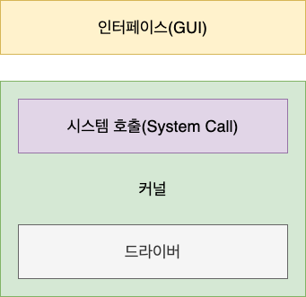
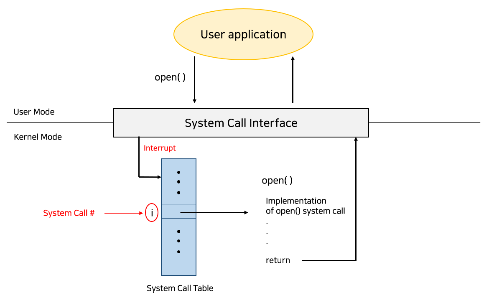
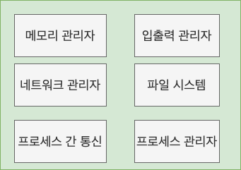
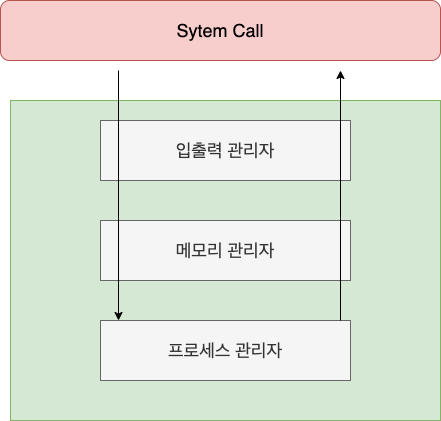
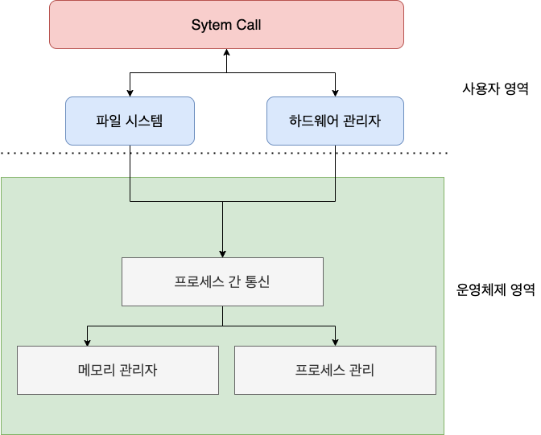
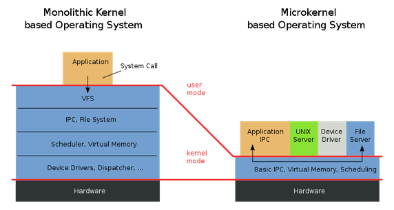

# 운영체제의 구조와 정의

### 운영체제(OS, Operating System)란?

- 사용자가 컴퓨터를 편리하고 효과적으로 사용할 수 있도록 환경을 제공하는 시스템 소프트웨어 (ex. Windows, Linux, UNIX, MS-DOS, ...)
- 하드웨어를 관리하고, 컴퓨터 시스템의 자원들을 효율적으로 관리하며, 응용 프로그램과 하드웨어 간의 인터페이스로써 다른 응용 프로그램이 유용한 작업을 할 수 있도록 환경을 제공함.

#### 운영체제의 역할

1. 프로세스 관리
   - 운영체제에서 현재 작동하는 응용 프로그램들을 관리.
   - 어떤 의미에서는 프로세서(CPU)를 관리하는 것이라고 볼 수도 있음.
   - 현재 CPU를 점유해야 할 프로세스를 결정하고, 실제로 CPU를 프로세스에 할당하며, 이 프로세스 간 공유자원 접근과 통신 등을 관리.
2. 저장장치 관리
   - 1차 저장장치에 해당하는 메인 메모리와 2차 저장장치에 해당하는 하드디스크, NAND 등을 관리하는 기능.
     - 1차 저장장치(메인 메모리)
       - 프로세스에 할당하는 메모리 영역의 할당과 해제
       - 각 메모리 영역 간의 침범 방지
       - 메인 메모리의 효율적 활용을 위한 가상 메모리 기능
     - 2차 저장장치(HDD, NAND Flash Memory 등)
       - 파일 형식의 데이터 저장
       - 이런 파일 데이터 관리를 위한 파일 시스템을 OS에서 관리
       - FAT, NTFS, ReFS, ext4, HFS, APFS 등 많은 파일 시스템들이 개발되어 사용 중
3. 네트워킹
   - TCP/IP 기반의 인터넷에 연결하거나, 응용프로그램이 네트워크를 사용하려면 운영체제에서 네트워크 프로토콜을 지원해야 함. (현재 상용 OS들은 다양하고 많은 네트워크 프로토콜 지원)
4. 사용자 관리
   - 운영체제는 한 컴퓨터를 여러 사람이 사용하는 환경도 지원해야 하기 때문에, 각 계정을 관리할 수 있는 기능이 필요.
   - 사용자 별로 보안을 위해 개인 파일에 대해선 다른 사용자가 접근할 수 없도록 해야 함. 파일이나 시스템 자원에 접근 권한을 지정할 수 있도록 지원하는 것이 사용자 관리 기능.
   - 계정 관리, 접근권한 관리
5. 디바이스 드라이버
   - 운영체제는 시스템의 자원, 하드웨어를 관리.
   - 시스템에는 여러 하드웨어가 붙어있는데, 이들을 운영체제에서 인식하고 관리하게 만들어 응용 프로그램이 하드웨어를 사용할 수 있게 만들어야 함.
   - 따라서 운영체제 안에 하드웨어를 추상화 해주는 계층이 필요. 이 계층이 바로 디바이스 드라이버.
   - 하드웨어의 종류가 많은 만큼, 운영체제 내부의 디바이스 드라이버도 많이 존재함. 이 수많은 디바이스 드라이버들을 관리하는 기능 또한 운영체제가 맡고 있음.

## 운영체제의 구조

### 커널과 인터페이스

- 운영체제는 커널과 인터페이스로 이루어져 있음.
  - 커널 : 프로세스 관리, 메모리 관리, 저장장치 관리와 같은 운영체제의 핵심적인 기능을 모아놓은 것으로 운영체제의 성능을 좌우함.
  - 인터페이스 : 사용자의 명령을 전달하고 실행결과를 사용자에게 알려주는 역할을 함.
- 운영체제는 커널과 인터페이스를 분리하여, 같은 커널을 사용하더라도 다른 인터페이스를 가질 수 있음.
  

## 시스템 호출(System Call)

- 시스템 콜(system call)은 운영 체제의 커널이 제공하는 서비스에 대해, 응용 프로그램의 요청에 따라 커널에 접근하기 위한 인터페이스. (커널을 보호하기 위해 만든 인터페이스)
- 사용자나 응용 프로그램이 컴퓨터 자원을 사용하기 위해서는 자원에 직접 접근하는 것이 아니라 시스템 호출을 사용해야 함.
- 직접 접근할 경우 모든 과정을 직접 핸들링해야 하며, 부주의로 인해 컴퓨터 시스템 자체를 파괴할 위험 있음. 하지만 시스템 호출을 사용한다면 요청만 하고 결과를 기다리면 되므로 문제가 발생하는 것 막을 수 있음.
- 각각의 시스템 콜은 숫자로 구별된다. 시스템 콜 인터페이스(System Call Interface)가 이 숫자에 따라 매핑된 테이블을 유지한다.
- 시스템 콜 테이블(System Call Table)은 메모리 주소의 모음인데, 해당 메모리 주소는 인터럽트 서비스 루틴을 가리키고 있다.
- 시스템 콜 인터페이스는 OS 커널에서 의도된 시스템 콜을 발생시키고, 시스템 콜의 상태나 기타 값들을 반환한다.
- 호출자(Caller)는 시스템 콜이 어떻게 구현되는지 알 필요는 없고, 어떻게 API를 사용하는지, 시스템 콜의 결과로 OS가 어떤 작업을 하는지만 알면 된다. 
  

- fork( ), exec( ), wait( )와 같은 것들은 Process 생성과 제어를 위한 System call임.
- fork, exec는 새로운 Process 생성과 관련이 되어 있다.
- wait는 Process (Parent)가 만든 다른 Process(child) 가 끝날 때까지 기다리는 명령어임.

### Fork

- 새로운 Process를 생성할 때 사용.

```C
#include <stdio.h>
#include <stdlib.h>
#include <unistd.h>

int main(int argc, char *argv[]) {
    printf("pid : %d", (int) getpid()); // pid : 29146

    int rc = fork();					// 주목

    if (rc < 0) {
        exit(1);
    }									// (1) fork 실패
    else if (rc == 0) {					// (2) child 인 경우 (fork 값이 0)
        printf("child (pid : %d)", (int) getpid());
    }
    else {								// (3) parent case
        printf("parent of %d (pid : %d)", rc, (int)getpid());
    }
}

pid : 29146

parent of 29147 (pid : 29146)

child (pid : 29147)

을 출력함 (parent와 child의 순서는 non-deterministic함. 즉, 확신할 수 없음. scheduler가 결정하는 일임.)
```

- PID : 프로세스 식별자. UNIX 시스템에서는 PID는 프로세스에게 명령을 할 때 사용함.
- Fork()가 실행되는 순간. 프로세스가 하나 더 생기는데, 이 때 생긴 프로세스(Child)는 fork를 만든 프로세스(Parent)와 (almost) 동일한 복사본을 갖게 된다. 이 때 OS는 위와 똑같은 2개의 프로그램이 동작한다고 생각하고, fork()가 return될 차례라고 생각한다. 그 때문에 새로 생성된 Process (child)는 main에서 시작하지 않고, if 문부터 시작하게 된다.
- child와 parent의 fork() 값은 다름. 따라서, 완전히 동일한 복사본이라 할 수 없다.
  - Parent의 fork()값 => child의 pid 값
  - Child의 fork()값 => 0

### wait

- child 프로세스가 종료될 때까지 기다리는 작업
- 위의 예시에 int wc = wait(NULL)만 추가함.

```c
#include <stdio.h>
#include <stdlib.h>
#include <unistd.h>
#include <sys/wait.h>

int main(int argc, char *argv[]) {
    printf("pid : %d", (int) getpid()); // pid : 29146

    int rc = fork();					// 주목

    if (rc < 0) {
        exit(1);
    }									// (1) fork 실패
    else if (rc == 0) {					// (2) child 인 경우 (fork 값이 0)
        printf("child (pid : %d)", (int) getpid());
    }
    else {								// (3) parent case
        int wc = wait(NULL)				// 추가된 부분
        printf("parent of %d (wc : %d / pid : %d)", wc, rc, (int)getpid());
    }
}

pid : 29146

child (pid : 29147)

parent of 29147 (wc : 29147 / pid : 29146)
```

- wait를 통해서, child의 실행이 끝날 때까지 기다려줌.
- parent가 먼저 실행되더라도, wait ()는 child가 끝나기 전에는 return하지 않으므로, 반드시 child가 먼저 실행됨.

### exec

- 단순 fork는 동일한 프로세스의 내용을 여러 번 동작할 때 사용
- child에서는 parent와 다른 동작을 하고 싶을 때는 exec를 사용할 수 있음.

```c
#include <stdio.h>
#include <stdlib.h>
#include <unistd.h>
#include <sys/wait.h>

int main(int argc, char *argv[]) {
    printf("pid : %d", (int) getpid()); // pid : 29146

    int rc = fork();					// 주목

    if (rc < 0) {
        exit(1);
    }									// (1) fork 실패
    else if (rc == 0) {					// (2) child 인 경우 (fork 값이 0)
        printf("child (pid : %d)", (int) getpid());
        char *myargs[3];
        myargs[0] = strdup("wc");		// 내가 실행할 파일 이름
        myargs[1] = strdup("p3.c");		// 실행할 파일에 넘겨줄 argument
        myargs[2] = NULL;				// end of array
        execvp(myarges[0], myargs);		// wc 파일 실행.
        printf("this shouldn't print out") // 실행되지 않음.
    }
    else {								// (3) parent case
        int wc = wait(NULL)				// 추가된 부분
        printf("parent of %d (wc : %d / pid : %d)", wc, rc, (int)getpid());
    }
}
```

- exec가 실행되면, execvp( 실행 파일, 전달 인자 ) 함수는, code segment 영역에 실행 파일의 코드를 읽어와서 덮어 씌운다.
- 씌운 이후에는, heap, stack, 다른 메모리 영역이 초기화되고, OS는 그냥 실행한다. 즉, 새로운 Process를 생성하지 않고, 현재 프로그램에 wc라는 파일을 실행한다. 그로인해서, execvp() 이후의 부분은 실행되지 않는다.

## 커널의 종류

### 단일형 커널(Monolithic Kernel)

- 초창기의 운영체제 구조로 커널의 핵심 기능 모듈들이 구분 없이 하나로 구성되어 있음.
- 대표적인 운영체제는 MS-DOS, VMS 등.

  

  - 장점 :
    - 모듈 간의 통신 비용이 줄어들어 효율적인 운영이 가능.
  - 단점 :
    - 모듈들이 하나로 묶여 있기 때문에 버그나 오류를 처리하기 어려움.
    - 기능상의 작은 결함이 시스템 전체로 확산할 수 있음(하나가 죽으면 전체 시스템이 죽음).
    - 디바이스 드라이버를 추가/삭제 하려면 커널을 재빌드 해야함.
    - 다양한 환경의 시스템에 적용하기 어려움. 확장 또한 어려움.

### 계층형 커널(Layered Kernel)

- 비슷한 기능을 가진 모듈을 묶어서 하나의 계층으로 만들어, 계층 간의 통신을 통해 운영체제를 구현하는 방식.

  

  - 장점 :
    - 단일형에 비해 버그나 오류를 쉽게 처리할 수 있음. 오류가 발생시 해당 계층만 수정하면 됨.
  - 단점 :
    - 계층이 존재하기 때문에 하나의 계층에 문제가 생기면 위, 아래 계층도 동작하지 못할 수 있음.
    - 운영체제가 커지고 복잡해지면 많은 계층들이 발생하게 되어 커널의 크기도 커지고 하드웨어의 용량도 늘어남.

### 마이크로 커널(Micro Kernel)

- 계층형 구조의 문제를 극복하기 위해 만든 구조.
- 프로세스 관리, 메모리 관리, 프로세스 간 통신 관리 등 가장 기본적인 기능만 커널에 담아 제공하고 나머지 부분은 제외해 가볍게 만든 커널.
- 기존의 단일형 커널이 갖고 있던 시스템 기능들(File System, Device driver)은 커널위의 서버의 형태로 존재함. (사용자 영역)
- 애플의 운영체제 OS X와 IOS가 이 구조를 가지고 있음.

  

  - 장점 :
    - 서버를 추가하는 방식이기 때문에 기능을 추가하기 쉽고, 시스템이 견고하며 리얼타임성이 높음.
    - 하나의 서비스가 죽더라도 커널 전체가 죽지는 않음. (ex. Device Driver 하나가 죽더라도 전체 커널이 죽는 일은 없음.)
    - 많은 컴퓨터에 이식하기 쉬움.
    - 커널이 가벼워 CPU 용량이 적은 시스템에 적용이 가능.
    - 리얼 타임성이 중요한 임베디드 시스템에서 주로 사용됨.
  - 단점 :

    - 시스템 기능들이 서버의 형태로 존재하기 때문에 커뮤니케이션 오버헤드가 있음(모듈이 독립적으로 존재하여 모듈 간 통신이 빈번하게 이루어져 성능이 저하될 수 있음).

  - 단일형 커널 vs 마이크로 커널

    

### 적재 가능 커널 모듈 (Loadable kernel module)

- 최근에 가장 좋은 OS 설계로 알려진 것은 loadable kernel modules (LKMs) (모듈형 커널)
- 이 방법에서는 커널에 핵심 요소들이 있고, 부가 서비스들을 modules을 통해 추가할 수 있음.
- Linux, macOS, Windows에 적용되는 방식
- 핵심 기능이 있는 커널이 돌아가면서 다른 서비스들을 동적으로 실행할 수 있음.
- 전반적으로 커널에 정의된 각 섹션이 있다는 점에서 계층형 커널을 닮았지만, primary module이 코어 기능을 가지고 있으며 다른 모듈을 부른다는 점에서는 마이크로 커널을 닮기도 했음.

- 장점 :
  - 새로운 services을 추가하는 것이 쉬움(직접 커널에 연결).
  - message passing 같은 것이 필요하지 않아 빠른 속도.
