# AVL Tree

</br>

## AVL 트리(AVL Tree)

### AVL 트리란
AVL 트리는 이진탐색트리의 단점을 보완하기 위한 트리. <br/>
노드의 추가나 삭제 시 **스스로 균형을 잡는 이진 탐색 트리**라고 할 수 있음. <br/>
트리가 한쪽으로 치우쳐 자라나는 현상을 방지하여 트리 높이의 균형을 유지하는 이진탐색트리.<br/>
균형 잡힌 이진탐색트리를 만들면 N개의 노드를 가진 트리의 높이가 O(logN)이 되어 탐색, 삽입, 삭제 연산의 수행시간이 O(logN)이 보장된다.
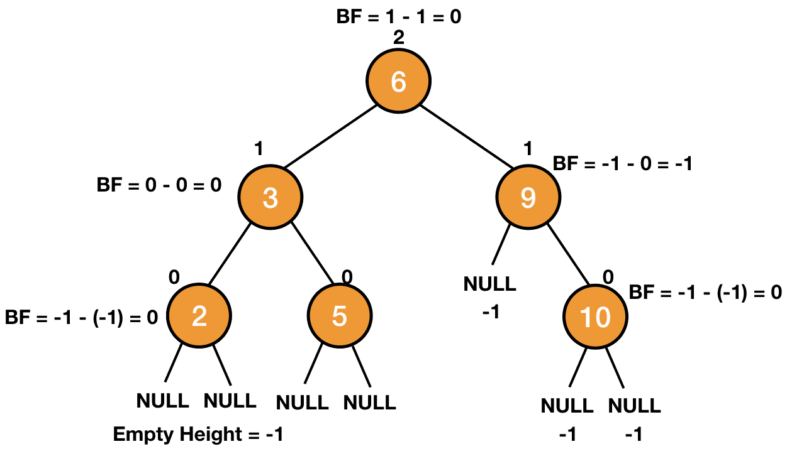

<br/>

- 이진탐색트리는 삽입순서에 따라 한쪽으로 노드가 쏠릴 수 있다는 문제점이 있었음.
    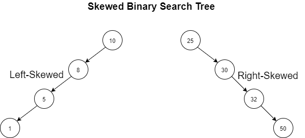
    - 위와 같은 형태의 트리에서 특정값을 찾으려면 O(N)의 시간이 필요.
    - 예로 1을 찾으려면 모든 노드를 탐색해야지 찾을 수 있고 따라서 성능이 매우 나빠지게 됨.
    - 이진탐색트리 연산 실행시간은 이진탐색트리의 높이에 따라 달라지는데 최상의 성능을 얻으려면 트리의 균형을 유지해야 함. (균등 트리일 때는 시간복잡도가 O(logN)이 나오지만 편향 트리일 때는 O(N))
    - 탐색, 삽입, 삭제 연산의 수행시간이 항상 O(logN)이 나오도록 보장하기 위해 AVL 트리를 사용하는 것.

<br/>

- AVL트리는 스스로 균형을 잡으므로 한쪽으로 노드가 쏠리지 않아 시간복잡도가 보장됨.
    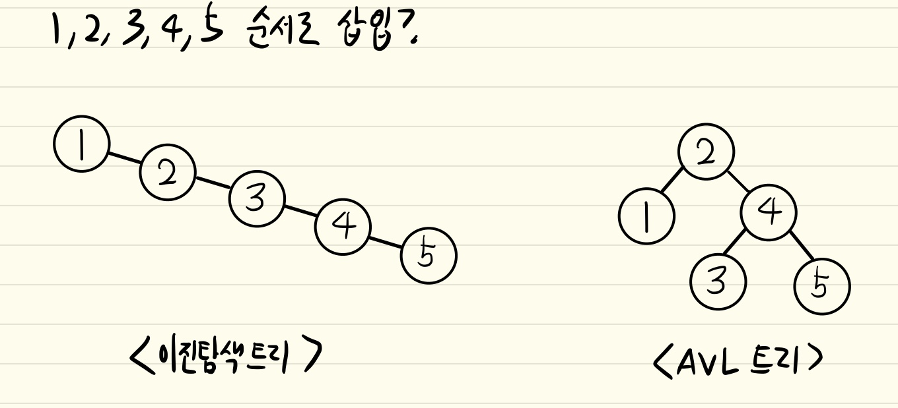

### 이진탐색트리 vs AVL트리 시간복잡도
|이진탐색트리|평균|최악|
|:---|:---:|:---:|
|삽입|$O(logn)$|$O(n)$|
|삭제|$O(logn)$|$O(n)$|
|탐색|$O(logn)$|$O(n)$|

|AVL트리|평균|최악|
|:---|:---:|:---:|
|삽입|$O(logn)$|$O(logn)$|
|삭제|$O(logn)$|$O(logn)$|
|탐색|$O(logn)$|$O(logn)$|

### 균형도(Balance Factor; BF)
- AVL 트리는 균형도라는 것을 이용하여 삽입과 삭제 시에 트리의 균형을 맞춤.
- 각 노드마다 균형도가 있으며 균형도가 절대값 2 미만이면 **균형트리**, 절대값 2 이상이면 **불균형 트리**임. (AVL 트리는 모든 노드의 BF가 -1, 0, 1 중 하나여야 함. 이를 벗어나면 균형이 깨진 것이고, 이 때 회전이 필요.)
- 불균형 트리의 경우 균형을 맞추기 위한 연산이 이뤄지기 때문에 균형도가 2 이상인 AVL 트리는 존재하지 않음.
- 균형도를 계산하기 위해선 각 노드의 높이부터 계산해야 함.

<br/>

- 높이 구하기 :
    - 높이는 리프노드에서부터 아래에서 위로 계산함
    - **리프 노드의 높이는 항상 0**
    - 부모 노드의 높이는 두 자식 노드의 높이 중 더 큰 값에 1을 더하여 계산됨.
    - **부모 노드의 높이 = Max(왼쪽 자식 노드의 높이, 오른쪽 자식 노드의 높이)+1**
    - **자식이 없는 노드는 null 노드라고 하며 높이를 -1로 가정함**
        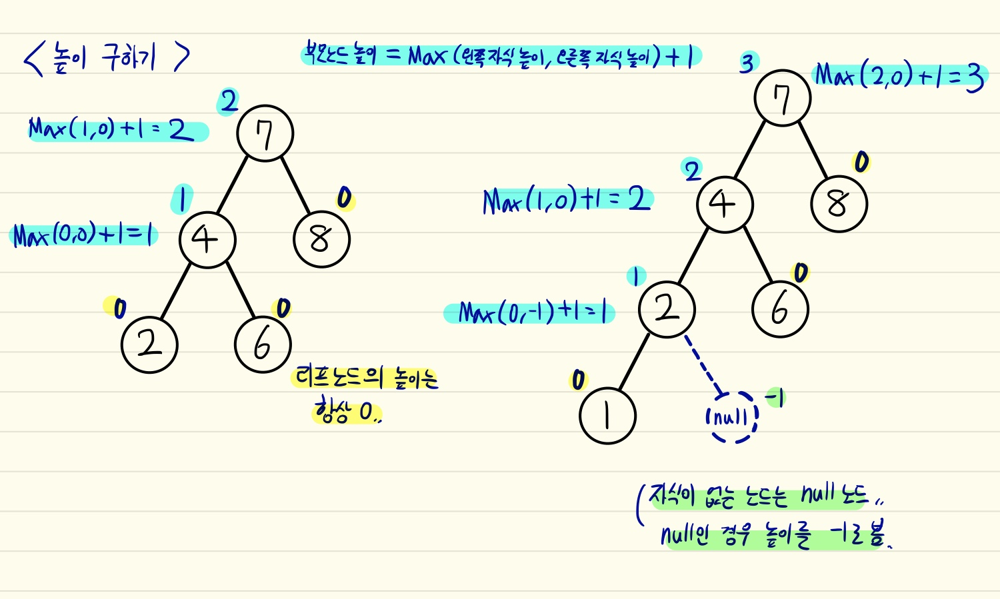
    
<br/>

- 균형도 구하기 :
    - **부모 노드 균형도 = 왼쪽 자식 노드 높이 - 오른쪽 자식 노드 높이**
    - 균형도 또한 리프노드에서부터 아래에서 위로 계산함
    - **리프 노드의 균형도는 항상 0**
    - **null 노드는 높이와 마찬가지로 균형도가 -1**
        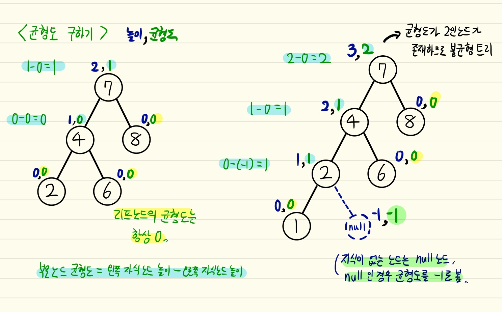

<br/>

- 균형도를 보면 좌측으로 쏠려있는지 우측으로 쏠려있는지 알 수 있는 지표가 됨.
    - **균형도가 양수**이면 **좌측으로 쏠려있는 트리**
    - **균형도가 음수**이면 **우측으로 쏠려있는 트리**
        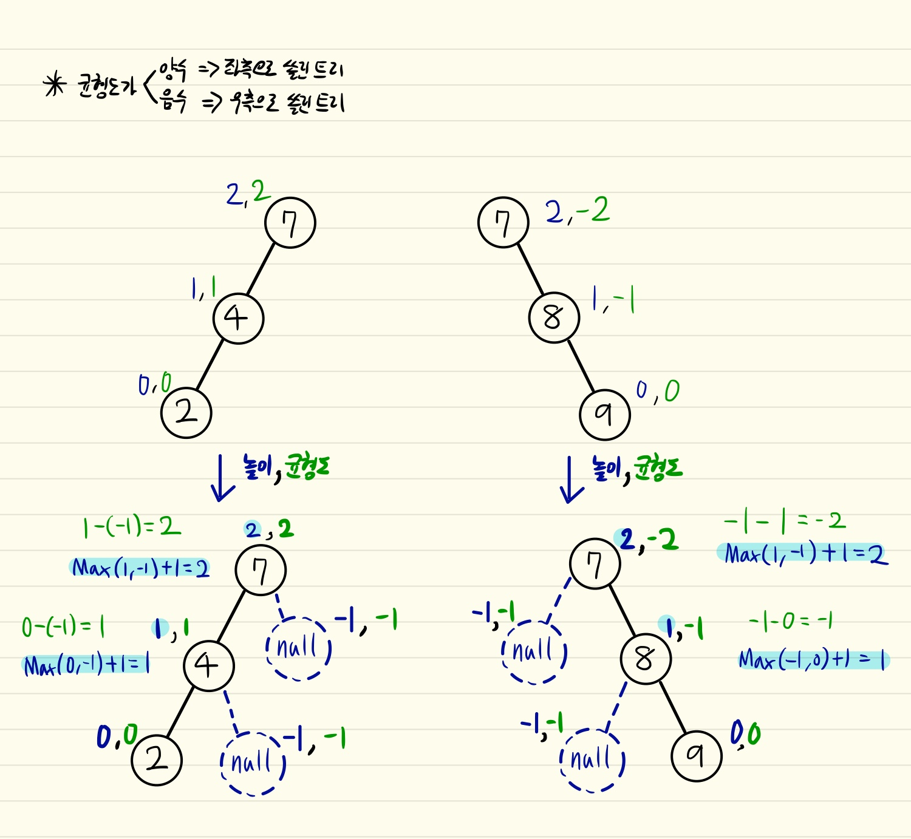

### 불균형 문제
- 트리의 삽입 또는 삭제로 인해 트리의 균형도가 무너질 수 있으며, 균형도가 무너진 불균형 트리는 균형도가 양수냐 음수냐에 따라 4가지 문제로 나눌 수 있음.
    1. `LL 문제` : 삽입 또는 삭제로 인해 Left-Left로 서브 트리가 비대해지는 것을 LL문제라고 함.
        - 부모노드의 균형도와 왼쪽 자식노드의 균형도 양수
    2. `RR 문제` : 삽입 또는 삭제로 인해 Right-Right로 서브 트리가 비대해지는 것을 RR문제라고 함.
        - 부모노드의 균형도와 오른쪽 자식노드의 균형도 음수
            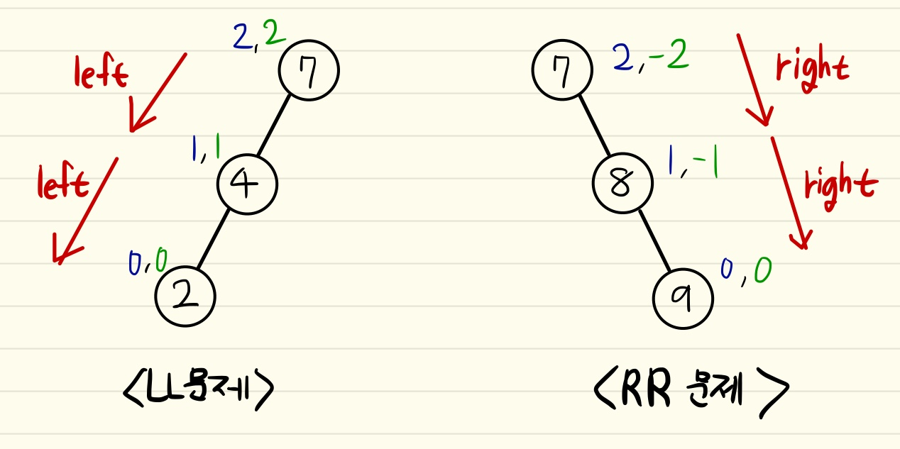
    3. `LR 문제` : 삽입 또는 삭제로 인해 Left-Right로 서브 트리가 비대해지는 것을 LR문제라고 함. (좌측이 비대한 문제와 우측이 비대한 문제가 섞인 문제)
        - 부모노드의 균형도 양수 왼쪽 자식노드의 균형도 음수
    4. `RL 문제` : 삽입 또는 삭제로 인해 Right-Left로 서브 트리가 비대해지는 것을 RL문제라고 함. (우측이 비대한 문제와 좌측이 비대한 문제가 섞인 문제)
        - 부모노드의 균형도 음수 오른쪽 자식노드의 균형도 양수
            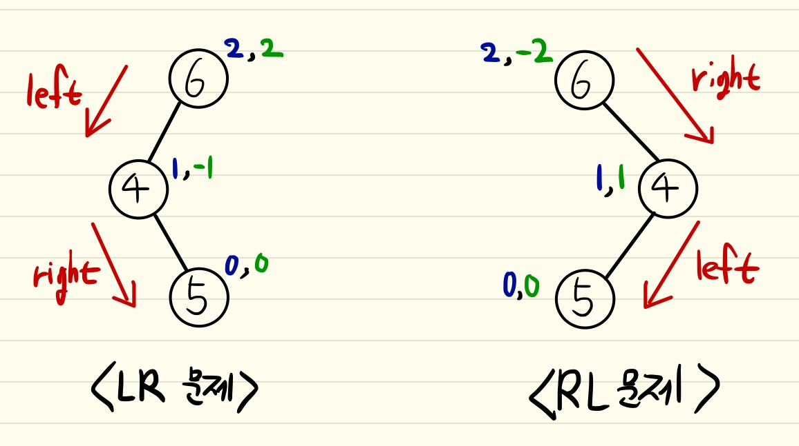

<br/>

- 데이터 삽입이나 삭제 후에 균형도를 체크.
- 이 4가지 문제를 해결하기 위해 노드를 회전시켜서 균형도를 2 미만으로 맞춰야, 불균형 트리를 균형 트리로 만들 수 있음
    - LL 문제 해결 -> `LL 회전` : LL 문제를 해결하기 위한 회전
        1. 부모 노드를 왼쪽 자식노드의 오른쪽 자식으로 연결
        2. 왼쪽 자식의 오른쪽 자식을 부모 노드의 왼쪽 자식으로 연결
        3. 새로운 부모 노드로 승격
        4. 트리 높이 재계산
        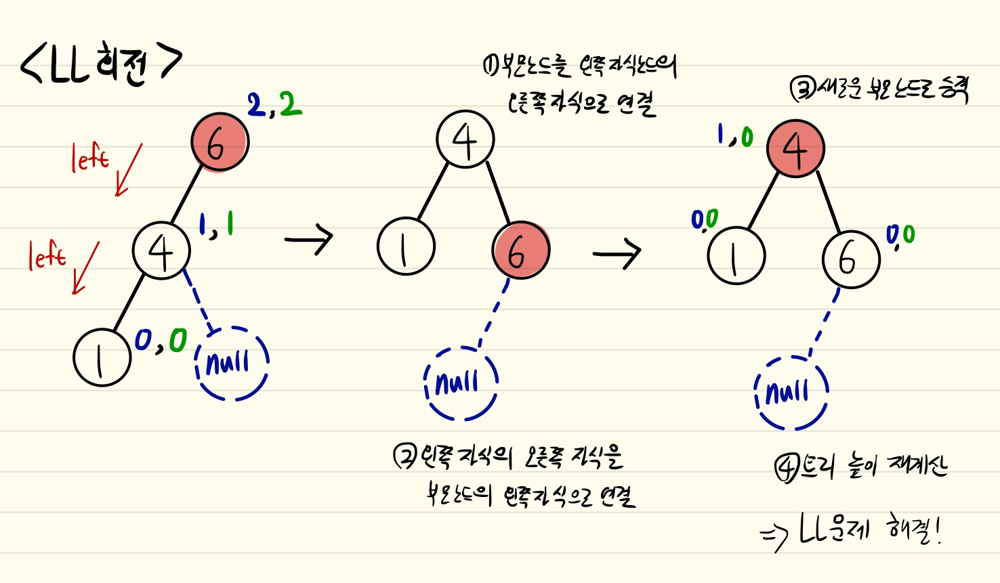
    - RR 문제 해결 ->`RR 회전` : RR 문제를 해결하기 위한 회전
        1. 부모 노드를 오른쪽 자식노드의 왼쪽 자식으로 연결
        2. 오른쪽 자식의 왼쪽 자식을 부모 노드의 오른쪽 자식으로 연결
        3. 새로운 부모 노드로 승격
        4. 트리 높이 재계산
        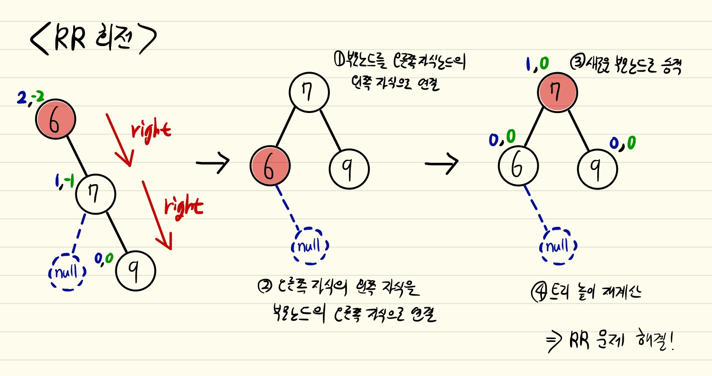
    - LR 문제 해결 -> `LR 회전` =  `RR 회전` + `LL 회전`
        1. 부모 노드를 오른쪽 자식노드의 왼쪽 자식으로 연결
        2. 오른쪽 자식의 왼쪽 자식을 부모 노드의 오른쪽 자식으로 연결
        3. 새로운 부모 노드로 승격
        4. 트리 높이 재계산
        5. 부모 노드를 왼쪽 자식노드의 오른쪽 자식으로 연결
        6. 왼쪽 자식의 오른쪽 자식을 부모 노드의 왼쪽 자식으로 연결
        7. 새로운 부모 노드로 승격
        8. 트리 높이 재계산
        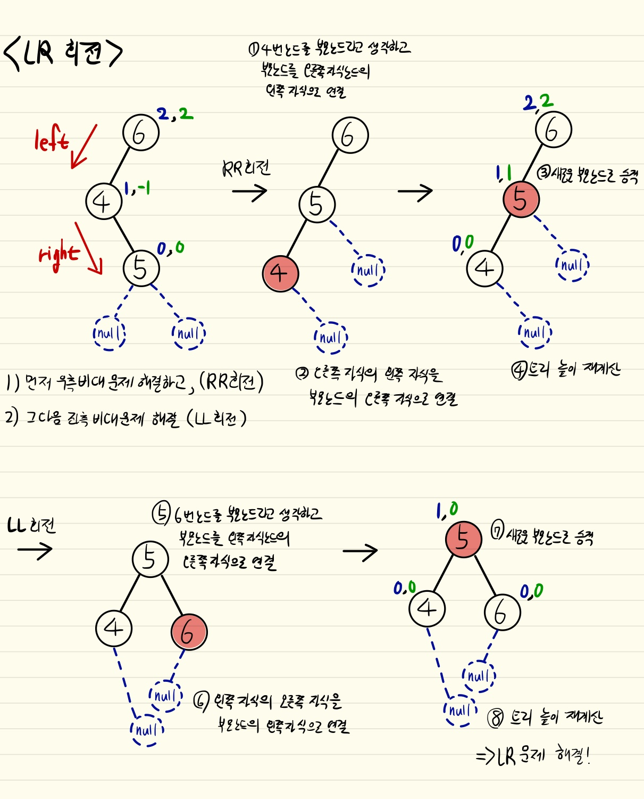
    - RL 문제 해결 -> `RL 회전` =  `LL 회전` + `RR 회전`
        1. 부모 노드를 왼쪽 자식노드의 오른쪽 자식으로 연결
        2. 왼쪽 자식의 오른쪽 자식을 부모 노드의 왼쪽 자식으로 연결
        3. 새로운 부모 노드로 승격
        4. 트리 높이 재계산
        5. 부모 노드를 오른쪽 자식노드의 왼쪽 자식으로 연결
        6. 오른쪽 자식의 왼쪽 자식을 부모 노드의 오른쪽 자식으로 연결
        7. 새로운 부모 노드로 승격
        8. 트리 높이 재계산
        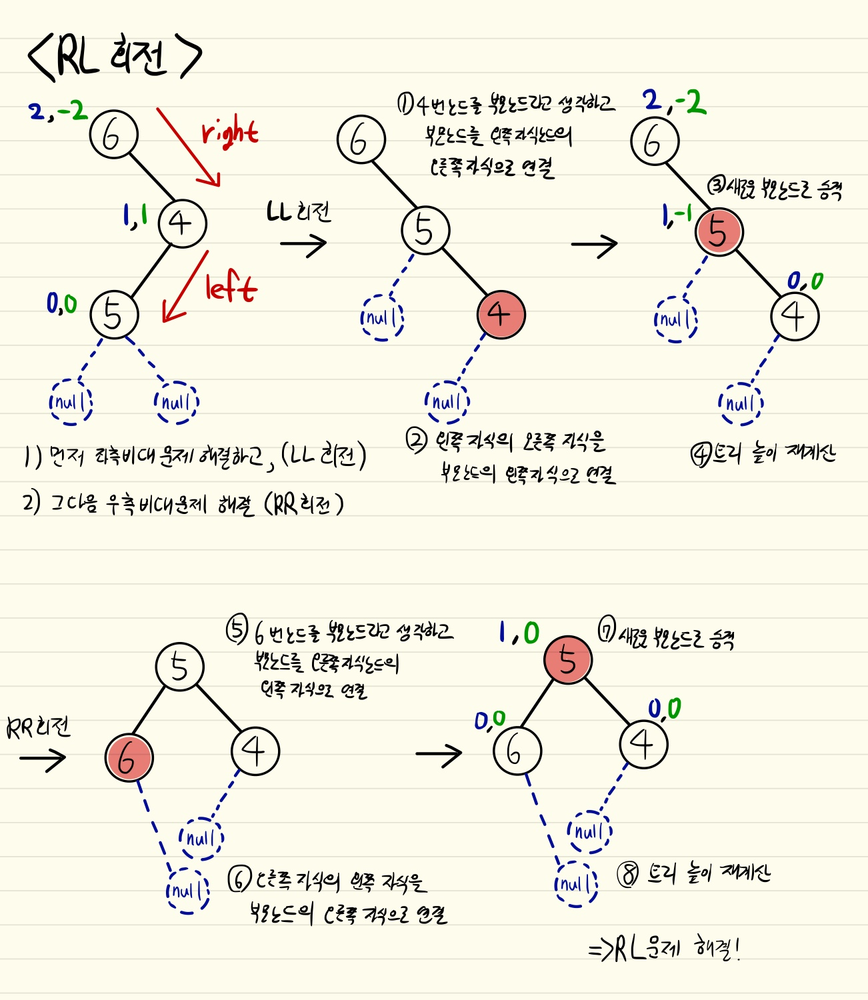

### AVL 트리의 삽입과 삭제
- 삽입 : 
    - 이진탐색트리의 삽입과 동일하게 새로운 노드를 삽입한다.
    - 새로이 삽입한 노드로부터 루트노드로 거슬러 올라가며 각 노드의 서브트리 높이 차이를 갱신한다. 이때 가장 먼저 불균형이 발생한 노드를 발견하면, 이 노드를 기준으로 새 노드가 어디에 삽입되었는가에 따라 적절한 회전 연산을 수행한다.
<br/><br/>
- 삭제 :
    - 이진탐색트리에서와 동일한 삭제 연산을 수행한다.
    - 삭제된 노드로부터 루트노드 방향으로 거슬로 올라가며 불균형이 발생한 경우 적절한 회전연산을 수행한다.
    - 회전연산 수행 후에 부모노드에서 불균형이 발생할 수도 있고, 이러한 일이 반복되어 루트노드에서 회전연산을 수행해야 하는 경우도 발생한다. 

<br/>

- 자바 구현 코드 :
    ```java
    class Node
    {
        int key, height;
        Node left, right;

        Node(int d)
        {
            key = d;
            height = 1;
        }
    }

    class AVLTree
    {
        Node root;

        // A utility function to get height of the tree
        int height(Node N)
        {
            if (N == null)
                return 0;
            return N.height;
        }

        // A utility function to get maximum of two integers
        int max(int a, int b)
        {
            return (a > b) ? a : b;
        }

        // A utility function to right rotate subtree rooted with y
        // See the diagram given above.
        Node rightRotate(Node y)
        {
            Node x = y.left;
            Node T2 = x.right;

            // Perform rotation
            x.right = y;
            y.left = T2;

            // Update heights
            y.height = max(height(y.left), height(y.right)) + 1;
            x.height = max(height(x.left), height(x.right)) + 1;

            // Return new root
            return x;
        }

        // A utility function to left rotate subtree rooted with x
        // See the diagram given above.
        Node leftRotate(Node x)
        {
            Node y = x.right;
            Node T2 = y.left;

            // Perform rotation
            y.left = x;
            x.right = T2;

            // Update heights
            x.height = max(height(x.left), height(x.right)) + 1;
            y.height = max(height(y.left), height(y.right)) + 1;

            // Return new root
            return y;
        }

        // Get Balance factor of node N
        int getBalance(Node N)
        {
            if (N == null)
                return 0;
            return height(N.left) - height(N.right);
        }

        Node insert(Node node, int key)
        {
            /* 1. Perform the normal BST rotation */
            if (node == null)
                return (new Node(key));

            if (key < node.key)
                node.left = insert(node.left, key);
            else if (key > node.key)
                node.right = insert(node.right, key);
            else // Equal keys not allowed
                return node;

            /* 2. Update height of this ancestor node */
            node.height = 1 + max(height(node.left),
                                height(node.right));

            /* 3. Get the balance factor of this ancestor
            node to check whether this node became
            Wunbalanced */
            int balance = getBalance(node);

            // If this node becomes unbalanced, then
            // there are 4 cases Left Left Case
            if (balance > 1 && key < node.left.key)
                return rightRotate(node);

            // Right Right Case
            if (balance < -1 && key > node.right.key)
                return leftRotate(node);

            // Left Right Case
            if (balance > 1 && key > node.left.key)
            {
                node.left = leftRotate(node.left);
                return rightRotate(node);
            }

            // Right Left Case
            if (balance < -1 && key < node.right.key)
            {
                node.right = rightRotate(node.right);
                return leftRotate(node);
            }

            /* return the (unchanged) node pointer */
            return node;
        }

        /* Given a non-empty binary search tree, return the
        node with minimum key value found in that tree.
        Note that the entire tree does not need to be
        searched. */
        Node minValueNode(Node node)
        {
            Node current = node;

            /* loop down to find the leftmost leaf */
            while (current.left != null)
            current = current.left;

            return current;
        }

        Node deleteNode(Node root, int key)
        {
            // STEP 1: PERFORM STANDARD BST DELETE
            if (root == null)
                return root;

            // If the key to be deleted is smaller than
            // the root's key, then it lies in left subtree
            if (key < root.key)
                root.left = deleteNode(root.left, key);

            // If the key to be deleted is greater than the
            // root's key, then it lies in right subtree
            else if (key > root.key)
                root.right = deleteNode(root.right, key);

            // if key is same as root's key, then this is the node
            // to be deleted
            else
            {

                // node with only one child or no child
                if ((root.left == null) || (root.right == null))
                {
                    Node temp = null;
                    if (temp == root.left)
                        temp = root.right;
                    else
                        temp = root.left;

                    // No child case
                    if (temp == null)
                    {
                        temp = root;
                        root = null;
                    }
                    else // One child case
                        root = temp; // Copy the contents of
                                    // the non-empty child
                }
                else
                {

                    // node with two children: Get the inorder
                    // successor (smallest in the right subtree)
                    Node temp = minValueNode(root.right);

                    // Copy the inorder successor's data to this node
                    root.key = temp.key;

                    // Delete the inorder successor
                    root.right = deleteNode(root.right, temp.key);
                }
            }

            // If the tree had only one node then return
            if (root == null)
                return root;

            // STEP 2: UPDATE HEIGHT OF THE CURRENT NODE
            root.height = max(height(root.left), height(root.right)) + 1;

            // STEP 3: GET THE BALANCE FACTOR OF THIS NODE (to check whether
            // this node became unbalanced)
            int balance = getBalance(root);

            // If this node becomes unbalanced, then there are 4 cases
            // Left Left Case
            if (balance > 1 && getBalance(root.left) >= 0)
                return rightRotate(root);

            // Left Right Case
            if (balance > 1 && getBalance(root.left) < 0)
            {
                root.left = leftRotate(root.left);
                return rightRotate(root);
            }

            // Right Right Case
            if (balance < -1 && getBalance(root.right) <= 0)
                return leftRotate(root);

            // Right Left Case
            if (balance < -1 && getBalance(root.right) > 0)
            {
                root.right = rightRotate(root.right);
                return leftRotate(root);
            }

            return root;
        }

        // A utility function to print preorder traversal of
        // the tree. The function also prints height of every
        // node
        void preOrder(Node node)
        {
            if (node != null)
            {
                System.out.print(node.key + " ");
                preOrder(node.left);
                preOrder(node.right);
            }
        }

        public static void main(String[] args)
        {
            AVLTree tree = new AVLTree();

            /* Constructing tree given in the above figure */
            tree.root = tree.insert(tree.root, 9);
            tree.root = tree.insert(tree.root, 5);
            tree.root = tree.insert(tree.root, 10);
            tree.root = tree.insert(tree.root, 0);
            tree.root = tree.insert(tree.root, 6);
            tree.root = tree.insert(tree.root, 11);
            tree.root = tree.insert(tree.root, -1);
            tree.root = tree.insert(tree.root, 1);
            tree.root = tree.insert(tree.root, 2);

            /* The constructed AVL Tree would be
            9
            / \
            1 10
            / \ \
            0 5 11
            / / \
            -1 2 6
            */
            System.out.println("Preorder traversal of "+
                                "constructed tree is : ");
            tree.preOrder(tree.root);

            tree.root = tree.deleteNode(tree.root, 10);

            /* The AVL Tree after deletion of 10
            1
            / \
            0 9
            /	 / \
            -1 5 11
            / \
            2 6
            */
            System.out.println("");
            System.out.println("Preorder traversal after "+
                            "deletion of 10 :");
            tree.preOrder(tree.root);
        }
    }
    // This code has been contributed by Mayank Jaiswal
    ```