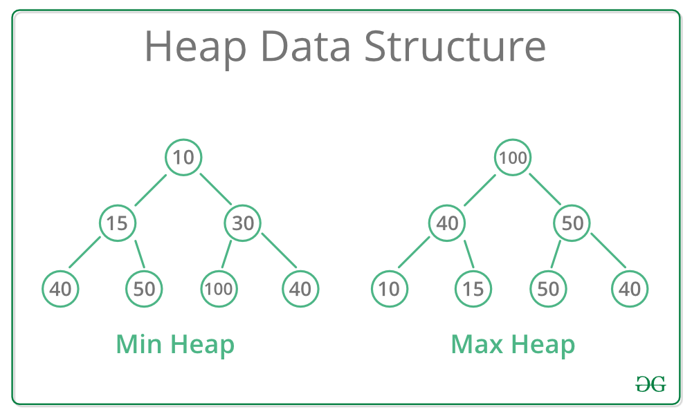
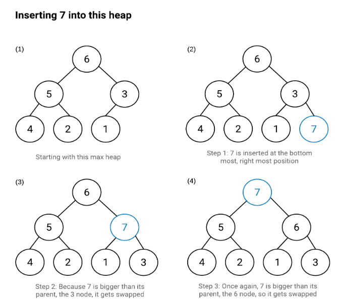
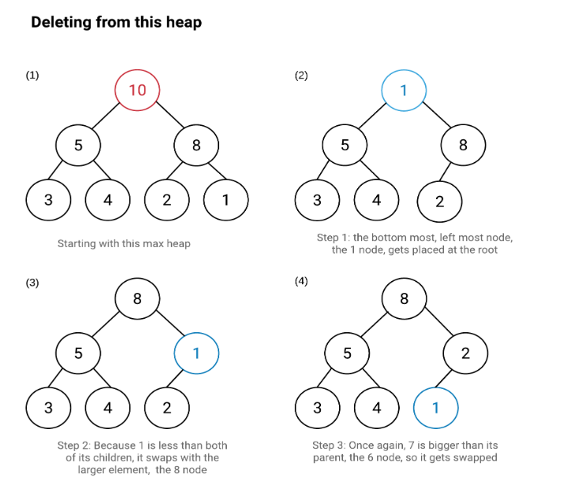

# Binary Heap

 

## 힙(Heap)

### 힙이란
힙(heap)은 이진 힙(binary heap)이라고도 하며, 최댓값 및 최솟값을 찾아내는 연산을 빠르게 하기 위해 고안된 완전 이진트리(complete binary tree)를 기본으로 한 자료구조

### 힙의 특징
- 힙은 완전 이진트리(Complete Binary Tree)의 일종으로 우선 순위 큐를 위하여 만들어진 자료구조이다.
- 여러 개의 값들 중에서 최댓값이나 최솟값을 빠르게 찾아내도록 만들어진 자료구조이다.
- 힙은 일종의 반정렬 상태(느슨한 정렬 상태) 를 유지한다.
    - 큰 값이 상위 레벨에 있고 작은 값이 하위 레벨에 있다는 정도
    - 간단히 말하면 부모 노드의 키 값이 자식 노드의 키 값보다 항상 큰(작은) 이진 트리를 말한다.
- 힙 트리에서는 중복된 값을 허용한다. (이진 탐색 트리에서는 중복된 값을 허용하지 않는다.)
- 부모노드의 키값과 자식노드의 키값 사이에는 대소관계가 성립한다.
- 키값 대소관계는 오로지 부모자식 간에만 성립되며 형제사이에는 대소관계가 정해지지 않음.

### 우선순위 큐
- 우선순위의 개념을 큐에 도입한 자료 구조. 데이터들이 우선순위를 가지고 있고 우선순위가 높은 데이터가 먼저 나간다.

    |자료구조|삭제되는 요소|
    |:---|:---:|
    |스택(Stack)|가장 최근에 들어온 데이터|
    |큐(Queue)|가장 먼저 들어온 데이터|
    |우선순위 큐(Priority Queue)|가장 우선순위가 높은 데이터|

- 우선순위 큐는 배열, 연결리스트, 힙으로 구현이 가능하다. 이 중에서 힙(heap)으로 구현하는 것이 가장 효율적이다.

    |우선순위 큐 구현 방법|삽입|삭제|
    |:---|:---:|:---:|
    |순서 없는 배열|O(1)|O(n)|
    |순서 없는 연결 리스트|O(1)|O(n)|
    |정렬된 배열|O(n)|O(1)|
    |정렬된 연결 리스트|O(n)|O(1)|
    |힙(heap)|O(logn)|O(logn)|

### 힙의 종류
- 최대 힙(max heap)
    - 부모 노드의 키 값이 자식 노드의 키 값보다 크거나 같은 완전 이진 트리
    - 최댓값이 루트노드에 있음
    - 부모 노드의 키값 >= 자식 노드의 키값
- 최소 힙(min heap)
    - 부모 노드의 키 값이 자식 노드의 키 값보다 작거나 같은 완전 이진 트리
    - 최솟값이 루트노드에 있음
    - 부모 노드의 키값 <= 자식 노드의 키값
    
    

## 힙의 구현
- 힙을 저장하는 표준적인 자료구조는 배열 이다.
- 구현을 쉽게 하기 위하여 배열의 첫 번째 인덱스인 0은 사용되지 않으며 1부터 사용한다.
- 특정 위치의 노드 번호는 새로운 노드가 추가되어도 변하지 않는다.
    - 예를 들어 루트 노드의 오른쪽 노드의 번호는 항상 3이다.
- 힙에서의 부모 노드와 자식 노드의 관계
    - 왼쪽 자식의 인덱스 = (부모의 인덱스) * 2
    - 오른쪽 자식의 인덱스 = (부모의 인덱스) * 2 + 1
    - 부모의 인덱스 = (자식의 인덱스) / 2
    

### 힙의 삽입
1. 힙에 새로운 요소가 들어오면, 일단 새로운 노드를 힙의 마지막 노드에 이어서 삽입한다.
2. 새로운 노드를 부모 노드들과 교환해서 힙의 성질을 만족시킨다.
    

### 힙의 삭제
1. 최대 힙에서 최댓값은 루트 노드이므로 루트 노드가 삭제된다.
2. 최대 힙(max heap)에서 삭제 연산은 최댓값을 가진 요소를 삭제하는 것이다.
3. 삭제된 루트 노드에는 힙의 마지막 노드를 가져온다.
힙을 재구성한다.
    

## 힙 정렬(Heap Sort)
### 힙 정렬 알고리즘
- 최대 힙 트리나 최소 힙 트리를 구성해 정렬을 하는 방법
- 내림차순 정렬을 위해서는 최대 힙을 구성하고 오름차순 정렬을 위해서는 최소 힙을 구성하면 된다.
- 과정 설명
    1. 정렬해야 할 n개의 요소들로 최대 힙(완전 이진 트리 형태)을 만든다.
        - 내림차순을 기준으로 정렬
    2. 그 다음으로 한 번에 하나씩 요소를 힙에서 꺼내서 배열의 뒤부터 저장하면 된다.
    3. 삭제되는 요소들(최댓값부터 삭제)은 값이 감소되는 순서로 정렬되게 된다.

### 내림차순 정렬을 위한 최대 힙(max heap)의 구현
- 힙(heap)은 1차원 배열로 쉽게 구현될 수 있다.
- 정렬해야 할 n개의 요소들을 1차원 배열에 기억한 후 최대 힙 삽입을 통해 차례대로 삽입한다.
- 최대 힙으로 구성된 배열에서 최댓값부터 삭제한다.

(1) 최대 힙의 삽입
1. 힙에 새로운 요소가 들어오면, 일단 새로운 노드를 힙의 마지막 노드에 이어서 삽입한다.
2. 새로운 노드를 부모 노드들과 교환해서 힙의 성질을 만족시킨다.

(2) 최대 힙의 삭제
1. 최대 힙에서 최댓값은 루트 노드이므로 루트 노드가 삭제된다.
2. 최대 힙(max heap)에서 삭제 연산은 최댓값을 가진 요소를 삭제하는 것이다.
삭제된 루트 노드에는 힙의 마지막 노드를 가져온다.
3. 힙을 재구성한다.

### 힙 정렬 알고리즘의 특징
- 시간 복잡도가 좋은편
- 힙 정렬이 가장 유용한 경우는 전체 자료를 정렬하는 것이 아니라 가장 큰 값 몇개만 필요할 때이다.

### 정렬 알고리즘 시간복잡도 비교
|정렬이름|최고|평균|최악|Run-time(정수60,000개) 단위: sec|
|:---|:---:|:---:|:---:|:---:|
|삽입정렬|O(n)|O($n^2$)|O($n^2$)|7.483|
|선택정렬|O($n^2$)|O($n^2$)|O($n^2$)|10.842|
|버블정렬|O($n^2$)|O($n^2$)|O($n^2$)|22.894|
|쉘 정렬|O(n)|O($n^{1.5}$)|O($n^2$)|0.056|
|퀵 정렬|O($nlogn$)|O($nlogn$)|O($n^2$)|0.014|
|힙 정렬|O($nlogn$)|O($nlogn$)|O($nlogn$)|0.034|
|병합정렬|O($nlogn$)|O($nlogn$)|O($nlogn$)|0.026|

- 단순(구현이 간단)하지만 비효율적인 방법
    - 삽입 정렬, 선택 정렬, 버블 정렬
- 구현이 복잡하지만 효율적인 방법
    - 퀵 정렬, 힙 정렬, 병합 정렬

### PriorityQueue의 동작 원리가 어떻게 되나요? (N사 전화면접)
우선순위큐는 가장 우선순위가 높은 데이터를 먼저 꺼내기 위해 고안된 자료구조입니다. 우선순위 큐를 구현하기 위해서 일반적으로 힙을 사용합니다. 힙은 완전이진트리를 통해서 구현되었기 때문에 우선순위 큐의 시간복잡도는 O(logn)입니다.

우선순위 큐는 힙이라는 자료구조를 가지고 구현합니다. top이 최대면 최대힙, top이 최소면 최소힙으로 표현합니다. 힙으로 구현된 이진 트리는 모든 정점이 자신의 자식 요소보다 우선순위가 높다는 성질을 가지고 있습니다. 이 성질을 통해 삽입과 삭제 연산을 모두 O(logN)으로 수행할 수 있습니다.