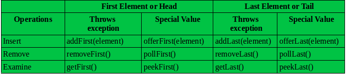

# Deque

</br>

## 덱(Deque)

### 덱이란
덱은 선형 자료구조의 일종으로, Deque는 Double-ended queue(양방향 큐)의 줄임말.<br/> 
한쪽에서만 삽입, 다른 한쪽에서만 삭제가 가능했던 큐와 달리 양쪽 front(전단), rear(후단)에서 삽입 삭제가 모두 가능한 큐를 의미하는 자료구조.


### 덱의 특징
- queue와 비슷하지만 queue는 front에서만 삭제하고, rear에서 삽입하는데, deque는 front와 rear에서 삭제와 삽입이 모두 가능
- deque은 가장 먼저 들어간 데이터를 가리키는 front 변수와 마지막으로 들어간 데이터를 가리키는 rear 변수를 갖고 있음.
- 덱(Deque)은 어떤 쪽으로 입력하고 어떤 쪽으로 출력하느냐에 따라서 스택(Stack)으로 사용할 수도 있고, 큐(Queue)로도 사용할 수 있음.
- 한쪽으로만 입력 가능하도록 설정한 덱을 스크롤(scroll)이라고 하며, 한쪽으로만 출력 가능하도록 설정한 덱을 셸프(shelf)라고 함. 
- 데이터를 앞, 뒤쪽에서 모두 삽입 삭제하는 과정이 필요한 경우 활용함.

### 자바에서의 덱
- Deque는 자바에서 인터페이스.
- Deque 인터페이스를 구현한 구현체로는 ArrayDeque, LinkedBlockingDeque, ConcurrentLinkedDeque, LinkedList 등의 클래스가 있음.


### 덱 인터페이스의 메소드
- insert method :
    
- remove method :
    
- view method :
    
- 정리  
    
    - ```void addFirst(E element)``` : 덱의 맨 앞에 element 추가. 공간이 부족할 경우 IllegalStateException 발생
	- ```boolean offerFirst​(E element)``` : 덱의 맨 앞에 element 추가. element가 덱에 추가되었을 경우 true 리턴 아니면 false 리턴.
    - ```void addLast​(E element)``` : 덱의 맨 뒤에 element 추가. 공간이 부족할 경우 IllegalStateException 발생
    - ```boolean offerLast​(E element)``` : 덱의 맨 뒤에 element 추가. element가 덱에 추가되었을 경우 true 리턴 아니면 false 리턴.
    - ```E	removeFirst()``` : 덱의 첫번째 element 덱에서 삭제하고 해당 element 리턴. 덱이 비어있다면 NoSuchElementException 발생
    - ```E	pollFirst()``` : 덱의 첫번째 element 덱에서 삭제하고 해당 element 리턴. 덱이 비어있다면 null 리턴.
    - ```E removeLast()``` :  덱의 마지막 element 덱에서 삭제하고 해당 element 리턴. 덱이 비어있다면 NoSuchElementException 발생
    - ```E pollLast()``` : 덱의 마지막 element 덱에서 삭제하고 해당 element 리턴. 덱이 비어있다면 null 리턴.
    - ```E getFirst()``` : 덱의 첫번째 요소 제거 하지않고 리턴. 덱이 비어있다면 NoSuchElementException 발생
    - ```E peekFirst()``` : 덱의 첫번째 요소 제거 하지않고 리턴. 덱이 비어있다면 null 리턴.
    - ```E getLast()``` : 덱의 마지막 요소 제거 하지않고 리턴. 덱이 비어있다면 NoSuchElementException 발생
    - ```E peekLast()``` : 덱의 마지막 요소 제거 하지않고 리턴. 덱이 비어있다면 null 리턴.


### 덱의 시간복잡도
- 원소의 삽입 : O(1) (덱의 front 혹은 rear에 데이터를 넣는 연산)
- 원소의 삭제 : O(1) (덱의 front 혹은 rear에 위치한 데이터를 삭제하는 연산)
- 원소의 접근 : O(1) (제일 앞, 뒤쪽만 확인 가능)

### 덱의 장단점
- 원소를 양끝에서 빠르게 삽입/제거 가능
- 어떠한 순서로도 원소들을 순회할 수 있음
- 양끝 위치가 아닌 곳에서 삽입/제거 수행시 그 성능은 list에 비해 현저히 떨어짐. (중간에서의 삽입 삭제가 어렵다)

### 덱의 구현
연결리스트를 이용하여 구현함.
```java
import Interface_form.Queue;
 
import java.util.Arrays;
import java.util.Comparator;
import java.util.NoSuchElementException;
 
/**
*
* @param <E> the type of elements in this Deque
* 
* @author st-lab.tistory.com
* @version 1.0
* @see Queue
* 
*/
 
public class LinkedListDeque<E> implements Queue<E>, Cloneable {
 
	private Node<E> head;	// 가장 앞에 있는 노드를 가리키는 변수 
	private Node<E> tail;	// 가장 뒤에 있는 노드를 가리키는 변수 
	private int size;	// 요소(노드)의 개수 
 
	public LinkedListDeque() {
		head = null;
		tail = null;
		size = 0;
	}
 
 
	public boolean offerFirst(E value) {	
		Node<E> newNode = new Node<E>(value);	// 새 노드 생성
		newNode.next = head;	// 새 노드의 다음 노드로 head 노드를 연결 
 
		/**
		 * head가 null이 아닐 경우에만 기존 head노드의 prev 변수가
		 * 새 노드를 가리키도록 한다. 
		 * 이유는 기존 head노드가 없는 경우(null)는 데이터가 
		 * 아무 것도 없던 상태였으므로 head.prev를 하면 잘못된 참조가 된다. 
		 */
		if (head != null) {
			head.prev = newNode;
		}
		
		head = newNode;	// head가 가리키는 노드가 새 노드를 가리키도록 한다. 
		size++;
 
		/**
		 * 다음에 가리킬 노드가 없는 경우(=데이터가 새 노드밖에 없는 경우 = 이전의 head가 null인경우)
		 * 데이터가 한 개(새 노드)밖에 없으므로 새 노드는 처음 시작노드이자
		 * 마지막 노드다. 즉 tail = head 다.
		 */
		if (head.next == null) {
			tail = head;
		}
		return true;
	}
	
	
	@Override
	public boolean offer(E value) {
		return offerLast(value);
	}
 
	public boolean offerLast(E value) {
 
		// 데이터가 없을 경우 offerFirst()로 인자를 넘겨줌 
		if (size == 0) {
			return offerFirst(value);
		}
 
		Node<E> newNode = new Node<E>(value);
		
		tail.next = newNode;	// tail이 가리키는 노드의 다음 노드를 새 노드를 가리키도록 연결 
		newNode.prev = tail;	// 새 노드가 가리키는 이전노드 또한 tail이 가리키는 노드로 연결 
		tail = newNode;	// tail이 가리키는 노드를 새 노드로 가리키도록 변경 
		size++;
 
		return true;
	}
	
	@Override
	public E poll() {
		return pollFirst();
	}
 
	public E pollFirst() {
		if (size == 0) {
			return null;
		}
 
		E element = head.data;	// 반환하기 위한 데이터
 
		Node<E> nextNode = head.next;	// head의 다음노드 
		
		// head가 가리키는 모든 데이터들 삭제
		head.data = null;
		head.next = null;
		
		// 삭제하기전 데이터가 두 개 이상 있을 경우(head와 tail이 같지 않은 경우)
		if (nextNode != null) {
			nextNode.prev = null;
		}
		head = null;
		head = nextNode;	// head가 가리키는 노드를 삭제한 노드의 다음 노드로 갱신
		size--;
		
		/**
		 * 삭제된 요소가 덱의 유일한 요소였을 경우
		 * 그 요소는 head 이자 tail이었으므로 
		 * 삭제되면서 tail도 가리킬 요소가 없기 때문에
		 * size가 0일경우 tail도 null로 변환
		 */
		if(size == 0) {
			tail = null;
		}
		
		return element;
	}
 
	public E remove() {
		return removeFirst();
	}
	
	public E removeFirst() {
		E element = poll();
		
		if(element == null) {
			throw new NoSuchElementException();
		}
		return element;
	}
	
	public E pollLast() {
		if (size == 0) {
			return null;
		}
		
		E element = tail.data;	// 반환하기 위한 데이터
		
		Node<E> prevNode = tail.prev;
		
		// tail이 가리키는 노드의 데이터와 링크 삭제
		tail.data = null;
		tail.prev = null;
		
		// 삭제하기전 데이터가 두 개 이상 있을 경우(head와 tail이 같지 않을 경우)
		if (prevNode != null) {
			prevNode.next = null;
		}
		
		tail = null;
		tail = prevNode;
		size--;
		
		/**
		 * 삭제된 요소가 덱의 유일한 요소였을 경우
		 * 그 요소는 head 이자 tail이었으므로 
		 * 삭제되면서 head도 가리킬 요소가 없기 때문에
		 * size가 0일경우 head도 null로 변환
		 */
		if(size == 0) {
			head = null;
		}
		return element;
	}
	
	public E removeLast() {
		E element = pollLast();
		
		if(element == null) {
			throw new NoSuchElementException();
		}
		return element;
	}
 
	
	
	@Override
	public E peek() {
		return peekFirst();
	}
	
	public E peekFirst() {
		// 요소가 없을 경우 null 반환
		if(size == 0) {
			return null;
		}
		
		return head.data;
	}
	
	public E peekLast() {
		// 요소가 없을 경우 null 반환 
		if(size == 0) {
			return null;
		}
		
		return tail.data;
	}
	
	
	public E element() {
		return getFirst();
	}
	
	public E getFirst() {
		E item = peek();
		
		// 앞의 원소 null 이라면(size = 0) 예외를 던진다. 
		if(item == null) {
			throw new NoSuchElementException();
		}
		return item;	
	}
	
	public E getLast() {
		E item = peekLast();
		
		// 앞의 원소 null 이라면(size = 0) 예외를 던진다. 
		if(item == null) {
			throw new NoSuchElementException();
		}
		return item;
	}
 
 
	public int size() {
		return size;
	}
 
	public boolean isEmpty() {
		return size == 0;
	}
 
	public boolean contains(Object value) {
		
		/**
		 * head 데이터부터 x가 null이 될 때까지 value랑 x의 데이터(x.data)랑
		 * 같은지를 비교하고 같을 경우 true를 반환한다.
		 */
		for(Node<E> x = head; x != null; x = x.next) {
			if(value.equals(x.data)) {
				return true;
			}
		}
		return false;
	}
	
	public void clear() {
		for (Node<E> x = head; x != null;) {
			Node<E> next = x.next;
 
			x.data = null;
			x.next = null;
			x.prev = null;
			x = next;
		}
		size = 0;
		head = tail = null;
 
	}
 
 
	public Object[] toArray() {
		Object[] array = new Object[size];
		int idx = 0;
		for (Node<E> x = head; x != null; x = x.next) {
			array[idx++] = (E) x.data;
		}
		return array;
	}
 
	@SuppressWarnings("unchecked")
	public <T> T[] toArray(T[] a) {
		if (a.length < size) {
			// Array.newInstance(컴포넌트 타입, 생성할 크기)
			a = (T[]) java.lang.reflect.Array.newInstance(a.getClass().getComponentType(), size);
		}
		int i = 0;
		Object[] result = a;
		for (Node<E> x = head; x != null; x = x.next) {
			result[i++] = x.data;
		}
		return a;
	}
	
	@Override
	public Object clone() {
			
		// super.clone() 은 CloneNotSupportedException 예외를 처리해주어야 한다.
		try {
			@SuppressWarnings("unchecked")
			LinkedListDeque<E> clone = (LinkedListDeque<E>) super.clone();	// 새로운 덱 객체 생성 
			clone.head = null;
			clone.tail = null;
			clone.size = 0;
				
			// 내부까지 복사되는 것이 아니기 때문에 내부 데이터들을 모두 복사해준다.
			for(Node<E> x = head; x != null; x = x.next) {
				clone.offerLast(x.data);
			}
			return clone;
			
		} catch (CloneNotSupportedException e) {
			throw new Error(e);	// 예외처리는 여러분들이 자유롭게 구성하면 된다.
		}
	}
	
	
	public void sort() {
		/**
		 *  Comparator를 넘겨주지 않는 경우 해당 객체의 Comparable에 구현된
		 *  정렬 방식을 사용한다.
		 *  만약 구현되어있지 않으면 cannot be cast to class java.lang.Comparable
		 *  에러가 발생한다.
		 *  만약 구현되어있을 경우 null로 파라미터를 넘기면
		 *  Arrays.sort()가 객체의 compareTo 메소드에 정의된 방식대로 정렬한다.
		 */
		sort(null);
	}
 
	@SuppressWarnings({ "unchecked", "rawtypes" })
	public void sort(Comparator<? super E> c) {
		Object[] a = this.toArray();
		Arrays.sort(a, (Comparator) c);
 
		int i = 0;
		for (Node<E> x = head; x != null; x = x.next, i++) {
			x.data = (E) a[i];
		}
	}
 
}

// 출처 : https://st-lab.tistory.com/187
```

### 원형 덱 구현
- 설계에서는 front, rear를 Head, Tail로 명명하였음.
- Head를 왼쪽, Tail을 오른쪽 방향으로 가정하고 진행
- 데크의 포화 상태를 검사할 때 tail이 가리키는 곳 뒤에 head가 있다면 포화 상태인 걸로 파악함.
- 삽입, 삭제 연산 시 두 포인터가 같은 곳을 가리키고 있다면 모든 요소가 삭제됐다고 판단하고 인덱스를 다시 데크 바깥으로 옮김.
```java
class MyCircularDeque {

    private int[] deque;
    private int head = -1;
    private int tail = -1;
    private int size;
    
    /** Initialize your data structure here. Set the size of the deque to be k. */
    public MyCircularDeque(int k) {
        size = k;
        deque = new int[k];
    }
    
    /** Adds an item at the front of Deque. Return true if the operation is successful. */
    public boolean insertFront(int value) {
        if(isFull()){
            return false;
        }
        if(isEmpty()){
            head = 0;
            tail = size-1;
        }
        
        head = (head - 1 + size) % size;
        deque[head] = value;
        return true;
    }
    
    /** Adds an item at the rear of Deque. Return true if the operation is successful. */
    public boolean insertLast(int value) {
        if(isFull()){
            return false;
        }
        if(isEmpty()){
            head = 0;
            tail = size-1;
        }
        
        tail = (tail + 1 + size) % size;
        deque[tail] = value;
        return true;
    }
    
    /** Deletes an item from the front of Deque. Return true if the operation is successful. */
    public boolean deleteFront() {
        if(isEmpty()){
            return false;
        }
        
        if(head == tail){
            head = -1;
            tail = -1;
        } else {
            head = (head + 1 + size) % size;
        }
        return true;
    }
    
    /** Deletes an item from the rear of Deque. Return true if the operation is successful. */
    public boolean deleteLast() {
        if(isEmpty()){
            return false;
        }
        
        if(head == tail){
            head = -1;
            tail = -1;
        } else {
            tail = (tail - 1 + size) % size;
        }
        return true;
    }
    
    /** Get the front item from the deque. */
    public int getFront() {
        if(isEmpty()) return -1;
        return deque[head];
    }
    
    /** Get the last item from the deque. */
    public int getRear() {
        if(isEmpty()) return -1;
        return deque[tail];
    }
    
    /** Checks whether the circular deque is empty or not. */
    public boolean isEmpty() {
        return head == -1 && tail == -1;
    }
    
    /** Checks whether the circular deque is full or not. */
    public boolean isFull() {
        return (tail + 1 + size) % size == head;
    }
}

//출처 : https://haruhiism.tistory.com/206
```
