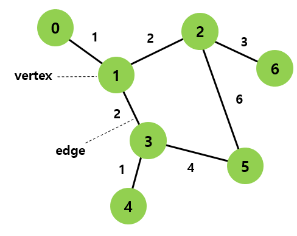
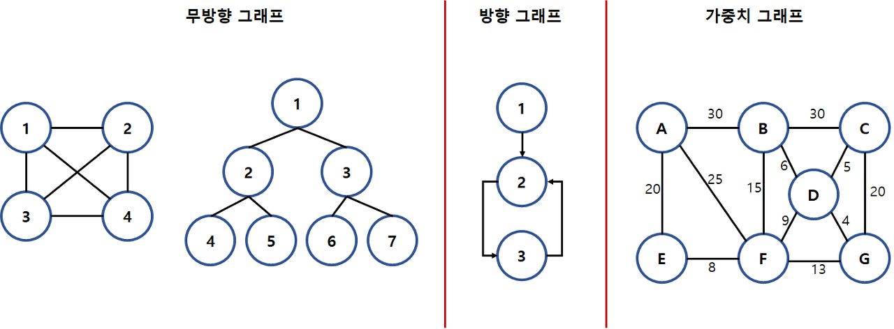
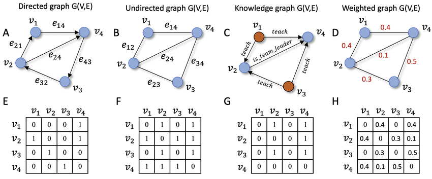
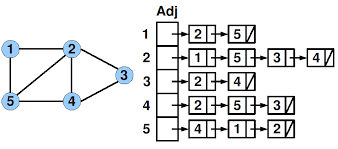

# Graph

</br>

## 그래프(Graph)

### 그래프란
그래프는 비선형적 자료구조 일종으로, 데이터를 담는 정점과 정점들을 연결하는 간선의 집합으로 구성되며 객체(정점) 간의 관계를 표현할 수 있는 자료구조.



### 그래프의 개념
- 단순히 노드(N, node)와 그 노드를 연결하는 간선(E, edge)을 하나로 모아 놓은 자료 구조
- 즉, 연결되어 있는 객체 간의 관계를 표현할 수 있는 자료 구조이다.
- Ex) 지도, 지하철 노선도의 최단 경로, 전기 회로의 소자들, 도로(교차점과 일방 통행길), 선수 과목 등
- 그래프는 여러 개의 고립된 부분 그래프(Isolated Subgraphs)로 구성될 수 있다.

### 그래프(Graph)의 특징
- 그래프는 네트워크 모델이다.
- 2개 이상의 경로가 가능하다.
- 즉, 노드들 사이에 무방향/방향에서 양방향 경로를 가질 수 있다.
- self-loop 뿐 아니라 loop/circuit 모두 가능하다.
- 루트 노드라는 개념이 없다.
- 부모-자식 관계라는 개념이 없다.
- 순회는 DFS나 BFS로 이루어진다.
- 그래프는 순환(Cyclic) 혹은 비순환(Acyclic)이다.
- 그래프는 크게 방향 그래프와 무방향 그래프가 있다.
- 간선의 유무는 그래프에 따라 다르다.

    

- 참고) 오일러 경로(Eulerian tour)
	- 그래프에 존재하는 모든 간선(edge)을 한 번만 통과하면서 처음 정점(vertex)으로 되돌아오는 경로
	- 그래프의 모든 정점에 연결된 간선의 개수가 짝수일 때만 오일러 경로가 존재

### 그래프의 종류
- 무방향 그래프 (Undirected Graph)
	- 무방향 그래프의 간선은 간선을 통해서 양방향으로 갈 수 있음.
	- 정점 A와 정점 B를 연결하는 간선은 (A, B)와 같이 정점의 쌍으로 표현.
		- (A, B)는 (B, A) 동일
	- ex) 양방향 통행 도로

<br/>

- 방향 그래프 (Directed Graph)
	- 간선에 방향성이 존재하는 그래프
	- A -> B로만 갈 수 있는 간선은 <A, B>로 표시.
		- <A, B>는 <B, A>는 다름
	- ex) 일방 통행 도로

<br/>

- 가중치 그래프 (Weighted Graph)
	- 간선에 비용이나 가중치가 할당된 그래프
	- 네트워크(Network)라고도 함.
	- Ex) 도시-도시의 연결, 도로의 길이, 회로 소자의 용량, 통신망의 사용료 등

<br/>

- 연결 그래프 (Connected Graph)
	- 무방향 그래프에 있는 모든 정점쌍에 대해서 항상 경로가 존재하는 경우
	- 그래프 G=(V, E) 내에 있는 **임의의 정점 u, v 간에 경로가 있는 그래프**
	- ex) 트리(Tree): 사이클을 가지지 않는 연결 그래프
	
<br/>

- 비연결 그래프 (Disconnected Graph)
	- 무방향 그래프에서 특정 정점쌍 사이에 경로가 존재하지 않는 경우

<br/>

- 사이클 (Cycle)
	- 단순 경로의 시작 정점과 종료 정점이 동일한 경우
	- 단순 경로(Simple Path) : 경로 중에서 반복되는 정점이 없는 경우

<br/>

- 비순환 그래프 (Acyclic Graph)
	- 사이클이 없는 그래프

<br/>

- 완전 그래프 (Complete Graph)
	- 그래프에 속해 있는 모든 정점이 서로 연결되어 있는 그래프
	- 그래프 G=(V, E) 내에 있는 **모든 정점 u, v 간에 변이 있는 그래프**
	- 무방향 완전 그래프 : 정점 수 n이면 간선의 수 n*(n-1)/2. 모든 꼭짓점은 차수 n-1을 가짐.
	- 방향 완전 그래프 : 정점 수 n이면 간선의 수 n*(n-1)  

### 자바에서 그래프를 인접행렬로 표현하는 법
- 인접 행렬은 2차원 배열로 그래프를 구현하는 방식.
- 인접행렬은 이차원 배열로 구현 가능. 행 개수 = 열 개수 = 정점의 수.<br/>
행이 출발정점, 열이 도착정점. 행렬의 모든 값을 0으로 초기화하고 시작.
- "정점 n과 m 연결되어있음" && "n에서 출발해 m 도착 가능" 하면 n행 m열의 값이 1(or 가중치값) 아니면 0으로 둠.
- 정점 n에서 출발해 도착할 수 있는 인접한 정점을 찾으려면 n행을 탐색하여
0 아닌 값이 저장된 열을 찾으면 됨.
- 반대로 정점 m에 도착할 수 있는 인접한 정점을 찾으려면 m열을 탐색하여 0 아닌 값이 저장된 행을 찾으면 됨.

```
1. 무방향 그래프 : 
간선의 방향이 정해져 있지 않아 양방향으로 진행 가능하므로, 정점 n과 m이 연결되어있다면 n행 m열과 m행 n열 두 곳에 1 저장.
ex) 정점 1과 정점 2가 연결되어있을 경우 => mat[1][2]=1, mat[2][1]=1 저장.

2. 방향 그래프 :
간선의 방향이 정해져 있어 한방향으로만 진행 가능하므로, 정점 n과 m이 연결되어있고 연결 방향이 n->m이라면 n행 m열에 1 저장.
ex) 정점 1과 정점 2가 1->2 방향으로 연결되어있을 경우 -> mat[1][2]=1 저장.
        
3. 가중치 무방향 그래프 :
간선의 방향이 정해져 있지 않아 양방향으로 진행 가능하며, 간선마다 가중치가 부과됨.정점 n과 m이 연결되어있고 가중치가 3이면 n행 m열과 m행 n열 두 곳에 가중치 값인 3 저장.
ex) 정점 1과 정점 2가 연결되어있으며 가중치 3일 경우 -> mat[1][2]=3, mat[2][1]=3 저장.
        
4. 가중치 방향 그래프 :
간선의 방향이 정해져 있으며, 간선마다 가중치가 부과됨. 정점 n과 m이 연결되어있고
연결 방향이 n->m이며 가중치가 3이면 n행 m열에 가중치 값인 3 저장.
ex) 정점 1과 정점 2가 1->2 방향으로 연결되어있으며 가중치 3일 경우 -> mat[1][2]=3 저장.
```



### 자바에서 그래프를 인접리스트로 표현하는 법
- 인접 리스트는 각 정점에 인접한 정점들을 리스트에 저장하여 그래프를 구현하는 방식.
- 인접리스트는 ArrayList<E> 객체를 저장할 수 있는 ArrayList(ArrayList<ArrayList<E>> graph)를 사용해 구현하며, ArrayList 객체(graph.get(x))에 정점 x에서 갈 수 있는 인접한 정점들을 리스트처럼 차례로 저장하는 방식으로 사용함.
- 인접행렬에서 각 행에 0이 아닌 값이 저장된 열 번호(=정점번호)들만 빼내서 이를 리스트처럼 각 행에 연결해놨다고 보면 됨. 
- 행 개수 = ArrayList 객체 개수 = 정점의 수이며, 열 개수 = 각 ArrayList 객체의 사이즈 = 각 정점에서 갈 수 있는 인접 정점들 개수.
- 그래프를 인접행렬 대신 인접리스트로 표현하면 탐색하는 데 걸리는 시간도 절약되고, 메모리도 절약됨. 그래서 문제풀 땐 보통 인접행렬 대신 인접리스트로 구현. (인접리스트가 인접행렬보다 더 빠름! 정점개수가 많아질 수록 인접행렬로 풀면 메모리 낭비도 되고 시간복잡도도 김. ex. 정점 10000개면 어떤 정점에서 갈 수 있는 정점 찾으려면 10000번 돌아야함.) 
- graph.get(x)는 ArrayList 객체를 리턴하므로 for-each문에 사용될 수 있음.
(ArrayList<ArrayList<Integer>> graph일 경우 for(int x : graph.get(x)){...})
	
```
ex1) 무방향 인접리스트의 경우,
정점 1이 1-2, 1-3 이렇게 연결되어있다고 하면,
graph.get(1).add(2);
graph.get(2).add(1);
graph.get(1).add(3);
graph.get(3).add(1);
//따라서 graph.get(1).get(0)=2, graph.get(2).get(0)=1, 
//graph.get(1).get(1)=3, graph.get(3).get(0)=1 이 됨.

ex2) 방향 인접리스트의 경우,
정점 1이 1->2, 1->3 이렇게 가능하다고 하면,
graph.get(1).add(2);
graph.get(1).add(3);
//따라서 graph.get(1).get(0)=2, graph.get(1).get(1)=3 이 됨.
	
가중치 그래프일 경우 인접리스트는 ArrayList<ArrayList<Edge>> graph 사용.
<Edge>는 변수 두개 포함하는 클래스 타입(ex. v, w 멤버변수 포함하는 Edge 클래스).
	
ex3) 무방향 가중치 인접리스트의 경우,
정점 1이 1-2 가중치 12라고 하면,	
graph.get(1).add(new Edge(2, 12));
graph.get(2).add(new Edge(1, 12));	
//따라서 graph.get(1).get(0).v=2, graph.get(1).get(0).w=12,
//graph.get(2).get(0).v=1, graph.get(2).get(0).w=12 가 됨.

ex4) 방향 가중치 인접리스트의 경우, 
정점 1이 1->2 가중치 12, 1->3 가중치 5이라고 하면,
graph.get(1).add(new Edge(2, 12));
graph.get(1).add(new Edge(3, 5));
//따라서 graph.get(1).get(0).v=2, graph.get(1).get(0).w=12,
//graph.get(1).get(1).v=3, graph.get(1).get(1).w=5 가 됨.

그래프가 문제에 등장할 경우 위 4가지 중 무엇인지 파악한 후 인접리스트 구현하기!
(1. 방향인지 무방향인지 2. 가중치인지 그냥인지) 
```


### 인접 행렬 VS 인접 리스트
- 인접 행렬
	- 그래프에 간선이 많이 존재하는 밀집 그래프(Dense Graph) 의 경우 선택
	- 장점
		- 두 정점을 연결하는 간선의 존재 여부 (M[i][j])를 O(1) 안에 즉시 알 수 있다.
		- 정점의 차수는 O(N) 안에 알 수 있다 : 인접 배열의 i번 째 행 또는 열을 모두 더한다.
	- 단점
		- 어떤 노드에 인접한 노드들을 찾기 위해서는 모든 노드를 전부 순회해야 한다.
		- 그래프에 존재하는 모든 간선의 수는 O(N^2) 안에 알 수 있다. : 인접 행렬 전체를 조사한다.

<br/>

- 인접 리스트
	- 그래프 내에 적은 숫자의 간선만을 가지는 희소 그래프(Sparse Graph) 의 경우 선택
	- 장점
		- 어떤 노드에 인접한 노드들을 쉽게 찾을 수 있다.
		- 그래프에 존재하는 모든 간선의 수는 O(V+E) 안에 알 수 있다 : 인접 리스트 전체를 조사한다.
	- 단점
		- 간선의 존재 여부와 정점의 차수: 정점 i의 리스트에 있는 노드의 수 즉, 정점 차수만큼의 시간이 필요

### 그래프 관련 용어
- `연결(Incident)`: 정점과 간선 사이의 관계를 나타내는 용어로 간선이 정점에 연결되어 있다고 말함.
- `인접(Adjacent)`: 정점 사이의 관계를 나타내는 용어로 두 정점이 동일한 간선에 연결되어 있다면 두 정점이 인접해 있다고 말함.
- `유향 그래프(Directed Graph)`: 방향성이 있는 간선들로 이루어진 그래프
- `무향 그래프(Undirected Graph)`: 방향성이 없는 간선들로 이루어진 그래프
- `가중치 그래프(Weighted Graph)`: 그래프를 구성하는 간선에 가중치가 존재하는 그래프
- `정점의 차수(Degree)`: 무향 그래프에서 정점 V와 인접한 정점의 수를 정점 V 의 차수라고 함.
- `진입 차수(In-Degree)`: 유향 그래프에서 다른 정점에서 정점 V 로 향하는 방향을 가진 간선의 수를 정점 V 의 진입 차수라고 함.
- `진출 차수(Out-Degree)`: 유향 그래프에서 정점 V 에서 다른 정점으로 향하는 방향을 가진 간선의 수를 정점 V 의 진출 차수라고 함.
- `경로(Path)`: 한 정점에서 다른 한 정점으로 향하는 연속된 간선들의 Sequence를 말함. Path 중에서 한 번 방문한 정점은 다시 방문하지 않는 경로(경로 중에서 반복되는 정점이 없는 경우)를 `Simple Path`라고 함.
- `도달 가능(Reachable)`: 정점 V에서 정점 W로의 경로가 존재하는 경우 정점 W는 정점 V에서 도달 가능하다라고 함.
- `Connected Graph`: 모든 정점 사이의 경로가 존재하는 그래프를 말함. 유향 그래프에서 모든 정점 사이의 경로가 존재하는 그래프는 특별히 `Strongly Connected Graph`라고 함.
- `Cycle`: 출발 정점과 도착 정점이 같은 경로를 Cycle이라고 함. Cycle이 없는 그래프는 `Acyclic Graph`.

### 그래프의 공간복잡도
- V(Vertex) : 그래프 안에 있는 모든 노드들의 집합을 V라고 함.
- E(Edge) : 그래프 안에 있는 모든 에지들의 집합을 E라고 함.
- 인접 행렬의 공간복잡도 : 인접 행렬을 정의할 때 V * V 만큼의 행렬을 만들어 사용하므로, 인접 행렬이 차지하는 공간은 **O(V^2)**
- 인접 리스트의 공간복잡도 : 노드 수와 에지의 개수 중 어떤 것이 큰 지 알 수 없기에 **O(V+E)** 만큼의 공간을 사용한다고 표현

### 그래프의 시간복잡도
시간복잡도는 크게 2가지로 나뉨.<br/>

(1) 두 노드가 연결되었는지 확인하는데 걸리는 시간 <br/>
- 인접 행렬의 경우, 고유 인덱스 값으로 행렬에 접근하여 **O(1)**
- 인접 리스트의 경우, 노드의 수가 V라 할 때 최악의 경우 총 V개의 요소를 확인해야 하므로 **O(V)**
<br/>

(2) 한 노드에 연결된 모든 노드들을 확인하는데 걸리는 시간
- 인접 행렬의 경우, 연결된 모든 노드를 확인하기 위해선 매번 V번 돌아야 하므로 **O(V)**
- 인접 리스트의 경우, 특정 노드의 인접 리스트에 접근하면 특정 노드와 인접 관계에 있는 노드들의 레퍼런스를 알 수 있으며 엣지의 개수만큼 확인하면 되므로 **O(E)**

### 결론
그래프의 공간복잡도
- 인접 행렬 : O(V^2)
- 인접 리스트 : O(V+E)

그래프의 시간복잡도<br/>
(1) 두 노드가 연결되었는지 확인하는데 걸리는 시간
- 인접 행렬 : O(1)
- 인접 리스트 : O(V)

(2) 한 노드에 연결된 모든 노드들을 확인하는데 걸리는 시간
- 인접 행렬 : O(V)
- 인접 리스트 : O(E)

사실상 그래프 알고리즘 문제에서 가장 중요한 것은 특정 노드에 연결된 모든 노드를 찾는 것.<br/>
따라서 공간도 적게 사용하면서 위 경우 탐색 시간도 빠른 인접 리스트가 훨씬 많이 사용된다.

## 그래프의 탐색
그래프의 탐색 방법은 깊이 우선 탐색(Depth First Search)과 너비 우선 탐색(Breadth First Search)이 있음.

### DFS (Depht First Search)
시작 정점에서 한 방향으로 계속 가다가 더 이상 갈 수 없게 되면 다시 가장 가까운 갈림길로 돌아와서 다른 방향으로 다시 탐색을 진행하는 방법과 유사.<br/>
루트 노드(혹은 다른 임의의 노드)에서 시작해서 다음 분기(branch)로 넘어가기 전에 해당 분기를 완벽하게 탐색하는 방법

- 넓게(wide) 탐색하기 전에 깊게(deep) 탐색하는 것
- 사용하는 경우: 모든 노드를 방문 하고자 하는 경우에 이 방법을 선택

### BFS(Breadth First Search)
시작 정점으로부터 가까운 정점을 먼저 방문하고 멀리 떨어져 있는 정점을 나중에 방문하는 순회 방범.<br/> 

- 깊게(deep) 탐색하기 전에 넓게(wide) 탐색하는 것
- 사용하는 경우 : 두 노드 사이의 최단 경로 혹은 임의의 경로를 찾고 싶을 때 이 방법을 선택

가까운 거리에 있는 정점들을 차례로 저장한 후 꺼낼 수 있는 자료 구조인 큐(queue)가 필요함. 알고리즘은 무조건 큐에서 정점을 꺼내서 정점을 방문하고 인접정점들을 큐에 추가함. 큐가 소진될때까지 동일한 코드를 반복함.<br/>

### 시간복잡도
DFS와 BFS 모두 인접 리스트로 구현한 경우엔 O(V + E) 시간복잡도를 갖고<br/> 인접 행렬로 구현한 경우엔 O(V^2) 시간복잡도를 가짐.