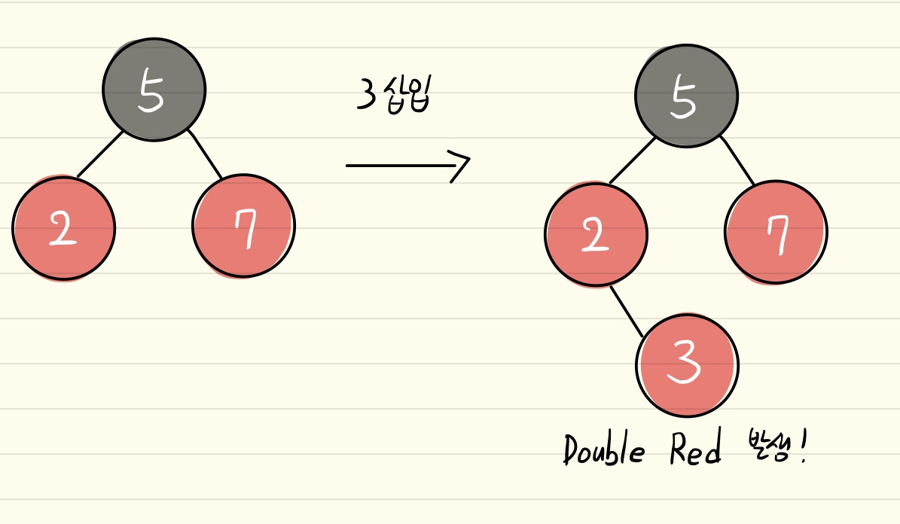
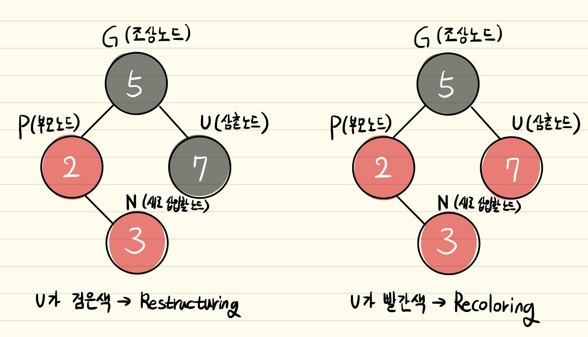
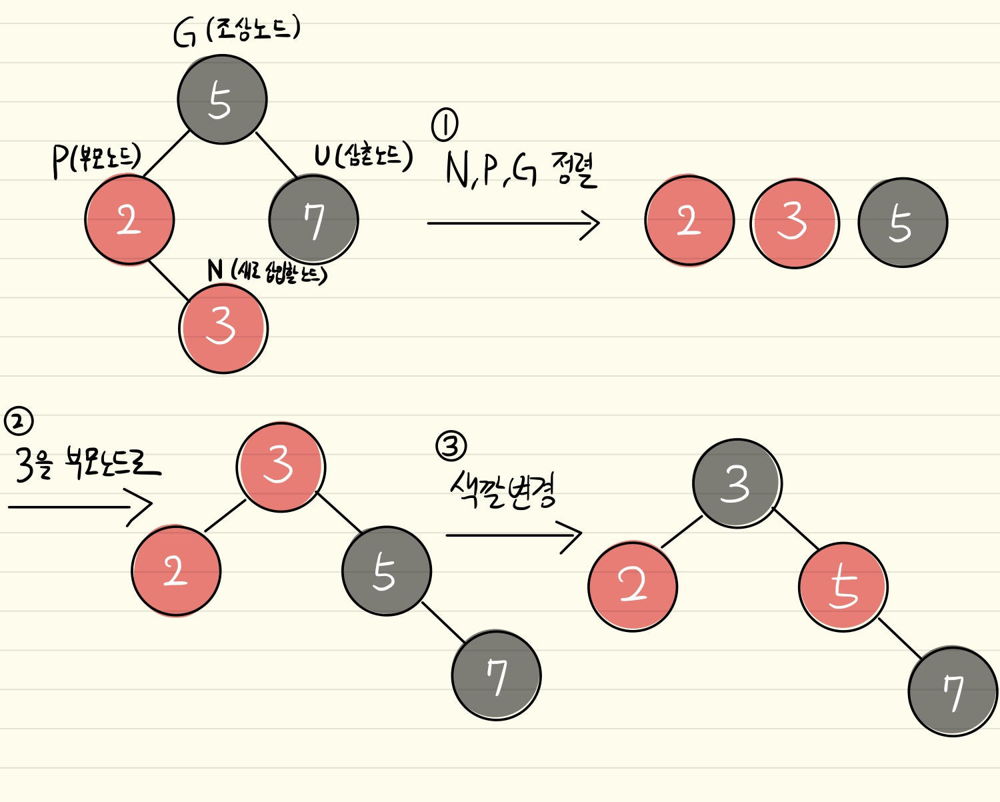
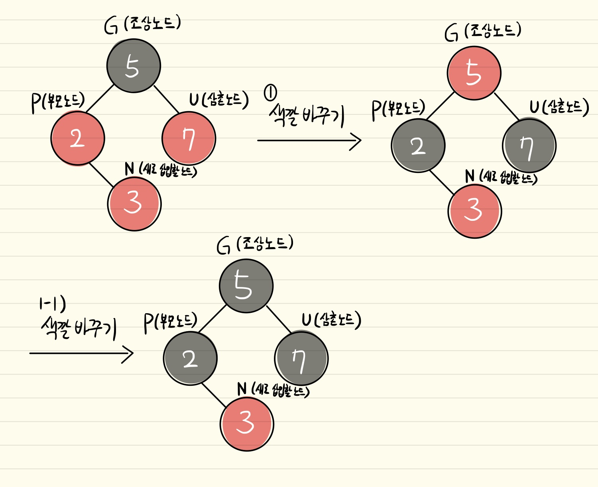
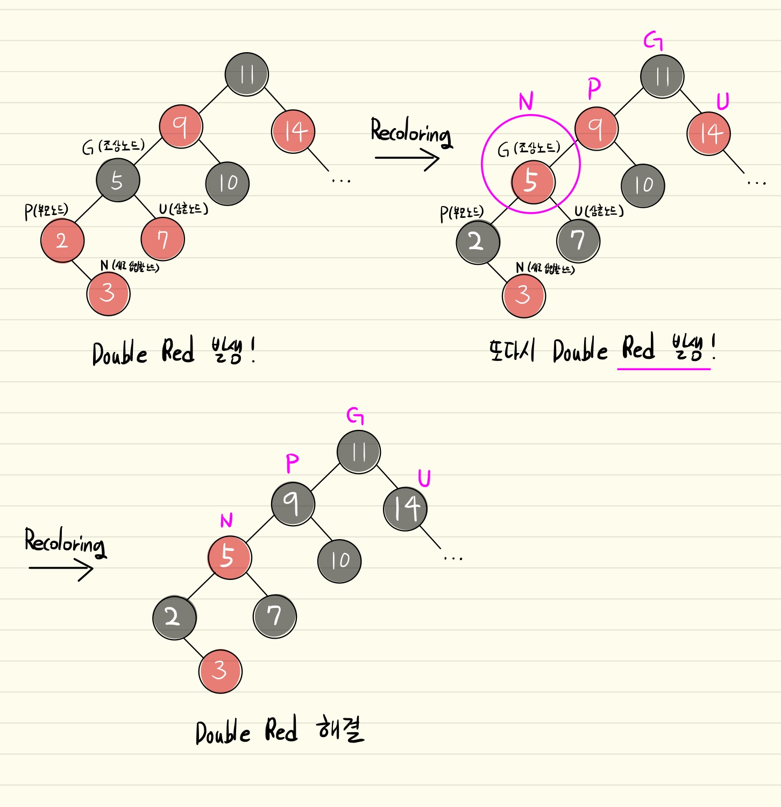
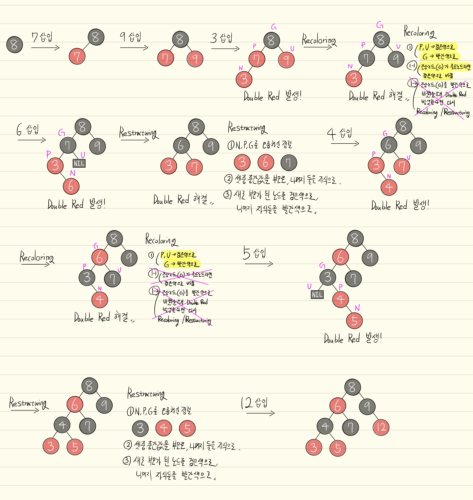

# Red-Black Tree

 

## 레드-블랙 트리(Red-Black Tree)

### 레드-블랙 트리란
레드-블랙 트리는 **자가 균형 이진 탐색 트리**이다.

### 레드-블랙 트리의 특징
레드-블랙 트리는 다음과 같은 조건들을 만족한다.
1. 모든 노드는 빨간색 혹은 검은색이다.
2. 루트 노드는 검은색이다.
3. 모든 리프 노드(NIL)들은 검은색이다. (NIL : null leaf, 자료를 갖지 않고 트리의 끝을 나타내는 노드)
4. 빨간색 노드의 자식은 검은색이다. (No Double Red. 빨간색 노드가 연속으로 나올 수 없다. 검은색 노드는 연속으로 나올 수 있음.)
5. 모든 리프 노드에서 Black Depth는 같다. (리프노드에서 루트 노드까지 가는 경로에서 만나는 검은색 노드의 개수가 같다.)

### 레드-블랙 트리 삽입 과정
- 레드-블랙 트리에 새로운 노드를 삽입할 때 새로운 노드는 항상 빨간색으로 삽입한다. 
    
    

    - 이렇게 되면 4번 조건이 위배되는 상황이 발생한다. 즉, 빨간색 노드가 연속으로 2번 나타날 수 있다(Double Red)  

- 레드 블랙 트리는 이러한 **Double Red 문제를 해결**하기 위해 2가지 전략을 사용한다.

    

    - 앞으로 새로 삽입할 노드를 N(New), 부모 노드를 P(Parent), 조상 노드를 G(Grand Parent), 삼촌 노드를 U(Uncle)라고 하자. 삼촌 노드는 말 그대로 부모의 형제라고 생각하면 된다. 
    - Double Red가 발생했을 때,
        - **삼촌 노드가 검은색**이라면 -> **Restructuring**을 수행
        - **삼촌 노드가 빨간색**이라면 -> **Recoloring**을 수행

### Double Red 해결 전략 : Restructuring

삼촌 노드가 검은색이라면 -> Restructuring을 수행

- Restructuring은 다음 과정을 거친다. 
    `(1)` 새로운 노드(N), 부모 노드(P), 조상 노드(G)를 오름차순으로 정렬한다. 
    `(2)` 셋 중 중간값을 부모로 만들고 나머지 둘을 자식으로 만든다. 
    `(3)` 새로 부모가 된 노드를 검은색으로 만들고 나머지 자식들을 빨간색으로 만든다. 

 

- 예시 :
    
    - Double Red가 발생했는데 삼촌 노드가 빨간색이다. 따라서 Restructuring 수행.
    - `(1)` 먼저 새로운 노드 N과 부모 노드 P, 조상 노드 G를 오름차순으로 정렬한다. 중간값은 3이 됨.
    - `(2)` 중간값인 3을 부모 노드로 바꾸고 나머지 2와 5를 자식 노드로 바꾼다.
    - 원래 5의 자식 노드였던 7은 5의 자식으로 딸려가게 된다.
    - `(3)` 새롭게 부모가 된 3을 검은색으로 바꿔주고 나머지 두 자식인 2, 5의 색을 빨간색으로 바꿔주면 Double Red 문제가 해결된다.
    - 완성된 트리가 레드-블랙 트리의 조건 3(모든 리프 노드(NIL)들은 검은색이다)을 만족하지 않는 것처럼 보일 수 있으나, 사실 조건을 만족하고 있는 것이며, 값이 3인 노드는 자식 노드 NIL 2개를 가지고 있고 그 NIL들이 검은색이라고 생각하면 됨.

### Double Red 해결 전략 : Recoloring
삼촌 노드가 빨간색이라면 -> Recoloring을 수행

- Recoloring은 다음과 같은 과정을 거친다. 
    `(1)` 새로운 노드(N)의 부모 노드(P)와 삼촌 노드(U)를 검은색으로 바꾸고 조상 노드(G)를 빨간색으로 바꾼다. 
    `1-1)` 조상 노드(G)가 루트 노드라면 검은색으로 바꾼다. 
    `1-2)` 조상 노드(G)를 빨간색으로 바꿨을 때 또다시 Double Red가 발생한다면, 또다시 Restructuring 혹은 Recoloring을 진행해서 Double Red 문제가 발생하지 않을 때까지 반복한다.

 

- 예시1 : 
    
    - Double Red가 발생했는데 삼촌 노드가 빨간색이다. 따라서 Recoloring을 수행.
    - `(1)` 부모 노드(P)와 삼촌 노드(U)를 검은색으로 바꾸고, 조상 노드(G)를 빨간색으로 바꾼다.
    - `1-1)` 조상 노드(G)가 루트 노드이므로 검은색으로 바꾼다. (루트 노드는 검은색이라는 조건을 지켜야 하므로)
    - 이렇게 하면 모든 조건이 지켜지면서 Double Red 문제가 해결된다.
    - 검은색 노드는 2번 연속으로 나와도 문제 발생하지 않음.

 

- 예시2 :
    - Recoloring은 간단해 보이지만 문제는 조상 노드(G)가 루트 노드가 아니면서, 조상 노드(G)가 또다시 Double Red 문제가 발생하는 경우이다.
    
        
        
        - 처음 트리에서 Recoloring을 진행하면 두번째 트리가 됨. 이 때 조상 노드(G)에서 또다시 Double Red가 발생하게 된다.
        - Double Red 문제가 발생한 값이 5인 노드를 기준으로 다시 한 번 살펴보자면, 해당 노드의 삼촌 노드(U)가 빨간색이므로 다시 Recoloring을 진행해주면 Double Red 문제를 해결할 수 있음. (새로운 노드(N)의 부모 노드(P)와 삼촌 노드(U)를 검은색으로 바꾸고 조상 노드(G)를 빨간색으로 바꾼다 -> 조상 노드(G)가 루트 노드라면 검은색으로 바꾼다.)
        - 만약 해당 노드의 삼촌 노드(U)가 검은색이었다면 Restructuring을 진행해주면 됨. 

### 레드-블랙 트리 예제

Q. 레드-블랙 트리에 순서대로 8, 7, 9, 3, 6, 4, 5, 12를 삽입한 후의 상태를 그리시오.

