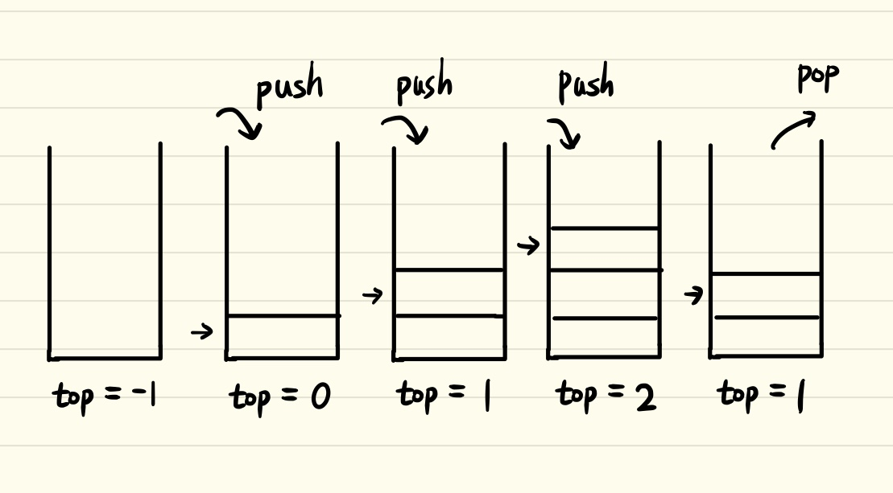
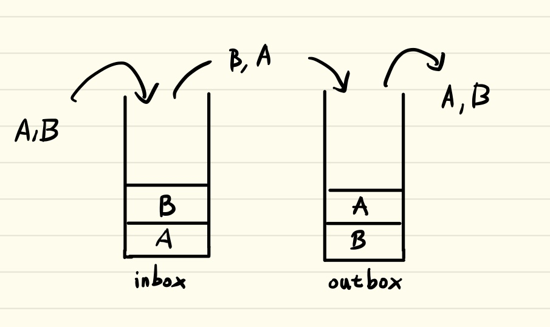
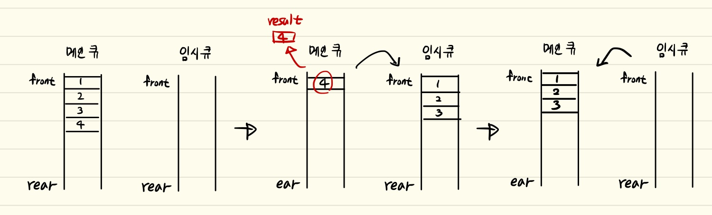

# Stack

</br>

## 스택(Stack)

### 스택이란
스택은 선형 자료구조의 일종으로, 마지막으로 들어간 데이터가 가장 첫 번째로 나오는 LIFO(Last In First Out) 구조를 가진 자료 구조. (먼저 들어간 원소가 나중에 나오는 FILO(First In Last Out)라고도 할 수 있음.) <br/> 
스택의 사용 예시로는 웹 브라우저의 방문기록(뒤로가기), 실행 취소(undo) 등이 있음.



### 스택의 특징
- 차곡차곡 쌓이는 구조로 먼저 스택에 들어간 원소는 맨 바닥에 깔리게 되며 호출 시 가장 위에 있는 것이 호출됨.
- 함수의 콜 스택, 웹 브라우저의 방문 기록, 안드로이드의 액티비티 관리, 연산자 후위 표기법 등에 스택이 쓰임.

### 스택의 연산
- pop() : 스택에서 가장 위에 있는(top) 항목을 제거
- push(x) : x를 스택의 가장 윗 부분(top)에 추가
- peek() : 스택의 가장 위(top)에 있는 데이터를 확인
- isEmpty() : 스택이 비어 있는지 확인

### 스택의 시간복잡도
|경우|접근(read)|탐색(search)|삽입(insert)|식제(delete)|
|:---|:---:|:---:|:---:|:---:|
|평균|$O(n)$|$O(n)$|$O(1)$|$O(1)$|
|최악|$O(n)$|$O(n)$|$O(1)$|$O(1)$|

### 스택의 구현
List로 구현하면 객체를 제거하는 작업이 필요함. 하지만 Array로 구현하면 삭제할 필요 없이 index를 줄이고 초기화만 하면 되므로 Array로 구현하는 것이 좋음.
```java
class ArrayStack{
    private int top;
    private int capacity;
    private Object stackArray[];
    private String type;

    ArrayStack(String type){
        this.type = type;
        this.top = -1;
        this.capacity = 100;
        stackArray = new Object[capacity];
    }
    ArrayStack(String type, int capacity){
        this.type = type;
        this.top = -1;
        this.capacity = capacity;
        stackArray = new Object[capacity];
    }

    public boolean isEmpty(){
        return (top == -1);
    }

    public boolean isFull(){
        return (top >= this.capacity-1);
    }

    public int size(){
        return this.top+1;
    }
    public void push(Object element){
        checkType(element);
        checkIsFull();

        stackArray[++top]  = element;
    }

    public Object pop(){
        checkIsEmpty();
        Object ele = stackArray[top];
        stackArray[top] = null;
        --top;
        return ele;
    }

    public Object peek(){
        checkIsEmpty();
        return stackArray[top];
    }

    public void clear(){
        checkIsEmpty();

        this.top = -1;
        stackArray = new Object[this.capacity];
    }

    public void printStack(){
        for(Object ele : stackArray){
            if(ele!=null)
                System.out.print(ele+" ");
        }
    }

    private void checkType(Object obj){
        if(!Objects.equals(this.type, obj.getClass().getSimpleName())){
            throw new IllegalStateException("타입 에러");
        }
    }
    private void checkIsFull(){
        if(isFull()){
            throw new IllegalStateException("스텍이 가득참");
        }
    }
    private void checkIsEmpty(){
        if(isEmpty()){
            throw new IllegalStateException("스텍이 비었음");
        }
    }
}

// 출처 : https://velog.io/@yeonwoo1125/Java-%EB%B0%B0%EC%97%B4%EB%A1%9C-Stack-%EA%B5%AC%ED%98%84%ED%95%98%EA%B8%B0
```

### 2개의 스택으로 큐 구현

- 구현 방법 : inbox와 outbox라는 2개의 스택으로 큐 구현.
    
    
    
1. inbox에 데이터를 삽입한다(push) → A,B 순으로 스택에 삽입됨
2. inbox에 있는 데이터를 추출(pop)하여 outbox에 삽입(push)한다. → B, A순으로 추출(pop)되어 outbox에 삽입됨. outbox에는 B, A 순으로 데이터가 쌓임.
3. outbox에 있는 데이터를 추출(pop)한다. → A, B 순으로 출력됨.
    
```java
public class Queue {

	private Stack inBox = new Stack();
	private Stack outBox = new Stack();
	
	public void enQueue(Object item) {
		inBox.add(item);
	}
	
	public Object deQueue() {
		
		if (outBox.isEmpty()) {
			while(!inBox.isEmpty()) {
				outBox.push(inBox.pop());
			}
		}
		return outBox.pop();
	}
    	
	public static void main(String[] args) {
		Queue queue = new Queue();
		queue.enQueue("A");
		queue.enQueue("B");
		queue.enQueue("C");
		
		System.out.println(queue.deQueue());
		System.out.println(queue.deQueue());
		System.out.println(queue.deQueue());
	}

}
// 출력 결과 : A B C 순으로 출력됨.
// 출처: https://creatordev.tistory.com/83 [Creator Developer:티스토리]
```

### 2개의 큐로 스택 구현
- 구현 방법 : 큐 한 개는 메인 큐, 다른 큐는 임시 큐로 두고 2개의 큐로 스택 구현
    

1. 메인 큐에 값들을 집어넣는다.
2. 메인 큐에 1개의 원소가 남을 때까지 꺼낸 값들을 임시 큐에 집어넣는다.
3. 메인 큐에 마지막 남은 원소를 꺼내 result 변수에 저장한다.
4. 임시 큐에 있는 원소들을 꺼내 다시 메인 큐로 모두 집어넣는다.
5. result 값을 리턴한다.

```java
import java.util.LinkedList;
import java.util.Queue;

class StackQ{
	Queue<Integer> mainQueue;
	Queue<Integer> tempQueue;
	
	public StackQ() {
		mainQueue = new LinkedList<>();
		tempQueue = new LinkedList<>();
	}
	
	public void push(int a) {
		mainQueue.offer(a); //push할 때는 메인큐에 값을 집어넣음
	}
	
	public int pop() {
		int result=-1;
		
		if(mainQueue.isEmpty()) {
			return -1;
		}
		
		while(mainQueue.size() != 1) { 
			tempQueue.offer(mainQueue.poll()); //메인 큐에 1개의 원소가 남을 때까지 꺼낸 값들을 임시 큐에 집어넣음
		}
		result = mainQueue.poll(); //메인 큐에 마지막 남은 원소를 꺼내 result 변수에 저장
		
		//나머지를 다시 main큐로 옮겨준다.
		if(!tempQueue.isEmpty()) {
			while(!tempQueue.isEmpty()) {
				mainQueue.offer(tempQueue.poll());
			}
		}
		
		return result;
	}
}

public class Sq {
	public static void main(String[] args) {
		StackQ sq = new StackQ();
		sq.push(1);
		sq.push(2);
		sq.push(3);

		System.out.println(sq.pop()); //3
		
		sq.push(4);
		System.out.println(sq.pop()); //4
		
		System.out.println(sq.pop()); //2
		System.out.println(sq.pop()); //1
	}
}

//출처 : https://hyunki99.tistory.com/27
```