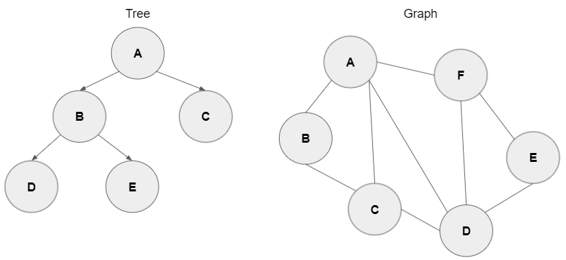
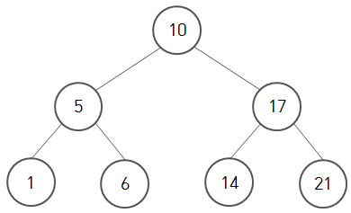
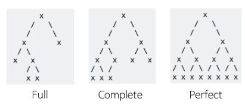

# Tree

</br>

## 트리(Tree)

### 트리란
트리는 비선형적이며 계층 구조를 갖는 자료구조. 트리는 데이터를 담는 노드와 노드들을 연결하는 간선으로 구성되며 노드들은 다른 노드들과 부모-자식 관계를 가짐.



### 트리의 개념
- 트리는 노드로 이루어진 자료 구조
    - 트리는 하나의 루트 노드를 갖는다.
    - 루트 노드를 제외한 모든 노드는 단 하나의 부모 노드만을 갖는다.
    - 루트 노드는 0개 이상의 자식 노드를 갖고 있다.
    - 그 자식 노드 또한 0개 이상의 자식 노드를 갖고 있고, 이는 반복적으로 정의된다.
- 노드(node)들과 노드들을 연결하는 간선(edge)들로 구성되어 있다.
    - 트리에는 사이클(cycle)이 존재할 수 없다.
    - 노드들은 특정 순서로 나열될 수도 있고 그럴 수 없을 수도 있다.
    - 각 노드는 부모 노드로의 연결이 있을 수도 있고 없을 수도 있다.
    - 각 노드는 어떤 자료형으로도 표현 가능하다.
- 비선형 자료구조로 계층적 관계를 표현한다. Ex) 디렉터리 구조, 조직도
- 그래프의 한 종류
    - 사이클(cycle)이 없는 하나의 연결 그래프(Connected Graph)
    - 또는 DAG(Directed Acyclic Graph, 방향성이 있는 비순환 그래프)의 한 종류 이다.

### 트리 관련 용어


- `노드(Node)` : 트리를 구성하는 각각의 요소.
- `루트 노드(root node)` : 트리 구조에서 최상위에 있는 노드이며 부모가 없는 노드. 트리는 하나의 루트 노드만을 가짐.
- `단말 노드(leaf node, Terminal Node)` : 자식이 없는 노드, ‘말단 노드’ 또는 ‘잎 노드’라고도 부름.
- `내부 노드(Internal Node)` : 단말 노드가 아닌 노드
- `간선(edge)` : 노드를 연결하는 선 (link, branch 라고도 부름)
- `형제(sibling)` : 같은 부모를 가지는 노드
- `노드의 크기(size)` : 자신을 포함한 모든 자손 노드의 개수
- `노드의 깊이(depth)` : 루트에서 어떤 노드에 도달하기 위해 거쳐야 하는 간선의 수
- `노드의 레벨(level)` : 트리의 특정 깊이를 가지는 노드의 집합
- `노드의 차수(degree)` : 하위 트리 개수 / 간선 수 (degree) = 각 노드가 지닌 가지의 수
- `트리의 차수(degree of tree)` : 트리의 최대 차수
- `트리의 높이(height)` : 루트 노드에서 가장 깊숙히 있는 노드의 깊이

### 트리의 특징
- 그래프의 한 종류. ‘최소 연결 트리’ 라고도 불린다.
- 트리는 계층 모델이다.
- 트리는 DAG(Directed Acyclic Graphs, 방향성이 있는 비순환 그래프)의 한 종류이다.
    - loop나 circuit이 없다. 당연히 self-loop도 없다.
    - 즉, 사이클이 없다.
- 노드가 N개인 트리는 항상 N-1개의 간선(edge)을 가진다.
    - 즉, 간선은 항상 (정점의 개수 - 1) 만큼을 가진다.
- 루트에서 어떤 노드로 가는 경로는 유일하다.
    - 임의의 두 노드 간의 경로도 유일하다. 즉, 두 개의 정점 사이에 반드시 1개의 경로만을 가진다.
- 한 개의 루트 노드만이 존재하며 모든 자식 노드는 한 개의 부모 노드만을 가진다.
    - 부모-자식 관계이므로 흐름은 top-bottom 아니면 bottom-top으로 이루어진다.
- 순회는 Pre-order, In-order 아니면 Post-order로 이루어진다. 이 3가지 모두 DFS/BFS 안에 있다.
- 트리는 이진 트리, 이진 탐색 트리, 균형 트리(AVL 트리, red-black 트리), 이진 힙(최대힙, 최소힙) 등이 있다.
- 일반 배열에서 삽입이나 삭제를 하는데 O(N)의 시간이 걸린다. 배열의 첫번째 원소에 삽입하는 경우 나머지 모든 요소들을 한 칸씩 뒤로 미뤄야 하므로 최악의 시간 복잡도 O(N)이 나온다. 하지만, 트리는 편향 트리가 아닌 이상 일반적인 트리에서는 O(log N) 정도의 시간으로 줄여진다.

## 트리의 종류
### 이진 트리 (Binary Tree)
- 각 노드가 최대 두 개의 자식을 갖는 트리
- 모든 트리가 이진 트리는 아니다.
- 이진 트리 순회
    - 중위 순회(in-order traversal): 왼쪽 가지 -> 현재 노드 -> 오른쪽 가지
        ```java
        void inOrderTraversal(TreeNode node) {
        if(node != null) {
            inOrderTraversal(node.left);
            visit(node);
            inOrderTraversal(node.right);
            }
        }
        ```
    - 전위 순회(pre-order traversal): 현재 노드 -> 왼쪽 가지 -> 오른쪽 가지
         ```java
        void preOrderTraversal(TreeNode node) {
            if(node != null) {
            visit(node);
            preOrderTraversal(node.left);
            preOrderTraversal(node.right);
            }
        }
        ```
    - 후위 순회(post-order traversal): 왼쪽 가지 -> 오른쪽 가지 -> 현재 노드
         ```java
        void postOrderTraversal(TreeNode node) {
            if(node != null) {
            postOrderTraversal(node.left);
            postOrderTraversal(node.right);
            visit(node);
            }
        }
        ```

### 이진 탐색 트리 (Binary Search Tree)

- 모든 노드가 아래와 같은 특정 규칙을 따르는 속성이 있는 이진 트리
    - 규칙 1. 이진 탐색 트리의 노드에 저장된 키는 유일하다.
    - 규칙 2. 부모의 키가 왼쪽 자식 노드의 키보다 크다.
    - 규칙 3. 부모의 키가 오른쪽 자식 노드의 키보다 작다.
    - 규칙 4. 왼쪽과 오른쪽 서브트리도 이진 탐색 트리이다.

 여기서 중위순회(Inorder Travel)을 적용하면 오름차순 정렬이 된다.

이진 탐색 트리의 탐색 연산은 O(log n)의 시간 복잡도를 갖는다. 사실 정확히 말하면 O(h)라고 표현하는 것이 맞음. 트리의 높이를 하나씩 더해갈수록 추가할 수 있는 노드의 수가 두 배씩 증가하기 때문.<br/>
하지만 이러한 이진 탐색 트리는 Skewed Tree(편향 트리)가 될 수 있다. 저장 순서에 따라 계속 한 쪽으로만 노드가 추가되는 경우가 발생하기 때문. 이럴 경우 성능에 영향을 미치게 되며, 탐색의 Worst Case 가 되고 시간 복잡도는 O(n)이 된다.

배열보다 많은 메모리를 사용하며 데이터를 저장했지만 탐색에 필요한 시간 복잡도가 같게 되는 비효율적인 상황이 발생하게 됨. 이를 해결하기 위해 Rebalancing 기법이 등장. 균형을 잡기 위한 트리 구조의 재조정을 Rebalancing이라 함. 이 기법을 구현한 트리에는 여러 종류가 존재하는데 그 중에서 하나가 뒤에서 살펴볼 Red-Black Tree.
   

### 균형 트리
- O(logN) 시간에 insert와 find를 할 수 있을 정도로 균형이 잘 잡혀 있는 경우
- Ex) 레드-블랙 트리, AVL 트리

### 완전 이진 트리 VS 전 이진 트리 VS 포화 이진 트리 vs 편향 이진 트리

- 완전 이진 트리(Complete Binary Tree) :
    - 트리의 모든 높이에서 노드가 꽉 차 있는 이진 트리. 즉, 마지막 레벨을 제외하고 모든 레벨이 완전히 채워져 있다.
    - 마지막 레벨은 꽉 차 있지 않아도 되지만 노드가 왼쪽에서 오른쪽으로 채워져야 한다.
    - 마지막 레벨 h에서 (1 ~ 2h-1)개의 노드를 가질 수 있다.
    - 또 다른 정의는 가장 오른쪽의 잎 노드가 (아마도 모두) 제거된 포화 이진 트리다.
    - 완전 이진 트리는 배열을 사용해 효율적으로 표현 가능하다.

<br/>

- 전 이진 트리(Full Binary Tree 또는 Strictly Binary Tree) :
    - 모든 노드가 0개 혹은 2개의 children 을 가지고 있을 때 “Binary Tree 는 full” 이라고 한다.
    - 자식 노드가 아예 없거나, 최대 둘뿐인 tree. 자식을 하나만 가진 노드가 없어야 한다.
    - Full Binary Tree 는 leaf 노드들을 제외한 모든 노드들이 2개의 children 을 가지는 Binary Tree” 라고도 할 수 있다.
    - L = I + 1 - Full Binary Tree 에서 모든 leaf 노드의 개수는 internal node 의 개수 + 1 이다.

<br/>

- 포화 이진 트리(Perfect Binary Tree) :
    - 전 이진 트리이면서 완전 이진 트리인 경우
    - 모든 말단 노드는 같은 높이에 있어야 하며, 마지막 단계에서 노드의 개수가 최대가 되어야 한다.
    - 모든 내부 노드가 두 개의 자식 노드를 가진다.
    - 모든 말단 노드가 동일한 깊이 또는 레벨을 갖는다.
    - Height 가 h 인 Perfect Binary Tree 는 $2^h$ - 1 개의 노드를 가진다.

<br/>

- 편향 이진 트리(Skewed Binary Tree) :
    - 모든 노드가 부모의 왼쪽 자식이기 때문에 왼쪽으로 편향되어 있거나 반대로 모든 노드가 부모의 오른쪽 자식이기 때문에 오른쪽으로 편향되어 있는 이진 트리를 말한다.
    - 모든 internal node 가 하나의 child 만을 가질 때를 말하며 Degenerate (or Pathological) Tree 라고도 한다.
    - Linked List 성능과 동일하다.


### 트라이(trie)
- 접두사 트리(Prefix Tree)라고도 부름.
- n-차 트리(n-ary Tree)의 변종
- 각 노드에 문자를 저장하는 자료구조
- 따라서 트리를 아래쪽으로 순회하면 단어 하나가 나온다.
- 접두사를 빠르게 찾아보기 위한 흔한 방식 으로, 모든 언어를 트라이에 저장해 놓는 방식이 있다.
- 유효한 단어 집합을 이용 하는 많은 문제들은 트라이를 통해 최적화할 수 있다.

## 트리의 구현 방법
기본적으로 트리는 그래프의 한 종류이므로 그래프의 구현 방법(인접 리스트 또는 인접 배열)으로 구현할 수 있음.

### 인접 배열 이용
- 1차원 배열에 자신의 부모 노드만 저장하는 방법
    - 트리는 부모 노드를 0개 또는 1개를 가지기 때문
    - 부모 노드를 0개: 루트 노드
- 이진 트리의 경우, 2차원 배열에 자식 노드를 저장하는 방법
    - 이진 트리는 각 노드가 최대 두 개의 자식을 갖는 트리이기 때문
    - Ex) A[i][0]: 왼쪽 자식 노드, A[i][1]: 오른쪽 자식 노드

### 인접 리스트 이용
- 가중치가 없는 트리의 경우
    - ArrayList< ArrayList > list = new ArrayList<>();
- 가중치가 있는 트리의 경우
    1) class Node { int num, dist; // 노드 번호, 거리 } 정의
    2) ArrayList[] list = new ArrayList[정점의 수 + 1];

## 그래프와 트리의 차이
||그래프|트리|
|:---:|:---:|:---:|
|정의|노드(node)와 그 노드를 연결하는 간선(edge)을 하나로 모아 놓은 자료 구조|그래프의 한 종류. DAG(Directed Acyclic Graph, 방향성이 있는 비순환 그래프)의 한 종류|
|방향성|방향 그래프(Directed), 무방향 그래프(Undirected)모두 존재|방향 그래프(Directed Graph)|
|사이클|사이클(Cycle) 가능, 자체 간선(self-loop)도 가능, 순환 그래프(Cyclic), 비순환 그래프(Acyclic) 모두 존재|사이클(Cycle) 불가능, 자체 간선(self-loop)도 불가능, 비순환 그래프(Acyclic Graph)|
|루트 노드|루트 노드의 개념이 없음|한 개의 루트 노드만이 존재. 모든 자식 노드는 한 개의 부모 노드만을 가짐|
|부모-자식|부모-자식의 개념이 없음|부모-자식 관계 top-bottom 또는 bottom-top으로 이루어짐|
|모델|네트워크 모델|계층 모델|
|순회|DFS, BFS|DFS, BFS안의 Pre-, In-, Post-order|
|간선의 수|그래프에 따라 간선의 수가 다름. 간선이 없을 수도 있음|노드가 N인 트리는 항상 N-1의 간선을 가짐|
|경로|-|임의의 두 노드 간의 경로는 유일|
|예시 및 종류|지도, 지하철 노선도의 최단 경로, 전기 회로의 소자들, 도로(교차점과 일방 통행길), 선수 과목|이진 트리, 이진 탐색 트리, 균형 트리(AVL 트리, red-black 트리), 이진힙(최대힙, 최소힙) 등|

## BST와 Binary Tree에 대해서 설명하세요. (N사 전화면접)
이진탐색트리(Binary Search Tree)는 이진 탐색과 연결 리스트를 결합한 자료구조이다. 이진 탐색의 효율적인 탐색 능력을 유지하면서, 빈번한 자료 입력과 삭제가 가능하다는 장점이 있다. 이진 탐색 트리는 왼쪽 트리의 모든 값이 반드시 부모 노드보다 작아야 하고, 반대로 오른쪽 트리의 모든 값이 부모 노드보다 커야 하는 특징을 가지고 있어야 한다. 이진 탐색 트리의 탐색, 삽입, 삭제의 시간복잡도는 O(h)이다. 트리의 높이에 영향을 받는데, 트리가 균형이 맞지 않으면 워스트 케이스가 나올 수 있다. 그래서 이 균형을 맞춘 구조가 AVL Tree이다.<br/>
이진 트리(Binary Tree)는 모든 노드들이 2개의 서브트리를 갖는 특별한 형태의 트리이다. 각 노드가 자식노드를 최대한 2개까지만 가질 수 있다.