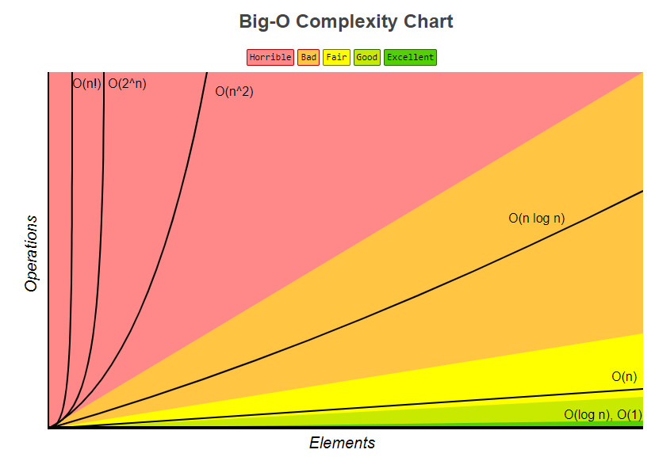

# 시간복잡도 , 공간복잡도
알고리즘의 복잡도는 시간복잡도와 공간복잡도로 나뉨. 

</br>

## 시간복잡도

### 시간 복잡도
**문제를 해결하는 데 걸리는 시간과 입력의 함수 관계**를 가리킴.</br>
어떠한 알고리즘의 로직이 **얼마나 오랜 시간**이 걸리는지를 나타내는 데 쓰이며, 보통 빅오 표기법으로 나타냄.
- 최상의 경우 : 빅-오메가 표기법 (Big-Ω Notation)
- 평균의 경우 : 빅-세타 표기법 (Big-θ Notation)
- 최악의 경우 : 빅-오 표기법 (Big-O Notation)


### 빅오 표기법
**입력 범위 n을 기준으로 해서 로직이 몇 번 반복되는지** 나타내는 것.</br>
‘가장 영향을 많이 끼치는’ 항의 상수 인자를 빼고 나머지 항을 없앤 것.</br></br>
아래는 입력 크기 n의 모든 입력에 대한 알고리즘에 필요한 시간이 $10n^2+n$ 인 코드이며, 코드의 시간 복잡도를 빅오 표기법으로 나타내면 $O(n^2)$ 이 됨.</br>
```java
for(int i=0; i<10; i++){
    for(int j=0; j<n; j++){
        for(int k=0; k<n; k++){
        	System.out.println("Hi");
    	}
   	}
}
for(int i=0; i<n; i++){
    System.out.println("Hi");
}
```


### 시간 복잡도의 존재 이유

시간 복잡도는 효율적인 코드로 개선하는 데 쓰이는 척도가 됨.</br>
특정 로직이 $O(n^2)$의 시간 복잡도를 가지고 9초가 걸린다고 했을 때, 이를 $O(n)$ 의 시간 복잡도를 가지는 알고리즘으로 개선한다면 3초가 걸리게 될 것.

### 시간 복잡도의 속도 비교



$O(1)$ < $O(lgN)$ < $O(N)$ < $O(NlgN)$ < $O(N^2)$ < $O(2^N)$  < $O(N!)$

### 자료 구조에서의 시간 복잡도

자료 구조를 쓸 때는 시간 복잡도를 잘 생각해야 하며, 보통 평균과 최악의 시간 복잡도를 고려하면서 씀.
</br></br>

자료 구조의 평균 시간 복잡도 :
|자료 구조|접근(read)|탐색(search)|삽입(insert)|식제(delete)|
|:---|:---:|:---:|:---:|:---:|
|배열(array)|$O(1)$|$O(n)$|$O(n)$|$O(n)$|
|스택(stack)|$O(n)$|$O(n)$|$O(1)$|$O(1)$|
|큐(queue)|$O(n)$|$O(n)$|$O(1)$|$O(1)$|
|이중 연결 리스트(doubly linked list)|$O(n)$|$O(n)$|$O(1)$|$O(1)$|
|해시 테이블(hash table)|$O(1)$|$O(1)$|$O(1)$|$O(1)$|
|이진 탐색 트리(BST)|$O(logn)$|$O(logn)$|$O(logn)$|$O(logn)$|
|AVL 트리|$O(logn)$|$O(logn)$|$O(logn)$|$O(logn)$|
|레드 블랙 트리|$O(logn)$|$O(logn)$|$O(logn)$|$O(logn)$|
</br>

자료 구조의 최악의 시간 복잡도 :
|자료 구조|접근(read)|탐색(search)|삽입(insert)|식제(delete)|
|:---|:---:|:---:|:---:|:---:|
|배열(array)|$O(1)$|$O(n)$|$O(n)$|$O(n)$|
|스택(stack)|$O(n)$|$O(n)$|$O(1)$|$O(1)$|
|큐(queue)|$O(n)$|$O(n)$|$O(1)$|$O(1)$|
|이중 연결 리스트(doubly linked list)|$O(n)$|$O(n)$|$O(1)$|$O(1)$|
|해시 테이블(hash table)|$O(n)$|$O(n)$|$O(n)$|$O(n)$|
|이진 탐색 트리(BST)|$O(n)$|$O(n)$|$O(n)$|$O(n)$|
|AVL 트리|$O(logn)$|$O(logn)$|$O(logn)$|$O(logn)$|
|레드 블랙 트리|$O(logn)$|$O(logn)$|$O(logn)$|$O(logn)$|

</br>

## 공간 복잡도
### 공간 복잡도
**프로그램을 실행시켰을 때 필요로 하는 자원 공간의 양**을 말함.</br>
정적 변수로 선언된 것 말고도  동적으로 재귀적인 함수로 인해 공간을 계속해서 필요로 할 경우도 포함함.<br/></br>
아래의 a 배열은 1004*4 byte의 크기(공간 복잡도)를 갖게 됨.        
```java
int a[1004];
```